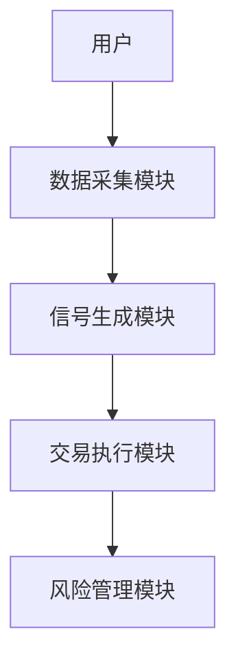
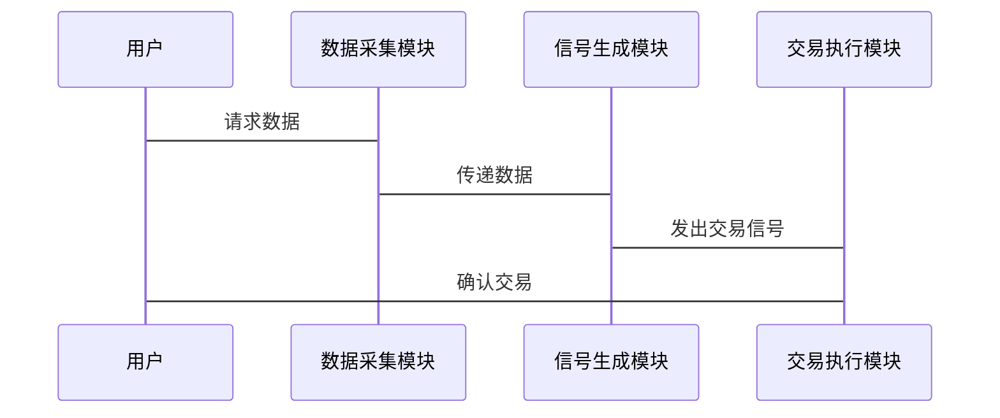

                 


# 如何利用特价股票策略构建多元资产对冲组合

> 关键词：特价股票策略，多元资产对冲，组合构建，风险对冲，量化分析

> 摘要：本文详细介绍了如何利用特价股票策略构建多元资产对冲组合。通过分析特价股票策略的核心概念、数学模型、算法实现以及系统架构，结合实际案例，为读者提供从理论到实践的全面指导。文章内容涵盖背景介绍、策略优化、算法实现、系统设计和项目实战，帮助读者掌握构建高效对冲组合的方法。

---

## 第1章: 特价股票策略概述

### 1.1 特价股票策略的定义与特点

#### 1.1.1 特价股票的定义
特价股票是指在特定市场条件下，价格低于其内在价值的股票。这些股票通常被市场低估，具有较大的上涨潜力。特价股票的特点包括低估值、高潜力和高波动性。

#### 1.1.2 特价股票策略的核心特点
- **低估值**：特价股票的价格通常低于其内在价值。
- **高波动性**：这类股票价格波动较大，为投资者提供了套利机会。
- **高潜力**：一旦市场重新发现其价值，价格可能迅速上涨。

#### 1.1.3 特价股票与传统股票投资的区别
- **传统股票投资**：基于长期价值投资，注重公司基本面。
- **特价股票策略**：基于短期价格波动和套利机会。

### 1.2 特价股票策略的优势与风险

#### 1.2.1 特价股票策略的优势
- **高收益潜力**：通过识别低估股票，投资者可能获得超额收益。
- **灵活性**：策略可以根据市场变化快速调整。

#### 1.2.2 特价股票策略的风险
- **高波动性风险**：价格波动大可能导致短期亏损。
- **市场流动性风险**：部分特价股票流动性差，难以快速变现。

#### 1.2.3 如何控制风险
- **分散投资**：通过投资多个特价股票分散风险。
- **严格筛选**：选择基本面良好的公司，减少风险。

### 1.3 特价股票策略在对冲组合中的作用

#### 1.3.1 对冲组合的基本概念
对冲组合是一种通过同时买入和卖出相关资产，以降低市场风险的投资策略。

#### 1.3.2 特价股票策略在对冲中的应用
- **风险对冲**：利用特价股票对冲市场下跌风险。
- **收益增强**：通过套利机会增加组合收益。

#### 1.3.3 对冲组合的风险管理
- **动态调整**：根据市场变化及时调整组合。
- **严格监控**：实时监控组合风险指标。

### 1.4 本章小结
本章介绍了特价股票策略的定义、特点、优势和风险，以及其在对冲组合中的作用。通过理解这些内容，投资者可以更好地利用特价股票策略构建对冲组合。

---

## 第2章: 特价股票策略的核心概念

### 2.1 特价股票策略的数学模型

#### 2.1.1 特价股票价格的数学表达式
$$ P_{\text{true}} = \frac{V}{D} $$
其中，\( V \) 是公司的内在价值，\( D \) 是市场对公司价值的折扣。

#### 2.1.2 特价股票价格的影响因素
- **市场情绪**：市场情绪影响股票价格。
- **公司基本面**：公司财务状况影响内在价值。

#### 2.1.3 数学模型的建立与验证
通过回归分析，建立股票价格与市场情绪的关系模型。

### 2.2 特价股票策略的定价模型

#### 2.2.1 基于市场情绪的定价模型
$$ P_{\text{market}} = P_{\text{true}} \times (1 - \alpha) $$
其中，\( \alpha \) 是市场情绪的影响系数。

#### 2.2.2 基于基本面分析的定价模型
$$ P_{\text{fundamental}} = \frac{V}{D} \times (1 - \beta) $$
其中，\( \beta \) 是市场波动的影响系数。

#### 2.2.3 综合定价模型的构建
综合考虑市场情绪和公司基本面，建立综合定价模型：
$$ P_{\text{total}} = P_{\text{market}} + P_{\text{fundamental}} $$

### 2.3 特价股票策略的风险评估

#### 2.3.1 风险的定义与分类
- **市场风险**：市场波动导致的资产损失。
- **流动性风险**：资产难以快速变现的风险。

#### 2.3.2 基于VaR的风险评估方法
$$ \text{VaR} = \text{损失的上限} $$

#### 2.3.3 基于CVaR的风险优化方法
$$ \text{CVaR} = \mathbb{E}[L | L \geq \text{VaR}] $$
其中，\( L \) 是损失金额。

### 2.4 本章小结
本章详细讲解了特价股票策略的数学模型和定价模型，并介绍了基于VaR和CVaR的风险评估方法。

---

## 第3章: 多元资产对冲组合的构建方法

### 3.1 多元资产对冲组合的基本原理

#### 3.1.1 多元资产配置的基本概念
通过配置多种资产降低组合风险。

#### 3.1.2 对冲组合的核心原理
通过买入和卖出相关资产对冲市场风险。

#### 3.1.3 多元资产对冲组合的优势
- **分散风险**：通过配置多种资产降低单一资产的风险。
- **增强收益**：通过套利机会增加组合收益。

### 3.2 特价股票策略在多元资产组合中的应用

#### 3.2.1 特价股票与其他资产的组合策略
- **股票与债券组合**：利用债券对冲股票市场的风险。
- **股票与期货组合**：利用期货对冲市场下跌风险。

#### 3.2.2 特价股票在风险对冲中的作用
- **市场对冲**：通过卖出指数期货对冲市场风险。
- **收益增强**：通过买入低估股票增加收益。

#### 3.2.3 多元资产组合的动态调整
根据市场变化，动态调整组合配置。

### 3.3 多元资产对冲组合的优化方法

#### 3.3.1 基于现代投资组合理论的优化
$$ \text{Minimize} \ \sigma^2 \ \text{subject to} \ \mathbb{E}[R] = T \text{和} \ \mathbb{E}[R] = T $$

#### 3.3.2 基于因子模型的优化方法
$$ R_i = \alpha + \beta_j R_j + \epsilon_i $$

#### 3.3.3 基于机器学习的优化方法
利用机器学习算法，预测资产收益，优化组合配置。

### 3.4 本章小结
本章介绍了多元资产对冲组合的构建方法，并详细讲解了如何利用特价股票策略优化组合配置。

---

## 第4章: 特价股票策略的算法实现

### 4.1 特价股票策略的量化分析

#### 4.1.1 数据收集与预处理
- **数据收集**：收集历史价格、财务数据等。
- **数据清洗**：处理缺失值和异常值。

#### 4.1.2 量化指标计算
- **市盈率（P/E）**：评估股票估值。
- **市净率（P/B）**：评估股票估值。

### 4.2 特价股票策略的机器学习算法

#### 4.2.1 回归分析
$$ y = \beta_0 + \beta_1 x_1 + \beta_2 x_2 + \epsilon $$

#### 4.2.2 聚类分析
利用K-means算法，将股票分为不同类别。

#### 4.2.3 分类算法
利用随机森林算法，预测股票是否为特价股票。

### 4.3 算法实现的代码示例

#### 4.3.1 数据加载与预处理
```python
import pandas as pd
data = pd.read_csv('stock_data.csv')
data.dropna(inplace=True)
```

#### 4.3.2 特价股票筛选
```python
def is_cheap_stock(row):
    return row['P/E'] < 15
data['is_cheap'] = data.apply(is_cheap_stock, axis=1)
```

#### 4.3.3 模型训练与预测
```python
from sklearn.ensemble import RandomForestClassifier
model = RandomForestClassifier()
model.fit(X_train, y_train)
y_pred = model.predict(X_test)
```

### 4.4 本章小结
本章详细讲解了特价股票策略的量化分析和机器学习算法实现，并提供了代码示例。

---

## 第5章: 多元资产对冲组合的系统架构设计

### 5.1 系统功能模块设计

#### 5.1.1 数据采集模块
- **数据来源**：交易所数据、财经网站数据。
- **数据类型**：股票价格、财务数据、市场情绪数据。

#### 5.1.2 信号生成模块
- **信号类型**：买入信号、卖出信号。
- **信号生成方法**：基于算法生成交易信号。

#### 5.1.3 交易执行模块
- **交易策略**：根据信号执行交易。
- **交易执行方法**：自动下单、手动确认。

### 5.2 系统架构设计

#### 5.2.1 系统架构图


#### 5.2.2 系统接口设计
- **API接口**：提供数据接口、交易接口。
- **接口标准**：符合交易所标准。

### 5.3 系统交互流程图

#### 5.3.1 交互流程


### 5.4 本章小结
本章详细讲解了多元资产对冲组合系统的架构设计和交互流程。

---

## 第6章: 特价股票策略的项目实战

### 6.1 项目环境搭建

#### 6.1.1 环境需求
- **操作系统**：Windows/Mac/Linux。
- **编程语言**：Python 3.8以上。
- **依赖库**：Pandas、NumPy、Scikit-learn、Plotly。

#### 6.1.2 环境安装
```bash
pip install pandas numpy scikit-learn plotly
```

### 6.2 系统核心实现

#### 6.2.1 数据加载与预处理
```python
import pandas as pd
data = pd.read_csv('stock_data.csv')
data.dropna(inplace=True)
```

#### 6.2.2 特价股票筛选
```python
def is_cheap_stock(row):
    return row['P/E'] < 15
data['is_cheap'] = data.apply(is_cheap_stock, axis=1)
```

#### 6.2.3 信号生成与交易执行
```python
from sklearn.ensemble import RandomForestClassifier
model = RandomForestClassifier()
model.fit(X_train, y_train)
y_pred = model.predict(X_test)
```

### 6.3 案例分析与优化

#### 6.3.1 实际案例分析
分析一只特价股票的投资回报。

#### 6.3.2 策略优化
调整筛选指标，优化交易信号。

### 6.4 本章小结
本章通过实际项目实战，详细讲解了如何利用特价股票策略构建对冲组合。

---

## 第7章: 最佳实践与小结

### 7.1 最佳实践

#### 7.1.1 风险管理
- **严格止损**：设置止损点，控制亏损。
- **分散投资**：避免过度集中。

#### 7.1.2 系统优化
- **定期监控**：监控系统运行状态。
- **持续优化**：根据市场变化优化策略。

### 7.2 小结
本文详细介绍了如何利用特价股票策略构建多元资产对冲组合，涵盖了策略背景、核心概念、算法实现和系统设计等内容。通过实际案例分析，帮助读者掌握构建高效对冲组合的方法。

### 7.3 未来展望
随着人工智能和大数据技术的发展，特价股票策略将更加精准和高效。未来的研究可以进一步探索多因子模型和智能算法的应用。

---

## 附录

### 附录A: 数据接口

#### A.1 数据接口说明
- **API文档**：提供详细的接口说明。
- **数据格式**：JSON/XML/CSV。

#### A.2 数据获取代码
```python
import requests
response = requests.get('https://api.example.com/stock_data')
data = response.json()
```

### 附录B: 代码库

#### B.1 代码库地址
- **GitHub仓库**：https://github.com/username/stock_strategy

### 附录C: 参考文献

#### C.1 参考文献列表
- 现代投资组合理论。
- 机器学习在金融中的应用。

---

以上是《如何利用特价股票策略构建多元资产对冲组合》的完整大纲和部分章节内容。希望这篇文章能够为读者提供从理论到实践的全面指导。

