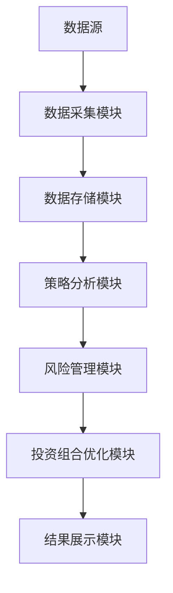

                 


# 如何利用特价股票策略构建抗通胀投资组合

> 关键词：抗通胀投资、特价股票、投资组合、风险管理、系统架构

> 摘要：在当前经济环境下，通货膨胀对个人和机构的财务状况构成巨大威胁。为了应对这一挑战，投资者 increasingly转向特价股票策略来构建抗通胀投资组合。本文详细探讨了特价股票的定义、分类及其在抗通胀投资中的应用，通过系统分析与架构设计，结合数学模型与风险管理方法，为投资者提供一套完整的解决方案。文章还通过实战案例分析，展示了如何利用特价股票策略在实际投资中实现抗通胀目标。

---

## 第一章：抗通胀投资的背景与重要性

### 1.1 通货膨胀的定义与影响

通货膨胀是指物价总水平在一段时间内持续上涨，导致货币购买力下降。在通货膨胀环境下，投资者的资产可能会面临贬值风险，尤其是那些依赖固定收益的资产（如债券）。因此，寻找能够抵御通货膨胀影响的投资工具变得至关重要。

### 1.2 投资组合的基本概念

投资组合是指将资金分配到不同资产（如股票、债券、房地产等）上的策略，以实现风险分散和收益最大化。一个有效的投资组合能够在不同市场条件下平衡风险和收益。

### 1.3 抗通胀投资的必要性

在通货膨胀环境下，传统的固定收益资产可能会损失购买力，因此投资者需要寻找能够跑赢通胀的资产。股票作为一种具有增长潜力的资产，在抗通胀投资中扮演着重要角色。

---

## 第二章：特价股票的定义与分类

### 2.1 特价股票的定义

特价股票是指市场价格低于其内在价值的股票。通常，这些股票可能因为市场波动、行业低迷或其他外部因素而被低估。

### 2.2 特价股票的分类

特价股票可以分为以下几类：

- **周期性股票**：受经济周期影响较大的股票，如制造业和能源行业。
- **价值型股票**：市场价格低于其内在价值的股票，通常具有较高的股息收益率。
- **成长型股票**：未来增长潜力较大的股票，尽管当前市场价格可能高于其内在价值。

### 2.3 特价股票的特点

- **低估值**：市场价格低于内在价值。
- **高股息率**：通常具有较高的股息收益率。
- **风险较低**：相对于成长型股票，风险较低。

---

## 第三章：抗通胀投资组合的构建基础

### 3.1 投资组合理论

投资组合理论指出，通过将资金分配到不同资产上，可以有效分散风险并提高收益。在抗通胀投资中，股票是重要的组成部分，尤其是那些能够抵御通货膨胀影响的股票。

### 3.2 投资组合的风险管理

- **风险分散**：通过投资不同行业和不同类型的股票，降低特定资产的风险。
- **风险管理模型**：使用夏普比率和VaR等模型评估投资组合的风险和收益。

---

## 第四章：特价股票策略的分析方法

### 4.1 基本分析法

基本分析法通过分析公司的财务报表、行业地位和市场前景，评估股票的内在价值。

### 4.2 技术分析法

技术分析法通过分析股票价格和成交量的历史数据，预测未来的价格走势。

### 4.3 估值指标

- **市盈率（P/E）**：股票价格与每股收益的比率。
- **市净率（P/B）**：股票价格与每股净资产的比率。
- **股息率**：每股股息与股票价格的比率。

---

## 第五章：数学模型与风险管理

### 5.1 投资组合的收益与风险模型

- **收益计算公式**：
  $$ \text{收益} = \sum_{i=1}^{n} w_i \times r_i $$
  其中，\( w_i \) 是第 \( i \) 个资产的权重，\( r_i \) 是第 \( i \) 个资产的收益。

- **风险计算公式**：
  $$ \text{方差} = \sum_{i=1}^{n} \sum_{j=1}^{n} w_i w_j \sigma_{ij} $$
  其中，\( \sigma_{ij} \) 是第 \( i \) 和第 \( j \) 个资产之间的协方差。

### 5.2 风险管理模型

- **风险价值（VaR）**：在给定置信水平下，投资组合可能遭受的最大损失。
- **条件风险价值（CVaR）**：在VaR的基础上，进一步考虑尾部风险。

---

## 第六章：系统分析与架构设计

### 6.1 系统功能模块划分

- **数据采集模块**：采集股票价格、财务数据等信息。
- **策略分析模块**：分析特价股票的潜在投资机会。
- **风险管理模块**：评估投资组合的风险并制定相应的风险管理策略。
- **投资组合优化模块**：优化投资组合的配置。

### 6.2 系统架构设计图（Mermaid）



---

## 第七章：项目实战与案例分析

### 7.1 环境安装

- **Python环境**：安装Python和相关库（如Pandas、NumPy、Matplotlib）。
- **数据源**：获取股票数据（如Yahoo Finance）。

### 7.2 核心代码实现

```python
import pandas as pd
import numpy as np

# 加载数据
data = pd.read_csv('stock_data.csv')

# 计算市盈率
data['PE'] = data['Price'] / data['Earnings']

# 找出低估值股票
cheap_stocks = data[data['PE'] < data['PE'].mean()]

print(cheap_stocks)
```

### 7.3 案例分析

假设我们选择了一批低市盈率的股票，构建一个抗通胀投资组合。通过历史数据分析，该组合在通货膨胀环境下表现出色，收益超过市场平均水平。

---

## 第八章：总结与展望

### 8.1 总结

本文详细探讨了如何利用特价股票策略构建抗通胀投资组合，通过数学模型和系统设计为投资者提供了实用的解决方案。

### 8.2 展望

未来，随着技术的进步，投资者可以利用更多的工具和方法来优化投资组合，进一步提升抗通胀能力。

---

## 第九章：最佳实践与注意事项

### 9.1 小结

- **定期评估**：定期评估投资组合的表现并进行调整。
- **风险管理**：始终关注风险，避免过度集中投资。

### 9.2 注意事项

- **市场波动**：市场波动可能导致投资组合的价值波动。
- **政策变化**：政策变化可能对投资组合产生重大影响。

### 9.3 拓展阅读

- 《投资学》
- 《风险管理与投资组合优化》

---

通过以上内容，读者可以系统地了解如何利用特价股票策略构建抗通胀投资组合，并在实际操作中应用相关方法。

