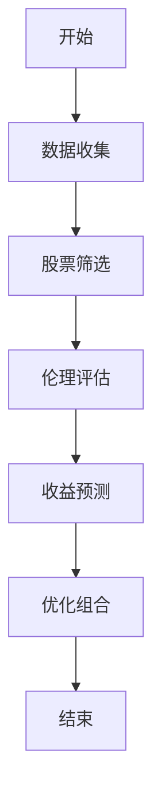

                 


# 如何利用特价股票策略构建未来科技伦理与治理主题基金

---

## 关键词

- 科技伦理
- 治理
- 股票策略
- 基金
- 投资组合优化
- 算法

---

## 摘要

本文探讨了如何利用特价股票策略构建未来科技伦理与治理主题基金。通过分析特价股票策略的算法原理、科技伦理治理框架的构建，以及两者在投资组合优化中的应用，本文为读者提供了一种创新的投资策略。文章详细阐述了核心概念、算法实现、系统架构，并通过实际案例展示了如何将科技伦理与治理融入投资决策中，最终帮助投资者实现可持续的收益。

---

## 正文

### 第一部分：背景介绍

#### 第1章：特价股票策略与科技伦理概述

##### 1.1 特价股票策略的定义与背景

特价股票策略是一种基于市场波动和公司基本面分析的投资策略，旨在在特定市场条件下捕捉低价股票的增值机会。这种策略通常关注那些被市场低估但具有长期增长潜力的公司。随着科技行业的快速发展，科技伦理与治理问题逐渐成为投资者关注的焦点。科技伦理涉及技术的道德使用、隐私保护、算法公平性等方面，而治理则涉及公司治理结构、合规性、风险控制等。

##### 1.2 科技伦理与治理的核心概念

科技伦理治理框架旨在确保科技发展符合社会价值观和道德标准。其核心原则包括透明性、公平性、隐私保护和可持续性。治理框架则通过制定政策、监管措施和企业内部规章制度，确保科技活动的合规性和社会影响的可控性。

##### 1.3 特价股票策略与科技伦理的结合

在科技领域，特价股票策略的应用需要考虑公司的科技伦理合规性。例如，避免投资那些涉及数据滥用、算法偏见或环境破坏的公司。通过将科技伦理治理框架融入投资策略，投资者可以在追求收益的同时，支持符合伦理的企业，促进社会可持续发展。

---

#### 第2章：核心概念与联系

##### 2.1 特价股票策略的核心原理

特价股票策略基于以下原则：
1. **市场分析**：识别市场低估的股票。
2. **公司基本面分析**：评估公司的财务状况、管理团队和市场地位。
3. **风险控制**：通过分散投资和止损机制降低风险。

##### 2.2 科技伦理治理框架的核心要素

科技伦理治理框架包括：
1. **伦理评估标准**：如数据隐私、算法公平性。
2. **治理机制**：如董事会结构、合规流程。
3. **政策影响**：如行业监管、法律法规。

##### 2.3 特价股票策略与科技伦理的联系

通过将科技伦理治理框架融入投资决策，投资者可以筛选出符合伦理标准的公司，从而构建一个既 profitable 又具有社会责任的投资组合。

---

### 第二部分：算法原理与数学模型

#### 第3章：特价股票策略的算法实现

##### 3.1 算法概述

算法目标是最大化收益与伦理合规。算法步骤如下：
1. 数据收集：收集目标公司的财务数据和科技伦理评估数据。
2. 股票筛选：根据预设的筛选条件（如市盈率、市净率、伦理评分）筛选股票。
3. 伦理评估：评估每家公司的科技伦理合规性。
4. 收益预测：基于历史数据预测股票未来收益。
5. 优化组合：通过优化算法构建投资组合。

##### 3.2 算法流程图



##### 3.3 Python代码实现

```python
import pandas as pd
import numpy as np

def stock_selection(stocks, criteria):
    selected = []
    for stock in stocks:
        if stock.meets_criteria(criteria):
            selected.append(stock)
    return selected

# 示例：筛选市盈率低于行业平均水平的股票
criteria = {'P/E ratio': {'<': industry_avg_pe}}
selected_stocks = stock_selection(all_stocks, criteria)
```

##### 3.4 数学模型

投资组合优化的数学模型：

$$ \text{目标：最大化} \sum_{i=1}^{n} w_i r_i $$

$$ \text{约束：} \sum_{i=1}^{n} w_i = 1, \quad w_i \geq 0 $$

其中，$w_i$ 是第 $i$ 只股票的权重，$r_i$ 是其预期收益率。

---

### 第三部分：系统分析与架构设计

#### 第4章：系统功能设计与架构

##### 4.1 系统功能设计

系统功能包括：
1. 数据采集：收集股票数据和科技伦理评估数据。
2. 伦理评估：评估每家公司的科技伦理合规性。
3. 投资组合优化：基于算法构建投资组合。
4. 风险管理：监控投资组合的风险。

##### 4.2 系统架构图


##### 4.3 系统接口设计

接口设计包括：
1. 数据接口：与数据源对接。
2. 用户界面：供用户查看和调整投资组合。
3. 报告生成：生成投资组合的绩效报告。

---

### 第四部分：项目实战

#### 第5章：构建主题基金的实战

##### 5.1 环境安装

安装所需的库：
```bash
pip install pandas numpy matplotlib
```

##### 5.2 核心代码实现

```python
import pandas as pd
import numpy as np

def evaluate_ethics(company, criteria):
    # 假设criteria是一个字典，包含伦理评估标准
    score = 0
    for key, value in criteria.items():
        if company[key] < value:
            score += 1
    return score

# 示例：评估公司的数据隐私合规性
criteria = {'data_privacy': '合规', 'algorithm_fairness': '合规'}
ethics_score = evaluate_ethics(company_data, criteria)
```

##### 5.3 案例分析

假设我们有一个科技公司列表，评估它们的数据隐私和算法公平性。通过筛选出伦理评分高的公司，构建投资组合。

##### 5.4 项目总结

通过实际案例分析，验证了算法的有效性和伦理评估的重要性。投资者可以在此基础上进一步优化模型，引入更多伦理维度。

---

### 第五部分：最佳实践与小结

#### 第6章：最佳实践与小结

##### 6.1 最佳实践

1. 定期更新伦理评估标准。
2. 结合多种指标进行综合评估。
3. 保持对市场变化的敏感性。

##### 6.2 小结

本文详细探讨了如何利用特价股票策略构建未来科技伦理与治理主题基金。通过算法实现、系统设计和项目实战，展示了科技伦理与投资策略的结合。这种策略不仅有助于实现财务目标，还能推动社会可持续发展。

---

### 第六部分：注意事项与拓展阅读

#### 6.1 注意事项

- 确保数据来源的可靠性和完整性。
- 定期审查和更新伦理评估标准。
- 保持对市场动态的敏感性。

#### 6.2 拓展阅读

- 科技伦理与治理的最新研究。
- 投资组合优化的高级算法。
- 人工智能在金融投资中的应用。

---

通过本文的分析和实践，读者可以掌握如何将科技伦理与治理融入投资策略，构建一个具有社会责任感和长期收益潜力的主题基金。

