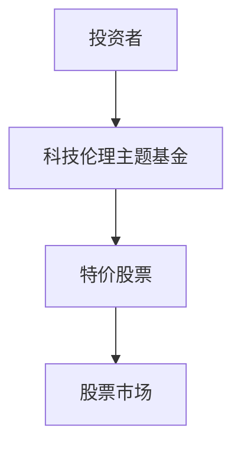
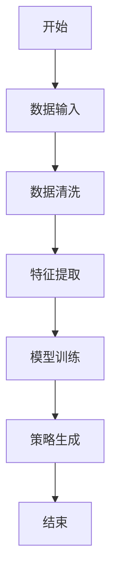
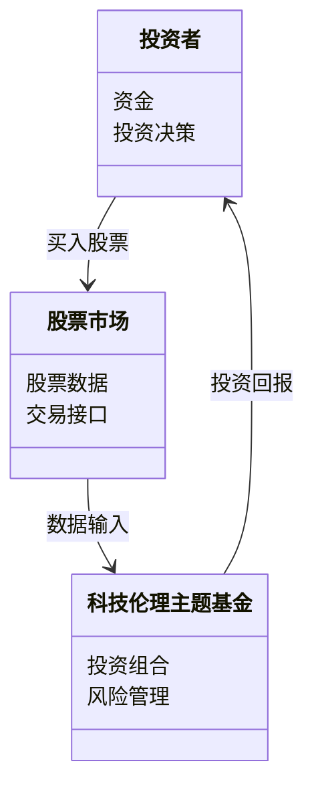
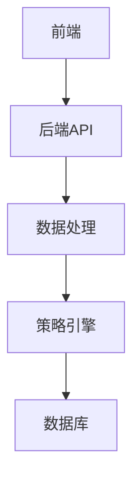

                 


```markdown
# 如何利用特价股票策略构建未来科技伦理主题基金

> 关键词：特价股票、科技伦理、主题基金、投资策略、风险管理

> 摘要：本文探讨如何利用特价股票策略构建一个专注于未来科技伦理的主题基金，通过详细分析核心概念、算法原理、系统架构和实际案例，提供一套完整的解决方案，涵盖从理论到实践的全过程。

---

## 目录大纲

### 第一部分：背景与核心概念

#### 第1章：问题背景与目标

##### 1.1 问题背景
- 1.1.1 科技伦理的重要性
- 1.1.2 特价股票策略的定义与特点
- 1.1.3 未来科技主题基金的目标

##### 1.2 核心概念的定义与边界
- 1.2.1 特价股票的定义与分类
- 1.2.2 科技伦理主题基金的定义
- 1.2.3 边界与外延

##### 1.3 核心要素组成
- 投资者
- 股票市场
- 科技伦理主题
- 风险管理

#### 第2章：核心概念与联系

##### 2.1 核心概念的原理
- 2.1.1 特价股票的筛选标准
- 2.1.2 科技伦理主题基金的构成要素
- 2.1.3 两者之间的关系

##### 2.2 核心概念对比表格
```mermaid
| 特价股票 | 科技伦理主题基金 |
|----------|------------------|
| 低价股   | 以科技伦理为核心的投资主题 |
| 高波动性 | 投资组合分散化 |
| 投机性   | 长期价值导向 |
```

##### 2.3 ER实体关系图


### 第二部分：算法原理

#### 第3章：特价股票策略的算法原理

##### 3.1 算法原理
- 3.1.1 策略目标：最大化收益，最小化风险
- 3.1.2 数据输入：历史股价、财务数据、市场指标
- 3.1.3 输出：投资组合

##### 3.2 算法步骤


##### 3.3 数学模型
- 优化目标：
$$ \text{max} \sum_{i=1}^{n} w_i r_i $$
- 约束条件：
$$ \sum_{i=1}^{n} w_i = 1 $$
$$ w_i \geq 0 \text{ 对所有 } i $$

### 第三部分：系统架构

#### 第4章：系统设计与架构

##### 4.1 项目介绍
- 目标：构建支持特价股票策略的主题基金
- 主要功能：数据采集、策略分析、投资组合优化、风险管理

##### 4.2 功能模块设计


##### 4.3 系统架构图


### 第四部分：项目实战

#### 第5章：项目实现与测试

##### 5.1 环境安装
- Python 3.8+
- 数据处理库：pandas, numpy
- 可视化库：matplotlib, seaborn
- 优化库：scipy.optimize

##### 5.2 核心代码实现
```python
import pandas as pd
from scipy.optimize import minimize

def portfolio_optimization(weights, returns):
    # 目标函数：最大化收益
    def objective(x):
        return -sum(x * returns)
    # 约束条件
    constraints = [{'type': 'eq', 'fun': lambda x: sum(x) - 1}]
    # 边界条件
    bounds = [(0, 1) for _ in range(len(weights))]
    # 优化
    result = minimize(objective, weights, method='SLSQP', bounds=bounds, constraints=constraints)
    return result.x

# 示例数据
returns = pd.Series([0.1, 0.2, 0.15])
weights = [1/3]*3
optimal_weights = portfolio_optimization(weights, returns)
print(optimal_weights)
```

##### 5.3 数据处理与回测
- 数据来源：Yahoo Finance API
- 数据清洗：处理缺失值、异常值
- 回测分析：计算夏普比率、最大回撤

### 第五部分：案例分析与伦理影响

#### 第6章：案例分析

##### 6.1 案例介绍
- 案例背景：某科技公司
- 数据分析：股价走势、财务指标
- 策略实施：买入并持有

##### 6.2 分析过程
- 数据清洗与特征提取
- 模型训练与策略生成
- 结果分析与调整

#### 第7章：伦理影响

##### 7.1 投资对科技伦理的影响
- 企业行为：研发投入、社会责任
- 政策导向：政府监管、行业标准
- 投资者的角色：推动积极变化

### 第六部分：风险管理与未来展望

#### 第8章：风险管理

##### 8.1 风险评估
- 市场风险：波动性分析
- 流动性风险：交易深度
- 信用风险：公司信用评级

##### 8.2 管理策略
- 多样化投资组合
- 设置止损点
- 定期重新评估

#### 第9章：未来展望

##### 9.1 未来趋势
- 技术进步：AI在投资中的应用
- 市场变化：科技伦理的重要性提升

##### 9.2 投资策略调整
- 动态调整投资组合
- 跟踪科技伦理趋势
- 应对监管变化

---

## 总结

通过以上步骤，我们可以系统地构建一个基于特价股票策略的科技伦理主题基金。从理论分析到实际操作，每一步都需要细致考虑，确保投资的科学性和伦理性的结合。未来，随着科技的发展和伦理意识的提升，这种投资策略将发挥更大的作用。
```

