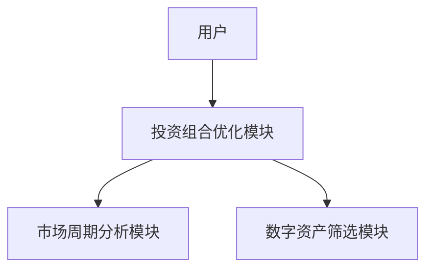

                 

# 如何利用特价股票策略构建跨周期数字主权投资组合

## 关键词：特价股票策略、跨周期投资、数字主权、投资组合、系统架构

## 摘要：
在当前复杂的经济环境中，投资者越来越关注如何通过有效的策略实现财富的保值与增值。本文将深入探讨如何利用特价股票策略构建跨周期数字主权投资组合。通过分析市场周期、数字资产的特点，结合投资组合优化算法，本文将提供一套系统化的解决方案，帮助投资者在不同市场周期中实现稳健的投资收益。

---

# 第1章 特价股票策略与跨周期投资概述

## 1.1 特价股票策略的定义与背景

### 1.1.1 特价股票的定义与特点
特价股票是指在特定市场周期中价格被低估的股票。其特点包括：
- **低估值**：市盈率、市净率等指标远低于行业平均水平。
- **周期性**：通常出现在市场低迷期或行业调整期。
- **风险收益比高**：在市场回升时具有较大的上涨潜力。

### 1.1.2 特价股票策略的应用场景
- **市场低迷期**：在市场下跌时，投资者可以通过特价股票策略捕捉低估资产。
- **行业调整期**：在某些行业因外部因素（如政策变化、技术革新）出现调整时，可以寻找被低估的股票。
- **长期投资**：通过长期持有特价股票，投资者可以在市场周期性波动中实现收益。

### 1.1.3 跨周期投资的基本概念
跨周期投资是指在较长的时间跨度内进行投资，旨在通过市场波动和经济周期的变化，实现投资收益的最大化。其核心在于：
- **分散风险**：通过配置不同周期和不同资产类别，降低投资组合的整体风险。
- **长期视角**：关注资产的长期表现，而非短期波动。

## 1.2 数字主权与投资组合构建

### 1.2.1 数字主权的定义与内涵
数字主权是指一个国家或个人在数字资产领域中拥有独立自主的决策权和控制权。其内涵包括：
- **数据主权**：对数据的生成、存储和使用拥有自主权。
- **资产独立性**：通过数字资产实现财富的独立管理。
- **技术主权**：掌握核心技术，避免对外部技术的依赖。

### 1.2.2 数字资产在投资组合中的作用
数字资产（如比特币、以太坊等）具有去中心化、抗通胀的特点，能够在投资组合中起到分散风险的作用。其具体作用包括：
- **风险分散**：数字资产与传统资产的相关性较低，可以有效降低投资组合的波动性。
- **高增长潜力**：数字资产在技术创新驱动下具有较高的增长潜力。
- **全球化配置**：数字资产不受地域限制，可以实现全球化的资产配置。

### 1.2.3 跨周期投资与数字主权的关系
跨周期投资需要考虑经济周期、市场波动等因素，而数字主权则为投资者提供了在数字资产领域中进行自主配置的能力。两者结合，可以在不同市场周期中灵活调整投资策略，实现稳健收益。

## 1.3 本章小结
本章主要介绍了特价股票策略和跨周期投资的基本概念，以及数字主权在投资组合中的作用。通过这些概念的结合，为后续构建跨周期数字主权投资组合奠定了基础。

---

# 第2章 特价股票策略的核心原理

## 2.1 特价股票策略的核心概念

### 2.1.1 市场周期分析
市场周期分为以下几个阶段：
1. **复苏期**：市场逐渐从低谷中恢复，个股出现分化。
2. **上升期**：市场整体上扬，高价股表现突出。
3. **峰值期**：市场达到高点，个股出现泡沫。
4. **衰退期**：市场开始下跌，个股价格被低估。

### 2.1.2 特价股票的识别方法
识别特价股票的方法包括：
- **估值指标**：市盈率（PE）、市净率（PB）等。
- **行业比较**：将个股与行业平均值进行对比。
- **技术分析**：通过K线图、成交量等技术指标判断股价是否被低估。

### 2.1.3 投资组合的构建逻辑
投资组合的构建逻辑包括：
1. **资产配置**：根据市场周期选择不同的资产类别。
2. **个股筛选**：通过估值和行业比较筛选出低估股票。
3. **风险控制**：设置止损点，控制投资组合的波动性。

## 2.2 特价股票策略的数学模型

### 2.2.1 市场周期模型的构建
市场周期模型可以通过以下步骤构建：
1. **数据收集**：收集历史股价数据。
2. **指标计算**：计算市盈率、市净率等指标。
3. **周期划分**：将数据划分为不同的市场周期阶段。

公式：
$$
\text{市场周期阶段} = \text{基于指标的聚类分析结果}
$$

### 2.2.2 特价股票识别的数学公式
特价股票的识别公式如下：
$$
\text{低估股票} = \{股票 | \text{PE} < \text{行业平均PE} \land \text{PB} < \text{行业平均PB}\}
$$

### 2.2.3 投资组合优化的数学模型
投资组合优化模型可以使用均值-方差模型：
$$
\min \sigma^2 \quad \text{subject to} \quad \mu \geq \text{目标收益}
$$

## 2.3 特价股票策略的算法原理

### 2.3.1 市场周期检测算法
市场周期检测算法的流程如下：
1. **数据预处理**：清洗和标准化数据。
2. **特征提取**：提取市盈率、市净率等特征。
3. **聚类分析**：使用K-means算法将数据划分为不同的市场周期阶段。

### 2.3.2 特价股票筛选算法
特价股票筛选算法的流程如下：
1. **计算估值指标**：计算每只股票的市盈率和市净率。
2. **行业比较**：将个股指标与行业平均值进行对比。
3. **筛选低估股票**：选择同时满足市盈率和市净率低于行业平均值的股票。

### 2.3.3 投资组合优化算法
投资组合优化算法的流程如下：
1. **确定投资目标**：设定风险承受能力和收益目标。
2. **计算资产回报率和协方差矩阵**。
3. **使用均值-方差模型优化投资组合**。

## 2.4 本章小结
本章详细介绍了特价股票策略的核心概念和数学模型，为后续构建跨周期数字主权投资组合提供了理论基础。

---

# 第3章 跨周期数字主权投资组合的构建

## 3.1 跨周期投资组合的构建逻辑

### 3.1.1 跨周期投资的基本原理
跨周期投资的基本原理包括：
1. **分散风险**：通过配置不同周期和资产类别的资产，降低投资组合的整体风险。
2. **长期视角**：关注资产的长期表现，而非短期波动。
3. **动态调整**：根据市场周期变化，动态调整投资组合。

### 3.1.2 数字资产在投资组合中的配置策略
数字资产的配置策略包括：
1. **资产分散**：将数字资产与其他传统资产（如股票、债券）进行分散配置。
2. **长期持有**：通过长期持有数字资产，捕捉其技术驱动的增长潜力。
3. **风险控制**：设置止损点，避免因市场波动导致的重大损失。

### 3.1.3 投资组合的执行计划
投资组合的执行计划包括：
1. **定期评估**：每季度评估投资组合的表现和风险。
2. **动态调整**：根据市场变化和投资目标调整资产配置。
3. **风险管理**：通过分散投资、设置止损等方式控制风险。

## 3.2 数字主权投资组合的系统设计

### 3.2.1 系统功能设计
系统功能设计包括：
1. **市场周期分析模块**：分析当前市场所处的周期阶段。
2. **数字资产筛选模块**：筛选出符合数字主权要求的数字资产。
3. **投资组合优化模块**：优化投资组合的配置，降低风险。

### 3.2.2 系统架构设计
系统架构设计包括：
1. **数据采集层**：收集市场数据和资产信息。
2. **数据处理层**：对数据进行清洗、计算和分析。
3. **用户界面层**：提供直观的投资组合配置和监控界面。

## 3.3 本章小结
本章详细介绍了跨周期数字主权投资组合的构建逻辑和系统设计，为投资者提供了一套系统化的投资解决方案。

---

# 第4章 特价股票策略与跨周期投资的结合

## 4.1 特价股票策略在跨周期投资中的作用

### 4.1.1 市场周期分析的作用
市场周期分析可以帮助投资者在不同市场阶段选择合适的资产配置策略。

### 4.1.2 数字资产的配置策略
通过数字资产的配置，投资者可以在市场周期波动中实现风险分散和收益增长。

## 4.2 跨周期投资中的策略优化

### 4.2.1 市场周期分析的优化
通过引入机器学习算法，提高市场周期检测的准确性和效率。

### 4.2.2 数字资产的筛选优化
通过多维度的指标分析，筛选出更具增长潜力的数字资产。

## 4.3 本章小结
本章探讨了特价股票策略在跨周期投资中的应用，并提出了优化策略，为投资者提供了更高效的投资方法。

---

# 第5章 数字主权投资组合的系统实现

## 5.1 系统功能设计

### 5.1.1 市场周期分析模块
- **功能**：分析当前市场周期阶段。
- **实现**：通过聚类分析算法，将市场数据划分为不同的周期阶段。

### 5.1.2 数字资产筛选模块
- **功能**：筛选符合数字主权要求的数字资产。
- **实现**：通过多指标分析，筛选出低估且具有增长潜力的数字资产。

## 5.2 系统架构设计

### 5.2.1 系统架构图

### 5.2.2 模块关系
- **投资组合优化模块**：核心模块，负责整体投资组合的优化。
- **市场周期分析模块**：提供市场周期分析结果，供优化模块参考。
- **数字资产筛选模块**：提供符合条件的数字资产列表，供优化模块选择。

## 5.3 本章小结
本章详细介绍了数字主权投资组合的系统实现，包括功能设计和架构设计，为投资者提供了一套完整的投资解决方案。

---

# 第6章 总结与展望

## 6.1 总结
本文详细探讨了如何利用特价股票策略构建跨周期数字主权投资组合。通过分析市场周期、数字资产的特点，结合投资组合优化算法，本文为投资者提供了一套系统化的投资解决方案。

## 6.2 展望
未来，随着人工智能和大数据技术的不断发展，特价股票策略和跨周期投资将更加精准和高效。投资者可以通过技术手段进一步优化投资组合，实现更高的收益。

---

# 附录

## 附录A 术语表
- **特价股票**：价格被低估的股票。
- **跨周期投资**：在较长的时间跨度内进行投资，旨在通过市场波动和经济周期的变化，实现投资收益的最大化。
- **数字主权**：对数字资产的生成、存储和使用拥有自主权。

## 附录B 参考文献
（此处列出相关文献和资料）

---

以上为文章的详细目录和内容框架，您可以根据需要进一步扩展每个部分的具体内容。

