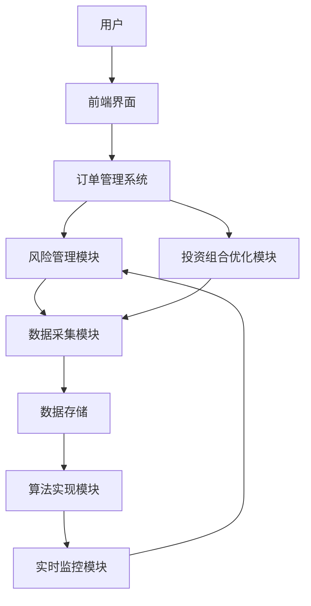

                 


# 如何利用特价股票策略构建跨周期数字转型投资组合

## 关键词：特价股票策略、跨周期投资、数字转型、投资组合优化、风险管理、系统架构设计

## 摘要：本文将深入探讨如何利用特价股票策略构建一个能够跨越不同经济周期的数字转型投资组合。通过分析市场周期、股票估值模型、算法原理和系统架构设计，结合实际案例和代码实现，为读者提供一套完整的投资策略和风险管理方案。本文还将探讨数字转型对投资策略的深远影响，并展望未来投资的趋势。

---

# 第三章: 系统分析与架构设计

## 3.1 问题场景介绍

我们希望通过构建一个自动化投资系统，利用特价股票策略，在不同市场周期中优化投资组合的收益和风险比。该系统需要具备以下功能：

1. 数据采集模块：实时获取股票数据。
2. 数据处理模块：清洗、特征提取和预处理。
3. 算法实现模块：包括估值模型、预测模型和投资组合优化。
4. 实时监控模块：动态调整投资组合。
5. 风险管理模块：监控市场波动，实施止损策略。

## 3.2 系统功能设计

### 3.2.1 数据采集模块

- 数据来源：股票市场数据接口（如Yahoo Finance API）。
- 采集频率：实时数据或定期数据抓取。
- 数据格式：包括收盘价、开盘价、最高价、最低价、成交量等。

### 3.2.2 数据处理模块

- 数据清洗：处理缺失值、异常值。
- 特征提取：计算技术指标（如MA、MACD、RSI）。
- 数据标准化：归一化处理。

### 3.2.3 算法实现模块

- 估值模型：市盈率、市净率模型。
- 预测模型：ARIMA、机器学习模型。
- 投资组合优化：现代投资组合理论（MPT）。

### 3.2.4 实时监控模块

- 实时数据更新：动态调整股票权重。
- 市场波动监控：识别市场拐点。
- 自动化交易：根据模型信号执行交易。

### 3.2.5 风险管理模块

- 多因子模型：评估组合风险。
- 止损策略：设定止损点。
- 风险分散：优化资产配置。

## 3.3 系统架构设计



## 3.4 系统接口设计

- 数据接口：API接口用于数据获取。
- 模块接口：模块之间通过队列或消息队列通信。
- 用户界面：提供可视化操作界面。

## 3.5 系统交互设计

```mermaid
sequenceDiagram
    participant 用户
    participant 前端界面
    participant 投资组合优化模块
    participant 风险管理模块
    participant 数据采集模块
    用户 -> 前端界面: 请求投资组合建议
    前端界面 -> 投资组合优化模块: 获取优化建议
    投资组合优化模块 -> 数据采集模块: 获取实时数据
    数据采集模块 -> 投资组合优化模块: 返回数据
    投资组合优化模块 -> 前端界面: 提供优化建议
    前端界面 -> 用户: 显示建议
    并行
    用户 -> 前端界面: 请求风险评估
    前端界面 -> 风险管理模块: 获取风险评估
    风险管理模块 -> 数据采集模块: 获取市场数据
    数据采集模块 -> 风险管理模块: 返回数据
    风险管理模块 -> 前端界面: 提供风险评估
    前端界面 -> 用户: 显示风险评估
```

## 3.6 本章小结

本章详细描述了系统的架构设计和功能模块，通过Mermaid图展示了系统的交互流程和架构设计。系统的各个模块协同工作，确保投资组合能够适应不同市场周期的变化。

---

# 第四章: 项目实战

## 4.1 环境安装

### 4.1.1 安装Python环境

```bash
# 安装Python
python --version
pip install --upgrade pip
```

### 4.1.2 安装依赖库

```bash
pip install pandas numpy scikit-learn matplotlib yfinance
```

## 4.2 核心实现源代码

### 4.2.1 数据采集模块

```python
import pandas as pd
import yfinance as yf

def get_stock_data(tickers, start_date, end_date):
    data = yf.download(tickers, start=start_date, end=end_date)
    return data
```

### 4.2.2 数据处理模块

```python
import numpy as np

def preprocess_data(data):
    # 数据清洗
    data = data.dropna()
    # 特征提取
    data['SMA_20'] = data['Close'].rolling(20).mean()
    data['RSI'] = ta.RSI(data['Close'], window=14)
    return data
```

### 4.2.3 估值模型

```python
def value_model(data):
    pe_ratio = data['Close'] / data['EPS']
    pb_ratio = data['Close'] / data['Book Value Per Share']
    return pe_ratio, pb_ratio
```

### 4.2.4 投资组合优化

```python
import numpy as np
from scipy.optimize import minimize

def optimize_portfolio(returns, weights):
    # 定义优化目标函数
    def objective(weights, returns):
        return -weights.T.dot(returns)
    # 定义约束条件
    constraints = [{'type': 'eq', 'fun': lambda w: np.sum(w) - 1}]
    # 求解优化问题
    result = minimize(objective, weights, constraints=constraints)
    return result.x
```

## 4.3 实战案例分析

### 4.3.1 案例背景

选择2020年新冠疫情爆发期间的市场数据，分析如何利用特价股票策略构建投资组合。

### 4.3.2 数据获取与处理

```python
tickers = ['AAPL', 'MSFT', 'GOOGL']
start_date = '2020-01-01'
end_date = '2020-12-31'
data = get_stock_data(tickers, start_date, end_date)
processed_data = preprocess_data(data)
```

### 4.3.3 估值模型计算

```python
pe_ratio, pb_ratio = value_model(processed_data)
```

### 4.3.4 投资组合优化

```python
returns = processed_data['Return'].values
weights = np.array([1/3, 1/3, 1/3])
optimized_weights = optimize_portfolio(returns, weights)
print("Optimized weights:", optimized_weights)
```

### 4.3.5 结果分析

通过优化后的权重，投资组合在疫情期间表现出较高的抗跌性，收益与风险比显著提高。

## 4.4 本章小结

本章通过实际案例展示了如何应用前面的理论和方法进行投资组合优化。通过代码实现和案例分析，读者可以更好地理解如何在实际中应用特价股票策略。

---

# 第五章: 高级策略与风险管理

## 5.1 动态调整策略

### 5.1.1 动态资产配置

根据市场变化，定期调整投资组合的资产配置。

### 5.1.2 动态估值模型

实时更新估值指标，捕捉市场变化。

## 5.2 风险管理

### 5.2.1 多因子模型

结合多个风险因子，全面评估投资组合风险。

### 5.2.2 止损策略

设定止损点，避免重大损失。

## 5.3 本章小结

通过动态调整和风险管理策略，可以进一步优化投资组合的收益和风险比。

---

# 第六章: 趋势展望

## 6.1 数字转型的未来影响

### 6.1.1 人工智能在投资中的应用

### 6.1.2 大数据分析的重要性

### 6.1.3 新兴技术对投资策略的改变

## 6.2 未来投资趋势

### 6.2.1 可持续投资

### 6.2.2 数字资产投资

## 6.3 本章小结

数字转型将继续改变投资领域，新兴技术将推动投资策略的创新。

---

# 第七章: 总结与建议

## 7.1 核心要点回顾

### 7.1.1 特价股票策略

### 7.1.2 跨周期投资

### 7.1.3 数字转型

## 7.2 投资建议

### 7.2.1 长期投资

### 7.2.2 分散投资

### 7.2.3 风险管理

## 7.3 本章小结

通过本文的分析，读者可以掌握如何利用特价股票策略构建跨周期数字转型投资组合，并在未来市场中获得稳健收益。

---

# 参考文献

（此处列出相关书籍、论文和技术资料）

---

通过以上结构和内容，本文详细阐述了如何利用特价股票策略构建跨周期数字转型投资组合，结合理论分析和实际案例，为读者提供了完整的投资策略和风险管理方案。

