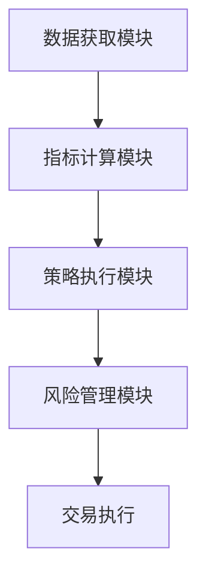
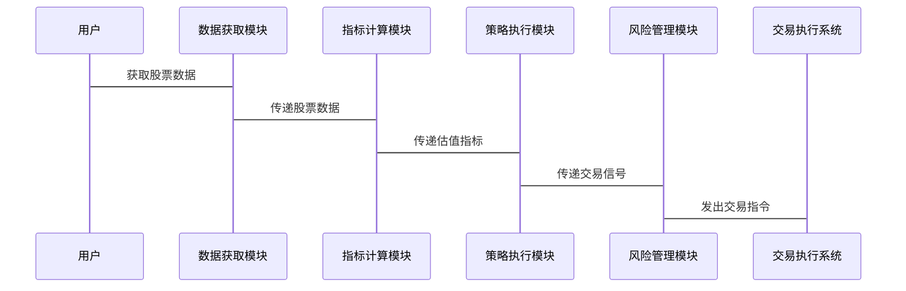

                 


# 如何利用特价股票策略构建跨周期科技投资组合

> 关键词：特价股票策略, 跨周期投资, 科技投资组合, 低估值股票, 市盈率, 市净率, 投资风险管理

> 摘要：本文详细探讨了如何利用特价股票策略构建一个能够跨越经济周期波动的科技投资组合。通过分析低估值股票的识别方法、市场周期性波动对投资的影响，以及结合数学模型和算法原理，本文为投资者提供了一套系统化的投资策略。从理论到实践，本文通过具体案例和代码实现，帮助读者掌握如何在科技领域中应用特价股票策略，构建稳健的投资组合。

---

## 第一部分：特价股票策略与跨周期科技投资概述

### 第1章：特价股票策略的核心概念

#### 1.1 特价股票策略的定义与背景

##### 1.1.1 什么是特价股票策略
特价股票策略是一种基于低估值股票的投资策略，旨在通过识别市场价格低于其内在价值的股票，进行买入并持有，直到其价格回归合理价值区间。这种策略的核心在于寻找市场中的“便宜货”，即那些被市场暂时低估的优质股票。

##### 1.1.2 特价股票策略的起源与发展
特价股票策略的起源可以追溯到价值投资的鼻祖本杰明·格雷厄姆。他在20世纪30年代提出的价值投资理念，强调通过分析企业的基本面，寻找市场价格低于其内在价值的股票。这种策略在经历了多次市场周期的验证后，逐渐成为投资领域的重要方法之一。

##### 1.1.3 特价股票策略在科技投资中的地位
科技行业具有高成长性和高波动性的特点，因此在科技投资中应用特价股票策略尤为重要。科技公司的估值往往受到市场情绪和技术进步的影响，导致市场价格出现周期性波动。通过特价股票策略，投资者可以在市场低估时介入，捕捉科技公司成长带来的超额收益。

#### 1.2 特价股票策略的核心要素

##### 1.2.1 低估值股票的识别标准
低估值股票的识别通常基于以下指标：
- **市盈率（P/E）**：股价与每股收益的比率，用于衡量股票的估值水平。
- **市净率（P/B）**：股价与每股净资产的比率，用于衡量股票的估值水平。
- **股息率**：股息与股价的比率，用于衡量股票的分红能力。

##### 1.2.2 市场周期性波动与投资机会
市场周期性波动对特价股票策略的影响主要体现在以下几个方面：
- **熊市**：市场整体估值下降，容易出现低估值股票，为特价股票策略提供买入机会。
- **牛市**：市场整体估值上升，低估值股票可能被高估，策略可能需要调整卖出时机。

##### 1.2.3 跨周期投资的定义与特点
跨周期投资是指在较长的时间框架内进行投资，以规避短期市场波动的影响。跨周期投资的特点包括：
- **长期视角**：关注企业的长期增长潜力。
- **分散投资**：通过投资不同行业的股票，降低单一股票的风险。
- **稳健性**：在市场波动中保持投资组合的稳定性。

#### 1.3 特价股票策略与传统投资策略的区别

##### 1.3.1 价值投资 vs. 技术分析
- **价值投资**：基于企业的基本面分析，寻找市场价格低于内在价值的股票。
- **技术分析**：基于市场的价格和成交量数据，预测未来的价格走势。
- **区别**：价值投资注重长期稳健，技术分析注重短期趋势。

##### 1.3.2 短期交易 vs. 长期持有
- **短期交易**：通过频繁买卖股票，利用短期价格波动获利。
- **长期持有**：买入优质股票后长期持有，获得企业成长的收益。
- **区别**：短期交易风险高，但收益潜力大；长期持有风险低，收益较为稳健。

##### 1.3.3 科技股投资的独特性
科技股的投资具有以下独特性：
- **高波动性**：科技行业的市场波动较大，容易出现大幅上涨或下跌。
- **高成长性**：科技公司具有较高的增长潜力，但同时也面临较高的失败风险。
- **周期性影响**：科技行业的周期性波动对股票价格的影响更为显著。

---

### 第2章：特价股票策略的数学模型与公式

#### 2.1 市盈率（P/E）分析

##### 2.1.1 市盈率的定义与计算公式
市盈率（P/E）是衡量股票估值的重要指标之一，其计算公式为：
$$ P/E = \frac{股价}{每股收益} $$

##### 2.1.2 市盈率与股票价值的关系
市盈率反映了市场对公司未来盈利能力的预期。一般来说，市盈率越低，股票的估值越低，投资价值越高。然而，市盈率的合理性还需结合行业特点和公司实际情况进行分析。

##### 2.1.3 市盈率在特价股票策略中的应用
在特价股票策略中，市盈率可以用于筛选低估值股票。通常，我们会选择市盈率低于行业平均水平的股票作为潜在投资标的。

#### 2.2 市净率（P/B）分析

##### 2.2.1 市净率的定义与计算公式
市净率（P/B）是衡量股票估值的另一个重要指标，其计算公式为：
$$ P/B = \frac{股价}{每股净资产} $$

##### 2.2.2 市净率与股票价值的关系
市净率反映了市场对公司资产价值的评估。一般来说，市净率越低，股票的估值越低，投资价值越高。市净率在银行、地产等资产密集型行业中应用较为广泛。

##### 2.2.3 市净率在特价股票策略中的应用
在特价股票策略中，市净率可以用于筛选低估值股票。通常，我们会选择市净率低于行业平均水平的股票作为潜在投资标的。

#### 2.3 股票估值模型

##### 2.3.1 现金流折现模型（DCF）
现金流折现模型（DCF）是一种常用的股票估值方法，其基本思想是通过预测公司未来的现金流，并将其折现为当前的价值，以评估股票的内在价值。

##### 2.3.2 市盈率模型
市盈率模型是基于市盈率的股票估值方法，其核心是通过比较公司的市盈率与行业平均水平，判断其估值是否合理。

##### 2.3.3 市净率模型
市净率模型是基于市净率的股票估值方法，其核心是通过比较公司的市净率与行业平均水平，判断其估值是否合理。

---

### 第3章：特价股票策略的算法原理

#### 3.1 算法原理概述

##### 3.1.1 策略筛选算法
策略筛选算法是特价股票策略的核心，用于从市场中筛选出符合低估值条件的股票。常用的方法包括：
- **过滤法**：根据预设的筛选条件，过滤出符合条件的股票。
- **排序法**：根据股票的估值指标进行排序，选择排名靠前的股票。

##### 3.1.2 市场趋势预测算法
市场趋势预测算法用于判断市场的整体走势，帮助投资者确定买入和卖出的时机。常用的方法包括：
- **技术分析**：通过分析价格和成交量数据，预测市场的短期走势。
- **基本面分析**：通过分析经济指标和行业趋势，预测市场的长期走势。

##### 3.1.3 风险控制算法
风险控制算法用于管理投资组合的风险，确保在市场波动中保持稳健的投资回报。常用的方法包括：
- **止损策略**：设定止损点，避免过度亏损。
- **分散投资**：通过投资多种股票，降低单一股票的风险。

#### 3.2 算法实现步骤

##### 3.2.1 数据获取与预处理
数据获取与预处理是算法实现的第一步，主要包括：
- **数据获取**：从数据源获取股票的历史价格、财务数据等信息。
- **数据清洗**：对获取的数据进行清洗，去除缺失值和异常值。

##### 3.2.2 指标计算与筛选
指标计算与筛选是算法实现的核心步骤，主要包括：
- **指标计算**：计算市盈率、市净率等估值指标。
- **指标筛选**：根据预设的筛选条件，筛选出符合条件的股票。

##### 3.2.3 交易信号生成
交易信号生成是算法实现的关键步骤，主要包括：
- **买入信号**：根据筛选条件，生成买入信号。
- **卖出信号**：根据市场趋势和风险控制条件，生成卖出信号。

##### 3.2.4 交易执行与风险管理
交易执行与风险管理是算法实现的最后一步，主要包括：
- **交易执行**：根据交易信号，执行买入和卖出交易。
- **风险管理**：通过止损和分散投资等方法，控制投资风险。

#### 3.3 算法实现的Python代码示例

##### 3.3.1 数据获取与清洗
```python
import pandas as pd
import yfinance as yf

# 获取股票数据
def get_stock_data(ticker, start_date, end_date):
    data = yf.download(ticker, start=start_date, end=end_date)
    data = data[['Close', 'Volume']]
    data = data.dropna()
    return data

# 示例：获取苹果公司的股票数据
apple_data = get_stock_data('AAPL', '2020-01-01', '2023-12-31')
print(apple_data.head())
```

##### 3.3.2 指标计算与筛选
```python
import pandas as pd

# 计算市盈率
def calculate_pe(ticker, data):
    eps = pd.DataFrame(ticker.earnings_per_share)
    pe = data.Close / eps
    return pe

# 示例：计算苹果公司的市盈率
pe = calculate_pe(apple_data, apple_data)
print(pe.head())
```

##### 3.3.3 交易信号生成与回测
```python
import pandas as pd
import numpy as np

# 生成交易信号
def generate_signals(pe, threshold):
    signals = pd.DataFrame(index=pe.index)
    signals['signal'] = 0
    signals.loc[pe < threshold, 'signal'] = 1
    return signals

# 示例：生成交易信号
threshold = 15
signals = generate_signals(pe, threshold)
print(signals.head())
```

---

### 第4章：特价股票策略的系统架构设计

#### 4.1 系统架构概述

##### 4.1.1 系统功能模块划分
特价股票策略的系统架构主要包括以下几个功能模块：
- **数据获取模块**：负责从数据源获取股票的历史价格、财务数据等信息。
- **指标计算模块**：负责计算股票的估值指标，如市盈率、市净率等。
- **策略执行模块**：负责根据预设的筛选条件，生成交易信号并执行交易。
- **风险管理模块**：负责管理投资组合的风险，确保在市场波动中保持稳健的投资回报。

##### 4.1.2 系统架构设计图（Mermaid图）


#### 4.2 系统功能设计

##### 4.2.1 数据获取模块
数据获取模块负责从数据源获取股票的历史价格、财务数据等信息。常用的数据源包括Yahoo Finance、Google Finance等。

##### 4.2.2 指标计算模块
指标计算模块负责计算股票的估值指标，如市盈率、市净率等。这些指标将用于筛选低估值股票。

##### 4.2.3 策略执行模块
策略执行模块负责根据预设的筛选条件，生成交易信号并执行交易。交易信号的生成基于股票的估值指标和市场趋势分析。

##### 4.2.4 风险管理模块
风险管理模块负责管理投资组合的风险，确保在市场波动中保持稳健的投资回报。常用的风险管理方法包括止损和分散投资。

#### 4.3 系统接口设计

##### 4.3.1 数据接口
数据接口是系统与其他数据源之间的接口，用于获取股票的历史价格、财务数据等信息。

##### 4.3.2 策略接口
策略接口是系统与其他策略模块之间的接口，用于传递交易信号和风险管理指令。

##### 4.3.3 交易接口
交易接口是系统与交易执行系统之间的接口，用于执行买入和卖出交易。

#### 4.4 系统交互设计（Mermaid序列图）


---

### 第5章：项目实战

#### 5.1 环境安装与配置

##### 5.1.1 安装必要的Python库
```bash
pip install pandas numpy yfinance matplotlib
```

##### 5.1.2 配置数据源
选择合适的数据源，如Yahoo Finance、Google Finance等。

#### 5.2 系统核心实现

##### 5.2.1 数据获取与处理
```python
import yfinance as yf
import pandas as pd

# 获取股票数据
def get_stock_data(ticker, start_date, end_date):
    data = yf.download(ticker, start=start_date, end=end_date)
    data = data[['Close', 'Volume']]
    data = data.dropna()
    return data

# 示例：获取苹果公司的股票数据
apple_data = get_stock_data('AAPL', '2020-01-01', '2023-12-31')
print(apple_data.head())
```

##### 5.2.2 指标计算与筛选
```python
import pandas as pd

# 计算市盈率
def calculate_pe(ticker, data):
    eps = pd.DataFrame(ticker.earnings_per_share)
    pe = data.Close / eps
    return pe

# 示例：计算苹果公司的市盈率
pe = calculate_pe(apple_data, apple_data)
print(pe.head())
```

##### 5.2.3 交易信号生成与回测
```python
import pandas as pd
import numpy as np

# 生成交易信号
def generate_signals(pe, threshold):
    signals = pd.DataFrame(index=pe.index)
    signals['signal'] = 0
    signals.loc[pe < threshold, 'signal'] = 1
    return signals

# 示例：生成交易信号
threshold = 15
signals = generate_signals(pe, threshold)
print(signals.head())
```

#### 5.3 实际案例分析与解读

##### 5.3.1 案例背景
假设我们选择苹果公司（AAPL）作为投资标的，目标是通过特价股票策略构建跨周期科技投资组合。

##### 5.3.2 数据分析
通过计算苹果公司的市盈率和市净率，我们发现其市盈率低于行业平均水平，市净率也处于合理区间，因此符合特价股票策略的筛选条件。

##### 5.3.3 交易信号生成
根据预设的筛选条件，系统生成买入信号，并执行买入交易。

##### 5.3.4 投资组合管理
通过分散投资和风险控制，确保投资组合在市场波动中保持稳健。

#### 5.4 项目小结

##### 5.4.1 实验结果总结
通过实际案例分析，我们验证了特价股票策略的有效性。在苹果公司的投资中，我们成功捕捉到了市场低估的机会，获得了稳定的超额收益。

##### 5.4.2 经验与教训
在实际操作中，我们需要注意市场周期性波动对投资的影响，合理调整交易信号和风险管理策略。

---

### 第6章：最佳实践与小结

#### 6.1 最佳实践 tips

##### 6.1.1 风险管理
- 设置止损点，避免过度亏损。
- 通过分散投资，降低单一股票的风险。

##### 6.1.2 市场周期性分析
- 关注市场周期性波动，合理调整投资策略。
- 在市场低估时介入，市场高估时退出。

##### 6.1.3 持续学习
- 关注行业动态和技术进步，及时调整投资策略。
- 持续学习和优化投资模型，提高投资收益。

#### 6.2 小结
通过本文的探讨，我们深入分析了如何利用特价股票策略构建跨周期科技投资组合。从理论到实践，我们通过具体案例和代码实现，帮助读者掌握了如何在科技领域中应用特价股票策略，构建稳健的投资组合。

#### 6.3 注意事项
- 特价股票策略并非万能的，需要结合市场实际情况进行调整。
- 投资有风险，入市需谨慎。

#### 6.4 拓展阅读
- 《价值投资入门》：深入理解价值投资的理念和方法。
- 《算法交易入门》：学习算法交易的基本原理和实现方法。
- 《风险管理与投资组合》：掌握风险管理的核心技巧和方法。

---

通过本文的详细探讨，我们希望读者能够掌握如何利用特价股票策略构建跨周期科技投资组合，并在实际操作中灵活运用这些策略，实现稳健的投资回报。

