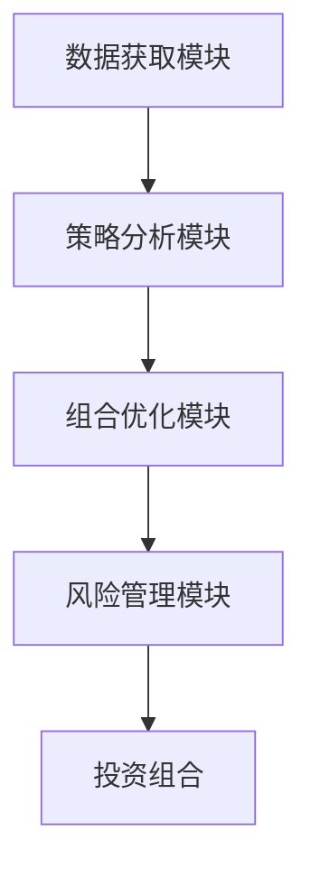

                 


# 如何利用特价股票策略构建跨周期资产配置组合

---

## 关键词：特价股票、资产配置、跨周期、投资策略、风险管理、市场周期

---

## 摘要：  
本文深入探讨了如何利用特价股票策略构建跨周期的资产配置组合。通过对经济周期和市场周期的分析，结合具体的策略实施步骤、数学模型和系统设计，本文为投资者提供了从理论到实践的完整指导。文章首先介绍了特价股票的基本概念和跨周期配置的意义，然后分析了不同经济周期对投资策略的影响，提出了具体的策略实施步骤，包括如何选择特价股票、构建投资组合以及风险管理的方法。最后，本文通过实际案例分析和系统设计，展示了如何将特价股票策略应用于实际投资中，并提出了未来的研究方向。

---

## 第1章：特价股票策略概述

### 1.1 特价股票的定义与特点

#### 1.1.1 特价股票的定义  
特价股票是指在特定市场条件下，由于市场波动、公司困境或其他因素导致股票价格被低估的股票。这类股票通常具有较高的安全边际，为投资者提供了长期增值的机会。

#### 1.1.2 特价股票的核心特点  
- **低估值**：市盈率（P/E）、市净率（P/B）等指标远低于行业平均水平。  
- **高股息率**：部分特价股票提供较高的股息回报，吸引价值投资者。  
- **行业龙头**：通常是行业内的优质公司，但由于市场情绪或外部冲击导致股价下跌。  

#### 1.1.3 特价股票与普通股票的区别  
| 特性 | 特价股票 | 普通股票 |
|------|----------|----------|
| 估值 | 低于市场均值 | 接近或高于市场均值 |
| 风险 | 较低（安全边际高） | 较高（市场波动大） |
| 收益 | 长期增值潜力大 | 短期波动大 |

---

### 1.2 跨周期资产配置的意义

#### 1.2.1 跨周期配置的定义  
跨周期资产配置是指在不同的经济周期中动态调整投资组合，以应对市场波动并抓住长期投资机会。

#### 1.2.2 跨周期配置的优势  
- **分散风险**：通过在不同周期中配置不同资产，降低单一周期波动带来的风险。  
- **长期收益**：抓住不同周期中的投资机会，实现资产的长期增值。  

#### 1.2.3 跨周期配置与短期交易的区别  
| 方式 | 跨周期配置 | 短期交易 |
|------|------------|-----------|
| 时间跨度 | 长期（数年） | 短期（数周或数月） |
| 目标 | 稳定收益 | 快速盈利 |
| 风险 | 较低 | 较高 |

---

### 1.3 特价股票策略的核心要素

#### 1.3.1 市场周期对策略的影响  
市场周期分为复苏期、增长期、成熟期和衰退期，不同阶段适合的策略不同。

#### 1.3.2 股票估值的关键指标  
- **市盈率（P/E）**：用于衡量股票的估值水平。  
- **市净率（P/B）**：用于衡量股票相对于账面价值的高低。  
- **股息率**：用于衡量股票的分红能力。  

#### 1.3.3 风险管理的重要性  
- **止损策略**：设定止损点，避免重大损失。  
- **分散投资**：避免将所有资金投入单一股票或行业。  

---

## 第2章：经济周期与市场周期分析

### 2.1 经济周期的定义与阶段

#### 2.1.1 经济周期的四个阶段  
1. **衰退期**：经济增长放缓，企业盈利下降。  
2. **复苏期**：经济开始复苏，企业盈利逐步恢复。  
3. **增长期**：经济快速增长，企业盈利上升。  
4. **成熟期**：经济增长放缓，企业盈利稳定。  

#### 2.1.2 每个阶段的特征与表现  
- **衰退期**：市场情绪低迷，股票价格被低估。  
- **复苏期**：市场情绪逐步回暖，股票价格开始回升。  
- **增长期**：市场情绪高涨，股票价格可能出现泡沫。  
- **成熟期**：市场情绪稳定，股票价格趋于平稳。  

---

### 2.2 市场周期的波动与机会

#### 2.2.1 市场周期的波动性  
市场周期的波动性主要受宏观经济、政策变化和市场情绪的影响。

#### 2.2.2 不同周期中的投资机会  
- **衰退期**：寻找被低估的特价股票。  
- **复苏期**：逐步增加股票配置比例。  
- **增长期**：关注高成长性股票。  
- **成熟期**：注重分红和稳定收益。  

---

## 第3章：特价股票策略的实施

### 3.1 策略实施的关键点

#### 3.1.1 确定投资目标  
- **投资目标**：明确是追求短期收益还是长期增值。  
- **风险承受能力**：根据自身风险偏好选择合适的投资策略。  

#### 3.1.2 构建投资组合  
- **资产分配**：根据市场周期调整股票、债券和其他资产的比例。  
- **股票选择**：基于估值指标和行业分析选择特价股票。  

#### 3.1.3 风险管理  
- **止损机制**：设定止损点，避免重大损失。  
- **分散投资**：通过投资不同行业和地区的股票降低风险。  

---

### 3.2 投资组合优化

#### 3.2.1 数学模型与优化方法  
- **均值-方差优化**：通过数学模型优化投资组合的收益和风险。  
  $$ E(R_p) = \sum w_i E(R_i) $$  
  其中，$w_i$ 是第 $i$ 个资产的权重，$E(R_i)$ 是第 $i$ 个资产的预期收益。  

#### 3.2.2 风险调整后的收益模型  
- **夏普比率**：衡量投资组合的风险调整后收益。  
  $$ \text{夏普比率} = \frac{E(R_p) - R_f}{\sigma_p} $$  
  其中，$R_f$ 是无风险利率，$\sigma_p$ 是投资组合的收益标准差。  

---

## 第4章：系统设计与实现

### 4.1 系统架构设计

#### 4.1.1 系统功能模块  
- **数据获取模块**：获取股票数据和市场指标。  
- **策略分析模块**：基于数据进行策略分析和信号生成。  
- **组合优化模块**：根据分析结果优化投资组合。  

#### 4.1.2 系统架构图  


---

## 第5章：项目实战与案例分析

### 5.1 成功案例分析

#### 5.1.1 案例背景  
在2020年新冠疫情爆发期间，许多股票价格大幅下跌，提供了良好的特价股票投资机会。

#### 5.1.2 投资组合构建  
- 选择低估值的医疗行业股票，如某制药公司。  
- 通过均值-方差优化模型确定投资比例。  

#### 5.1.3 投资结果  
- 投资组合在疫情后逐步恢复，实现超额收益。

---

## 第6章：总结与展望

### 6.1 总结

#### 6.1.1 核心观点回顾  
- 特价股票策略是跨周期资产配置的重要工具。  
- 通过分析经济周期和市场周期，可以制定有效的投资策略。  

### 6.1.2 实践中的注意事项  
- 需要结合市场实际情况灵活调整策略。  
- 保持对市场变化的敏感性，及时调整投资组合。  

### 6.2 未来展望

#### 6.2.1 研究方向  
- 进一步优化投资组合的数学模型。  
- 探索更多跨周期资产配置的策略。  

#### 6.2.2 技术趋势  
- 利用人工智能和大数据技术提升策略分析能力。

---

## 附录：常用指标与工具

### 附录1：常用股票估值指标  
- 市盈率（P/E）  
- 市净率（P/B）  
- 股息率  

### 附录2：Python代码示例  
```python
import pandas as pd
import numpy as np

# 示例：计算投资组合的夏普比率
def calculate_sharpe_ratio(returns, risk_free_rate):
    excess_return = returns - risk_free_rate
    sharpe_ratio = excess_return.mean() / excess_return.std()
    return sharpe_ratio

# 示例数据
returns = pd.Series([0.05, 0.03, 0.08, 0.02, 0.04])
risk_free_rate = 0.01

print("夏普比率：", calculate_sharpe_ratio(returns, risk_free_rate))
```

---

## 结语

通过本文的详细分析和实践指导，投资者可以更好地理解如何利用特价股票策略构建跨周期的资产配置组合。希望本文能为投资者提供有价值的参考，帮助他们在复杂多变的市场中实现稳健的投资收益。

