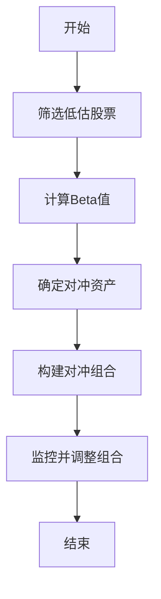
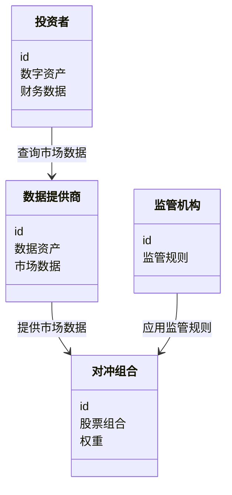
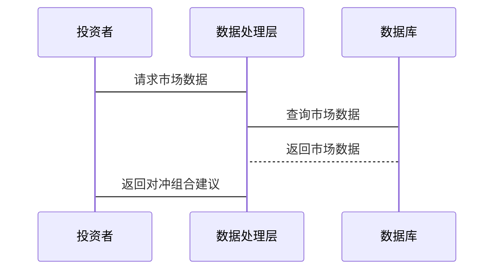

                 


# 如何利用特价股票策略构建长期数字主权与隐私保护对冲组合

> 关键词：数字主权，隐私保护，特价股票策略，对冲组合，投资策略

> 摘要：本文探讨如何利用特价股票策略构建一个既能保护数字主权和隐私，又能进行有效对冲的投资组合。通过分析数字主权和隐私保护的重要性，结合特价股票策略的算法原理和数学模型，构建一个安全、高效的对冲组合。文章从背景介绍、核心概念、算法实现、系统设计到项目实战，全面解析这一策略。

---

## 第一部分：背景与核心概念

### 第1章：数字主权与隐私保护的背景

#### 1.1 数字主权的定义与重要性

数字主权是指一个国家或个人对其数字资产和数据的控制权和使用权。在数字化时代，数字主权的重要性日益凸显，因为它关系到国家安全、经济利益和个人隐私。数字主权的核心在于确保数据的自主性和不可侵犯性，防止外部势力的干涉和数据泄露。

#### 1.2 隐私保护的重要性

隐私保护是数字时代的核心问题之一。随着信息技术的发展，个人和企业的数据被广泛收集和利用，隐私保护成为保护个人权益的重要手段。隐私保护不仅关乎个人隐私，还影响企业的声誉和法律责任。

#### 1.3 特价股票策略的背景

特价股票策略是一种投资策略，旨在通过购买价格低于其实际价值的股票来获得超额收益。这种策略通常在市场低迷或公司遇到短期困难时实施，利用市场的非理性定价来实现收益。

#### 1.4 数字主权、隐私保护与特价股票的联系

数字主权和隐私保护为特价股票策略提供了新的应用场景。通过对数据的控制和隐私保护，投资者可以更好地分析市场动态，发现低估的股票，构建对冲组合，降低风险，同时保护个人和企业的数字资产。

---

### 第2章：数字主权与隐私保护的核心概念

#### 2.1 数字主权的实体关系图

```mermaid
erDiagram
    actor 投资者 {
        <.pk> id
        name
        digital_assets
        }
    actor 数据提供商 {
        <pk> id
        name
        data_assets
        }
    actor 监管机构 {
        <pk> id
        name
        regulations
        }
    investor <--own--> digital_assets
    data_provider <--own--> data_assets
   监管机构 <--regulate--> digital_assets
    投资者 <--use--> 数据提供商
```

数字主权涉及投资者、数据提供商和监管机构三者之间的关系。投资者拥有数字资产，数据提供商拥有数据资产，监管机构负责监管数字资产的使用。

#### 2.2 隐私保护的属性特征对比表

| 属性 | 特征 |
|------|------|
| 安全性 | 防止数据泄露 |
| 隐私性 | 保护个人数据 |
| 可控性 | 用户控制数据访问 |
| 透明性 | 数据使用透明 |

#### 2.3 数字主权与隐私保护的联系

数字主权为隐私保护提供了法律和制度保障，而隐私保护则通过技术手段实现数字主权的实践。两者相互依存，共同构建安全的数字环境。

---

## 第二部分：算法原理讲解

### 第3章：特价股票对冲策略的算法原理

#### 3.1 算法概述

特价股票对冲策略旨在通过购买低估股票和卖出高估股票，构建一个零成本或低成本的对冲组合。该算法基于市场中性原则，利用资产价格的波动性进行套利。

#### 3.2 算法流程图



算法步骤包括筛选低估股票、计算Beta值、确定对冲资产、构建组合、监控和调整。

#### 3.3 算法实现代码

```python
import pandas as pd
import numpy as np

def calculate_beta(stock_returns, market_returns):
    # 计算Beta系数
    covariance = np.cov(stock_returns, market_returns)[0, 1]
    variance = np.var(market_returns)
    beta = covariance / variance
    return beta

def stock_selection(stocks, market_data):
    selected = []
    for stock in stocks:
        stock_data = market_data[stock]
        beta = calculate_beta(stock_data.returns, market_data['market_returns'])
        if beta < 0.95 and stock_data.price < stock_data.book_value:
            selected.append(stock)
    return selected

# 示例数据
market_data = {'market_returns': pd.Series([0.02, 0.01, 0.03], index=[2020,2021,2022]),
               'stocks': {'stock1': {'price': 50, 'book_value': 60, 'returns': [0.1, 0.05, 0.07]},
                          'stock2': {'price': 30, 'book_value': 40, 'returns': [0.08, 0.06, 0.04]}}
selected_stocks = stock_selection(['stock1', 'stock2'], market_data)
print(selected_stocks)
```

---

### 第4章：数学模型与公式

#### 4.1 对冲组合的构建公式

对冲组合的目标是使组合的Beta系数为零，即：

$$
\beta_p = \sum_{i=1}^{n} w_i \beta_i = 0
$$

其中，$w_i$是第i只股票的权重，$\beta_i$是其Beta系数。

#### 4.2 投资组合的收益公式

投资组合的预期收益可以表示为：

$$
E(R_p) = \sum_{i=1}^{n} w_i E(R_i)
$$

其中，$E(R_i)$是第i只股票的预期收益。

#### 4.3 风险调整后的收益公式

夏普比率用于衡量风险调整后的收益：

$$
\text{夏普比率} = \frac{E(R_p - R_f)}{\sigma_p}
$$

其中，$R_f$是无风险利率，$\sigma_p$是组合的波动率。

---

## 第三部分：系统分析与架构设计

### 第5章：系统功能设计

#### 5.1 领域模型类图



#### 5.2 系统架构设计

```mermaid
archiDiagram
    component 投资者界面 {
        提交查询
        显示结果
        }
    component 数据处理层 {
        计算Beta系数
        构建对冲组合
        }
    component 数据库 {
        市场数据
        股票数据
        }
    投资者界面 --> 数据处理层
    数据处理层 --> 数据库
```

---

### 第6章：接口设计与交互

#### 6.1 接口设计

- API接口：提供市场数据查询、Beta系数计算、对冲组合构建等功能。

#### 6.2 交互流程



---

## 第四部分：项目实战

### 第7章：项目实现

#### 7.1 环境安装

- Python 3.8+
- Pandas, NumPy, Matplotlib

#### 7.2 核心代码实现

```python
import pandas as pd
import numpy as np

def calculate_beta(stock_returns, market_returns):
    covariance = np.cov(stock_returns, market_returns)[0, 1]
    variance = np.var(market_returns)
    return covariance / variance

def build_portfolio(stocks, market_data):
    portfolio = []
    for stock in stocks:
        stock_data = market_data[stock]
        beta = calculate_beta(stock_data.returns, market_data['market_returns'])
        if beta < 0.95:
            portfolio.append(stock)
    return portfolio

# 示例数据
market_data = {
    'market_returns': pd.Series([0.02, 0.01, 0.03], index=[2020,2021,2022]),
    'stocks': {
        'stock1': {'returns': [0.1, 0.05, 0.07], 'price': 50, 'book_value': 60},
        'stock2': {'returns': [0.08, 0.06, 0.04], 'price': 30, 'book_value': 40}
    }
}
selected_stocks = build_portfolio(['stock1', 'stock2'], market_data)
print(selected_stocks)
```

---

## 第五部分：总结与展望

### 第8章：最佳实践与小结

#### 8.1 小结

通过结合数字主权和隐私保护，利用特价股票策略构建对冲组合，可以在保护数字资产的同时实现投资收益。本文详细介绍了算法原理、系统架构和项目实现，为投资者提供了实用的指导。

#### 8.2 注意事项

- 数据隐私保护需严格遵守相关法规。
- 算法模型需定期更新和优化。
- 投资决策需结合市场动态和专业分析。

#### 8.3 拓展阅读

- 数字主权相关的法律和政策。
- 隐私保护技术的最新发展。
- 对冲组合的其他构建方法。

---

# 结语

利用特价股票策略构建长期数字主权与隐私保护对冲组合，不仅是一种投资策略，更是保护数字资产的重要手段。通过本文的详细解析，读者可以掌握这一策略的核心要点，并在实际操作中灵活运用。未来，随着技术的发展，这一领域将有更多创新和突破，值得持续关注和研究。

