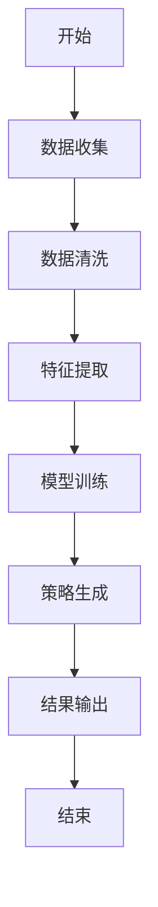
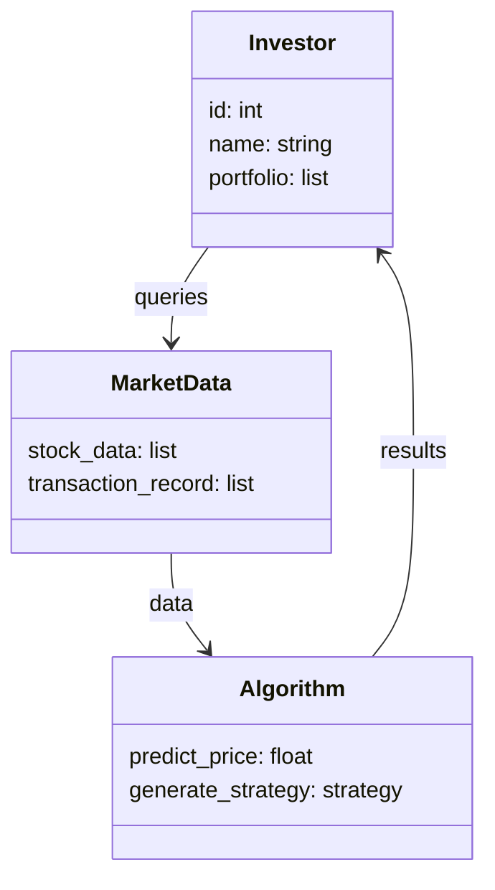
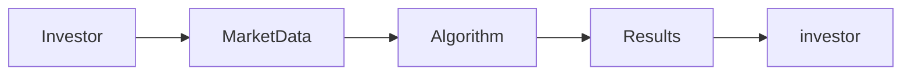
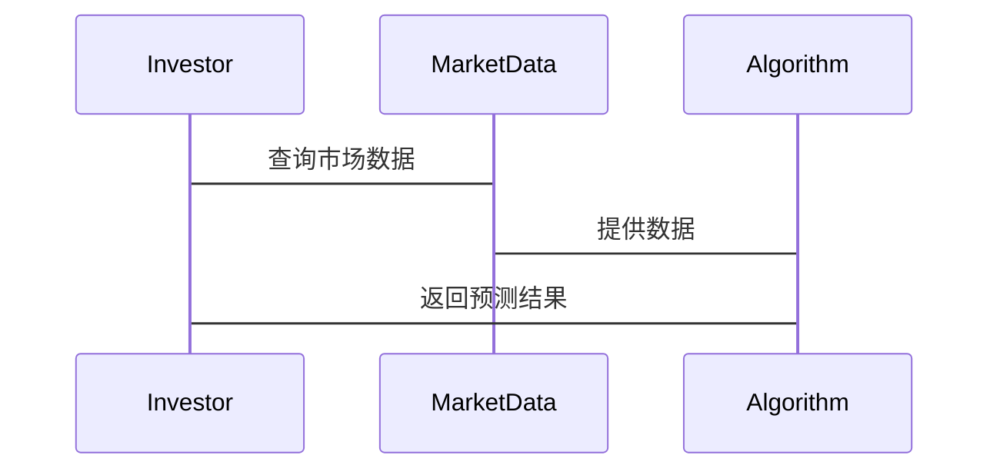

                 


```markdown
# 如何利用特价股票策略构建长期数字主权与隐私保护投资组合

> 关键词：特价股票、数字主权、隐私保护、投资组合、算法原理

> 摘要：本文将探讨如何利用特价股票策略构建长期数字主权与隐私保护的投资组合。通过分析特价股票的核心原理、数字主权与隐私保护的重要性，结合算法和系统架构设计，为读者提供一个安全、高效的投资策略。

---

## 第一部分: 特价股票策略与数字主权概述

### 第1章: 特价股票策略的背景与意义

#### 1.1 特价股票的定义与特点
- **1.1.1 特价股票的定义**  
  特价股票是指在特定市场条件下，以低于市场价出售的股票。这种股票通常在市场低迷或公司遇到短期困难时出现，为投资者提供了以较低价格买入优质资产的机会。

- **1.1.2 特价股票的核心特点**  
  特价股票的特点包括高波动性、高风险、高回报和短期性。投资者需要具备快速识别和决策的能力，才能在市场中抓住这些机会。

- **1.1.3 特价股票与传统股票的区别**  
  与传统股票相比，特价股票的风险更高，但潜在回报也更大。投资者需要更加谨慎地评估公司的基本面和市场环境。

#### 1.2 数字主权与隐私保护的背景
- **1.2.1 数字主权的概念**  
  数字主权是指个人或国家对其数字资产和数据的控制权。在数字化时代，保护数字主权对于个人和企业都至关重要。

- **1.2.2 隐私保护的重要性**  
  隐私保护是数字主权的重要组成部分。随着数据的广泛应用，保护个人隐私和数据安全成为投资者必须考虑的重要因素。

- **1.2.3 数字主权与隐私保护的关联**  
  数字主权的实现依赖于隐私保护，而隐私保护则是数字主权的重要保障。两者相辅相成，共同确保投资者的数据安全和利益。

#### 1.3 特价股票策略与数字主权的关系
- **1.3.1 特价股票策略的潜在风险**  
  特价股票策略的风险主要体现在市场波动和公司基本面的变化上。投资者需要具备一定的风险承受能力和市场敏感性。

- **1.3.2 数字主权对投资策略的影响**  
  数字主权的保护措施可以确保投资者的数据和交易信息的安全，从而为投资策略的实施提供保障。

- **1.3.3 隐私保护在投资中的作用**  
  隐私保护可以防止投资者的交易信息被滥用，从而降低投资风险，提高投资回报。

### 第2章: 特价股票策略的核心概念与联系

#### 2.1 特价股票策略的原理
- **2.1.1 市场周期分析**  
  市场周期分析是特价股票策略的重要组成部分。通过分析市场的波动周期，投资者可以更好地把握买入和卖出的时机。

- **2.1.2 价格波动预测**  
  价格波动预测是基于历史数据和市场趋势，利用算法和模型预测股票价格的变化趋势。

- **2.1.3 投资组合优化**  
  投资组合优化是通过合理配置资产，降低风险并提高回报。特价股票策略可以通过优化投资组合，实现长期稳定的收益。

#### 2.2 数字主权与隐私保护的机制
- **2.2.1 数据加密技术**  
  数据加密技术是保护隐私的重要手段。通过加密技术，可以确保投资者的数据不被未经授权的第三方访问。

- **2.2.2 区块链在隐私保护中的应用**  
  区块链技术可以提供透明且不可篡改的记录，确保数据的安全性和隐私性。在投资中，区块链可以用于记录交易信息，防止数据被篡改。

- **2.2.3 数字主权的实现路径**  
  数字主权的实现需要通过法律、技术和政策的综合作用。投资者可以通过选择符合隐私保护标准的平台和工具，实现数字主权的保护。

#### 2.3 特价股票策略与数字主权的联系
- **2.3.1 数据驱动的投资决策**  
  数据驱动的投资决策需要依赖大量的市场数据和公司信息。数字主权的保护可以确保这些数据的安全性和准确性。

- **2.3.2 隐私保护对投资安全的影响**  
  隐私保护可以防止投资者的交易信息被滥用，从而降低投资风险，提高投资安全性。

- **2.3.3 数字主权对投资策略的优化**  
  通过数字主权的保护，投资者可以更好地控制自己的数据和交易信息，从而优化投资策略，提高投资回报。

### 第3章: 特价股票策略的算法原理

#### 3.1 算法原理概述
- **3.1.1 特价股票选择的算法逻辑**  
  特价股票选择的算法逻辑包括数据收集、数据清洗、特征提取、模型训练和策略生成等步骤。通过算法，投资者可以快速识别出具有潜在投资价值的股票。

- **3.1.2 投资组合优化的数学模型**  
  投资组合优化的数学模型包括收益最大化和风险最小化的目标函数，以及约束条件。通过优化模型，投资者可以实现投资组合的最优配置。

- **3.1.3 风险评估与收益预测**  
  风险评估与收益预测是通过分析历史数据和市场趋势，利用统计和机器学习方法，预测股票的未来表现。

#### 3.2 算法流程图


#### 3.3 算法实现代码
```python
def stock_selection_algorithm(data):
    # 数据清洗
    cleaned_data = data.dropna()
    # 特征提取
    features = cleaned_data[['price', 'volume', 'market_cap']]
    # 模型训练
    model = LinearRegression()
    model.fit(features, cleaned_data['target'])
    # 策略生成
    predictions = model.predict(features)
    return predictions
```

#### 3.4 数学模型与公式
- **收益计算公式**  
  $$ \text{收益} = \sum_{i=1}^{n} (p_i - c_i) $$
  其中，\( p_i \) 是卖出价格，\( c_i \) 是买入价格。

- **风险评估公式**  
  $$ \text{风险} = \sigma^2 $$
  其中，\( \sigma \) 是收益的方差。

通过上述公式，投资者可以量化投资组合的收益和风险，从而做出更加科学的投资决策。

---

## 第四部分: 系统分析与架构设计

### 第4章: 数字主权与隐私保护的系统架构

#### 4.1 问题场景介绍
在数字主权与隐私保护的投资系统中，需要确保投资者的数据和交易信息的安全性。系统需要能够抵御各种网络攻击和数据泄露的风险，同时提供高效的交易和数据分析功能。

#### 4.2 系统功能设计


#### 4.3 系统架构设计


#### 4.4 系统接口设计
- **API接口**  
  系统需要提供RESTful API接口，供投资者查询市场数据、提交交易订单和获取交易结果。

- **数据加密接口**  
  系统需要提供数据加密接口，确保投资者的数据在传输和存储过程中不被泄露。

#### 4.5 系统交互序列图


---

## 第五部分: 项目实战

### 第5章: 环境安装与核心实现

#### 5.1 环境安装
投资者需要安装以下工具和库：
- **Python**：用于数据分析和算法实现。
- **Pandas**：用于数据处理。
- **Scikit-learn**：用于机器学习模型训练。
- **Mermaid**：用于绘制图表。

#### 5.2 核心代码实现
```python
import pandas as pd
from sklearn.linear_model import LinearRegression

def main():
    # 数据加载
    data = pd.read_csv('stock_data.csv')
    # 数据清洗
    cleaned_data = data.dropna()
    # 特征提取
    features = cleaned_data[['price', 'volume', 'market_cap']]
    target = cleaned_data['target']
    # 模型训练
    model = LinearRegression()
    model.fit(features, target)
    # 预测结果
    predictions = model.predict(features)
    print('预测结果:', predictions)

if __name__ == '__main__':
    main()
```

#### 5.3 代码解读与分析
- **数据加载**：从CSV文件中加载股票数据。
- **数据清洗**：删除缺失值，确保数据的完整性。
- **特征提取**：选择影响股票价格的关键特征，如价格、成交量和市值。
- **模型训练**：使用线性回归模型训练，预测股票价格。
- **预测结果**：输出模型的预测结果，供投资者参考。

#### 5.4 实际案例分析
假设我们有一个包含以下数据的CSV文件：
```
price, volume, market_cap, target
100, 1000, 500000, 1
90, 1500, 600000, 0
80, 2000, 700000, -1
```
通过上述代码，我们可以训练模型并预测股票价格的变化趋势，从而制定相应的投资策略。

---

## 第六部分: 最佳实践与小结

### 第6章: 小结与注意事项

#### 6.1 小结
通过本文的分析，我们可以看出，利用特价股票策略构建长期数字主权与隐私保护的投资组合，不仅需要掌握股票市场的基本知识，还需要具备一定的技术能力和安全意识。数字主权和隐私保护是确保投资安全的重要保障，而算法和系统设计则是实现投资目标的关键工具。

#### 6.2 注意事项
- **数据隐私保护**：投资者需要特别注意数据的隐私保护，避免因数据泄露导致投资损失。
- **系统安全性**：投资系统需要具备强大的安全防护能力，抵御各种网络攻击和数据篡改。
- **持续学习与优化**：市场环境和法律法规不断变化，投资者需要持续学习和优化投资策略，以适应新的挑战。

### 第7章: 拓展阅读与学习资源

#### 7.1 拓展阅读
- **《算法交易：如何利用数学与计算机科学在金融市场上获得超额收益》**：本书深入介绍了算法交易的基本原理和实现方法。
- **《区块链：重新定义价值交换的未来》**：本书详细讲解了区块链技术及其在金融领域的应用，对数字主权和隐私保护有深刻的见解。

#### 7.2 学习资源
- **Coursera：金融数据分析与投资策略**  
  提供金融数据分析和投资策略的在线课程，帮助投资者提升数据分析能力。
- **QuantInst：量化投资与算法交易**  
  提供量化投资和算法交易的实战课程，适合有一定编程基础的投资者。

---

## 结语

通过本文的详细分析，我们可以看到，利用特价股票策略构建长期数字主权与隐私保护的投资组合，不仅需要掌握股票市场的基本知识，还需要具备一定的技术能力和安全意识。希望本文的分析和建议能够为投资者提供有价值的参考，帮助他们在复杂多变的市场环境中实现稳健的投资回报。
```

