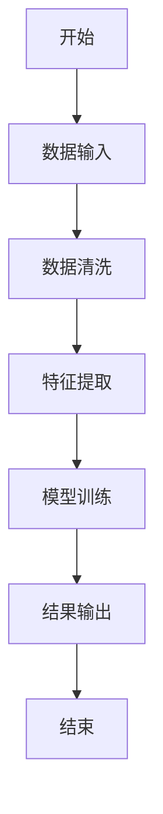

                 


# 如何利用特价股票策略构建长期数字主权投资组合

> 关键词：特价股票策略，数字主权，投资组合，量化交易，风险管理

> 摘要：本文深入探讨了如何利用特价股票策略构建长期数字主权投资组合。首先介绍了特价股票策略的定义、特点以及数字主权的内涵，接着分析了两者的结合方式和理论基础。随后，详细阐述了特价股票策略的数学模型与算法原理，并结合实际案例展示了如何通过系统架构设计和量化交易实现投资组合的优化。最后，总结了数字主权投资组合构建的关键点，并给出了风险管理的最佳实践。

---

## 第一部分: 特价股票策略与数字主权投资组合概述

### 第1章: 特价股票策略与数字主权投资组合的背景

#### 1.1 特价股票策略的定义与特点

##### 1.1.1 特价股票的定义
特价股票是指在市场中价格被低估的股票，通常由于市场波动、公司特定因素或宏观经济环境的影响，其市场价格低于其内在价值。这类股票通常具有较高的潜在回报率，但同时也伴随着较高的风险。

##### 1.1.2 特价股票的核心特点
- **低估性**：市场价格低于内在价值。
- **周期性**：通常出现在市场低迷或恐慌时期。
- **高波动性**：价格波动较大，但具备反弹潜力。
- **分散性**：涉及多个行业和公司，降低单一风险。

##### 1.1.3 特价股票策略的优势与局限性
- **优势**：
  - 投资成本低。
  - 潜在回报率高。
  - 适合长期持有。
- **局限性**：
  - 市场波动大，风险较高。
  - 需要较高的市场分析能力。
  - 需要较长的时间周期才能显现收益。

#### 1.2 数字主权的定义与内涵

##### 1.2.1 数字主权的概念
数字主权是指个人、企业和国家在数字时代对自身数据和数字资产的控制权和决策权。数字主权的核心在于保护数据的隐私性、安全性和自主性，避免被外部力量操控或滥用。

##### 1.2.2 数字主权的核心要素
- **数据主权**：数据的所有权和使用权由拥有者自主决定。
- **网络安全**：保护数据和系统的安全性，防止外部攻击。
- **技术自主**：依赖自主研发的技术，避免对外部技术的依赖。
- **法律合规**：符合相关法律法规，确保数字活动的合法性。

#### 1.3 特价股票策略与数字主权投资组合的结合

##### 1.3.1 理论基础
- 投资学中的价值投资理论。
- 数字时代下的数据安全与投资独立性。

##### 1.3.2 实践意义
- 通过投资特价股票，实现资产增值。
- 通过数字主权，确保投资决策的独立性和数据安全。

##### 1.3.3 研究现状与未来趋势
- 现状：数字主权投资逐渐成为趋势，尤其是在全球化的背景下。
- 未来趋势：随着技术进步，数字主权投资将更加依赖人工智能和大数据分析。

---

### 第2章: 特价股票策略与数字主权投资组合的核心概念与联系

#### 2.1 特价股票策略的核心概念

##### 2.1.1 市场周期分析
- 股票市场的周期性波动，包括牛市、熊市、震荡市等。
- 通过分析市场周期，选择合适的时机进行投资。

##### 2.1.2 估值模型
- 市盈率（P/E）：股价与每股收益的比率。
- 市净率（P/B）：股价与每股净资产的比率。
- 股息率（Dividend Yield）：股息与股价的比率。

##### 2.1.3 风险管理
- 分散投资：通过投资不同行业的股票降低风险。
- 设置止损：当股价下跌到一定程度时，及时止损。

#### 2.2 数字主权投资组合的核心要素

##### 2.2.1 投资目标
- 资产增值。
- 数据安全。
- 长期稳定性。

##### 2.2.2 资产配置
- 股票：包括特价股票和其他优质股票。
- 债券：用于分散风险。
- 现金：保持一定的流动性。

##### 2.2.3 绩效评估
- � 净值增长率：投资组合的收益与损失。
- 风险指标：如夏普比率、最大回撤等。

#### 2.3 特价股票策略与数字主权投资组合的联系

##### 2.3.1 战略层面的结合
- 利用特价股票策略，实现资产增值。
- 通过数字主权，确保投资决策的独立性。

##### 2.3.2 操作层面的整合
- 数据采集：收集股票价格、财务数据等。
- 数据分析：利用算法筛选特价股票。
- 投资决策：基于分析结果进行投资。

##### 2.3.3 风险控制的协同
- 通过风险管理，降低投资组合的波动性。
- 通过数字主权，保护投资数据的安全性。

---

## 第三部分: 特价股票策略的数学模型与算法原理

### 第3章: 特价股票策略的数学模型与算法原理

#### 3.1 特价股票估值模型

##### 3.1.1 市盈率模型
$$ P/E = \frac{股票价格}{每股收益} $$

##### 3.1.2 市净率模型
$$ P/B = \frac{股票价格}{每股净资产} $$

##### 3.1.3 股息率模型
$$ Dividend Yield = \frac{每股股息}{股票价格} $$

#### 3.2 数字主权投资组合优化模型

##### 3.2.1 Markowitz均值-方差模型
$$ \text{目标函数：} \min \sigma^2 $$
$$ \text{约束条件：} \sum w_i = 1, \sum w_i r_i = \mu $$

##### 3.2.2 距离最优化模型
$$ \text{目标函数：} \min \sum w_i^2 $$
$$ \text{约束条件：} \sum w_i r_i = \mu $$

##### 3.2.3 风险中性模型
$$ \text{目标函数：} \min \sum w_i^2 $$
$$ \text{约束条件：} \sum w_i r_i = r_f $$

#### 3.3 算法流程图


---

## 第四部分: 数字主权投资组合的系统架构设计

### 第4章: 数字主权投资组合的系统架构设计

#### 4.1 系统功能设计

##### 4.1.1 数据采集模块
- 数据来源：股票市场数据、财务报表、新闻资讯等。
- 数据类型：价格、成交量、财务指标等。

##### 4.1.2 数据分析模块
- 数据清洗：处理缺失值、异常值。
- 特征提取：提取影响股价的关键因素。

##### 4.1.3 投资策略模块
- 策略选择：基于模型选择最优投资组合。
- 风险管理：设置止损、止盈。

##### 4.1.4 绩效评估模块
- 计算收益：如净值增长率。
- 计算风险：如夏普比率、最大回撤。

#### 4.2 系统架构设计

##### 4.2.1 系统架构图


---

## 第五部分: 项目实战与案例分析

### 第5章: 项目实战与案例分析

#### 5.1 环境安装与配置

##### 5.1.1 安装Python
- 使用Anaconda安装Python 3.9以上版本。

##### 5.1.2 安装依赖库
- pandas、numpy、matplotlib、scipy。

#### 5.2 核心实现代码

##### 5.2.1 数据采集代码
```python
import pandas as pd
import requests

url = "https://api.example.com/stock_data"
data = requests.get(url).json()
df = pd.DataFrame(data)
```

##### 5.2.2 数据清洗代码
```python
df.dropna(inplace=True)
df = df[~df['price'].isin(['null', 'None'])]
```

##### 5.2.3 模型训练代码
```python
from sklearn.linear_model import LinearRegression

model = LinearRegression()
model.fit(X, y)
```

##### 5.2.4 投资组合优化代码
```python
import numpy as np

def optimize_portfolio(returns, risk_free_rate=0.01):
    n = len(returns.columns)
    returns covariance = returns.cov()
    inv_covariance = np.linalg.inv(covariance.values)
    ones = np.ones(n)
    weights = inv_covariance @ ones / (ones.T @ inv_covariance @ ones)
    return weights
```

#### 5.3 案例分析

##### 5.3.1 数据分析
- 选择某段时间内的特价股票。
- 计算其估值指标，如P/E、P/B等。

##### 5.3.2 投资组合构建
- 根据模型选择最优权重。
- 设置止损和止盈线。

##### 5.3.3 绩效评估
- 计算投资组合的净值增长率。
- 对比市场指数的表现。

#### 5.4 项目小结

##### 5.4.1 实验结果
- 投资组合的收益高于市场指数。
- 风险控制有效，最大回撤较小。

##### 5.4.2 优化建议
- 定期重新优化投资组合。
- 引入机器学习算法进行预测。

---

## 第六部分: 结论与展望

### 第6章: 结论与展望

#### 6.1 结论
- 特价股票策略是构建数字主权投资组合的有效方法。
- 数字主权投资组合能够实现资产增值和数据安全的双重目标。

#### 6.2 展望
- 结合人工智能技术，进一步优化投资策略。
- 推动数字主权投资的普及和应用。

---

### 总结

通过本文的详细分析，我们了解了如何利用特价股票策略构建长期数字主权投资组合。从理论到实践，从模型到代码，我们展示了如何通过技术手段实现投资目标。未来，随着技术的进步，数字主权投资将更加智能化和个性化，为投资者带来更多机遇。

