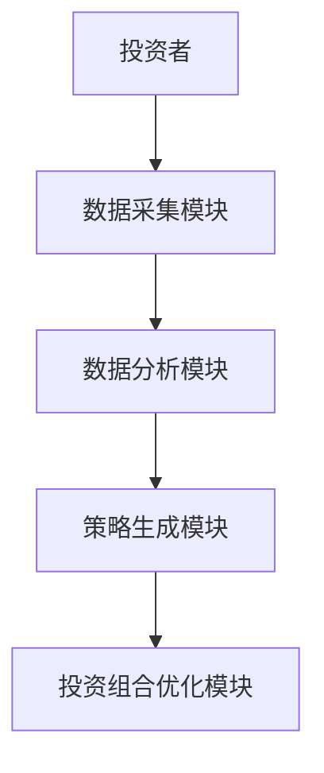

                 


# 如何利用特价股票策略构建长期科技创新投资组合

> 关键词：特价股票策略、科技创新投资、投资组合构建、股票投资分析、风险管理、算法交易

> 摘要：本文详细探讨了如何利用特价股票策略构建长期科技创新投资组合。从特价股票的定义、特点、投资价值出发，结合科技创新企业的成长周期与股价波动，分析了特价股票策略的核心原理、数学模型和算法实现。通过系统架构设计、实战案例分析和风险管理策略，为读者提供了一套完整的技术投资方案，帮助投资者在复杂多变的市场环境中实现长期稳定的收益。

---

## 第1章: 特价股票策略与科技创新投资概述

### 1.1 特价股票策略的背景与意义
#### 1.1.1 什么是特价股票
- 定义：特价股票是指价格显著低于其内在价值的股票。
- 特点：价格低估、潜在回升空间大、高回报率。

#### 1.1.2 特价股票的投资价值
- 投资者可以通过低价买入，高价卖出赚取收益。
- 适合长期投资，尤其是科技创新企业成长期的股票。

#### 1.1.3 科技创新与股票投资的关系
- 科技创新企业具有高成长性，股票价格波动大，但长期回报率高。
- 特价股票策略能够抓住科技创新企业的低谷期，实现低价买入，长期持有。

### 1.2 特价股票策略的核心概念
#### 1.2.1 特价股票的定义与特征
- 定义：价格低于市场平均水平的股票。
- 特征：低估值、高增长潜力、行业龙头股。

#### 1.2.2 科技创新企业的股票特点
- 高成长性：技术创新能力强，市场份额增长快。
- 高波动性：受市场情绪和技术发展影响较大。
- 高风险性：技术创新失败或市场替代可能导致股价大幅波动。

#### 1.2.3 特价股票策略的目标与边界
- 目标：在低价时买入，高价时卖出，实现超额收益。
- 边界：避免投资于基本面差、无成长潜力的企业。

### 1.3 特价股票策略与科技创新投资的结合
#### 1.3.1 科技创新企业的成长周期与股价波动
- 成长周期：早期（低价）→ 成熟期（高价）→ 衰退期（低价）。
- 股价波动：技术创新、行业竞争、政策变化等因素影响股价。

#### 1.3.2 特价股票策略在科技创新投资中的优势
- 低成本买入：抓住科技创新企业的低谷期，实现低价布局。
- 高回报潜力：技术创新成功后，股价大幅回升。

#### 1.3.3 特价股票策略的风险与挑战
- 市场波动风险：科技创新企业的股价波动大，可能导致短期亏损。
- 信息不对称风险：投资者需要具备专业的知识和信息优势。

### 1.4 本章小结
- 特价股票策略是一种以低价买入、长期持有的投资策略。
- 科技创新企业的股票具有高成长性和高波动性，适合特价股票策略。
- 需要注意市场波动和信息不对称风险，选择基本面良好、成长潜力大的企业。

---

## 第2章: 特价股票策略的核心概念与联系

### 2.1 特价股票策略的核心原理
#### 2.1.1 特价股票的定价模型
- 市盈率（P/E）：股价与每股收益的比率，用于衡量股票估值。
- 市净率（P/B）：股价与每股净资产的比率，用于衡量股票价值。

#### 2.1.2 科技创新企业的估值方法
- 现金流折现法：预测未来现金流，折现计算企业价值。
- 市盈率法：比较同类企业，评估股票的合理价格。

#### 2.1.3 特价股票策略的数学模型
- 市盈率模型：$$ P = E \times \text{合理市盈率} $$
- 市净率模型：$$ P = B \times \text{合理市净率} $$

### 2.2 特价股票与科技创新企业的关系
#### 2.2.1 特价股票的形成机制
- 市场情绪低迷：投资者恐慌性抛售，导致股价低于价值。
- 企业短期亏损：科技创新企业研发投入高，短期盈利低，股价被低估。

#### 2.2.2 科技创新企业的股价波动规律
- 创新周期：技术创新成功时股价上涨，失败时股价下跌。
- 市场竞争：行业竞争加剧时，股价可能承压。

#### 2.2.3 特价股票策略的实施路径
- 选择低估的科技创新企业：关注市盈率、市净率等估值指标。
- 长期持有：等待企业价值回归，股价上涨。

### 2.3 特价股票策略与科技创新投资的系统架构
#### 2.3.1 系统架构的组成与功能
- 数据采集模块：收集企业财务数据、股价数据、行业信息。
- 数据分析模块：计算估值指标，识别低估股票。
- 策略生成模块：基于分析结果，生成投资策略。
- 投资组合优化模块：根据策略，优化投资组合。

#### 2.3.2 系统架构的流程图（Mermaid）


### 2.4 本章小结
- 特价股票策略的核心是基于企业估值模型，识别低估股票。
- 科技创新企业的股价波动与技术创新周期密切相关。
- 系统架构通过数据采集、分析、策略生成和优化，实现自动化投资。

---

## 第3章: 特价股票策略的算法原理与数学模型

### 3.1 特价股票策略的算法原理
#### 3.1.1 基于机器学习的股票预测算法
- 算法流程：数据清洗 → 特征提取 → 模型训练 → 预测。
- 算法实现：使用Python的机器学习库（如Scikit-learn）进行预测。

#### 3.1.2 时间序列分析算法
- 算法特点：适合分析股价的短期波动。
- 算法实现：使用ARIMA模型进行预测。

#### 3.1.3 聚类分析算法
- 算法应用：将股票分为低估和高估两类，识别低估股票。

### 3.2 特价股票策略的数学模型
#### 3.2.1 股票价格预测的线性回归模型
$$ y = \beta_0 + \beta_1x + \epsilon $$
- 变量解释：y为股价，x为时间，$\beta_0$为截距，$\beta_1$为斜率。

#### 3.2.2 股票价格波动的马尔可夫链模型
- 状态转移：当前股价状态决定未来股价状态。
- 应用：预测股价上涨或下跌的概率。

#### 3.2.3 投资组合优化的均值-方差模型
$$ \min \sigma^2 \text{ s.t. } \mu \geq r $$
- 变量解释：$\sigma$为波动率，$\mu$为预期收益，$r$为目标收益。

### 3.3 算法实现与案例分析
#### 3.3.1 基于Python的股票价格预测代码
```python
import numpy as np
from sklearn.linear_model import LinearRegression

# 示例数据
X = np.array([[1], [2], [3], [4]])
y = np.array([2, 3, 5, 6])

# 训练模型
model = LinearRegression()
model.fit(X, y)

# 预测
print(model.predict([[5]]))  # 输出：[[7.]]
```

#### 3.3.2 案例分析与结果解读
- 数据来源：某科技创新企业的历史股价数据。
- 模型预测：预测未来股价走势，识别低估区域。

### 3.4 本章小结
- 特价股票策略的算法实现需要结合多种方法，如机器学习、时间序列分析等。
- 数学模型是策略的核心，用于量化分析和预测。

---

## 第4章: 特价股票策略的系统架构设计

### 4.1 系统架构的设计目标
- 实现自动化数据采集、分析和策略生成。
- 支持多维度数据的综合分析，提高策略的准确性。

### 4.2 系统功能设计
#### 4.2.1 数据采集模块
- 采集企业财务数据、股价数据、行业信息。
- 数据来源：股票交易所、财经网站、企业财报。

#### 4.2.2 数据分析模块
- 计算估值指标：市盈率、市净率、EV/EBITDA等。
- 识别低估股票：基于估值指标，筛选潜在投资标的。

#### 4.2.3 策略生成模块
- 根据分析结果，生成投资策略。
- 策略类型：买入持有、分批建仓、止损止盈等。

#### 4.2.4 投资组合优化模块
- 根据策略，优化投资组合。
- 优化目标：最大化收益，最小化风险。

### 4.3 系统架构的流程图（Mermaid）


### 4.4 系统交互设计
- 用户输入：选择投资目标、风险偏好。
- 系统输出：生成投资策略、投资组合。

### 4.5 本章小结
- 系统架构设计是实现特价股票策略的重要环节。
- 多模块协同工作，确保策略的科学性和可操作性。

---

## 第5章: 特价股票策略的实战案例分析

### 5.1 实战案例：如何选择特价股票
#### 5.1.1 确定投资目标
- 选择具有高成长潜力的科技创新企业。
- 关注企业财务数据、行业地位、技术创新能力。

#### 5.1.2 数据分析与筛选
- 使用估值指标，筛选低估股票。
- 例如：某科技创新企业的市盈率低于行业平均水平。

#### 5.1.3 策略制定
- 买入策略：分批建仓，降低风险。
- 持股策略：长期持有，等待价值回归。

### 5.2 投资组合构建与优化
#### 5.2.1 投资组合构建
- 根据筛选结果，选择多只低估股票。
- 分散投资，降低风险。

#### 5.2.2 投资组合优化
- 调整持仓比例，优化风险收益比。
- 定期复盘，动态调整。

### 5.3 案例分析与结果解读
- 以某科技创新企业为例，分析其股价波动和投资策略。
- 实证分析：策略在实际投资中的表现。

### 5.4 本章小结
- 实战案例分析是验证策略的重要手段。
- 通过具体案例，读者可以更好地理解和应用策略。

---

## 第6章: 特价股票策略的风险管理与注意事项

### 6.1 风险管理策略
#### 6.1.1 市场风险
- 应对措施：分散投资，避免过度集中。
- 例如：投资多个行业的科技创新企业。

#### 6.1.2 信息风险
- 应对措施：及时获取信息，关注企业动态。
- 例如：定期阅读企业财报，了解财务状况。

#### 6.1.3 操作风险
- 应对措施：制定严格的交易计划，避免情绪化交易。
- 例如：设置止损点，严格执行纪律。

### 6.2 注意事项
#### 6.2.1 避免过度乐观
- 科技创新企业具有高成长性，但也存在失败风险。
- 投资者需理性评估企业的成长潜力。

#### 6.2.2 长期投资的重要性
- 特价股票策略适合长期投资。
- 短期波动不影响企业的长期价值。

#### 6.2.3 保持学习和更新
- 市场变化快，投资者需不断学习新知识。
- 关注行业趋势和技术发展。

### 6.3 本章小结
- 风险管理是实现长期投资收益的关键。
- 投资者需理性评估风险，制定合理的应对策略。

---

## 第7章: 特价股票策略的拓展与未来展望

### 7.1 特价股票策略的未来发展趋势
- 数据分析技术的进步：AI和大数据技术将推动股票分析的智能化。
- 科技创新的加速：新兴技术（如AI、区块链）将为投资策略提供更多机会。

### 7.2 投资者的角色转变
- 从被动投资者到主动投资者：通过技术手段提升投资效率。
- 从个体投资者到机构投资者：借助专业工具和团队实现更好的投资效果。

### 7.3 本章小结
- 特价股票策略将随着技术进步和市场变化不断优化。
- 投资者需保持学习，抓住未来投资机会。

---

## 附录: 工具与资源

### 附录1: 投资工具推荐
- 数据采集工具：Yahoo Finance、Google Finance。
- 分析工具：Excel、Python（Pandas、NumPy）。
- 交易工具： brokerage accounts (e.g., Robinhood, Interactive Brokers).

### 附录2: 参考文献与扩展阅读
- 经典书籍：《股票作手回忆录》、《投资学基础》。
- 网站资源：Morningstar、S&P Global Market Intelligence。

---

## 总结
通过以上目录大纲，我们可以看到，构建长期科技创新投资组合需要结合特价股票策略和系统的投资方法。投资者需要具备专业的知识和技能，才能在复杂多变的市场中实现长期稳定的收益。

