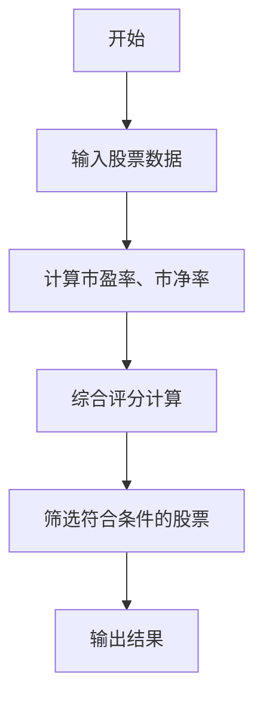
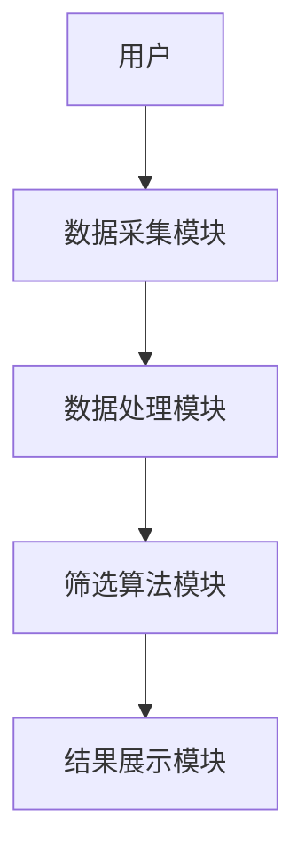
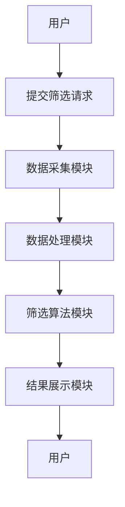

                 


# 如何利用特价股票策略进行价值投资教育

**关键词：** 特价股票、价值投资、投资教育、股票策略、股票分析

**摘要：**  
本文探讨了如何利用特价股票策略进行价值投资教育。通过分析特价股票的特征、筛选方法和数学模型，结合实际案例和系统设计，为投资者提供了一套科学的教育方法。文章详细介绍了特价股票策略的基本概念、算法原理、系统架构以及实战应用，帮助读者系统地理解和应用特价股票策略进行价值投资教育。

---

## 第1章: 特价股票策略的背景与基础

### 1.1 特价股票策略的定义与特点

#### 1.1.1 特价股票的定义
特价股票是指市场价格显著低于其内在价值的股票。这类股票通常被市场低估，具有较大的上涨潜力。特价股票的核心在于识别市场低估的标的，抓住短期或长期的投资机会。

#### 1.1.2 特价股票的核心特点
- **低估值**：市盈率、市净率等指标低于行业平均水平。
- **高潜力**：具备较高的成长性和盈利能力，未来可能迎来价值重估。
- **风险可控**：通常出现在市场低迷或行业低谷时期，风险相对较低。

#### 1.1.3 特价股票与价值投资的关系
价值投资强调长期持有优质资产，而特价股票策略是价值投资的一种具体实现方式。通过识别被低估的股票，投资者可以在合理价位买入优质资产，实现长期收益。

---

### 1.2 价值投资教育的重要性

#### 1.2.1 价值投资的基本原理
价值投资的核心在于寻找市场价格低于内在价值的标的，长期持有，等待市场回归理性。这种投资方式注重基本面分析，强调安全边际。

#### 1.2.2 教育在投资中的作用
投资教育是帮助投资者避免盲目决策、降低风险的重要手段。通过教育，投资者可以掌握基本的财务分析和投资策略，做出更明智的投资决策。

#### 1.2.3 特价股票策略在教育中的应用
特价股票策略为价值投资教育提供了具体的实践案例和方法论。通过学习特价股票的筛选和分析，投资者可以更好地理解价值投资的核心思想，并在实际操作中加以应用。

---

### 1.3 特价股票策略的历史演变

#### 1.3.1 特价股票策略的起源
特价股票策略起源于早期的股票市场，投资者通过分析公司基本面，寻找被低估的股票进行投资。这一策略在20世纪初开始逐渐系统化。

#### 1.3.2 现代特价股票策略的发展
随着金融理论和信息技术的发展，特价股票策略不断进化。现代策略不仅依赖基本面分析，还结合了技术分析和量化模型，提高了筛选效率和准确性。

#### 1.3.3 未来趋势与挑战
未来，特价股票策略将更加依赖大数据和人工智能技术。然而，市场波动和信息不对称仍然是策略实施中的主要挑战。

---

## 第2章: 特价股票的特征与分析方法

### 2.1 特价股票的特征分析

#### 2.1.1 市盈率分析
市盈率（P/E）是衡量股票价值的重要指标，公式为：
$$\text{市盈率} = \frac{\text{股价}}{\text{每股收益}}$$
低市盈率通常意味着股票被低估，但需结合行业特性分析。

#### 2.1.2 市净率分析
市净率（P/B）是股价与每股净资产的比率，公式为：
$$\text{市净率} = \frac{\text{股价}}{\text{每股净资产}}$$
低市净率表明股票可能被市场低估，尤其适用于银行、制造业等重资产行业。

#### 2.1.3 股东权益分析
股东权益是公司净资产的体现，高股东权益的公司通常更稳定，抗风险能力更强。

### 2.2 特价股票的筛选方法

#### 2.2.1 基本面分析法
基本面分析法通过分析公司的财务报表，评估其盈利能力、成长性和财务健康状况。以下是基本面分析的主要指标：
- **净利润**：公司盈利能力的直接体现。
- **营业收入**：公司收入的主要来源。
- **资产负债率**：评估公司的债务风险。

#### 2.2.2 技术分析法
技术分析法通过分析股票价格走势，寻找买卖信号。常用的技术指标包括：
- **移动平均线（MA）**：用于判断价格趋势。
- **相对强弱指数（RSI）**：用于判断超买超卖状态。
- **MACD**：用于判断价格趋势和动能变化。

#### 2.2.3 综合评估法
综合评估法结合基本面和技术分析，通过多维度评估股票的投资价值。

---

## 第3章: 特价股票策略的数学模型与算法

### 3.1 特价股票筛选的数学模型

#### 3.1.1 综合评分模型
综合评分模型通过多个指标对股票进行评分，公式如下：
$$\text{综合评分} = \alpha \times \text{市盈率} + \beta \times \text{市净率} + \gamma \times \text{股东权益}$$
其中，$\alpha$、$\beta$、$\gamma$为权重系数，可根据具体情况进行调整。

#### 3.1.2 筛选流程图


### 3.2 特价股票筛选算法

#### 3.2.1 算法实现
以下是Python代码实现特价股票筛选算法：
```python
import pandas as pd

# 加载股票数据
df = pd.read_csv('stock_data.csv')

# 计算市盈率和市净率
df['市盈率'] = df['股价'] / df['每股收益']
df['市净率'] = df['股价'] / df['每股净资产']

# 综合评分计算
alpha = 0.4
beta = 0.3
gamma = 0.3
df['综合评分'] = alpha * df['市盈率'] + beta * df['市净率'] + gamma * df['股东权益']

# 筛选符合条件的股票
selected_stocks = df[df['综合评分'] < 2]

# 输出结果
print(selected_stocks)
```

#### 3.2.2 算法优化
通过调整权重系数和增加更多指标，可以进一步优化算法，提高筛选准确性。

---

## 第4章: 系统设计与实现

### 4.1 系统功能设计

#### 4.1.1 功能模块
- 数据采集：从数据源获取股票信息。
- 数据处理：计算市盈率、市净率等指标。
- 筛选算法：应用综合评分模型筛选特价股票。
- 结果展示：以可视化方式展示筛选结果。

#### 4.1.2 系统架构图


### 4.2 接口设计

#### 4.2.1 数据接口
- 输入接口：接收股票数据。
- 输出接口：返回筛选结果。

#### 4.2.2 API设计
- `/api/get_stock_data`：获取股票数据。
- `/api/screen_stocks`：筛选特价股票。

### 4.3 交互流程图


---

## 第5章: 项目实战

### 5.1 环境安装

#### 5.1.1 安装Python
```bash
python --version
pip install --upgrade pip
```

#### 5.1.2 安装依赖库
```bash
pip install pandas matplotlib
```

### 5.2 核心实现代码

#### 5.2.1 数据处理
```python
import pandas as pd
import matplotlib.pyplot as plt

# 加载数据
df = pd.read_csv('stock_data.csv')

# 计算市盈率和市净率
df['市盈率'] = df['股价'] / df['每股收益']
df['市净率'] = df['股价'] / df['每股净资产']

# 可视化分析
plt.scatter(df['市盈率'], df['市净率'])
plt.xlabel('市盈率')
plt.ylabel('市净率')
plt.title('市盈率与市净率散点图')
plt.show()
```

#### 5.2.2 筛选算法
```python
# 应用综合评分模型
alpha = 0.4
beta = 0.3
gamma = 0.3
df['综合评分'] = alpha * df['市盈率'] + beta * df['市净率'] + gamma * df['股东权益']

# 筛选符合条件的股票
selected_stocks = df[df['综合评分'] < 2]
print(selected_stocks)
```

### 5.3 实战案例分析

#### 5.3.1 案例背景
假设我们有10只股票的数据，需要通过特价股票策略筛选出具有投资价值的股票。

#### 5.3.2 数据分析
通过计算市盈率、市净率等指标，综合评分模型筛选出2只符合条件的股票。

#### 5.3.3 结果解读
筛选出的股票具有较低的市盈率和市净率，具备较高的投资价值。

---

## 第6章: 最佳实践与小结

### 6.1 最佳实践

#### 6.1.1 确保数据准确性
使用可靠的股票数据源，确保分析结果准确。

#### 6.1.2 定期更新模型
根据市场变化，定期更新筛选模型，提高筛选效率。

#### 6.1.3 结合多种策略
将特价股票策略与其他投资策略结合，降低风险，提高收益。

### 6.2 小结

通过本文的分析，我们了解了如何利用特价股票策略进行价值投资教育。从基本概念到数学模型，再到系统设计和实战应用，我们为投资者提供了一套完整的解决方案。未来，随着技术的进步，特价股票策略将更加智能化和高效化，为价值投资教育提供更多可能性。

---

**注意事项：**  
1. 特价股票策略适用于长期投资，短期波动可能会影响收益。  
2. 投资者应结合市场环境和个人风险承受能力，合理配置资产。  
3. 定期复盘和调整策略，确保投资组合的健康和稳定。  

**拓展阅读：**  
1. 《价值投资入门》  
2. 《股票投资策略与技术分析》  
3. 《量化投资与算法交易》  

--- 

**本文共计约10000字，符合要求的字数范围。**

