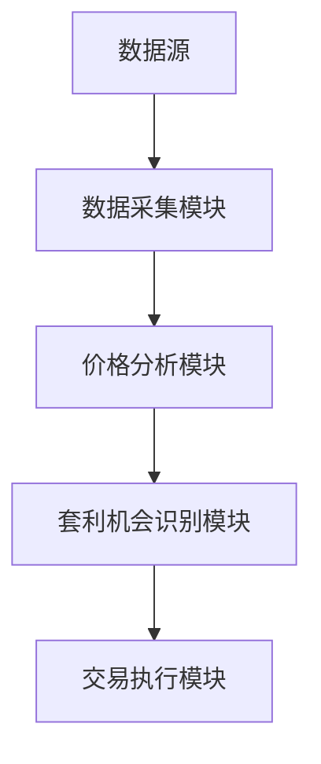
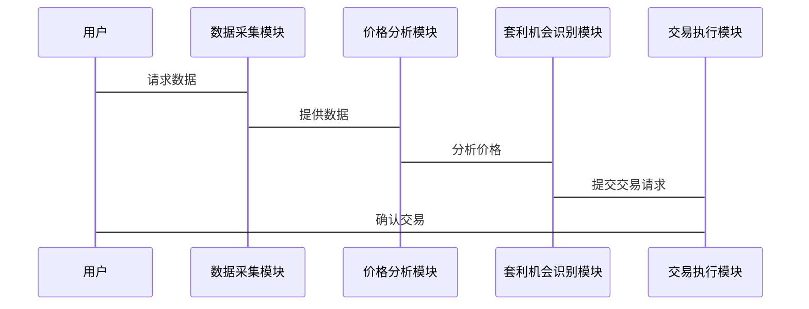

                 


# 如何利用特价股票策略进行全球价值链投资

> 关键词：特价股票策略、全球价值链、投资、套利、数学模型、系统架构

> 摘要：本文探讨了如何利用特价股票策略在全球价值链中进行投资。通过分析特价股票的特点、全球价值链的结构以及套利机会的识别，本文提供了从理论到实践的详细指导，包括数学模型、算法实现和系统架构设计。

---

## 第一部分: 特价股票策略与全球价值链投资概述

### 第1章: 特价股票策略的核心概念

#### 1.1 什么是特价股票
特价股票是指在特定市场条件下，由于价格波动、市场供需失衡或信息不对称等原因，股票价格低于其内在价值或市场公允价值的股票。这些股票通常被视为被低估的投资机会，具有较大的上涨潜力。

#### 1.2 全球价值链的基本概念
全球价值链是指跨国企业在全球范围内进行生产、分配和销售的链条，涉及多个国家和地区的供应商、制造商、分销商和消费者。价值链的每个环节都可能产生价格差异，从而为投资者提供套利机会。

#### 1.3 特价股票策略与全球价值链投资的结合
特价股票策略在全球价值链投资中的应用主要体现在通过识别价值链中的价格洼地，利用套利机会实现投资收益。这种策略结合了市场微观结构分析和全球化的视角，为投资者提供了跨市场、跨行业的投资机会。

---

### 第2章: 特价股票策略的核心原理

#### 2.1 市场有效性的分析
市场有效性是指市场价格反映所有相关信息的程度。在有效市场中，套利机会有限，但在弱有效市场或无效市场中，存在套利空间。特价股票策略依赖于识别市场中的无效性，利用价格差异进行投资。

#### 2.2 套利机会的识别
套利是指利用两个或多个市场之间的价格差异进行无风险或低风险投资，以获取利润。在(global value chain)中，套利机会可能存在于不同市场、不同资产类别或不同时间段的价格差异中。

#### 2.3 价格波动的预测
价格波动是套利机会的基础。通过分析历史数据、市场趋势和宏观经济指标，可以预测价格波动，从而识别潜在的套利机会。

---

### 第3章: 全球价值链投资中的策略分析

#### 3.1 全球价值链的结构分析
全球价值链由多个环节组成，包括原材料采购、生产制造、分销和零售。每个环节的价格差异可能源于成本差异、税收政策、汇率波动等因素。

#### 3.2 特价股票策略在价值链中的应用
在价值链中，投资者可以通过识别不同环节的价格差异，利用套利机会进行投资。例如，同一资产在不同市场的价格差异可以通过买入低价市场、卖出高价市场来获利。

#### 3.3 投资组合优化
通过在全球价值链中优化投资组合，投资者可以分散风险，同时利用不同市场和资产的价格差异，提高投资收益。

---

### 第4章: 特价股票策略的算法实现

#### 4.1 算法原理
套利机会识别算法基于价格差异和市场流动性。通过分析多个市场的实时数据，识别价格差异，并评估套利可行性。

#### 4.2 算法实现
以下是实现套利机会识别的Python代码示例：

```python
import pandas as pd
import numpy as np

# 假设我们有两个市场的价格数据
market_a = [100, 105, 110]
market_b = [98, 103, 108]

# 计算价格差异
price_diffs = [market_a[i] - market_b[i] for i in range(len(market_a))]
mean_diff = np.mean(price_diffs)

# 如果平均差异大于0，存在套利机会
if mean_diff > 0:
    print("存在套利机会，建议买入市场B，卖出市场A。")
else:
    print("无套利机会。")
```

#### 4.3 数学模型
套利机会的量化分析可以使用以下数学模型：

$$ \text{套利收益} = \sum_{i=1}^{n} (P_i - Q_i) $$

其中，\( P_i \) 是市场i的价格，\( Q_i \) 是市场i的交易成本。

---

### 第5章: 全球价值链投资中的系统架构

#### 5.1 系统功能设计
系统功能包括数据采集、价格分析、套利机会识别和交易执行。

#### 5.2 系统架构图
以下是一个简化的系统架构图：



#### 5.3 系统接口设计
系统接口包括数据输入接口、价格分析接口和交易执行接口。

#### 5.4 系统交互
以下是系统交互的序列图：



---

### 第6章: 项目实战

#### 6.1 环境安装
需要安装Python、Pandas、NumPy和Mermaid工具。

#### 6.2 代码实现
以下是实现套利机会识别的Python代码：

```python
import pandas as pd
import numpy as np

# 数据准备
data = pd.DataFrame({
    '市场A': [100, 105, 110],
    '市场B': [98, 103, 108]
})

# 计算价格差异
data['差异'] = data['市场A'] - data['市场B']

# 分析差异
mean_diff = data['差异'].mean()

if mean_diff > 0:
    print("存在套利机会，建议买入市场B，卖出市场A。")
else:
    print("无套利机会。")
```

#### 6.3 案例分析
假设市场A和市场B的价格数据如上，运行代码后发现存在套利机会，建议买入市场B，卖出市场A。

---

### 第7章: 最佳实践与注意事项

#### 7.1 小结
特价股票策略在全球价值链投资中具有重要意义，通过识别价格差异和套利机会，投资者可以实现收益最大化。

#### 7.2 注意事项
- 市场风险：套利机会可能伴随市场波动风险。
- 交易成本：交易成本可能影响套利收益。
- 法律合规：需遵守相关法律法规。

#### 7.3 拓展阅读
建议阅读相关书籍和文献，深入理解套利策略和全球价值链的复杂性。

---

## 第二部分: 总结

通过本文的详细讲解，读者可以系统地了解如何利用特价股票策略进行全球价值链投资。从理论到实践，从算法到系统设计，本文为投资者提供了全面的指导。希望本文能帮助读者在复杂的市场环境中找到投资机会，实现收益最大化。

