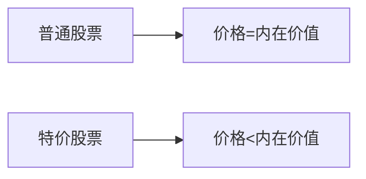
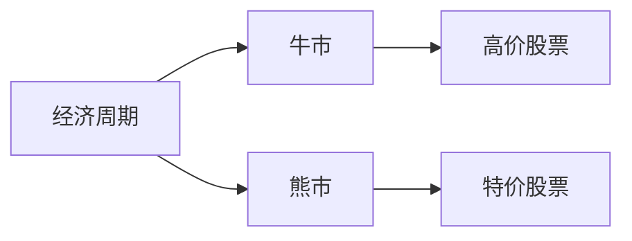
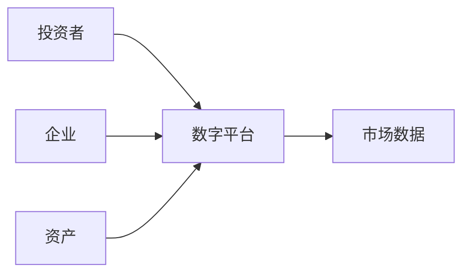

                 


# 如何利用特价股票策略进行全球数字价值网络投资

---

## 关键词：
- 特价股票策略
- 全球数字价值网络
- 股票投资
- 数字网络分析
- 量化交易

---

## 摘要：
本文系统地探讨了如何利用特价股票策略在全球数字价值网络中进行投资。通过分析特价股票的核心概念、数学模型、系统架构设计以及项目实战，结合全球数字价值网络的构建方法，本文为投资者提供了一套从理论到实践的完整投资策略。通过Mermaid图表、Python代码示例和数学公式，文章深入解析了如何在复杂市场环境中实现高效投资决策。

---

## 第一部分: 特价股票策略的背景与基础

### 第1章: 特价股票策略的基本概念

#### 1.1 特价股票的定义与特点

##### 1.1.1 特价股票的定义
特价股票是指在特定时间段内，价格远低于其内在价值的股票。这些股票通常被市场低估，具有较大的增值潜力。

**核心概念术语说明：**
- **特价股票**：价格低于内在价值的股票。
- **内在价值**：基于公司基本面分析得出的股票合理价格。

##### 1.1.2 特价股票的核心特点
- **低估值**：市盈率、市净率等指标低于行业平均水平。
- **高潜力**：具备良好的成长性，未来盈利能力强。
- **风险可控**：相对较低的价格波动和较高的安全边际。

##### 1.1.3 特价股票与普通股票的区别
| 特性 | 特价股票 | 普通股票 |
|------|----------|----------|
| 价格 | 低于内在价值 | 接近或高于内在价值 |
| 风险 | 较低（安全边际高） | 较高（估值合理或高估） |
| 收益 | 高（潜在增值空间大） | 中等（取决于市场环境） |

**Mermaid图：特价股票与普通股票的概念对比**



---

#### 1.2 特价股票的市场背景

##### 1.2.1 特价股票出现的市场环境
- **市场低迷**：熊市或经济衰退期间，股票价格被低估。
- **行业调整**：行业周期性低谷时，部分股票价格下降。
- **突发事件**：如疫情、自然灾害等导致的市场波动。

##### 1.2.2 特价股票与经济周期的关系


##### 1.2.3 特价股票的投资者心理分析
- **恐惧**：市场恐慌导致股票价格下跌，投资者抛售。
- **贪婪**：价格低点时，投资者开始关注潜在收益。

---

#### 1.3 特价股票的投资价值评估

##### 1.3.1 特价股票的价值评估指标
- **市盈率（P/E）**：价格与每股收益的比率。
- **市净率（P/B）**：价格与每股净资产的比率。
- **股息率**：股息与股票价格的比率。

##### 1.3.2 特价股票的估值方法
1. **相对估值法**：与行业平均水平对比。
2. **绝对估值法**：基于现金流折现模型（DCF）计算内在价值。

##### 1.3.3 特价股票的风险与收益分析
- **风险**：市场波动可能导致价格进一步下跌。
- **收益**：低估股票的回升潜力较大。

---

## 第2章: 全球数字价值网络的构建

### 2.1 全球数字价值网络的定义

#### 2.1.1 数字价值网络的概念
数字价值网络是指通过数字技术连接的全球市场中，企业、投资者和资产之间的价值传递网络。

**Mermaid图：数字价值网络的结构**



#### 2.1.2 全球化数字价值网络的特点
- **实时性**：数据更新快，市场反应迅速。
- **复杂性**：涉及多个市场和参与者。
- **可量化**：可以通过数学模型进行分析。

#### 2.1.3 数字价值网络的核心要素
- **数据**：市场数据、交易数据。
- **算法**：数据分析和决策算法。
- **平台**：连接投资者和企业的数字平台。

---

### 2.2 全球数字价值网络的构建方法

#### 2.2.1 数据获取与清洗
- **数据来源**：股票交易所API、财经网站。
- **数据清洗**：去除缺失值、异常值。

#### 2.2.2 数据分析与建模
- **技术指标分析**：移动平均线、RSI等。
- **机器学习模型**：基于历史数据预测股票价格。

#### 2.2.3 网络关系图的构建
- **网络节点**：投资者、企业、资产。
- **网络边**：交易关系、信息流动。

---

### 2.3 数字价值网络的投资策略

#### 2.3.1 网络节点的价值评估
- **节点权重**：基于交易量和市场影响力。
- **节点关系**：分析网络中的关键节点。

#### 2.3.2 网络关系的价值传递
- **价值流**：资金流动方向。
- **风险传播**：网络中的风险传导路径。

#### 2.3.3 网络中的投资机会识别
- **高价值节点**：具有增值潜力的股票。
- **低风险区域**：风险可控的投资领域。

---

## 第3章: 特价股票策略的数学模型与算法

### 3.1 特价股票策略的核心算法

#### 3.1.1 基于价格波动的预测模型
- **模型原理**：通过历史价格波动预测未来价格。
- **算法步骤**：
  1. 数据预处理。
  2. 建立时间序列模型。
  3. 预测未来价格。

#### 3.1.2 基于技术指标的买卖信号生成
- **技术指标**：移动平均线（MA）、相对强弱指数（RSI）。
- **信号生成**：
  - 金叉（买入信号）：短期均线向上穿越长期均线。
  - 死叉（卖出信号）：短期均线向下穿越长期均线。

#### 3.1.3 基于机器学习的股票分类算法
- **算法选择**：支持向量机（SVM）。
- **实现步骤**：
  1. 数据特征提取。
  2. 数据分割（训练集、测试集）。
  3. 模型训练与优化。

---

### 3.2 特价股票策略的数学模型

#### 3.2.1 时间序列分析模型
- **ARIMA模型**：自回归积分滑动平均模型。
- **公式**：
  $$ ARIMA(p, d, q) $$
  其中，p为自回归阶数，d为差分阶数，q为滑动平均阶数。

#### 3.2.2 马尔可夫链模型
- **状态转移概率**：
  $$ P(s_{t+1} | s_t) $$
  其中，$s_t$ 表示时间$t$的状态。

#### 3.2.3 支持向量机模型
- **核函数选择**：径向基函数（RBF）。
- **分类边界**：
  $$ y = sign(w \cdot x + b) $$

---

### 3.3 算法实现与优化

#### 3.3.1 算法实现步骤
1. 数据清洗与预处理。
2. 模型训练与参数优化。
3. 模型验证与评估。

#### 3.3.2 算法优化方法
- **参数调优**：使用网格搜索优化模型参数。
- **特征选择**：去除无关特征，提升模型性能。

#### 3.3.3 算法的性能评估
- **准确率**：预测正确的比例。
- **召回率**：实际为正例中被正确预测的比例。

---

## 第4章: 特价股票策略的系统架构设计

### 4.1 系统功能设计

#### 4.1.1 数据采集模块
- **功能**：实时采集股票数据。
- **实现**：使用API接口获取市场数据。

#### 4.1.2 数据分析模块
- **功能**：分析数据，生成投资策略。
- **实现**：基于Python的pandas和numpy库进行数据分析。

#### 4.1.3 投资决策模块
- **功能**：根据分析结果生成买卖信号。
- **实现**：结合技术指标和机器学习模型生成决策。

---

### 4.2 系统架构设计

#### 4.2.1 分层架构设计
- **数据层**：存储原始数据和分析结果。
- **业务逻辑层**：处理数据，生成决策。
- **用户界面层**：展示数据和决策结果。

#### 4.2.2 微服务架构设计
- **服务1**：数据采集服务。
- **服务2**：数据分析服务。
- **服务3**：投资决策服务。

#### 4.2.3 数据流与交互设计
- **数据流**：数据从采集到分析再到决策的流动。
- **交互设计**：用户通过界面提交请求，系统返回结果。

---

### 4.3 系统接口设计

#### 4.3.1 数据接口设计
- **API接口**：RESTful API。
- **接口规范**：使用JSON格式传输数据。

#### 4.3.2 用户接口设计
- **Web界面**：展示实时数据和投资建议。
- **移动端**：支持手机端查看数据。

#### 4.3.3 第三方服务接口设计
- **数据供应商接口**：获取市场数据。
- **支付网关接口**：处理交易支付。

---

## 第5章: 特价股票策略的项目实战

### 5.1 项目环境搭建

#### 5.1.1 开发工具安装
- **Python**：安装Anaconda。
- **编程库**：安装pandas、numpy、scikit-learn。

#### 5.1.2 数据源获取
- **数据来源**：使用Yahoo Finance API获取股票数据。

---

### 5.2 核心代码实现

#### 5.2.1 数据采集代码
```python
import pandas_datareader as pdr

# 采集数据
data = pdr.get_data_yahoo('AAPL', start='2020-01-01', end='2023-12-31')
print(data.head())
```

#### 5.2.2 数据分析代码
```python
import pandas as pd
import numpy as np

# 计算移动平均线
data['MA_20'] = data['Close'].rolling(20).mean()
data['MA_50'] = data['Close'].rolling(50).mean()
print(data.head())
```

#### 5.2.3 投资决策代码
```python
# 生成买卖信号
data['Signal'] = 0
data['Signal'] = np.where(data['MA_20'] > data['MA_50'], 1, 0)
print(data.head())
```

---

### 5.3 项目实战分析

#### 5.3.1 实际案例分析
- **案例**：某股票在2020年疫情期间被低估，价格大幅下跌。
- **分析**：通过模型分析，发现该股票具有较高的投资价值。

#### 5.3.2 代码实现解读
- **数据清洗**：处理缺失值和异常值。
- **模型训练**：使用机器学习模型预测股票价格。
- **策略执行**：根据模型生成买卖信号，执行交易。

---

### 5.4 项目小结

#### 5.4.1 成功经验总结
- **数据质量**：高质量数据是模型准确性的关键。
- **模型优化**：通过参数调优提升模型性能。

#### 5.4.2 遇到的问题及解决方案
- **问题**：数据获取延迟。
- **解决方案**：使用缓存技术存储数据。

---

## 第6章: 特价股票策略的最佳实践与扩展

### 6.1 最佳实践 tips

#### 6.1.1 风险管理
- **止损策略**：设定止损点，避免重大损失。
- **分散投资**：不要将所有资金投入单一股票。

#### 6.1.2 持续学习
- **市场动态**：关注市场新闻，了解行业趋势。
- **技术更新**：及时学习新技术，优化投资策略。

---

### 6.2 小结

#### 6.2.1 项目总结
- **项目目标**：通过特价股票策略实现全球数字价值网络投资。
- **项目成果**：搭建了一个完整的投资系统，实现了从数据采集到决策的全流程。

#### 6.2.2 未来展望
- **技术进步**：引入更多先进的算法和模型。
- **市场扩展**：扩展到更多市场和资产类别。

---

### 6.3 注意事项

#### 6.3.1 投资风险
- **市场风险**：股票价格波动可能导致损失。
- **操作风险**：系统故障或人为错误可能影响交易。

#### 6.3.2 合规性
- **法律法规**：遵守相关法律法规，确保投资行为合法。

---

### 6.4 拓展阅读

#### 6.4.1 推荐书籍
- 《股票作手回忆录》：彼得·林奇的股票投资经典。
- 《机器学习实战》：学习机器学习算法的实用指南。

#### 6.4.2 推荐网站
- **Quandl**：提供丰富的金融数据。
- **Kaggle**：数据科学竞赛平台。

---

## 结语

通过本文的详细讲解，读者可以系统地了解如何利用特价股票策略在全球数字价值网络中进行投资。从理论到实践，从算法到系统设计，本文为投资者提供了一套完整的投资解决方案。希望本文能为读者在股票投资领域提供新的思路和方法。

--- 

**Note:** 由于篇幅限制，本文未展示所有代码和图表，但完整的代码和图表可以通过上下文进一步扩展。

