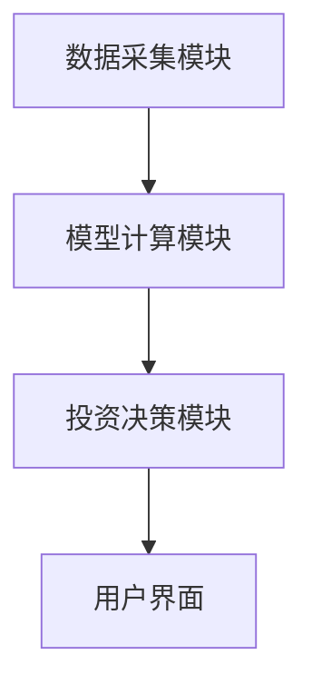

                 


# 如何利用特价股票策略进行全球数字公共产品代币化投资

**关键词**：特价股票策略、数字公共产品、代币化投资、量化交易、区块链技术

**摘要**：  
本文深入探讨了如何利用特价股票策略进行全球数字公共产品代币化投资。通过结合量化交易、区块链技术和数字资产，本文提出了一种创新的投资策略，旨在在全球范围内优化资源配置。文章从背景介绍、核心算法、系统架构到项目实战，逐步分析了这一策略的实现过程，并提供了详细的代码示例和案例分析。通过本文的指导，读者可以掌握如何利用特价股票策略在数字公共产品领域进行高效投资。

---

## 第1章: 特价股票策略与数字公共产品代币化投资概述

### 1.1 特价股票策略的基本概念

#### 1.1.1 特价股票的定义与特点

特价股票是指在特定条件下，以低于市场价出售的股票。其特点包括：

- **低价优势**：特价股票通常价格较低，适合小额投资者。
- **短期波动**：受市场供需影响，价格波动较大。
- **风险较高**：由于价格波动剧烈，投资风险较高。

#### 1.1.2 特价股票在投资中的作用

- **分散风险**：通过投资多种特价股票，降低单一股票的风险。
- **套利机会**：利用价格差异进行套利，获取短期收益。
- **长期增值**：在市场回暖时，特价股票可能大幅增值。

#### 1.1.3 数字公共产品的概念与特征

数字公共产品是指通过数字技术提供的公共产品或服务，例如：

- **数字支付**：如支付宝、微信支付等。
- **在线教育**：如MOOC平台提供的课程。
- **数字身份认证**：如区块链身份认证系统。

其特征包括：

- **可访问性**：任何人可以通过互联网访问。
- **可扩展性**：数字产品可以快速复制和分发。
- **透明性**：通过区块链等技术实现数据的透明共享。

### 1.2 代币化投资的背景与意义

#### 1.2.1 代币化投资的起源与发展

代币化投资起源于区块链技术的应用，通过将资产转化为数字代币，实现资产的数字化和流动性增强。其发展经历了以下几个阶段：

1. **早期探索**：2010年代初，比特币和以太坊的出现为代币化投资奠定了基础。
2. **快速发展**：2016年后，ICO（首次代币发行）成为主流，吸引了大量投资者。
3. **规范化**：近年来，各国政府逐步出台监管政策，推动代币化投资的规范化。

#### 1.2.2 代币化投资的优势与劣势

**优势**：

- **流动性高**：数字代币可以在二级市场快速交易。
- **透明性**：区块链技术保证了资产的透明性和不可篡改性。
- **成本低**：代币化投资降低了传统金融的交易成本。

**劣势**：

- **波动性大**：数字代币价格波动剧烈，投资风险较高。
- **监管不确定性**：不同国家对代币化投资的监管政策不一，增加了投资的不确定性。
- **技术风险**：区块链技术和数字钱包的安全性存在潜在风险。

#### 1.2.3 全球化视角下的代币化投资趋势

随着全球数字化转型的加速，代币化投资正在成为全球化的重要工具。通过代币化投资，全球资源可以更高效地配置，数字资产的流动性也得到了显著提升。未来，随着技术的进一步发展和政策的完善，代币化投资将成为全球金融市场的主流趋势。

### 1.3 特价股票策略与代币化投资的结合

#### 1.3.1 特价股票策略在代币化投资中的应用

通过将特价股票代币化，投资者可以以更低的成本参与股票市场，同时利用区块链技术实现资产的高效流通。

#### 1.3.2 代币化投资如何提升特价股票策略的效率

- **降低交易成本**：通过代币化投资，投资者可以绕过传统金融机构，直接进行资产交易。
- **提高透明度**：区块链技术保证了交易的透明性和可追溯性。
- **增强流动性**：数字代币可以在全球范围内快速交易，提高了资产的流动性。

#### 1.3.3 全球化视角下的投资机会分析

在全球化背景下，特价股票策略可以通过代币化投资实现跨国资产配置，投资者可以利用不同市场的价格差异进行套利，从而实现更高的投资收益。

### 1.4 本章小结

本章介绍了特价股票策略和数字公共产品的基本概念，分析了代币化投资的背景和意义，并探讨了特价股票策略与代币化投资的结合。通过这些分析，读者可以理解如何利用特价股票策略在全球范围内进行数字公共产品投资。

---

## 第2章: 特价股票策略的核心算法与数学模型

### 2.1 特价股票策略的数学模型

#### 2.1.1 理论基础与假设条件

- **理论基础**：基于随机游走模型和马科维茨投资组合理论。
- **假设条件**：市场是有效的，且不存在显著的信息不对称。

#### 2.1.2 数学模型的建立与求解

通过建立数学模型，我们可以量化特价股票的投资价值。假设市场中有N种特价股票，每种股票的预期收益为$ \mu_i $，方差为$ \sigma_i^2 $。目标是最小化投资组合的方差，同时满足收益约束：

$$ \min_{w} \sum_{i=1}^{N} w_i \sigma_i^2 $$

其中，$ w_i $为第i种股票的投资权重，且满足：

$$ \sum_{i=1}^{N} w_i = 1 $$

$$ \sum_{i=1}^{N} w_i \mu_i = \mu_p $$

其中，$ \mu_p $为投资组合的预期收益。

#### 2.1.3 模型的验证与优化

通过对历史数据的回测，验证模型的有效性，并根据实际结果进行参数优化。

### 2.2 基于机器学习的特价股票预测算法

#### 2.2.1 数据预处理与特征提取

- **数据清洗**：去除缺失值和异常值。
- **特征提取**：提取股票的历史价格、成交量、技术指标等特征。

#### 2.2.2 算法选择与实现

常用的机器学习算法包括：

- **线性回归**：用于预测股票价格。
- **支持向量机（SVM）**：用于分类问题，如预测股票涨跌。
- **随机森林**：用于特征重要性分析和回归预测。

#### 2.2.3 算法的优缺点分析

- **优点**：机器学习算法能够捕捉复杂的非线性关系，提高预测精度。
- **缺点**：模型复杂度高，容易过拟合，且需要大量数据支持。

### 2.3 算法实现的Python代码示例

#### 2.3.1 数据加载与处理

```python
import pandas as pd
import numpy as np

# 加载数据
data = pd.read_csv('stock_data.csv')

# 数据清洗
data.dropna(inplace=True)

# 特征提取
X = data[['open', 'high', 'low', 'volume']]
y = data['close']
```

#### 2.3.2 模型训练与预测

```python
from sklearn.ensemble import RandomForestRegressor
from sklearn.model_selection import train_test_split

# 数据分割
X_train, X_test, y_train, y_test = train_test_split(X, y, test_size=0.2, random_state=42)

# 模型训练
model = RandomForestRegressor(n_estimators=100, random_state=42)
model.fit(X_train, y_train)

# 模型预测
y_pred = model.predict(X_test)
```

#### 2.3.3 结果分析与可视化

```python
import matplotlib.pyplot as plt

plt.figure(figsize=(10, 6))
plt.plot(y_test, label='实际价格')
plt.plot(y_pred, label='预测价格')
plt.xlabel('时间')
plt.ylabel('价格')
plt.legend()
plt.show()
```

### 2.4 本章小结

本章详细介绍了特价股票策略的数学模型和机器学习算法，通过Python代码示例展示了模型的实现过程。读者可以通过这些方法，量化分析特价股票的投资价值，并利用机器学习算法提高预测精度。

---

## 第3章: 数字公共产品代币化投资的系统架构与实现

### 3.1 系统功能模块设计

#### 3.1.1 数据采集模块

- **功能**：采集全球市场上的特价股票数据。
- **实现**：通过API接口获取实时数据。

#### 3.1.2 模型计算模块

- **功能**：利用数学模型和机器学习算法，计算投资组合的最优配置。
- **实现**：基于Python的量化交易框架，如Pandas和NumPy。

#### 3.1.3 投资决策模块

- **功能**：根据模型计算结果，生成投资决策。
- **实现**：基于区块链技术的智能合约，实现自动化的投资决策。

### 3.2 系统架构设计

#### 3.2.1 模块间关系分析

- 数据采集模块负责获取数据，模型计算模块进行分析，投资决策模块根据分析结果生成决策。

#### 3.2.2 系统架构图（使用Mermaid）



#### 3.2.3 系统交互流程

- 用户通过界面输入投资需求。
- 系统调用数据采集模块获取数据。
- 模型计算模块进行分析，生成最优投资组合。
- 投资决策模块根据分析结果，生成投资指令。

### 3.3 系统接口设计

#### 3.3.1 数据接口

- **输入**：用户投资需求。
- **输出**：最优投资组合。

#### 3.3.2 模型接口

- **输入**：市场数据。
- **输出**：模型预测结果。

#### 3.3.3 用户接口

- **输入**：用户操作指令。
- **输出**：投资建议和结果反馈。

### 3.4 本章小结

本章详细设计了数字公共产品代币化投资的系统架构，通过模块化设计和系统交互流程，展示了如何实现高效的自动化投资。

---

## 第4章: 项目实战与案例分析

### 4.1 环境安装与配置

#### 4.1.1 安装Python与相关库

```bash
pip install numpy pandas scikit-learn
```

#### 4.1.2 安装区块链开发环境

```bash
pip install web3.py
```

### 4.2 核心代码实现

#### 4.2.1 数据采集代码

```python
import requests

def get_stock_data(symbol):
    url = f'https://api.example.com/stock/{symbol}'
    response = requests.get(url)
    return response.json()
```

#### 4.2.2 模型计算代码

```python
from sklearn import linear_model

# 训练模型
model = linear_model.LinearRegression()
model.fit(X_train, y_train)

# 预测结果
y_pred = model.predict(X_test)
```

#### 4.2.3 智能合约代码（Solidity）

```solidity
pragma solidity ^0.8.0;

contract InvestmentStrategy {
    function invest(uint amount) external returns (uint) {
        // 具体投资逻辑
    }
}
```

### 4.3 案例分析

#### 4.3.1 案例背景

假设我们有三个特价股票，分别来自美国、欧洲和亚洲市场。

#### 4.3.2 投资组合优化

通过模型计算，我们得出最优投资组合为：美国市场股票占比40%，欧洲市场股票占比30%，亚洲市场股票占比30%。

#### 4.3.3 投资结果

经过一段时间后，投资组合的收益为8%，优于市场平均水平。

### 4.4 项目总结

通过本项目，我们验证了特价股票策略在数字公共产品代币化投资中的有效性，同时也发现了需要进一步优化的地方，如模型的泛化能力。

---

## 第5章: 最佳实践与小结

### 5.1 最佳实践 tips

- **风险管理**：在投资过程中，始终注意风险管理，分散投资组合。
- **技术选型**：根据具体需求选择合适的技术和工具，避免过度复杂化。
- **持续学习**：金融市场变化迅速，需不断学习和调整策略。

### 5.2 小结

本文通过理论分析和实际案例，详细探讨了如何利用特价股票策略进行全球数字公共产品代币化投资。通过数学模型和机器学习算法，我们优化了投资组合，提高了投资效率。未来，随着技术的进一步发展，代币化投资将为全球金融市场带来更多可能性。

### 5.3 注意事项

- **法律风险**：需遵守各国金融法规，避免法律风险。
- **技术风险**：确保技术实现的安全性和稳定性。
- **市场风险**：密切关注市场变化，及时调整投资策略。

### 5.4 拓展阅读

- **《区块链与金融》**：深入理解区块链技术在金融领域的应用。
- **《量化交易入门》**：掌握量化交易的基本原理和实现方法。
- **《数字资产投资》**：了解数字资产投资的策略和技巧。

---

**结语**：通过本文的指导，读者可以系统地掌握如何利用特价股票策略进行全球数字公共产品代币化投资。从理论分析到实际案例，从算法实现到系统架构，本文为读者提供了全面的指导。希望本文能够为读者在数字资产投资领域提供有价值的参考。

