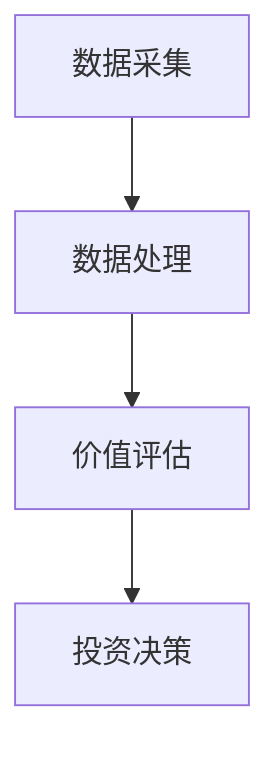

                 


# 如何利用特价股票策略进行全球数字基础设施投资

## 关键词：特价股票策略, 数字基础设施投资, 价值投资, 云计算, 大数据, 人工智能, 5G

## 摘要：  
本文将深入探讨如何利用特价股票策略进行全球数字基础设施投资。通过分析数字基础设施行业的特点、价值投资的核心理念以及两者结合的应用场景，提供一套基于数学模型和系统架构的分析方法，帮助投资者在数字基础设施领域实现高效、精准的投资决策。文章结合实际案例，详细解读如何从数据采集、模型构建到系统设计的全过程，并总结最佳实践和注意事项，为读者提供一套完整的投资策略。

---

## 第一部分: 特价股票策略与全球数字基础设施投资背景

### 第1章: 特价股票策略与数字基础设施投资概述

#### 1.1 特价股票策略的定义与特点
- **1.1.1 特价股票的定义**  
  特价股票是指那些市场价格低于其内在价值的股票。这种股票通常被认为被市场低估，具有较大的上涨潜力。
  
- **1.1.2 特价股票的核心特点**  
  - 低估值：市盈率、市净率等指标远低于行业平均水平。  
  - 高分红：通常具备稳定的股息收益。  
  - 高质量：公司基本面良好，具备长期发展潜力。  

- **1.1.3 特价股票与传统股票投资的区别**  
  | 特点 | 特价股票 | 传统股票 |  
  |------|----------|----------|  
  | 投资策略 | 价值驱动，寻找低估标的 | 可能基于趋势或短期波动 |  
  | 风险 | 较低（估值修复预期） | 较高（市场波动较大） |  
  | 收益周期 | 中长期 | 短中期 |  

#### 1.2 全球数字基础设施投资的背景
- **1.2.1 数字基础设施的定义与范围**  
  数字基础设施包括为数字经济发展提供支持的硬件和软件设施，如数据中心、5G网络、云计算平台、大数据存储和处理系统等。  

- **1.2.2 全球数字基础设施投资的趋势**  
  随着数字化转型的加速，全球对数字基础设施的需求持续增长。云计算、人工智能和大数据等领域成为投资热点。  

- **1.2.3 数字基础设施与全球经济的关系**  
  数字基础设施是数字经济的核心，其发展直接影响全球经济的增长和转型。  

#### 1.3 特价股票策略在数字基础设施投资中的应用
- **1.3.1 特价股票策略的核心优势**  
  - 通过低估值股票捕捉市场机会。  
  - 在数字基础设施领域，低估值企业往往具备较高的增长潜力。  

- **1.3.2 数字基础设施投资中的机会**  
  - 云计算：企业上云需求持续增长，云服务提供商具备长期投资价值。  
  - 大数据：数据量爆炸式增长，相关企业具备结构性机会。  
  - 人工智能：技术驱动型企业具备高增长潜力。  
  - 5G：通信网络升级带来的投资机会。  

- **1.3.3 特价股票策略与数字基础设施投资的结合**  
  通过筛选低估值的数字基础设施相关企业，投资者可以在市场低估时布局，捕捉价值回归带来的收益。

---

## 第二部分: 特价股票策略的核心概念与分析框架

### 第2章: 价值投资的基本原理

#### 2.1 价值投资的定义与特点
- **2.1.1 价值投资的定义**  
  价值投资是一种投资策略，通过分析企业的内在价值，寻找市场价格低于内在价值的股票进行投资。  

- **2.1.2 价值投资的核心理念**  
  - 企业价值 = 净现值（NPV）  
  - 投资的核心是寻找安全边际，即市场价格低于企业价值。  

- **2.1.3 价值投资与特价股票策略的关系**  
  特价股票策略是价值投资的一种具体应用，专注于寻找市场价格低于内在价值的股票。

#### 2.2 数字基础设施投资的分析框架
- **2.2.1 数字基础设施行业的关键指标**  
  - 市盈率（P/E）：衡量企业盈利能力的指标。  
  - 市净率（P/B）：衡量企业资产价值的指标。  
  - 股息率：衡量企业的分红能力。  

- **2.2.2 数字基础设施企业的财务分析**  
  - 收入增长率：反映企业增长潜力。  
  - 净利润增长率：反映企业盈利能力。  
  - 负债率：衡量企业的财务健康状况。  

- **2.2.3 数字基础设施投资的风险评估**  
  - 市场风险：行业周期性波动。  
  - 技术风险：技术升级带来的竞争压力。  
  - 政策风险：政策变化对行业的影响。  

#### 2.3 特价股票策略的数学模型与公式
- **市盈率计算公式**  
  $$市盈率 = \frac{股价}{每股收益}$$  
  示例：某公司股价为10元，每股收益为2元，市盈率为5倍。  

- **市净率计算公式**  
  $$市净率 = \frac{股价}{每股净资产}$$  
  示例：某公司股价为10元，每股净资产为5元，市净率为2倍。  

- **股息率计算公式**  
  $$股息率 = \frac{每股股息}{股价}$$  
  示例：某公司每股股息为1元，股价为10元，股息率为10%。  

---

## 第三部分: 数字基础设施的系统分析与架构设计

### 第3章: 数字基础设施的系统分析

#### 3.1 数字基础设施系统的组成
- **3.1.1 数据中心**  
  - 数据存储与处理的核心设施。  
  - 投资机会：云计算服务提供商、大数据存储企业。  

- **3.1.2 5G网络**  
  - 新一代通信网络基础设施。  
  - 投资机会：通信设备制造商、网络服务提供商。  

- **3.1.3 人工智能平台**  
  - 提供AI计算和算法支持的基础设施。  
  - 投资机会：AI芯片制造商、AI解决方案提供商。  

#### 3.2 数字基础设施系统的功能设计
- **功能需求**  
  - 数据采集与处理：实时采集数字基础设施相关企业的财务数据、行业趋势、政策信息。  
  - 价值评估：基于数学模型计算企业的内在价值。  
  - 投资决策：根据评估结果，生成投资建议。  

- **系统架构设计（Mermaid图）**  


#### 3.3 数字基础设施系统的架构设计
- **系统架构图（Mermaid图）**  


---

## 第四部分: 数字基础设施投资的项目实战

### 第4章: 项目实战

#### 4.1 环境配置
- **工具安装**  
  - 数据采集工具：Python的requests库、BeautifulSoup库。  
  - 数据分析工具：Python的Pandas、NumPy库。  
  - 可视化工具：Matplotlib、Seaborn。  

#### 4.2 数据收集与处理
- **代码实现**  
  ```python
  import requests
  from bs4 import BeautifulSoup
  import pandas as pd

  # 数据采集
  url = "https://example.com/stock_data"
  response = requests.get(url)
  soup = BeautifulSoup(response.text, 'html.parser')
  data = []
  for row in soup.find_all('tr'):
      cols = row.find_all('td')
      data.append([cols[0].text, float(cols[1].text), float(cols[2].text)])

  # 数据处理
  df = pd.DataFrame(data, columns=['公司', '市盈率', '市净率'])
  df['潜在价值'] = df['市盈率'] * df['市净率']
  print(df.head())
  ```

- **结果解读**  
  通过代码采集数字基础设施相关企业的市盈率和市净率数据，计算潜在价值，筛选出市场价格低于潜在价值的企业。

#### 4.3 系统实现与结果分析
- **代码实现**  
  ```python
  import pandas as pd
  import numpy as np

  # 数据模拟
  np.random.seed(42)
  companies = ['云服务A', '云服务B', '云服务C']
  pe = [10, 15, 12]
  pb = [2, 3, 2.5]
  df = pd.DataFrame({'公司': companies, '市盈率': pe, '市净率': pb})

  # 价值评估
  df['潜在价值'] = df['市盈率'] * df['市净率']
  df['股价'] = df['潜在价值'] * 10  # 示例计算
  print(df)
  ```

- **结果解读**  
  通过模拟数据，计算潜在价值和股价，筛选出股价低于潜在价值的企业，作为投资标的。

#### 4.4 项目总结与注意事项
- **总结**  
  通过实际案例分析，验证了特价股票策略在数字基础设施投资中的可行性。  

- **注意事项**  
  - 数据来源的可靠性。  
  - 模型的适用性。  
  - 市场风险的控制。  

---

## 第五部分: 总结与展望

### 第5章: 总结与展望

#### 5.1 总结
- 特价股票策略是一种有效的投资方法，尤其适用于数字基础设施领域的投资。  
- 通过系统的分析和数学模型的支持，投资者可以在数字基础设施领域捕捉到低估的投资机会。  

#### 5.2 展望
- 随着数字技术的不断发展，数字基础设施投资的机会将更加多元化。  
- 结合人工智能和大数据技术，特价股票策略将更加精准和高效。  

#### 5.3 最佳实践 tips
- 定期更新模型参数，适应市场变化。  
- 分散投资，降低风险。  
- 保持对行业趋势的关注。  

---

通过以上分析，读者可以全面了解如何利用特价股票策略进行全球数字基础设施投资，并在实际操作中应用这些策略。

