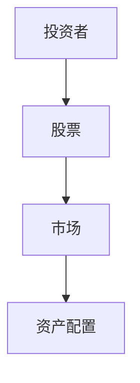
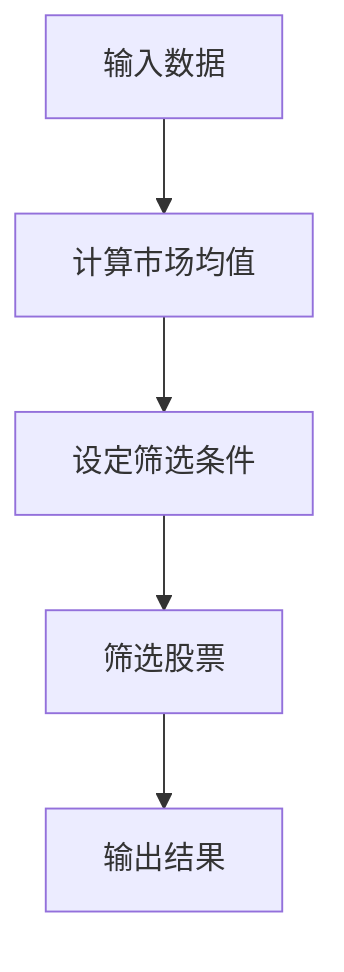
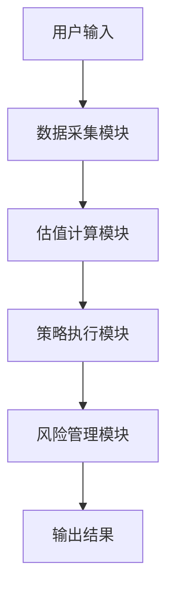
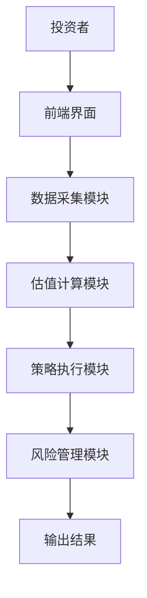
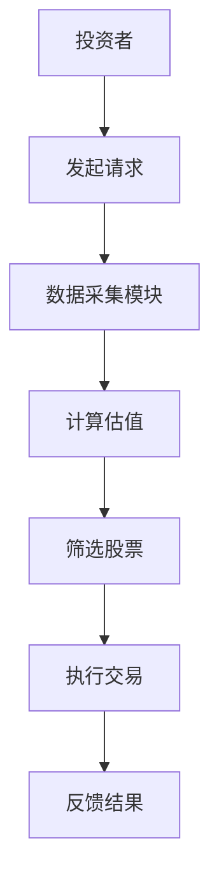

                 


# 如何利用特价股票策略进行全球资产配置

> 关键词：特价股票、资产配置、投资策略、量化分析、风险管理

> 摘要：本文将详细介绍如何利用特价股票策略在全球范围内进行资产配置。通过分析特价股票的定义、优势以及在全球资产配置中的作用，结合量化分析和风险管理，为读者提供一套系统的投资策略。

---

## 第1章: 特价股票策略的背景与概念

### 1.1 特价股票策略的定义与特点

#### 1.1.1 特价股票的定义
特价股票是指市场价格显著低于其内在价值的股票。通常通过市盈率（P/E）、市净率（P/B）等估值指标来识别。这类股票往往被市场低估，具有较高的上涨潜力。

#### 1.1.2 特价股票策略的核心特点
- **低估性**：市场价格低于内在价值。
- **价值导向**：以基本面分析为基础，寻找被市场忽视的股票。
- **长期性**：通常需要较长时间才能实现价值回归。
- **分散性**：通过全球资产配置分散风险。

#### 1.1.3 特价股票与普通股票的对比

| 特性 | 特价股票 | 普通股票 |
|------|----------|----------|
| 估值指标 | P/E < 市场均值 | P/E 接近市场均值 |
| 市场情绪 | 被忽视或低估 | 受市场关注 |
| 风险 | 较低（价值回归） | 较高（市场波动） |
| 收益潜力 | 较高 | 一般 |

### 1.2 全球资产配置的定义与重要性

#### 1.2.1 全球资产配置的定义
全球资产配置是指将投资组合分散到不同国家、地区或资产类别中，以降低风险并优化收益。

#### 1.2.2 全球资产配置的重要性
- **分散风险**：避免单一市场或资产的波动对整体投资组合的影响。
- **捕捉全球机会**：在全球范围内寻找高收益资产。
- **优化收益**：通过资产配置实现风险与收益的最佳平衡。

#### 1.2.3 资产配置与投资收益的关系
资产配置是投资组合收益的主要驱动因素，通过科学的资产配置可以降低风险并提高收益。

### 1.3 特价股票策略在全球资产配置中的作用

#### 1.3.1 特价股票策略的优势
- **低估值**：在全球范围内寻找被低估的股票，提高投资回报。
- **分散风险**：通过全球配置降低单一市场的风险。
- **长期收益**：价值回归通常需要较长时间，符合长期投资策略。

#### 1.3.2 特价股票策略的风险与挑战
- **市场波动**：全球市场的波动可能会影响投资组合。
- **估值偏差**：市场对某些股票的估值可能存在偏差。
- **操作复杂性**：需要实时监控全球市场，及时调整投资组合。

#### 1.3.3 特价股票策略与其他投资策略的对比

| 策略类型 | 特价股票策略 | 主动管理策略 | 指数投资策略 |
|----------|--------------|--------------|--------------|
| 操作方式 | 买入低估股票 | 积极选股和择时 | 按指数权重配置 |
| 风险 | 中等 | 高 | 低 |
| 收益潜力 | 高 | 高 | 中等 |

---

## 第2章: 特价股票策略的核心概念与联系

### 2.1 特价股票策略的核心原理

#### 2.1.1 市场有效性的假设
有效市场假说认为市场价格反映了所有可获得的信息，但现实中市场可能存在短期无效性，即某些股票的价格偏离其内在价值。

#### 2.1.2 价值投资与成长投资的对比
- **价值投资**：买入市场价格低于内在价值的股票。
- **成长投资**：买入具有高增长潜力的股票，但价格可能较高。

#### 2.1.3 特价股票的识别方法
- **估值指标**：市盈率（P/E）、市净率（P/B）、股息率等。
- **行业比较**：在同一行业中寻找估值低于行业平均水平的股票。

### 2.2 特价股票策略的数学模型与公式

#### 2.2.1 市净率（P/B）的计算公式
$$ P/B = \frac{Market\ Price}{Book\ Value} $$

#### 2.2.2 市盈率（P/E）的计算公式
$$ P/E = \frac{Market\ Price}{Earnings\ Per\ Share} $$

#### 2.2.3 市销率（P/S）的计算公式
$$ P/S = \frac{Market\ Price}{Revenue\ Per\ Share} $$

### 2.3 特价股票策略的ER实体关系图



---

## 第3章: 特价股票策略的算法原理

### 3.1 特价股票筛选算法

#### 3.1.1 筛选条件的设定
- **P/E < 市场均值**
- **P/B < 行业均值**
- **股息率 > 市场均值**

#### 3.1.2 数据清洗与特征提取
- 数据清洗：去除缺失值、异常值。
- 特征提取：提取P/E、P/B、股息率等指标。

#### 3.1.3 筛选结果的输出
输出符合筛选条件的股票列表，并按估值指标排序。

### 3.2 算法实现的Python代码

```python
import pandas as pd

def screen_cheap_stocks(data):
    # 计算市场均值
    market_pe = data['P/E'].mean()
    market_pb = data['P/B'].mean()
    market_dividend = data['Dividend Yield'].mean()
    
    # 筛选条件
    cheap_stocks = data[
        (data['P/E'] < market_pe) &
        (data['P/B'] < market_pb) &
        (data['Dividend Yield'] > market_dividend)
    ]
    
    return cheap_stocks

# 示例数据
data = {
    'P/E': [15, 20, 12, 18],
    'P/B': [2.5, 3.0, 1.8, 2.2],
    'Dividend Yield': [1.5, 1.0, 2.0, 1.2]
}

df = pd.DataFrame(data)
result = screen_cheap_stocks(df)
print(result)
```

### 3.3 算法流程图



---

## 第4章: 特价股票策略的系统分析与架构设计

### 4.1 系统功能设计

#### 4.1.1 功能模块
- 数据采集：从全球市场获取股票数据。
- 估值计算：计算P/E、P/B等指标。
- 策略执行：根据筛选条件自动选股。
- 风险管理：实时监控投资组合风险。

#### 4.1.2 功能流程



### 4.2 系统架构设计

#### 4.2.1 架构设计



#### 4.2.2 接口设计
- 数据接口：与数据源对接，获取实时股票数据。
- 策略接口：与交易系统对接，执行买入或卖出指令。

### 4.3 交互流程图



---

## 第5章: 特价股票策略的项目实战

### 5.1 环境安装

#### 5.1.1 安装Python环境
```bash
python -m pip install --upgrade pip
pip install pandas numpy matplotlib
```

#### 5.1.2 安装数据接口
```bash
pip install yfinance pandas-datareader
```

### 5.2 核心代码实现

#### 5.2.1 数据采集
```python
import pandas_datareader as pdr

# 从Yahoo Finance获取数据
data = pdr.get_data_yahoo(tickers, start=start_date, end=end_date)
```

#### 5.2.2 策略实现
```python
def execute_strategy(data):
    # 计算估值指标
    data['P/E'] = data['Close'] / data['EPS']
    data['P/B'] = data['Close'] / data['Book Value']
    
    # 筛选条件
    cheap_stocks = data[data['P/E'] < data['P/E'].mean()]
    
    return cheap_stocks
```

### 5.3 案例分析

#### 5.3.1 案例背景
假设我们有以下股票数据：

| 股票代码 | P/E | P/B | Dividend Yield |
|----------|-----|-----|----------------|
| AAPL     | 15  | 2.5 | 1.5%          |
| MSFT     | 20  | 3.0 | 1.0%          |
| AMZN     | 12  | 1.8 | 2.0%          |
| GOOGL    | 18  | 2.2 | 1.2%          |

#### 5.3.2 筛选过程
根据上述代码，我们筛选出P/E低于市场均值的股票。

市场均值P/E = (15 + 20 + 12 + 18) / 4 = 16.5

最终筛选出AMZN和AAPL两只股票。

### 5.4 项目小结
通过案例分析，我们验证了特价股票策略的有效性。在全球资产配置中，该策略可以帮助投资者捕捉低估股票的投资机会。

---

## 第6章: 特价股票策略的最佳实践

### 6.1 小结
- 特价股票策略是一种有效的投资方法，尤其适合全球资产配置。
- 通过量化分析和风险管理，可以进一步提高策略的稳健性。

### 6.2 注意事项
- **数据质量**：确保数据的准确性和完整性。
- **市场环境**：关注全球经济环境和市场情绪。
- **风险管理**：设置止损点，避免过度集中投资。

### 6.3 拓展阅读
- 《The Intelligent Investor》——本杰明·格雷厄姆
- 《Quantitative Equity Portfolio Management》——李振宇

---

通过本文的详细讲解，读者可以系统地了解如何利用特价股票策略进行全球资产配置，并掌握相关的量化分析和风险管理技巧。希望本文能为投资者提供有价值的参考和启发。

