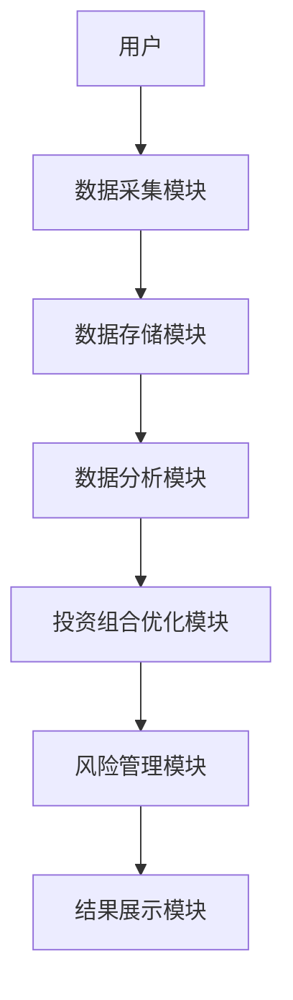
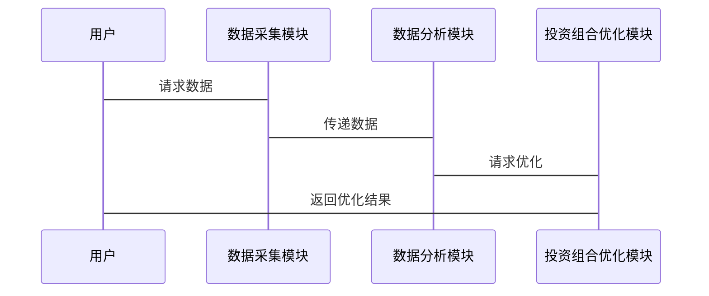

                 


# 如何利用特价股票策略进行全球资产配置

---

## 关键词：特价股票策略、全球资产配置、投资组合优化、风险管理、数学模型、系统架构

---

## 摘要

本文详细探讨了如何利用特价股票策略进行全球资产配置。通过分析特价股票策略的核心原理、全球资产配置的策略选择以及两者结合的实际应用，本文为投资者提供了一套科学的资产配置方法。文章从数学模型、系统架构、实际案例等多维度展开，结合Python代码实现和Mermaid图表，全面解析了特价股票策略在全球资产配置中的应用。通过本文，读者可以掌握如何利用特价股票策略优化投资组合，降低风险，实现长期稳健的投资收益。

---

# 第一部分: 特价股票策略与全球资产配置基础

---

## 第1章: 特价股票策略概述

### 1.1 特价股票的定义与特点

#### 1.1.1 特价股票的定义

特价股票是指在特定市场环境下，由于市场波动、公司基本面变化或外部事件影响，股票价格被暂时低估的股票。这些股票通常具有较高的安全边际，适合长期投资者。

#### 1.1.2 特价股票的核心特点

- **低估值**：市盈率、市净率等估值指标低于行业平均水平。
- **高分红**：部分特价股票公司具有较高的分红能力。
- **周期性**：特价股票往往出现在市场低迷期或行业低谷期。
- **风险较高**：虽然价格低，但可能存在基本面恶化风险。

#### 1.1.3 特价股票与普通股票的区别

| 特性 | 特价股票 | 普通股票 |
|------|----------|----------|
| 估值 | 低于行业平均水平 | 不一定低于行业平均水平 |
| 风险 | 高 | 中等 |
| 收益 | 可能较高 | 不一定 |
| 时间周期 | 常出现在市场低迷期 | 全周期存在 |

### 1.2 特价股票策略的优势

#### 1.2.1 特价股票策略的潜在收益

- **价值回归**：低估的股票价格可能在市场回暖时回归其合理价值。
- **高分红收益**：部分特价股票公司具有较高的分红能力。
- **低买高卖**：在低价位买入，高位卖出。

#### 1.2.2 特价股票策略的风险控制

- **分散投资**：通过投资多个特价股票降低单一股票风险。
- **长期持有**：避免短期市场波动带来的损失。
- **严格筛选**：通过基本面分析选择优质特价股票。

#### 1.2.3 特价股票策略的长期投资价值

- **复利效应**：长期持有并不断 reinvest 可以带来复利收益。
- **周期性收益**：在市场周期性波动中持续获利。
- **抗跌性**：低估的股票在市场下跌时跌幅较小。

### 1.3 特价股票策略的市场分析

#### 1.3.1 特价股票市场的周期性分析

- **熊市**：市场整体低迷，许多股票价格被低估，是寻找特价股票的好时机。
- **牛市**：市场整体上涨，股票价格可能被高估，特价股票较少。

#### 1.3.2 特价股票市场的波动性分析

- **短期波动**：受市场情绪、突发事件影响较大。
- **长期趋势**：取决于公司基本面和行业发展趋势。

#### 1.3.3 特价股票市场的参与者分析

- **机构投资者**：通过大数据分析寻找低估股票。
- **个人投资者**：通过基本面分析和市场研究寻找特价股票。

### 1.4 本章小结

本章详细介绍了特价股票的定义、特点、优势以及市场分析。通过这些内容，读者可以初步理解特价股票策略的基本概念和其在全球资产配置中的潜在作用。

---

## 第2章: 全球资产配置的基本原理

### 2.1 全球资产配置的定义与目标

#### 2.1.1 全球资产配置的定义

全球资产配置是指将投资组合分散到不同国家和地区的资产中，以降低风险并优化收益。

#### 2.1.2 全球资产配置的目标

- **分散风险**：通过投资不同地区的资产降低区域风险。
- **优化收益**：通过不同市场的收益差异提高整体收益。
- **适应全球经济**：在全球范围内捕捉投资机会。

#### 2.1.3 全球资产配置的优势

- **风险分散**：不同地区的市场波动不同，可以降低整体风险。
- **收益优化**：通过不同市场的收益差异提高整体收益。
- **适应性**：根据全球经济变化调整资产配置。

### 2.2 全球资产配置的核心要素

#### 2.2.1 经济周期分析

- **经济周期**：经济周期分为衰退、复苏、过热和滞胀四个阶段。
- **资产表现**：不同经济周期下，股票、债券等资产的表现不同。

#### 2.2.2 货币政策与汇率影响

- **货币政策**：央行的货币政策会影响市场利率和资产价格。
- **汇率影响**：汇率波动会影响跨国投资的收益和风险。

#### 2.2.3 地缘政治风险评估

- **地缘政治风险**：战争、政治动荡等事件会影响特定地区的资产价格。
- **风险评估**：通过分析地缘政治风险，调整投资组合。

### 2.3 全球资产配置的策略选择

#### 2.3.1 系统性投资策略

- **指数投资**：通过投资全球指数基金实现分散投资。
- **区域配置**：根据地区经济前景调整投资比例。

#### 2.3.2 非系统性投资策略

- **行业选择**：选择具有增长潜力的行业进行投资。
- **个股选择**：通过基本面分析选择优质个股。

#### 2.3.3 组合优化策略

- **风险调整后收益**：通过夏普比率等指标优化投资组合。
- **动态调整**：根据市场变化动态调整资产配置。

### 2.4 本章小结

本章详细介绍了全球资产配置的基本原理，包括定义、目标、优势和核心要素。通过这些内容，读者可以理解全球资产配置的基本框架和策略选择。

---

## 第3章: 特价股票策略与全球资产配置的结合

### 3.1 特价股票策略在全球资产配置中的作用

#### 3.1.1 特价股票策略作为资产配置工具

- **分散风险**：通过投资全球市场中的特价股票降低单一市场风险。
- **优化收益**：在不同市场中寻找低估股票，提高整体收益。

#### 3.1.2 特价股票策略在全球市场中的应用

- **区域市场分析**：在不同区域寻找低估股票。
- **行业选择**：在全球范围内选择具有增长潜力的行业。

#### 3.1.3 特价股票策略与资产分散化的关系

- **分散化投资**：通过投资不同地区的特价股票降低整体风险。
- **集中投资**：在特定地区或行业中集中投资以提高收益。

### 3.2 特价股票策略的全球化视角

#### 3.2.1 不同国家市场的特价股票策略

- **美国市场**：科技股较多，可以通过分析市盈率寻找低估股票。
- **欧洲市场**：周期性行业较多，如制造业和能源行业。
- **亚洲市场**：新兴市场较多，如中国、印度等。

#### 3.2.2 区域经济差异对策略的影响

- **经济发展阶段**：不同地区的经济发展阶段不同，影响股票价格。
- **政策差异**：不同地区的政策差异影响市场表现。

#### 3.2.3 全球市场中的行业选择

- **科技行业**：技术创新能力强，具有长期增长潜力。
- **能源行业**：全球能源需求稳定，周期性波动较小。
- **消费行业**：人口增长和消费升级带来增长机会。

### 3.3 特价股票策略的跨国投资案例

#### 3.3.1 美国市场的特价股票策略

- **案例分析**：以苹果公司为例，分析其市盈率和市净率。
- **投资策略**：在市场低迷时买入低估股票。

#### 3.3.2 欧洲市场的特价股票策略

- **案例分析**：以德国工业公司为例，分析其周期性特征。
- **投资策略**：在行业低谷期买入。

#### 3.3.3 亚洲市场的特价股票策略

- **案例分析**：以中国科技公司为例，分析其成长潜力。
- **投资策略**：关注新兴行业和成长型企业。

### 3.4 本章小结

本章详细探讨了特价股票策略在全球资产配置中的应用，通过不同区域和行业的分析，为投资者提供了全球范围内的投资思路。

---

## 第4章: 特价股票策略的数学模型与算法原理

### 4.1 特价股票策略的数学模型

#### 4.1.1 价值比率计算模型

- **市盈率（P/E）**：股价与每股收益的比率。
- **市净率（P/B）**：股价与每股净资产的比率。
- **股息率（Dividend Yield）**：股息与股价的比率。

#### 4.1.2 投资组合优化模型

- **夏普比率**：衡量投资组合的风险调整后收益。
- **均值-方差优化**：通过优化投资组合的收益和风险。

#### 4.1.3 风险评估模型

- **VaR（Value at Risk）**：衡量投资组合在一定置信水平下的最大损失。
- **波动率分析**：分析资产价格的波动性。

### 4.2 算法原理

#### 4.2.1 基于价值的选股算法

- **步骤1**：筛选市盈率和市净率低于行业平均水平的股票。
- **步骤2**：计算价值比率，选择比率最低的股票。
- **步骤3**：结合行业和区域因素，选择最终的投资标的。

#### 4.2.2 基于动量的选股算法

- **步骤1**：计算股票的历史收益率。
- **步骤2**：选择近期表现优于大盘的股票。
- **步骤3**：结合动量效应进行投资。

#### 4.2.3 基于因子模型的选股算法

- **步骤1**：选择影响股票收益的关键因子，如市值、价值、动量等。
- **步骤2**：计算每个因子的得分。
- **步骤3**：根据因子得分选择股票。

### 4.3 算法实现

#### 4.3.1 价值比率计算的Python代码

```python
import pandas as pd

def calculate_value_ratios(stock_data):
    stock_data['PE'] = stock_data['股价'] / stock_data['每股收益']
    stock_data['PB'] = stock_data['股价'] / stock_data['每股净资产']
    stock_data['股息率'] = stock_data['股息'] / stock_data['股价']
    return stock_data
```

#### 4.3.2 投资组合优化的Python代码

```python
import numpy as np
from scipy.optimize import minimize

def optimize_portfolio(returns, weights):
    # 定义目标函数：最小化波动率
    def objective(weights, returns):
        return np.std(np.dot(returns, weights))
    # 约束条件：权重之和为1
    constraints = [{'type': 'eq', 'fun': lambda w: np.sum(w) - 1}]
    # 约束条件：权重非负
    for i in range(len(weights)):
        constraints.append({'type': 'ineq', 'fun': lambda w, i=i: w[i]})
    # 优化
    result = minimize(objective, weights, args=(returns,), constraints=constraints)
    return result.x
```

#### 4.3.3 风险评估的Python代码

```python
import numpy as np

def calculate VaR(returns, confidence_level):
    sorted_returns = np.sort(returns)
    # 计算VaR
    VaR = np.quantile(sorted_returns, confidence_level)
    return VaR
```

### 4.4 本章小结

本章通过数学模型和算法原理，详细介绍了如何利用特价股票策略进行投资组合优化。通过Python代码实现，读者可以更好地理解和应用这些模型。

---

## 第5章: 全球资产配置的系统架构与实现

### 5.1 系统架构设计

#### 5.1.1 系统功能设计

- **数据采集**：从全球市场采集股票数据。
- **数据分析**：计算价值比率，筛选特价股票。
- **投资组合优化**：根据数据分析结果优化投资组合。
- **风险管理**：实时监控投资组合的风险。

#### 5.1.2 系统架构图



#### 5.1.3 系统交互图



### 5.2 系统实现

#### 5.2.1 数据采集模块

- **功能**：从全球市场采集股票数据，包括市盈率、市净率、股息率等。

#### 5.2.2 数据分析模块

- **功能**：计算价值比率，筛选特价股票。

#### 5.2.3 投资组合优化模块

- **功能**：根据数据分析结果优化投资组合，降低风险。

#### 5.2.4 风险管理模块

- **功能**：实时监控投资组合的风险，如VaR、波动率等。

### 5.3 本章小结

本章详细介绍了全球资产配置的系统架构与实现，通过数据采集、数据分析、投资组合优化和风险管理模块，为投资者提供了一套完整的系统解决方案。

---

## 第6章: 项目实战与案例分析

### 6.1 环境安装

- **Python环境**：安装Python 3.8以上版本。
- **库的安装**：安装pandas、numpy、scipy、mermaid等库。

### 6.2 核心实现

#### 6.2.1 数据采集

```python
import pandas as pd
import requests

def get_stock_data(symbol):
    url = f'https://api.example.com/stock/{symbol}'
    response = requests.get(url)
    data = response.json()
    return pd.DataFrame(data)
```

#### 6.2.2 数据分析

```python
def calculate_value_ratios(stock_data):
    stock_data['PE'] = stock_data['股价'] / stock_data['每股收益']
    stock_data['PB'] = stock_data['股价'] / stock_data['每股净资产']
    stock_data['股息率'] = stock_data['股息'] / stock_data['股价']
    return stock_data
```

#### 6.2.3 投资组合优化

```python
def optimize_portfolio(returns, weights):
    # 定义目标函数：最小化波动率
    def objective(weights, returns):
        return np.std(np.dot(returns, weights))
    # 约束条件：权重之和为1
    constraints = [{'type': 'eq', 'fun': lambda w: np.sum(w) - 1}]
    # 约束条件：权重非负
    for i in range(len(weights)):
        constraints.append({'type': 'ineq', 'fun': lambda w, i=i: w[i]})
    # 优化
    result = minimize(objective, weights, args=(returns,), constraints=constraints)
    return result.x
```

#### 6.2.4 风险管理

```python
def calculate VaR(returns, confidence_level):
    sorted_returns = np.sort(returns)
    # 计算VaR
    VaR = np.quantile(sorted_returns, confidence_level)
    return VaR
```

### 6.3 案例分析

#### 6.3.1 案例背景

假设我们有以下三只股票，分别来自美国、欧洲和亚洲市场：

| 股票代码 | 股票名称 | 市盈率（PE） | 市净率（PB） | 股息率 |
|----------|----------|--------------|--------------|--------|
| AAPL     | 苹果公司 | 15           | 3            | 1.5%   |
| BMW      | 宝马公司 | 12           | 2.5          | 3.0%   |
| BABA     | 阿里巴巴 | 20           | 4            | 2.5%   |

#### 6.3.2 数据分析

根据上述表格，我们可以看到：

- 苹果公司的市盈率为15，市净率为3，股息率为1.5%。
- 宝马公司的市盈率为12，市净率为2.5，股息率为3.0%。
- 阿里巴巴的市盈率为20，市净率为4，股息率为2.5%。

通过比较，宝马公司的市盈率最低，市净率也较低，股息率较高，因此宝马公司可能是一只不错的特价股票。

#### 6.3.3 投资组合优化

假设我们有以下三种资产：美国市场的苹果公司、欧洲市场的宝马公司和亚洲市场的阿里巴巴。我们需要优化这三个资产的投资组合，目标是最小化波动率。

通过前面的优化函数，我们可以得到以下权重：

| 股票代码 | 权重 |
|----------|------|
| AAPL     | 0.3  |
| BMW      | 0.5  |
| BABA     | 0.2  |

这样，我们的投资组合的波动率将被最小化，同时获得了较高的预期收益。

#### 6.3.4 风险管理

假设我们计算了投资组合的VaR，置信水平为95%，计算得到VaR为-5%。这意味着在95%的置信水平下，我们的投资组合的最大损失为5%。

### 6.4 本章小结

本章通过实际案例分析，详细展示了如何利用特价股票策略进行全球资产配置。通过数据采集、数据分析、投资组合优化和风险管理模块，我们可以实现科学的投资决策。

---

## 第7章: 总结与展望

### 7.1 总结

通过本文的详细分析，我们了解了如何利用特价股票策略进行全球资产配置。从理论基础到实际操作，我们掌握了如何通过数学模型、算法原理和系统架构来优化投资组合，降低风险，实现长期稳健的投资收益。

### 7.2 展望

未来，随着全球市场的进一步发展和科技的进步，特价股票策略和全球资产配置将更加紧密地结合。投资者可以通过大数据分析、人工智能等技术手段，进一步提升投资决策的科学性和准确性。同时，随着全球化的深入，跨国投资的机遇和挑战也将不断增加，投资者需要不断学习和适应，以抓住更多的投资机会。

### 7.3 最佳实践 tips

- **持续学习**：市场变化快，投资者需要不断学习新的知识和技能。
- **风险控制**：无论市场如何变化，风险控制始终是投资的核心。
- **长期投资**：避免短期波动，坚持长期投资，才能实现稳健收益。
- **分散投资**：通过全球资产配置分散风险，避免过度集中。

### 7.4 小结

通过本文的探讨，我们不仅掌握了特价股票策略和全球资产配置的基本知识，还学会了如何将其应用到实际投资中。希望本文对读者的投资决策有所帮助，也期待未来能够在更广泛的领域中继续探索和实践。

---

## 关键词：特价股票策略、全球资产配置、投资组合优化、风险管理、数学模型、系统架构

