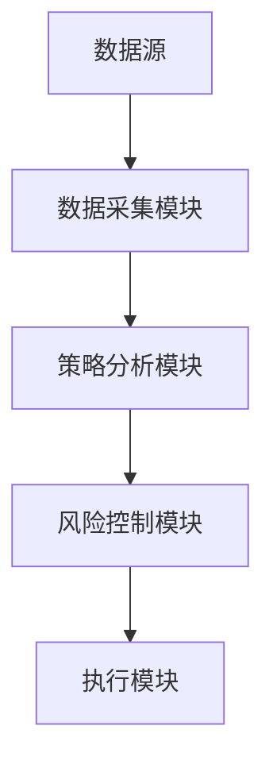
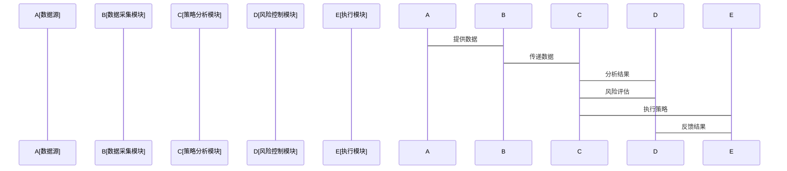

                 


# 如何利用特价股票策略进行反向ETF投资

> 关键词：特价股票，反向ETF，投资策略，波动率，风险管理

> 摘要：本文详细探讨了如何利用特价股票策略进行反向ETF投资。通过分析特价股票和反向ETF的核心概念，构建数学模型，设计系统架构，提供项目实战和最佳实践，帮助读者理解并掌握这一投资策略。

---

## 第一部分: 特价股票与反向ETF投资概述

### 第1章: 特价股票与反向ETF投资的背景介绍

#### 1.1 特价股票的基本概念

##### 1.1.1 什么是特价股票
特价股票是指价格相对市场价值被低估的股票。这些股票通常具有较高的潜在回报，但可能伴随着较高的风险。特价股票的识别通常基于基本面分析，如低市盈率、低市净率等指标。

##### 1.1.2 特价股票的市场特征
- **低估值**：市盈率、市净率等指标低于行业平均水平。
- **高波动性**：价格波动较大，容易受到市场情绪影响。
- **周期性**：通常在市场低迷时出现，周期性较强。

##### 1.1.3 特价股票的投资价值
- **高回报潜力**：低估的股票有较高的上涨空间。
- **逆向投资机会**：在市场低迷时买入，市场复苏时卖出。

#### 1.2 反向ETF的基本概念

##### 1.2.1 什么是反向ETF
反向ETF是一种通过做空指数或行业表现来获利的ETF。当市场下跌时，反向ETF的价格会上涨，为投资者提供在市场低迷时期获利的机会。

##### 1.2.2 反向ETF的运作机制
反向ETF通过杠杆和做空机制来实现收益。通常，反向ETF的表现与市场指数相反，例如，当指数下跌2%，反向ETF可能上涨2%。

##### 1.2.3 反向ETF的优缺点
- **优点**：可以在市场下跌时获利，操作简便。
- **缺点**：杠杆效应可能导致高风险，不适合长期持有。

#### 1.3 特价股票与反向ETF的结合

##### 1.3.1 结合的背景与动机
在市场低迷时期，特价股票和反向ETF都可能表现良好，结合两者可以有效分散风险，提高投资收益。

##### 1.3.2 结合的潜在优势
- **风险分散**：通过持有特价股票和反向ETF，投资者可以在市场上涨和下跌时获利。
- **策略互补**：特价股票提供长期增长潜力，反向ETF提供短期反弹机会。

##### 1.3.3 结合的市场机会
在市场波动加剧的情况下，结合特价股票和反向ETF的投资策略可以有效捕捉市场机会，降低投资风险。

---

### 第2章: 特价股票与反向ETF的核心概念与联系

#### 2.1 特价股票的市场分析

##### 2.1.1 市场波动对特价股票的影响
市场波动通常会导致股票价格的剧烈波动，特价股票在市场下跌时可能进一步被低估，而在市场上涨时可能被迅速推高。

##### 2.1.2 特价股票的估值方法
常用的估值方法包括市盈率（P/E）、市净率（P/B）和股息率等。通过比较这些指标，投资者可以识别出被低估的股票。

##### 2.1.3 特价股票的市场周期
特价股票通常出现在市场周期的低谷期，投资者需要耐心等待市场复苏。

#### 2.2 反向ETF的策略分析

##### 2.2.1 反向ETF的收益来源
反向ETF通过做空市场指数来获利，当市场下跌时，反向ETF的收益增加。

##### 2.2.2 反向ETF的风险管理
投资者需要注意杠杆风险和市场波动风险，避免在市场剧烈波动时过度投资。

##### 2.2.3 反向ETF的市场适应性
反向ETF适用于市场趋势不明确或下跌趋势的市场环境，不适合长期牛市。

#### 2.3 特价股票与反向ETF的关联性分析

##### 2.3.1 特价股票波动对反向ETF的影响
当市场下跌时，特价股票的价格可能进一步下跌，而反向ETF则可能上涨，两者表现出相反的走势。

##### 2.3.2 反向ETF在特价股票投资中的应用
投资者可以利用反向ETF在市场下跌时对冲特价股票的投资风险，或者在市场上涨时通过反向ETF获利。

##### 2.3.3 特价股票与反向ETF的协同效应
通过结合特价股票和反向ETF，投资者可以在不同市场环境下实现收益最大化，同时降低投资风险。

---

### 第3章: 特价股票与反向ETF投资策略的数学模型

#### 3.1 特价股票的波动率模型

##### 3.1.1 波动率的定义与计算
波动率是衡量资产价格波动程度的指标，通常用标准差表示。

$$ \text{波动率} = \sqrt{\frac{1}{n}\sum_{i=1}^{n}(x_i - \mu)^2} $$

其中，\( x_i \) 是价格数据，\( \mu \) 是平均值，\( n \) 是数据点数量。

##### 3.1.2 波动率的数学公式
$$ \text{波动率} = \sqrt{\frac{1}{n}\sum_{i=1}^{n}(x_i - \mu)^2} $$

#### 3.2 反向ETF的收益模型

##### 3.2.1 反向ETF的收益计算
反向ETF的收益通常与市场指数的表现相反，可以用以下公式表示：

$$ \text{收益} = -\frac{1}{n}\sum_{i=1}^{n}(x_i - \mu) $$

#### 3.3 组合投资的优化模型

##### 3.3.1 投资组合的收益-风险优化
使用均值-方差优化模型来选择最优的投资组合。

$$ \text{优化目标} = \min_w \left( w^T \Sigma w \right) $$

其中，\( w \) 是权重向量，\( \Sigma \) 是协方差矩阵。

---

### 第4章: 特价股票与反向ETF投资策略的系统分析与架构设计

#### 4.1 投资系统模块划分

##### 4.1.1 数据采集模块
负责收集股票价格、市场指数等数据。

##### 4.1.2 策略分析模块
分析数据，识别特价股票和反向ETF的投资机会。

##### 4.1.3 风险控制模块
监控投资组合的风险，调整投资策略。

##### 4.1.4 执行模块
根据策略执行买卖操作。

#### 4.2 系统架构设计

##### 4.2.1 项目介绍
设计一个基于特价股票和反向ETF的投资系统，实现数据采集、策略分析、风险控制和交易执行功能。

##### 4.2.2 系统功能设计
- 数据采集模块：收集股票价格、市场指数等数据。
- 策略分析模块：识别特价股票和反向ETF的投资机会。
- 风险控制模块：监控投资组合的风险，调整投资策略。
- 执行模块：根据策略执行买卖操作。

##### 4.2.3 系统架构图


#### 4.3 系统接口设计

##### 4.3.1 数据接口
- 数据源：股票价格、市场指数等数据接口。

##### 4.3.2 策略接口
- 策略分析模块与数据采集模块的接口。

##### 4.3.3 执行接口
- 执行模块与策略分析模块的接口。

#### 4.4 系统交互序列图



---

## 第五部分: 项目实战

### 第5章: 项目实战与代码实现

#### 5.1 环境安装

##### 5.1.1 安装Python环境
```bash
python --version
pip install numpy pandas matplotlib
```

##### 5.1.2 安装股票数据接口
```bash
pip install pandas-datareader
```

#### 5.2 系统核心实现

##### 5.2.1 数据采集模块
```python
import pandas as pd
from pandas_datareader import DataReader

def get_stock_data(tickers, start_date, end_date):
    data = DataReader(tickers, 'yahoo', start_date, end_date)
    return data
```

##### 5.2.2 策略分析模块
```python
import numpy as np

def calculate_volatility(prices):
    returns = np.log(prices.pct_change().dropna())
    volatility = returns.std()
    return volatility
```

##### 5.2.3 风险控制模块
```python
def calculate_sharpe_ratio(returns, risk_free_rate):
    excess_returns = returns - risk_free_rate
    sharpe_ratio = excess_returns.mean() / excess_returns.std()
    return sharpe_ratio
```

##### 5.2.4 执行模块
```python
import yfinance as yf

def execute_trade(ticker, amount):
    # 示例代码，实际操作需要连接交易API
    print(f"买入 {ticker}，金额为 {amount}")
```

#### 5.3 代码应用解读与分析
- 数据采集模块：从Yahoo Finance获取股票数据。
- 策略分析模块：计算股票的波动率，识别特价股票。
- 风险控制模块：计算夏普比率，评估投资组合的风险。
- 执行模块：根据策略执行买卖操作。

#### 5.4 实际案例分析
- 案例：假设当前市场处于下跌趋势，识别出一只特价股票和一只反向ETF。
- 执行策略：买入特价股票和反向ETF，分散投资风险。

---

## 第六部分: 最佳实践 tips、小结、注意事项、拓展阅读

### 第6章: 最佳实践 tips

#### 6.1 小结
- 特价股票和反向ETF结合可以有效分散风险，提高投资收益。
- 需要根据市场环境调整投资策略，避免过度依赖单一策略。

#### 6.2 注意事项
- 投资者需要具备一定的市场分析能力，识别特价股票和反向ETF的投资机会。
- 需要注意市场波动风险，避免在市场剧烈波动时过度投资。

#### 6.3 拓展阅读
- 《投资学基础》
- 《ETF投资策略》
- 《风险管理与投资组合优化》

---

通过以上详细的内容，本文系统地介绍了如何利用特价股票策略进行反向ETF投资，从理论到实践，为投资者提供了全面的指导和建议。

