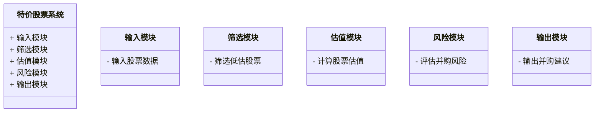

                 


# 如何利用特价股票策略进行反向并购投资

> 关键词：特价股票策略、反向并购投资、股票估值模型、风险评估、并购定价模型

> 摘要：本文将详细介绍如何利用特价股票策略进行反向并购投资。通过分析特价股票的特点、反向并购的基本概念，探讨两者结合的策略制定、数学模型、系统架构设计及项目实战。本文旨在为投资者提供一套系统化的方法论，帮助其在并购交易中实现价值最大化。

---

# 第一部分: 特价股票策略与反向并购投资基础

## 第1章: 特价股票策略概述

### 1.1 特价股票的定义与特点

#### 1.1.1 什么是特价股票
特价股票是指价格低于市场平均水平的股票，通常具有较高的性价比。这类股票可能因为市场波动、公司短期问题或行业周期性调整而被低估。

#### 1.1.2 特价股票的特点
- 低估值：市盈率、市净率等指标低于行业平均水平。
- 高分红：部分公司为了吸引投资者，会提高股息分红。
- 行业周期性：通常出现在行业低谷期。

#### 1.1.3 特价股票与普通股票的区别
| 特性 | 特价股票 | 普通股票 |
|------|----------|----------|
| 估值 | 低于行业均值 | 与行业均值持平或高于均值 |
| 风险 | 风险较高 | 风险适中 |
| 收益 | 有机会获得超额收益 | 收益稳定 |

### 1.2 反向并购投资的定义与特点

#### 1.2.1 什么是反向并购
反向并购是指一家非上市公司通过收购一家上市公司来实现间接上市的过程。这种方式通常用于快速融资和扩展业务。

#### 1.2.2 反向并购的常见模式
- **现金支付**：用现金购买目标公司的股份。
- **股票支付**：用并购方的股票作为支付手段。
- **混合支付**：结合现金和股票的支付方式。

#### 1.2.3 反向并购的优势与风险
优势：
- 快速上市，降低融资门槛。
- 优化资产结构，提升企业形象。

风险：
- 并购后整合难度大。
- 目标公司可能存在隐性负债。

---

## 第2章: 特价股票策略与反向并购的关系

### 2.1 特价股票在反向并购中的作用

#### 2.1.1 特价股票作为并购工具
在反向并购中，特价股票可以作为支付工具，降低并购成本。

#### 2.1.2 特价股票在并购中的优势
- 价格优势：相比现金支付，特价股票的支付成本更低。
- 市场认可度高：股票支付可以提升目标公司股东的接受度。

#### 2.1.3 特价股票与并购成本的关系
$$\text{并购成本} = \text{股价} \times \text{股份数}$$

---

# 第二部分: 特价股票策略在反向并购中的应用

## 第3章: 特价股票策略的制定与实施

### 3.1 策略制定的关键因素

#### 3.1.1 市场分析与目标选择
- 行业分析：选择周期性低谷的行业。
- 股票筛选：使用估值模型筛选低估股票。

#### 3.1.2 财务分析与估值模型
- 市盈率（P/E）：目标公司P/E低于行业均值。
- 市净率（P/B）：目标公司P/B低于行业均值。

#### 3.1.3 风险评估与应对措施
- 市场风险：行业复苏的可能性。
- 财务风险：目标公司的负债情况。

### 3.2 策略实施的步骤

#### 3.2.1 确定目标公司
- 选择具有低估股价的公司。
- 确保公司基本面良好。

#### 3.2.2 股权结构设计
- 确保并购后控制权。
- 设计合理的股权分配。

#### 3.2.3 并购方案制定
- 确定支付方式（现金或股票）。
- 制定详细的并购计划。

#### 3.2.4 交易执行与后续管理
- 确保交易合规性。
- 并购后的整合与管理。

---

## 第4章: 特价股票策略的数学模型与算法

### 4.1 特价股票估值模型

#### 4.1.1 市盈率模型
$$\text{合理股价} = \text{行业平均P/E} \times \text{目标公司每股收益}$$

#### 4.1.2 市净率模型
$$\text{合理股价} = \text{行业平均P/B} \times \text{目标公司每股净资产}$$

#### 4.1.3 自由现金流模型
$$\text{企业价值} = \sum_{t=1}^{n} \frac{\text{自由现金流}}{(1 + r)^t}$$

### 4.2 并购风险评估模型

#### 4.2.1 风险因子分析
- 市场风险：行业波动。
- 财务风险：公司负债情况。

#### 4.2.2 风险概率计算
$$\text{风险概率} = \sum (\text{风险因子} \times \text{权重})$$

#### 4.2.3 风险影响评估
$$\text{总风险影响} = \text{风险概率} \times \text{影响程度}$$

### 4.3 算法原理

#### 4.3.1 基于CAPM的并购定价模型
$$\text{预期回报率} = r_f + \beta \times (r_m - r_f)$$
其中，\( r_f \) 是无风险利率，\( r_m \) 是市场预期回报率，\( \beta \) 是目标公司的贝塔系数。

#### 4.3.2 基于博弈论的并购策略选择
- 使用纳什均衡理论分析并购双方的策略选择。

#### 4.3.3 基于机器学习的并购风险预测
- 使用逻辑回归或随机森林模型预测并购风险。

---

## 第5章: 系统分析与架构设计方案

### 5.1 系统分析

#### 5.1.1 问题场景介绍
- 目标：设计一个支持特价股票策略的系统。
- 范围：涵盖股票筛选、估值模型、风险评估等功能。

#### 5.1.2 项目目标与范围
- 目标：提供一套完整的反向并购投资解决方案。
- 范围：包括股票筛选、估值模型、风险评估、交易执行等功能。

### 5.2 系统功能设计

#### 5.2.1 领域模型（Mermaid 类图）


### 5.3 系统架构设计

#### 5.3.1 系统架构（Mermaid 架构图）
```mermaid
client
    ↔
api_gateway
    ↔
backend
        ↔
databases
        ↔
storage
```

### 5.4 系统接口设计

#### 5.4.1 接口设计
- API接口：提供股票数据接口、估值模型接口、风险评估接口。

### 5.5 系统交互（Mermaid 序列图）

```mermaid
sequenceDiagram
    client -> api_gateway: 请求股票数据
    api_gateway -> backend: 调用股票筛选服务
    backend -> databases: 查询历史数据
    databases → backend: 返回数据
    backend → api_gateway: 返回筛选结果
    api_gateway → client: 返回最终结果
```

---

## 第6章: 项目实战

### 6.1 环境安装

#### 6.1.1 安装Python环境
```bash
pip install python3
pip install numpy pandas
```

### 6.2 核心实现

#### 6.2.1 股票筛选代码
```python
import pandas as pd

def screen_cheap_stocks(data):
    # 计算市盈率和市净率
    data['pe'] = data['市盈率']
    data['pb'] = data['市净率']
    # 筛选pe和pb均低于行业均值的股票
    cheap Stocks = data[(data['pe'] < data['pe'].mean()) & (data['pb'] < data['pb'].mean())]
    return cheap Stocks
```

#### 6.2.2 估值模型代码
```python
def calculate_value(data):
    # 使用CAPM模型计算预期回报率
    data['预期回报率'] = r_f + beta * (r_m - r_f)
    return data
```

### 6.3 案例分析

#### 6.3.1 案例分析
- 假设目标公司A，股价为10元，市盈率为15，行业平均市盈率为20。
- 筛选结果：A符合低估条件。
- 估值结果：预期回报率为12%。

### 6.4 项目总结
通过实战案例，验证了特价股票策略的有效性。投资者可以利用该策略在反向并购中实现超额收益。

---

## 第7章: 总结与展望

### 7.1 总结
本文详细介绍了如何利用特价股票策略进行反向并购投资，涵盖策略制定、数学模型、系统设计及项目实战。

### 7.2 展望
未来，可以进一步研究如何利用大数据和人工智能技术优化并购策略，提升投资收益。

---

## 第8章: 注意事项与最佳实践

### 8.1 注意事项
- 严格控制风险。
- 确保交易合规性。

### 8.2 最佳实践
- 定期复盘投资策略。
- 保持对市场的敏感性。

---

通过以上步骤，投资者可以系统化地利用特价股票策略进行反向并购投资，实现资产增值。

