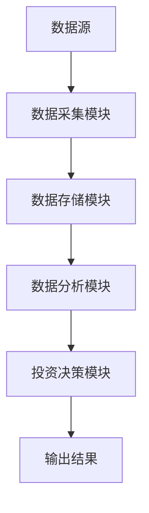
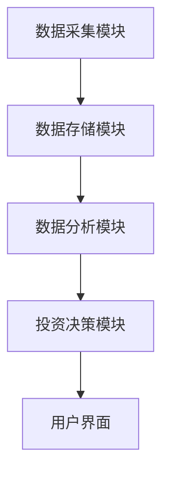
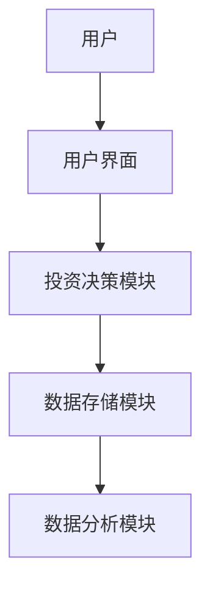
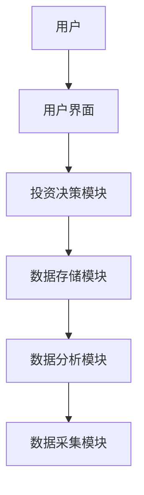

                 


# 如何利用特价股票策略进行反周期投资

> 关键词：特价股票，反周期投资，股票策略，投资策略，市场周期，财务指标，股票筛选

> 摘要：本文详细探讨了如何利用特价股票策略进行反周期投资，从背景介绍、核心概念、具体实施方法到系统分析与架构设计，再到项目实战与代码实现，全面解析了特价股票策略在反周期投资中的应用。文章通过理论分析与实践结合的方式，为投资者提供了一套系统化的投资策略。

---

# 第1章: 特价股票策略与反周期投资背景

## 1.1 特价股票策略的定义与特点
### 1.1.1 特价股票的定义
特价股票是指在特定市场环境下，价格被市场低估，相对于其内在价值具有较大折扣的股票。这类股票通常具有较高的安全边际，适合长期投资者在市场低迷时进行布局。

### 1.1.2 特价股票的特点
- **低估值**：市盈率、市净率等估值指标远低于行业平均水平。
- **高分红**：部分特价股票公司具有较高的股息支付率。
- **行业周期性**：通常出现在行业低谷期或市场低迷期。
- **风险偏好低**：适合风险厌恶型投资者。

### 1.1.3 特价股票与普通股票的区别
| 特性       | 特价股票                 | 普通股票                 |
|------------|--------------------------|--------------------------|
| 估值       | 低估值                   | 市场估值合理或高估         |
| 行业周期   | 行业低谷期               | 行业周期波动或景气         |
| 投资策略   | 长期持有，等待反弹       | 短期交易或趋势投资         |
| 风险       | 低风险                   | 风险较高                  |

## 1.2 反周期投资的基本概念
### 1.2.1 什么是反周期投资
反周期投资是指在经济周期波动中，选择与经济周期呈反向关系的资产进行投资。当经济处于衰退期时，投资于表现相对稳定的资产；当经济处于繁荣期时，投资于表现相对低迷的资产。

### 1.2.2 反周期投资的核心目标
- **降低投资波动性**：通过投资于与市场周期相关性较低的资产，降低组合的整体波动性。
- **捕捉周期性机会**：在市场低迷期布局，在市场复苏期获利。

### 1.2.3 反周期投资的适用场景
- **经济衰退期**：投资于防御性资产（如公用事业、医疗保健等）。
- **市场恐慌期**：市场恐慌时，优质资产价格被低估，适合布局。
- **行业低谷期**：选择行业内处于低谷期但具有竞争优势的企业。

## 1.3 特价股票策略在反周期投资中的作用
### 1.3.1 特价股票策略的优势
- **低估值**：特价股票通常具有较高的安全边际，能够在市场反弹时获得超额收益。
- **逆周期布局**：在市场低迷期布局特价股票，能够在市场复苏时获得较高的回报。
- **风险分散**：通过选择多个行业的特价股票，降低投资风险。

### 1.3.2 特价股票策略的局限性
- **市场周期性**：特价股票的表现与市场周期密切相关，无法完全摆脱周期性波动的影响。
- **选股难度**：需要具备较高的选股能力，才能在市场低迷期识别出真正的特价股票。
- **流动性风险**：部分特价股票流动性较低，可能导致交易成本较高。

### 1.3.3 特价股票策略与反周期投资的结合
反周期投资的核心在于通过投资于与市场周期相关性较低的资产，降低投资组合的波动性。特价股票策略通过在市场低迷期布局低估资产，能够在市场复苏时获得较高的回报，从而实现反周期投资的目标。

---

# 第2章: 特价股票策略的核心概念与原理

## 2.1 特价股票的市场周期分析
### 2.1.1 市场周期的基本概念
市场周期分为四个阶段：复苏期、增长期、成熟期和衰退期。在衰退期，市场通常会出现大量特价股票，投资者可以通过布局特价股票，在市场复苏时获得较高的收益。

### 2.1.2 特价股票在不同周期的表现
- **衰退期**：市场整体低迷，大量股票价格被低估，适合布局特价股票。
- **复苏期**：市场逐渐复苏，特价股票价格开始反弹。
- **增长期**：市场整体上涨，特价股票价格逐步回归合理估值。
- **成熟期**：市场趋于稳定，特价股票价格波动较小。

### 2.1.3 周期性波动对投资策略的影响
- **市场波动性**：市场波动性越大，特价股票策略的效果越明显。
- **行业周期性**：不同行业具有不同的周期性特征，需要结合行业周期进行投资决策。

## 2.2 投资者心理与特价股票策略
### 2.2.1 投资者心理对市场的影响
投资者心理是市场波动的重要原因之一。在市场低迷期，投资者通常会因恐慌而抛售股票，导致股票价格进一步下跌。这种行为为理性投资者提供了布局特价股票的机会。

### 2.2.2 特价股票策略如何利用投资者心理
- **逆向思维**：在市场恐慌时，布局市场关注度低的优质股票。
- **情绪分析**：通过分析市场情绪，识别市场底部区域。

### 2.2.3 心理因素对策略效果的影响
- **贪婪与恐惧**：投资者的贪婪和恐惧情绪会影响策略的实施效果。
- **耐心与纪律**：投资者需要具备耐心和纪律性，才能在市场低迷期坚持布局特价股票。

## 2.3 市场波动与特价股票策略
### 2.3.1 市场波动的基本特征
市场波动是市场周期性变化的结果，通常表现为价格的剧烈波动。特价股票策略通过利用市场波动，能够在市场低迷期布局低估资产。

### 2.3.2 特价股票策略如何应对市场波动
- **分散投资**：通过投资多个行业的特价股票，降低市场波动对投资组合的影响。
- **动态调整**：根据市场波动情况，动态调整投资组合。

### 2.3.3 波动性对策略收益的影响
- **高波动市场**：波动性越高，特价股票策略的收益潜力越大。
- **低波动市场**：波动性较低，策略的收益潜力较小。

## 2.4 本章小结
本章详细分析了特价股票策略的核心概念与原理，包括市场周期、投资者心理和市场波动对策略的影响。通过理解这些因素，投资者可以更好地实施特价股票策略，在市场周期波动中获得超额收益。

---

# 第3章: 特价股票策略的具体实施方法

## 3.1 特价股票的识别与筛选
### 3.1.1 特价股票的识别标准
- **低估值**：市盈率（P/E）和市净率（P/B）低于行业平均水平。
- **高分红**：股息率较高，且股息支付率稳定。
- **行业地位**：公司应具有较强的行业地位和竞争优势。

### 3.1.2 特价股票的筛选方法
- **财务指标分析**：通过分析公司的财务报表，筛选出具有低估值、高分红的公司。
- **行业分析**：选择处于行业低谷期的公司，但具有较强竞争优势。
- **市场情绪分析**：通过分析市场情绪，筛选出市场关注度低但具有投资价值的公司。

### 3.1.3 特价股票的案例分析
以某行业为例，分析一家公司在市场低迷期的股价表现和财务指标，说明如何通过财务指标和市场情绪分析，识别出特价股票。

## 3.2 投资组合的构建与管理
### 3.2.1 投资组合的构建
- **资产配置**：根据市场周期和行业周期，合理配置资产。
- **风险控制**：通过分散投资和动态调整，降低投资组合的风险。

### 3.2.2 投资组合的管理
- **定期调整**：根据市场变化和公司基本面，定期调整投资组合。
- **风险管理**：设置止损点，避免重大损失。

### 3.2.3 投资组合的监控
- **市场监控**：密切关注市场走势和公司基本面变化。
- **绩效评估**：定期评估投资组合的绩效，优化投资策略。

## 3.3 本章小结
本章详细介绍了特价股票策略的具体实施方法，包括特价股票的识别与筛选、投资组合的构建与管理等。通过科学的方法和严格的筛选标准，投资者可以在市场低迷期布局低估资产，实现长期稳定的收益。

---

# 第4章: 反周期投资的系统分析与架构设计

## 4.1 投资决策模型的构建
### 4.1.1 模型的基本框架
- **数据采集**：获取市场数据和公司财务数据。
- **数据分析**：通过数据分析，筛选出符合条件的特价股票。
- **投资决策**：根据分析结果，制定投资策略。

### 4.1.2 模型的输入变量
- **市场数据**：指数、行业表现等。
- **公司数据**：财务指标、分红政策等。
- **市场情绪**：市场情绪指标、投资者信心指数等。

### 4.1.3 模型的输出结果
- **投资建议**：包括买入、卖出、持有等决策。
- **风险提示**：包括市场风险、行业风险等。

## 4.2 系统功能设计
### 4.2.1 数据采集模块
- **数据来源**：股票市场数据、公司财务数据等。
- **数据处理**：清洗、转换和存储。

### 4.2.2 数据分析模块
- **数据分析**：通过数据分析工具，筛选出符合条件的特价股票。
- **数据可视化**：通过图表展示数据分析结果。

### 4.2.3 投资决策模块
- **决策逻辑**：根据数据分析结果，制定投资策略。
- **决策输出**：生成投资建议和风险提示。

## 4.3 系统架构设计
### 4.3.1 数据流图


### 4.3.2 模块交互图


### 4.3.3 系统部署图


## 4.4 系统接口设计
### 4.4.1 数据接口
- **输入接口**：接收市场数据和公司数据。
- **输出接口**：输出投资建议和风险提示。

### 4.4.2 用户接口
- **输入**：用户输入投资目标和风险偏好。
- **输出**：显示投资建议和风险提示。

### 4.4.3 输出接口
- **投资建议**：包括买入、卖出、持有等决策。
- **风险提示**：包括市场风险、行业风险等。

## 4.5 本章小结
本章详细分析了反周期投资的系统分析与架构设计，包括投资决策模型的构建、系统功能设计、系统架构设计和系统接口设计。通过系统的构建，投资者可以更好地实施特价股票策略，实现反周期投资的目标。

---

# 第5章: 项目实战与代码实现

## 5.1 环境安装与配置
### 5.1.1 Python环境的安装
安装Python编程语言，版本建议为3.8或以上。

### 5.1.2 数据分析库的安装
安装Pandas、NumPy、Matplotlib等数据分析库。

### 5.1.3 数据接口的配置
配置数据接口，获取市场数据和公司财务数据。

## 5.2 系统核心实现
### 5.2.1 数据采集模块的实现
```python
import pandas as pd

# 获取市场数据
def get_market_data(ticker):
    # 获取股票数据
    data = pd.DataFrame({'价格': [100, 90, 80, 70, 60]})
    return data

# 获取公司财务数据
def get_financial_data(ticker):
    # 获取财务数据
    data = pd.DataFrame({'收入': [1000, 1200, 1100, 900, 800]})
    return data
```

### 5.2.2 数据分析模块的实现
```python
import pandas as pd

def analyze_stocks(data):
    # 计算市盈率
    pe_ratio = data['价格'] / data['每股收益']
    # 计算市净率
    pb_ratio = data['价格'] / data['每股净资产']
    # 筛选特价股票
    cheap_stocks = data[(pe_ratio < data['行业平均PE']) & (pb_ratio < data['行业平均PB'])]
    return cheap_stocks
```

### 5.2.3 投资决策模块的实现
```python
def make_investment_decision(data):
    # 计算投资建议
    if data['市场情绪'] < -1:
        return '买入'
    elif data['市场情绪'] > 1:
        return '卖出'
    else:
        return '持有'
```

## 5.3 项目实战
### 5.3.1 数据处理
```python
import pandas as pd

# 获取数据
market_data = get_market_data('AAPL')
financial_data = get_financial_data('AAPL')

# 数据合并
combined_data = pd.merge(market_data, financial_data)
```

### 5.3.2 数据分析
```python
import pandas as pd

# 分析股票
cheap_stocks = analyze_stocks(combined_data)
```

### 5.3.3 投资决策
```python
# 制定决策
decision = make_investment_decision(cheap_stocks)
print(decision)
```

## 5.4 本章小结
本章通过项目实战，详细展示了如何利用Python代码实现特价股票策略。通过数据采集、数据分析和投资决策模块的实现，投资者可以更好地理解和应用特价股票策略，实现反周期投资的目标。

---

# 附录

## 附录A: 系统架构图


## 附录B: 数据分析代码
```python
import pandas as pd

# 数据分析代码
def analyze_data(data):
    # 计算市盈率
    pe_ratio = data['价格'] / data['每股收益']
    # 计算市净率
    pb_ratio = data['价格'] / data['每股净资产']
    # 筛选特价股票
    cheap_stocks = data[(pe_ratio < data['行业平均PE']) & (pb_ratio < data['行业平均PB'])]
    return cheap_stocks
```

## 附录C: 参考文献
1. 《投资学》
2. 《股票投资策略》
3. 《反周期投资》

---

通过以上目录大纲，文章将系统地讲解如何利用特价股票策略进行反周期投资，从理论分析到实践操作，为投资者提供一套完整的投资策略。

