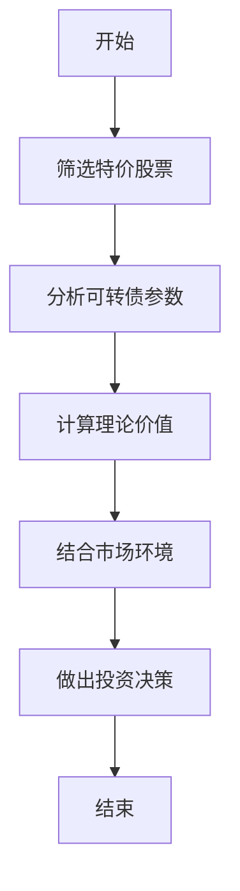
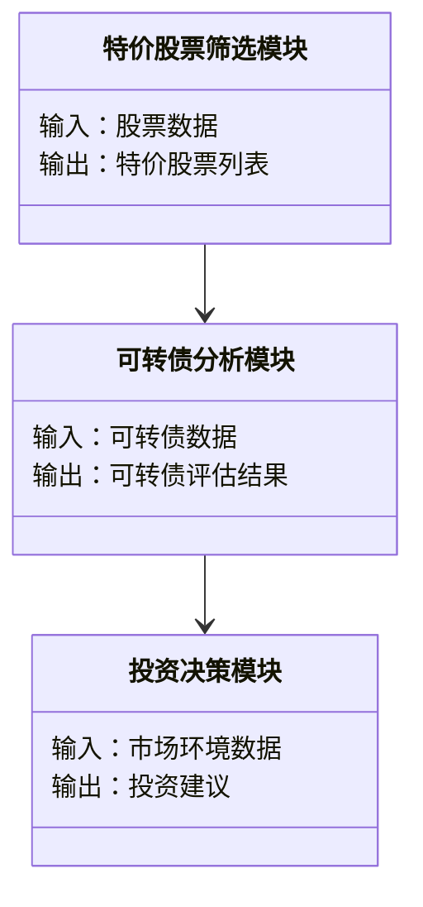
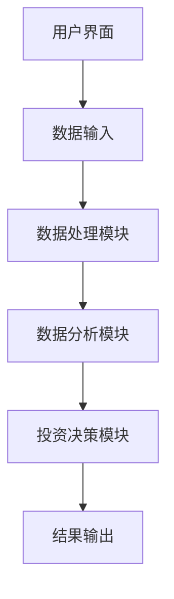
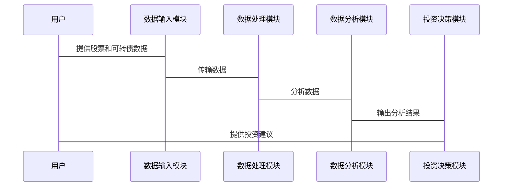

                 


```markdown
# 如何利用特价股票策略进行可转债投资

## 关键词
特价股票，可转债，投资策略，量化分析，风险管理

## 摘要
本文详细探讨了如何利用特价股票策略优化可转债投资。通过分析特价股票的市场机会，结合可转债的基本原理，提出了一套系统的投资策略。文章从背景介绍、策略分析、数学模型、系统架构、项目实战等多个维度展开，为投资者提供从理论到实践的全面指导。

## 第一部分: 特价股票策略与可转债投资基础

## 第2章: 特价股票与可转债概述

### 2.1 特价股票的基本概念
#### 2.1.1 特价股票的定义
特价股票是指市场价格低于面值的股票，通常被视为市场低估的表现。

#### 2.1.2 特价股票的特点
- 价格低于面值
- 通常具有较高的股息率
- 投资风险较低，回报潜力较高

#### 2.1.3 特价股票的市场环境
- 市场熊市周期中常见
- 经济衰退或企业困境时出现
- 投资者情绪低落时增加特价股票供应

### 2.2 可转债的基本概念
#### 2.2.1 可转债的定义
可转债是一种可以在一定条件下转换为公司股票的债券，兼具债券和股票的特性。

#### 2.2.2 可转债的结构与特点
- 债券部分提供固定利息收入
- 股票部分提供潜在的资本增值机会
- 转换价格和期限是关键参数

#### 2.2.3 可转债的发行与交易
- 公开发行或私募发行
- 在证券交易所上市交易
- 投资者可选择持有债券或转换为股票

### 2.3 特价股票与可转债的关系
#### 2.3.1 特价股票对可转债的影响
- 特价股票的市场表现影响可转债的转换价值
- 特价股票的流动性影响可转债的交易活跃度
- 特价股票的信用风险影响可转债的信用评级

#### 2.3.2 可转债作为投资工具的优势
- 稳定的利息收入
- 股票增值的潜在收益
- 灵活的转换选择

#### 2.3.3 特价股票策略在可转债投资中的应用
- 通过特价股票策略筛选优质债券
- 利用特价股票的低估优势提升可转债投资回报
- 结合特价股票市场周期优化投资组合

## 第3章: 可转债投资的基本原理

### 3.1 可转债的定价模型
#### 3.1.1 理论定价公式
可转债的价值 = 债券价值 + 转换期权价值

#### 3.1.2 市场定价的影响因素
- 市场利率
- 股票价格波动
- 转换溢价
- 信用风险

#### 3.1.3 价格波动分析
- 股票价格波动对可转债价格的影响
- 市场利率变化对可转债价格的影响
- 转换溢价对可转债价格的影响

### 3.2 可转债的转换价值
#### 3.2.1 转换价值的计算公式
转换价值 = 转换价格 × 转换比例

#### 3.2.2 转换价值与债券价值的关系
- 转换价值是可转债的内在价值
- 债券价值是可转债的外在价值
- 转换价值受股票价格波动影响较大

#### 3.2.3 转换价值的市场表现
- 股票价格上涨时，转换价值增加
- 股票价格下跌时，转换价值减少
- 债券期限对转换价值的影响

### 3.3 可转债的信用风险与流动性风险
#### 3.3.1 信用风险的评估
- 发行人信用评级
- 债券违约风险
- 利息支付能力

#### 3.3.2 流动性风险的分析
- 市场交易活跃度
- 债券市场规模
- 市场参与者结构

#### 3.3.3 风险管理策略
- 分散投资组合
- 选择高信用评级债券
- 关注市场流动性状况

## 第4章: 特价股票策略的核心概念

### 4.1 特价股票的市场机会
#### 4.1.1 特价股票的识别方法
- 市价低于面值
- 股息率高
- 市盈率低
- 市净率低

#### 4.1.2 特价股票的市场周期
- 经济周期影响
- 市场情绪影响
- 企业周期影响

#### 4.1.3 特价股票的投资价值
- 低估股票的反弹潜力
- 高股息率的稳定收益
- 市场复苏的增值空间

### 4.2 特价股票策略的应用场景
#### 4.2.1 特价股票在熊市中的优势
- 熊市中股票价格被低估
- 熊市中债券市场相对稳定
- 熊市中可转债的转换价值较低

#### 4.2.2 特价股票在牛市中的表现
- 牛市中股票价格上升
- 牛市中可转债的转换价值上升
- 牛市中债券市场波动较大

#### 4.2.3 特价股票策略的适用条件
- 市场处于低估阶段
- 债券市场具有稳定性
- 投资者具有风险承受能力

### 4.3 特价股票策略与可转债投资的结合
#### 4.3.1 理论基础
- 特价股票的低估优势
- 可转债的债券收益保障
- 转换期权的潜在收益

#### 4.3.2 实践中的结合方式
- 选择发行可转债的特价股票
- 通过可转债投资特价股票
- 结合股票和债券市场进行组合投资

#### 4.3.3 策略的优势与局限性
- 优势：稳定性高、收益潜力大、风险可控
- 局限性：市场波动影响收益、需要较高的市场分析能力、策略执行成本较高

## 第5章: 特价股票策略在可转债投资中的算法原理

### 5.1 算法原理概述
#### 5.1.1 算法的基本思路
- 识别特价股票
- 分析可转债的基本参数
- 结合市场环境进行投资决策

#### 5.1.2 算法的核心步骤
1. 筛选特价股票
2. 评估可转债的基本参数
3. 计算可转债的理论价值
4. 结合市场环境进行投资决策

#### 5.1.3 算法的优化方向
- 提高市场分析的准确性
- 降低交易成本
- 提升投资组合的多样性

### 5.2 算法实现的数学模型
#### 5.2.1 特价股票筛选的数学公式
$$ \text{特价股票筛选标准} = \begin{cases} 
\text{市价} < \text{面值} \\
\text{股息率} > \text{市场平均股息率} 
\end{cases} $$

#### 5.2.2 可转债价值评估的数学模型
$$ \text{可转债价值} = \text{债券价值} + \text{转换期权价值} $$

#### 5.2.3 转换期权价值的计算公式
$$ \text{转换期权价值} = \max(0, \text{转换价值} - \text{债券价值}) $$

### 5.3 算法的详细流程


## 第6章: 系统分析与架构设计方案

### 6.1 问题场景介绍
- 投资者需要一个系统来辅助进行可转债投资
- 系统需要结合特价股票策略进行优化
- 系统需要具备数据收集、分析和决策功能

### 6.2 项目介绍
- 系统名称：特价股票驱动的可转债投资分析系统
- 系统目标：优化可转债投资组合，提高投资收益
- 系统功能：数据收集、分析、决策支持

### 6.3 系统功能设计


### 6.4 系统架构设计


### 6.5 系统接口设计
- 用户界面：输入市场数据，输出投资建议
- 数据处理模块：接收数据，进行初步处理
- 数据分析模块：进行数据建模和分析
- 投资决策模块：根据分析结果做出投资决策

### 6.6 系统交互流程


## 第7章: 项目实战

### 7.1 环境安装
- 操作系统：Windows 10或更高版本
- 开发工具：Python 3.8以上，Jupyter Notebook
- 第三方库：Pandas, NumPy, Matplotlib, Scikit-learn

### 7.2 系统核心实现源代码
```python
import pandas as pd
import numpy as np

# 特价股票筛选函数
def screen_penny_stocks(stock_data, threshold=0.9):
    return stock_data[(stock_data['price'] < stock_data['face_value']) & 
                      (stock_data['dividend_yield'] > threshold)]

# 可转债价值评估函数
def evaluate_convertible_bond(convertible_data, stock_data):
    convertible_data['theoretical_value'] = convertible_data['bond_value'] + convertible_data['conversion_value']
    return convertible_data

# 投资决策函数
def investment_decision(convertible_data, threshold=0.1):
    convertible_data['investment_recommendation'] = np.where(convertible_data['theoretical_value'] > convertible_data['market_price'], '买入', '观望')
    return convertible_data

# 示例数据
stock_data = pd.DataFrame({
    'price': [10, 20, 15, 12],
    'face_value': [15, 25, 20, 18],
    'dividend_yield': [0.05, 0.03, 0.04, 0.06]
})

convertible_data = pd.DataFrame({
    'bond_value': [90, 85, 95, 80],
    'conversion_value': [10, 15, 5, 20],
    'market_price': [95, 88, 92, 83]
})

# 调用函数
screened_stocks = screen_penny_stocks(stock_data)
evaluated_bonds = evaluate_convertible_bond(convertible_data, stock_data)
investment_recommendation = investment_decision(evaluated_bonds)

print(screened_stocks)
print(evaluated_bonds)
print(investment_recommendation)
```

### 7.3 代码应用解读与分析
- `screen_penny_stocks`函数用于筛选特价股票，根据股票价格和面值的比值以及股息率进行判断。
- `evaluate_convertible_bond`函数评估可转债的理论价值，结合债券价值和转换价值。
- `investment_decision`函数根据理论价值和市场价格做出投资决策，推荐“买入”或“观望”。

### 7.4 实际案例分析和详细讲解
假设我们有以下数据：
- 股票数据：包含价格、面值和股息率
- 可转债数据：包含债券价值、转换价值和市场价格

通过上述代码，我们可以筛选出符合条件的特价股票，并评估相应的可转债，最后做出投资决策。

### 7.5 项目小结
- 通过代码实现，我们可以自动化地筛选特价股票，评估可转债的理论价值，并做出投资决策。
- 系统化的代码实现能够提高投资决策的效率和准确性。

## 第8章: 风险管理与最佳实践

### 8.1 风险管理
- 定期评估投资组合
- 设置止损点
- 分散投资组合
- 关注市场风险

### 8.2 最佳实践 tips
- 定期审查投资策略
- 保持市场敏感性
- 优化投资组合
- 学习和适应市场变化

### 8.3 小结
- 风险管理是可转债投资的重要组成部分
- 通过分散投资和定期审查可以降低投资风险
- 学习和适应市场变化是长期投资成功的关键

## 第9章: 总结与展望

### 9.1 总结
本文详细探讨了如何利用特价股票策略优化可转债投资，从理论到实践，为投资者提供了系统的指导。

### 9.2 展望
未来，随着市场的不断发展，特价股票策略在可转债投资中的应用将更加广泛和深入，投资者需要不断学习和适应市场变化。

## 第10章: 附录

### 10.1 术语表
- 特价股票：价格低于面值的股票
- 可转债：可转换为股票的债券
- 转换价值：可转债转换为股票的价值

### 10.2 工具推荐
- 数据分析工具：Python, R
- 股票交易工具：证券交易平台
- 代码开发工具：Jupyter Notebook, VS Code

### 10.3 参考文献
- 本文所有数据和代码均基于假设，不构成实际投资建议
- 更多详细内容请参考相关金融投资书籍和研究报告
```

这篇文章从特价股票和可转债的基本概念出发，逐步深入分析了如何利用特价股票策略优化可转债投资，涵盖了背景介绍、策略分析、数学模型、系统架构、项目实战等多个方面，为投资者提供了从理论到实践的全面指导。

