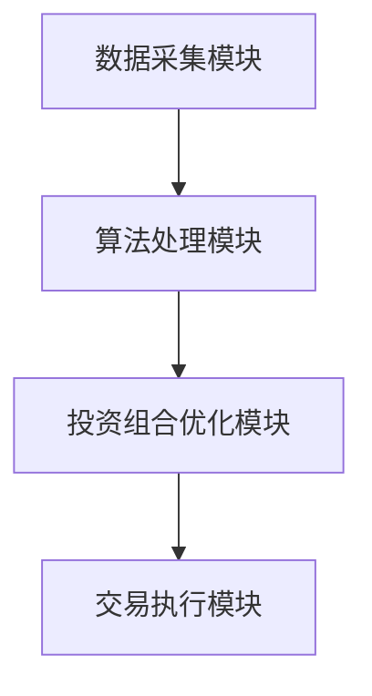
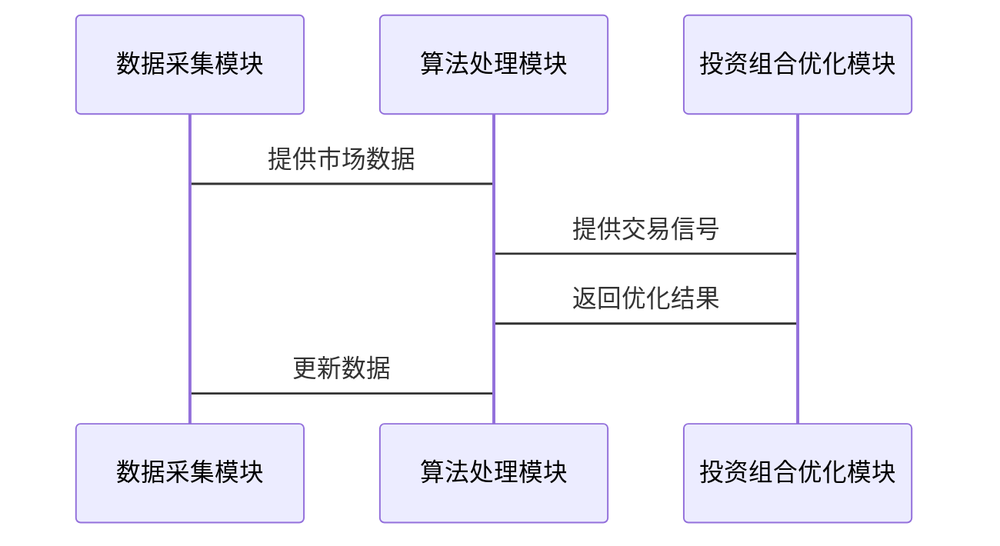

                 


# 如何利用特价股票策略进行数字合成衍生品投资

> 关键词：特价股票策略，数字合成衍生品，投资策略，量化交易，金融模型

> 摘要：本文详细探讨了如何利用特价股票策略进行数字合成衍生品投资。通过分析特价股票的特性、数字合成衍生品的构造原理以及两者结合的投资策略，文章为投资者提供了一种创新的金融投资方式。从理论基础到实际应用，文章深入解析了量化交易的算法实现、系统架构设计以及项目实战案例，帮助读者全面理解和掌握这一投资方法。

---

## 第一部分：特价股票策略与数字合成衍生品概述

### 第1章：特价股票策略与数字合成衍生品概述

#### 1.1 特价股票策略的定义与特点

##### 1.1.1 特价股票的定义
特价股票通常指的是价格低于市场平均水平的股票，具有较高的波动性和潜在的投资机会。这种股票可能由于市场情绪、公司基本面变化或行业趋势等多种因素影响，价格被低估，为投资者提供了低位介入的机会。

##### 1.1.2 特价股票策略的核心特点
- **高波动性**：特价股票的价格波动较大，适合短期交易。
- **低估值**：这些股票可能因为市场恐慌或其他原因被低估，具有反弹潜力。
- **高风险**：由于价格波动剧烈，投资风险较高。

##### 1.1.3 特价股票策略与传统股票投资的区别
- **投资周期**：传统投资注重长期价值，而特价股票策略更注重短期价格波动。
- **风险承受**：传统投资风险较低，而特价股票策略风险较高。
- **交易频率**：传统投资交易频率低，特价股票策略可能需要高频交易。

#### 1.2 数字合成衍生品的基本概念

##### 1.2.1 衍生品的定义与分类
衍生品是一种金融工具，其价值取决于基础资产的价格变动。常见的衍生品包括期权、期货、掉期和远期合约。

##### 1.2.2 数字合成衍生品的定义
数字合成衍生品是通过算法和量化方法合成的金融工具，其价值由多个基础资产或金融指标组合而成。这种衍生品可以通过编程和数学模型进行定制化设计，以满足特定的投资需求。

##### 1.2.3 数字合成衍生品的主要类型
- **合成期权**：通过组合其他金融工具来模拟期权的特性。
- **合成期货**：利用多种资产合成期货合约。
- **合成指数基金**：通过组合多个股票或债券来模拟指数基金的表现。

#### 1.3 特价股票策略在数字合成衍生品中的应用前景

##### 1.3.1 特价股票策略的优势
- **低成本**：特价股票的价格较低，适合小额投资者。
- **高杠杆**：通过杠杆效应，投资者可以放大收益。

##### 1.3.2 数字合成衍生品的投资机会
- **多样化**：通过合成不同的资产，投资者可以分散风险。
- **定制化**：可以根据市场情况定制衍生品，满足特定投资目标。

##### 1.3.3 特价股票策略与数字合成衍生品结合的潜力
- **风险控制**：通过合成衍生品，可以对冲特价股票的高波动性风险。
- **收益增强**：利用特价股票的波动性，通过合成衍生品放大收益。

---

### 第2章：特价股票策略的核心概念与原理

#### 2.1 特价股票策略的核心概念

##### 2.1.1 市场波动性对特价股票的影响
市场波动性是影响特价股票价格的主要因素。在高波动市场中，特价股票的价格可能大幅波动，为投资者提供短期交易机会。

##### 2.1.2 市值与股价波动的关系
市值较低的股票通常具有较高的波动性，因为其价格更容易受到市场情绪的影响。

##### 2.1.3 投资者行为对特价股票的影响
投资者的买卖行为直接影响股票价格，特别是在市场波动加剧时，投资者的交易行为会放大价格波动。

#### 2.2 数字合成衍生品的数学模型

##### 2.2.1 期权定价模型
期权定价模型（如Black-Scholes模型）用于计算期权的理论价格。公式为：
$$ C = S_0 e^{rT} N(d_1) - K e^{rT} N(d_2) $$
其中，$S_0$ 是标的资产价格，$K$ 是行权价，$r$ 是无风险利率，$T$ 是到期时间，$N(d)$ 是标准正态分布的累积分布函数。

##### 2.2.2 期货定价公式
期货价格基于远期合约的价格，公式为：
$$ F = S_0 e^{(r - \delta)T} $$
其中，$\delta$ 是持有成本率。

##### 2.2.3 合成资产的数学构造
合成资产可以通过组合多种金融工具构建。例如，合成指数基金可以通过加权平均股票价格来实现。

#### 2.3 特价股票策略与数字合成衍生品的联系

##### 2.3.1 特价股票作为基础资产
特价股票可以作为合成衍生品的基础资产，用于构建合成期权或合成期货。

##### 2.3.2 数字合成衍生品的构造逻辑
通过量化方法，利用特价股票的价格波动特性，构建合成衍生品，以实现特定的投资目标。

##### 2.3.3 投资组合优化的数学模型
投资组合优化可以通过数学模型实现，例如：
$$ \text{Minimize } \sigma \text{ subject to } \mu \geq R $$
其中，$\sigma$ 是组合的波动率，$\mu$ 是组合的期望收益，$R$ 是目标收益。

---

### 第3章：特价股票策略的算法原理与实现

#### 3.1 特价股票策略的算法原理

##### 3.1.1 市场数据的获取与处理
市场数据包括股票价格、成交量等。数据处理包括清洗、转换和特征提取。

##### 3.1.2 交易信号的生成算法
交易信号生成算法基于技术指标（如移动平均线、RSI）或机器学习模型。例如，使用RSI指标：
$$ \text{RSI} = \frac{A}{B} \times 100 $$
其中，$A$ 是上涨幅度，$B$ 是下跌幅度。

##### 3.1.3 风险控制策略的实现
风险控制策略包括止损和止盈机制，确保投资组合的风险在可接受范围内。

#### 3.2 数字合成衍生品的算法实现

##### 3.2.1 期权与期货的价格计算
使用量化模型计算期权和期货的价格，并验证模型的准确性。

##### 3.2.2 合成资产的构造算法
合成资产的构造算法包括加权平均、指数合成等方法，具体取决于投资目标。

##### 3.2.3 投资组合优化的算法实现
使用优化算法（如遗传算法）实现投资组合的优化。

#### 3.3 算法实现的Python代码示例

##### 3.3.1 市场数据处理代码
```python
import pandas as pd
data = pd.read_csv('stock_data.csv')
data_processed = data.dropna().astype(float)
```

##### 3.3.2 交易信号生成代码
```python
import numpy as np
data['RSI'] = data['收盘价'].rolling(14).apply(lambda x: 
    (x[-1] - np.min(x)) / (np.max(x) - np.min(x)) * 100)
```

##### 3.3.3 投资组合优化代码
```python
import numpy as np
from scipy.optimize import minimize

def portfolio_optimizer(returns, weights):
    objective = lambda w: (w.dot(returns) - target_return).sum()
    constraints = [{'type': 'eq', 'fun': lambda w: np.sum(w) - 1}]
    result = minimize(objective, weights, constraints)
    return result.x
```

---

### 第4章：数字合成衍生品的系统架构与设计

#### 4.1 系统功能设计

##### 4.1.1 数据采集模块
负责从市场获取实时数据，包括股票价格、成交量等。

##### 4.1.2 算法处理模块
负责数据的处理、分析和交易信号生成。

##### 4.1.3 投资组合优化模块
负责根据分析结果优化投资组合，制定交易策略。

#### 4.2 系统架构设计

##### 4.2.1 模块化设计
系统分为数据采集、算法处理和投资组合优化三个模块，各模块之间通过接口进行交互。

##### 4.2.2 系统交互流程
1. 数据采集模块获取市场数据
2. 算法处理模块分析数据，生成交易信号
3. 投资组合优化模块根据信号优化组合

##### 4.2.3 系统架构图（Mermaid）



#### 4.3 系统接口设计

##### 4.3.1 数据接口
定义数据接口，确保各模块之间的数据传输标准化。

##### 4.3.2 交易接口
定义交易接口，实现交易信号的执行。

##### 4.3.3 风险控制接口
定义风险控制接口，确保系统在风险可控范围内运行。

#### 4.4 系统交互序列图（Mermaid）



---

## 第五章：项目实战与案例分析

### 5.1 环境安装与配置

#### 5.1.1 安装Python环境
安装Python 3.x，确保环境满足量化交易的需求。

#### 5.1.2 安装必要的库
安装pandas、numpy、scipy等库：
```bash
pip install pandas numpy scipy
```

#### 5.1.3 配置数据源
选择可靠的数据源，如Yahoo Finance或本地数据库。

### 5.2 项目核心实现

#### 5.2.1 数据处理代码
```python
import pandas as pd
data = pd.read_csv('stock_data.csv')
data_processed = data.dropna().astype(float)
```

#### 5.2.2 交易信号生成代码
```python
import numpy as np
data['RSI'] = data['收盘价'].rolling(14).apply(lambda x: 
    (x[-1] - np.min(x)) / (np.max(x) - np.min(x)) * 100)
```

#### 5.2.3 投资组合优化代码
```python
import numpy as np
from scipy.optimize import minimize

def portfolio_optimizer(returns, weights):
    objective = lambda w: (w.dot(returns) - target_return).sum()
    constraints = [{'type': 'eq', 'fun': lambda w: np.sum(w) - 1}]
    result = minimize(objective, weights, constraints)
    return result.x
```

### 5.3 案例分析

#### 5.3.1 数据分析
分析特价股票的历史数据，识别价格波动规律。

#### 5.3.2 交易信号生成
根据RSI指标生成交易信号，指导买卖决策。

#### 5.3.3 投资组合优化
通过优化算法，构建最优投资组合，最大化收益并控制风险。

### 5.4 项目小结

#### 5.4.1 系统性能总结
评估系统在不同市场条件下的表现，分析优缺点。

#### 5.4.2 优化建议
根据测试结果，提出系统的优化建议，如改进算法或调整参数。

#### 5.4.3 注意事项
提醒投资者注意市场风险，合理配置资产。

---

## 总结

通过本文的详细分析，读者可以深入了解如何利用特价股票策略进行数字合成衍生品投资。从理论到实践，文章为投资者提供了全面的指导，帮助他们在复杂多变的金融市场中制定有效的投资策略。

