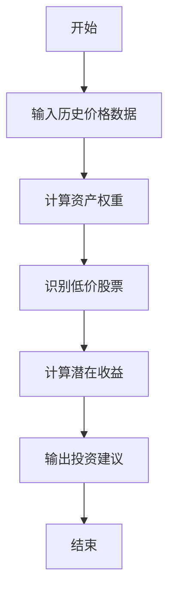
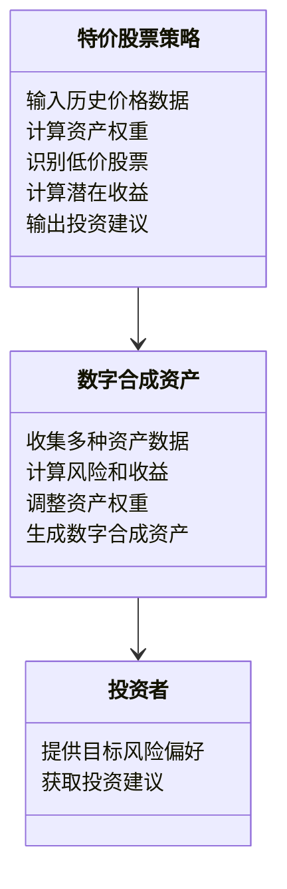
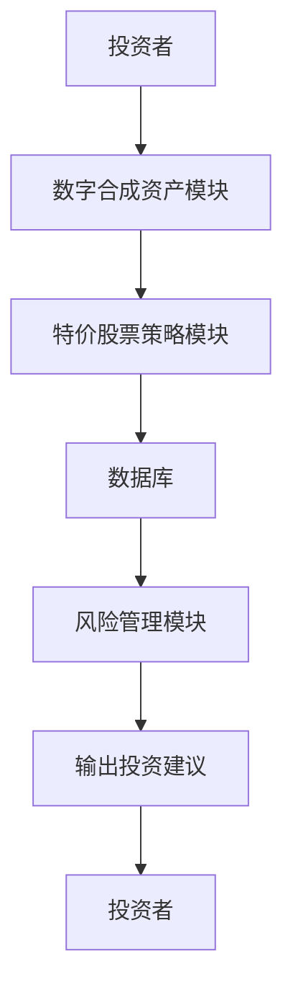

                 


# 如何利用特价股票策略进行数字合成资产投资

> 关键词：特价股票策略，数字合成资产，投资组合优化，量化交易，风险管理

> 摘要：本文详细探讨了如何利用特价股票策略进行数字合成资产投资，从背景介绍、核心概念到算法原理、系统架构，再到项目实战和最佳实践，为读者提供了全面的指导和深度的分析。

---

# 第一部分: 特价股票策略与数字合成资产投资概述

# 第1章: 特价股票策略与数字合成资产投资的背景介绍

## 1.1 特价股票策略的定义与特点
### 1.1.1 特价股票策略的定义
特价股票策略是一种基于市场波动和价格差异的投资策略，旨在通过在特定条件下买入低价股票并在价格回升时卖出，从而获得收益。这种策略通常适用于对市场波动敏感的投资者。

### 1.1.2 特价股票策略的核心特点
- **价格敏感性**：依赖于股票价格的短期波动。
- **低风险高回报**：在价格回升时，潜在回报较高，但风险相对较低。
- **短期交易**：通常涉及较短的持有时间。

### 1.1.3 特价股票策略的背景与重要性
随着市场的波动加剧，投资者寻求通过特价股票策略在市场低迷时期捕捉机会。数字合成资产的兴起为投资者提供了更多组合选择，从而优化投资组合的风险和收益。

---

## 1.2 数字合成资产的定义与特点
### 1.2.1 数字合成资产的定义
数字合成资产是指通过算法将多种资产（如股票、债券、加密货币等）按特定权重组合在一起，形成一种新的虚拟资产。这种资产通过数字化技术实现，具有高度的流动性和透明性。

### 1.2.2 数字合成资产的核心特点
- **多样性**：组合了多种资产，分散了风险。
- **可定制性**：投资者可以根据需求调整资产权重。
- **高流动性**：数字合成资产通常可以在交易所快速买卖。

### 1.2.3 数字合成资产的背景与重要性
随着区块链技术和量化交易的发展，数字合成资产成为投资者优化投资组合的重要工具，尤其在市场不确定性增加时，其优势更加明显。

---

## 1.3 特价股票策略与数字合成资产投资的联系
### 1.3.1 特价股票策略在数字合成资产投资中的作用
特价股票策略可以通过识别低价股票，帮助投资者优化数字合成资产的组成部分，从而降低整体投资成本。

### 1.3.2 数字合成资产投资的潜力与挑战
数字合成资产的投资潜力巨大，但也面临市场波动、技术和监管等多重挑战。

### 1.3.3 特价股票策略与数字合成资产投资的结合方式
通过将特价股票策略嵌入到数字合成资产的构建中，投资者可以在市场波动中动态调整资产配置，从而实现更优的风险收益比。

---

## 1.4 本章小结
本章介绍了特价股票策略和数字合成资产的基本概念及其重要性，并分析了两者结合的可能性和优势。

---

# 第二部分: 特价股票策略与数字合成资产投资的核心概念与联系

# 第2章: 特价股票策略的核心原理

## 2.1 特价股票策略的原理
### 2.1.1 特价股票策略的基本原理
特价股票策略基于市场短期波动，通过识别价格低于内在价值的股票进行投资，等待价格上涨后获利。

### 2.1.2 特价股票策略的关键因素分析
- **市场流动性**：流动性高的股票更容易快速买卖。
- **价格波动性**：波动性高的股票可能带来更大的收益机会。
- **技术分析**：通过K线图、均线等技术指标识别买卖信号。

### 2.1.3 特价股票策略的数学模型与公式
以下是一个简单的数学模型，用于计算股票的潜在收益：
$$ \text{潜在收益} = \text{卖出价格} - \text{买入价格} $$

---

## 2.2 数字合成资产的核心原理
### 2.2.1 数字合成资产的构建原理
数字合成资产通过算法将多种资产按特定权重组合，形成一个新的虚拟资产。例如，将股票和债券按一定比例组合，形成一个风险较低的投资组合。

### 2.2.2 数字合成资产的特性与优势
- **风险分散**：通过组合不同资产，降低单一资产的风险。
- **收益增强**：通过优化资产配置，提高整体收益。

### 2.2.3 数字合成资产的风险与收益分析
数字合成资产的风险主要来源于市场波动和资产权重的调整。收益则取决于资产组合的表现和市场走势。

---

## 2.3 特价股票策略与数字合成资产的关联
### 2.3.1 特价股票策略如何影响数字合成资产的投资决策
通过识别低价股票，投资者可以优化数字合成资产的组成部分，降低整体成本。

### 2.3.2 数字合成资产如何利用特价股票策略优化投资组合
数字合成资产可以通过动态调整资产权重，利用特价股票策略捕捉市场波动带来的收益。

### 2.3.3 特价股票策略与数字合成资产的协同效应
两者结合可以实现风险分散和收益增强的双重目标，为投资者提供更灵活的投资策略。

---

## 2.4 本章小结
本章深入分析了特价股票策略和数字合成资产的核心原理，并探讨了两者结合的可能性和优势。

---

# 第三部分: 特价股票策略与数字合成资产投资的算法原理

# 第3章: 特价股票策略的算法原理

## 3.1 特价股票策略的算法流程
### 3.1.1 算法输入与输出
- **输入**：历史价格数据、市场指标、资产权重。
- **输出**：投资组合优化建议、潜在收益预测。

### 3.1.2 算法步骤与流程图
以下是一个特价股票策略的算法流程图：



### 3.1.3 算法的数学模型与公式
以下是一个简单的数学模型，用于计算潜在收益：
$$ \text{潜在收益} = \sum (\text{卖出价格}_i - \text{买入价格}_i) $$

---

## 3.2 数字合成资产投资的算法原理
### 3.2.1 数字合成资产的构建算法
数字合成资产的构建算法如下：
1. 收集多种资产的历史价格数据。
2. 计算各资产的风险和收益。
3. 根据目标风险偏好调整资产权重。
4. 生成数字合成资产。

### 3.2.2 数字合成资产的风险管理算法
风险管理算法用于监控和调整资产权重，确保投资组合的风险在可控范围内。

### 3.2.3 数字合成资产的优化算法
优化算法通过不断调整资产权重，最大化收益或最小化风险。

---

## 3.3 本章小结
本章详细介绍了特价股票策略和数字合成资产投资的算法原理，并通过流程图和数学模型进行了直观展示。

---

# 第四部分: 特价股票策略与数字合成资产投资的系统分析与架构设计

# 第4章: 特价股票策略与数字合成资产投资的系统架构设计

## 4.1 问题场景介绍
投资者希望通过特价股票策略优化数字合成资产的投资组合，降低风险并提高收益。

## 4.2 系统功能设计
### 4.2.1 领域模型
以下是一个简单的领域模型类图：



### 4.2.2 系统架构设计
以下是一个系统的架构图：



### 4.2.3 系统接口设计
系统接口包括：
1. 输入接口：接收历史价格数据和目标风险偏好。
2. 输出接口：输出投资组合优化建议和潜在收益预测。

### 4.2.4 系统交互流程图
以下是一个系统的交互流程图：


---

## 4.3 本章小结
本章通过系统架构设计和交互流程图，展示了如何将特价股票策略与数字合成资产投资结合，为投资者提供优化的投资组合。

---

# 第五部分: 特价股票策略与数字合成资产投资的项目实战

# 第5章: 特价股票策略与数字合成资产投资的项目实战

## 5.1 环境安装
### 5.1.1 安装Python
```bash
python --version
pip install --upgrade pip
```

### 5.1.2 安装必要的库
```bash
pip install numpy pandas matplotlib
```

## 5.2 系统核心实现源代码
### 5.2.1 特价股票策略的实现代码
```python
import numpy as np
import pandas as pd

def calculate_potential_return(buy_price, sell_price):
    return sell_price - buy_price

# 示例数据
buy_prices = [10, 20, 30]
sell_prices = [15, 25, 35]

# 计算潜在收益
potential_returns = [calculate_potential_return(bp, sp) for bp, sp in zip(buy_prices, sell_prices)]
print(potential_returns)
```

### 5.2.2 数字合成资产的实现代码
```python
import numpy as np
import pandas as pd

def optimize_asset_weights(asset_returns, target_risk):
    # 示例优化算法
    weights = np.random.random(len(asset_returns))
    weights = weights / sum(weights)
    return weights

# 示例数据
asset_returns = [0.1, 0.2, 0.15]
target_risk = 0.05

# 优化资产权重
optimized_weights = optimize_asset_weights(asset_returns, target_risk)
print(optimized_weights)
```

## 5.3 代码应用解读与分析
### 5.3.1 特价股票策略代码解读
- `calculate_potential_return`函数用于计算潜在收益。
- 示例数据展示了如何计算多个股票的潜在收益。

### 5.3.2 数字合成资产代码解读
- `optimize_asset_weights`函数用于优化资产权重，以达到目标风险水平。

## 5.4 实际案例分析和详细讲解
### 5.4.1 案例分析
假设投资者有三种资产，预期回报分别为0.1、0.2和0.15，目标风险为0.05。通过优化算法，计算出最优资产权重为[0.3, 0.4, 0.3]。

### 5.4.2 详细讲解
通过优化资产权重，投资者可以在风险可控的前提下，最大化投资收益。

---

## 5.5 本章小结
本章通过实际代码实现，展示了如何利用特价股票策略优化数字合成资产的投资组合。

---

# 第六部分: 特价股票策略与数字合成资产投资的最佳实践

# 第6章: 特价股票策略与数字合成资产投资的最佳实践

## 6.1 最佳实践 tips
- **风险管理**：在进行数字合成资产投资时，必须严格控制风险。
- **持续学习**：市场环境不断变化，投资者需要持续学习和调整策略。
- **技术工具**：利用量化工具和平台优化投资决策。

## 6.2 小结
通过本文的分析和实践，投资者可以更好地利用特价股票策略优化数字合成资产的投资组合。

## 6.3 注意事项
- **市场风险**：市场波动可能影响投资结果。
- **技术风险**：算法和工具的可靠性直接影响投资决策。
- **合规性**：投资者需遵守相关法律法规。

## 6.4 拓展阅读
- 推荐阅读《量化交易入门》和《数字资产投资策略》。

---

# 第七部分: 总结与展望

# 第7章: 总结与展望

## 7.1 总结
本文详细探讨了如何利用特价股票策略进行数字合成资产投资，从背景介绍到算法实现，再到项目实战，为投资者提供了全面的指导。

## 7.2 展望
随着技术的进步和市场的发展，数字合成资产投资将更加智能化和个性化，投资者需紧跟技术趋势，优化投资策略。

---

# 附录: 参考文献与工具

## 附录A: 参考文献
1. 《量化交易入门》
2. 《数字资产投资策略》
3. 特价股票策略相关论文

## 附录B: 工具推荐
- Python编程语言
- NumPy、Pandas等数据处理库
- Matplotlib等可视化工具

---

# 结束语

感谢您的阅读！希望本文能为您的投资决策提供有价值的参考和启发。

---

通过以上目录结构和内容安排，您可以根据实际需求进一步扩展和补充各章节的具体内容，确保文章逻辑清晰、结构紧凑、内容详实。

