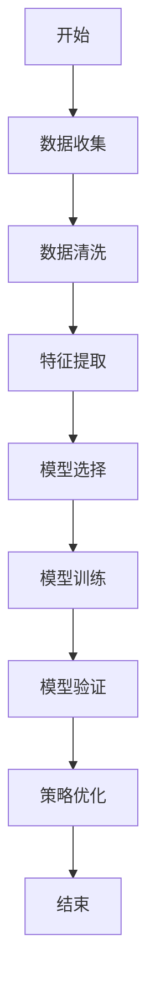
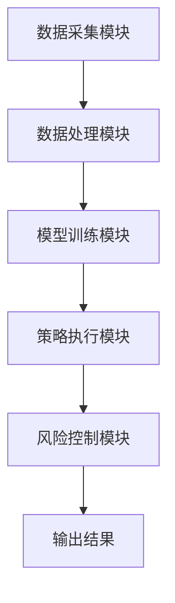
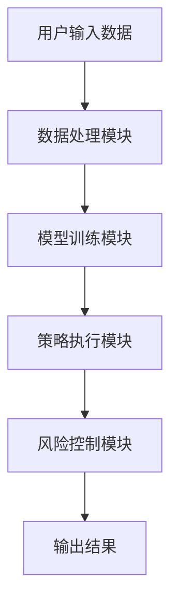

                 


# 如何利用特价股票策略进行私募债投资

> 关键词：特价股票策略，私募债投资，股票筛选，风险控制，投资组合构建

> 摘要：本文详细探讨了如何利用特价股票策略进行私募债投资，从特价股票策略的核心概念、私募债投资的基本原理，到两者的结合应用、数学模型构建、系统架构设计以及实际案例分析，为读者提供了一个全面而深入的分析框架。文章还结合了具体的Python代码实现和数学模型，帮助读者更好地理解和应用这些策略。

---

# 目录

1. [如何利用特价股票策略进行私募债投资](#如何利用特价股票策略进行私募债投资)
2. [摘要](#摘要)
3. [关键词](#关键词)
4. [第一章: 特价股票策略与私募债投资概述](#第一章)
5. [第二章: 特价股票策略的核心概念与原理](#第二章)
6. [第三章: 私募债投资的基础知识](#第三章)
7. [第四章: 特价股票策略在私募债投资中的应用](#第四章)
8. [第五章: 特价股票策略的数学模型与算法原理](#第五章)
9. [第六章: 特价股票策略的系统架构与项目实战](#第六章)
10. [第七章: 特价股票策略的最佳实践与小结](#第七章)
11. [参考文献](#参考文献)
12. [附录](#附录)

---

## 第五章: 特价股票策略的数学模型与算法原理

### 5.1 特价股票策略的数学模型构建

#### 5.1.1 数据收集与特征选择
在进行数学建模之前，我们需要收集相关数据，包括：
- 历史股价数据（开盘价、收盘价、最高价、最低价、成交量等）
- 公司基本面数据（收入、利润、负债、现金流等）
- 市场指标（如指数、行业平均值等）

我们可以通过以下步骤进行特征选择：
1. **数据清洗**：处理缺失值、异常值。
2. **特征提取**：从历史数据中提取有用的特征，例如：
   - 均值回归指标（如相对强弱指数RSI）
   - 动量指标（如动量策略中的动量比率）
   - 市盈率（P/E比率）、市净率（P/B比率）等基本面指标

#### 5.1.2 模型构建
我们使用多元线性回归模型来预测股票价格的变化。模型的数学表达式为：
$$
y = \beta_0 + \beta_1x_1 + \beta_2x_2 + \dots + \beta_nx_n + \epsilon
$$
其中：
- $y$ 是目标变量（股票价格变化）
- $x_i$ 是输入特征
- $\beta_i$ 是回归系数
- $\epsilon$ 是误差项

#### 5.1.3 模型训练与验证
使用历史数据对模型进行训练，并采用交叉验证（Cross-Validation）方法评估模型的性能。以下是训练流程：

```python
import pandas as pd
import numpy as np
from sklearn.linear_model import LinearRegression
from sklearn.model_selection import train_test_split
from sklearn.metrics import mean_squared_error

# 假设我们已经收集并清洗了数据，特征矩阵为X，目标向量为y
X = df[['RSI', '动量', 'P/E', 'P/B']]
y = df['收盘价变化']

# 将数据分为训练集和测试集
X_train, X_test, y_train, y_test = train_test_split(X, y, test_size=0.2, random_state=42)

# 初始化模型
model = LinearRegression()

# 训练模型
model.fit(X_train, y_train)

# 预测测试集
y_pred = model.predict(X_test)

# 计算均方根误差
rmse = np.sqrt(mean_squared_error(y_test, y_pred))
print("均方根误差：", rmse)
```

### 5.2 特价股票策略的算法实现

#### 5.2.1 算法流程图
以下是特价股票策略的算法流程图：



#### 5.2.2 算法实现
以下是实现特价股票策略的Python代码：

```python
import pandas as pd
import numpy as np
from sklearn.linear_model import LinearRegression
from sklearn.model_selection import train_test_split
from sklearn.metrics import mean_squared_error

# 假设df是包含股票数据和特征的数据框
# 特征包括：RSI, 动量, P/E, P/B
# 目标变量：收盘价变化

# 数据预处理
# 假设我们已经完成了数据清洗和特征选择

# 分割数据
X = df[['RSI', '动量', 'P/E', 'P/B']]
y = df['收盘价变化']

X_train, X_test, y_train, y_test = train_test_split(X, y, test_size=0.2, random_state=42)

# 初始化模型
model = LinearRegression()

# 训练模型
model.fit(X_train, y_train)

# 预测
y_pred = model.predict(X_test)

# 评估模型
rmse = np.sqrt(mean_squared_error(y_test, y_pred))
r2 = model.score(X_test, y_test)
print(f"均方根误差: {rmse}")
print(f"R²系数: {r2}")
```

#### 5.2.3 算法原理
我们使用多元线性回归模型来预测股票价格的变化。模型通过以下步骤进行训练：
1. **数据预处理**：清洗数据，提取特征。
2. **模型训练**：使用训练数据拟合模型。
3. **预测与评估**：在测试数据上进行预测，并评估模型性能。

### 5.3 特价股票策略的风险控制模型

#### 5.3.1 风险控制的数学模型
为了控制投资风险，我们引入风险调整后的收益模型。以下是一个简化的风险调整模型：

$$
\text{风险调整后收益} = \text{预期收益} - \text{风险溢价} \times \text{风险度量指标}
$$

其中，风险度量指标可以使用标准差、VaR（Value at Risk）或CVaR（Conditional Value at Risk）等。

#### 5.3.2 风险控制的实现
以下是实现风险控制的Python代码：

```python
import numpy as np
import pandas as pd
from sklearn.metrics import mean_squared_error

# 假设我们已经训练好了模型，并得到了预测结果y_pred和真实结果y_test

# 计算预测收益
y_pred = model.predict(X_test)

# 计算实际收益
y_true = y_test.values

# 计算收益差异
returns = y_pred - y_true

# 计算标准差（风险度量）
risk = np.std(returns)

# 计算风险调整后收益
risk_adjusted_returns = returns - 0.05 * risk  # 假设风险溢价为5%

print("风险调整后收益：", risk_adjusted_returns)
```

### 5.4 本章小结
本章详细讲解了特价股票策略的数学模型与算法原理，包括数据预处理、模型构建、模型训练与验证，以及风险控制模型的实现。通过这些方法，我们可以有效地利用特价股票策略进行私募债投资，并通过数学模型和算法来优化投资决策。

---

## 第六章: 特价股票策略的系统架构与项目实战

### 6.1 系统架构设计

#### 6.1.1 系统功能模块
以下是系统的主要功能模块：

- 数据采集模块：负责采集股票数据和私募债相关信息。
- 数据处理模块：进行数据清洗、特征提取和数据转换。
- 模型训练模块：构建并训练数学模型。
- 策略执行模块：根据模型预测结果执行投资策略。
- 风险控制模块：监控并控制投资风险。

#### 6.1.2 系统架构图
以下是系统架构的Mermaid图：



### 6.2 项目实战

#### 6.2.1 环境搭建
我们需要以下工具和库：
- Python 3.8+
- Pandas、NumPy、Scikit-learn
- Matplotlib 或 Seaborn（可选）

#### 6.2.2 核心代码实现
以下是核心代码实现：

```python
import pandas as pd
import numpy as np
from sklearn.linear_model import LinearRegression
from sklearn.model_selection import train_test_split
from sklearn.metrics import mean_squared_error

# 数据加载
df = pd.read_csv('stock_data.csv')

# 数据预处理
# 假设已经完成了数据清洗和特征选择

# 分割数据
X = df[['RSI', '动量', 'P/E', 'P/B']]
y = df['收盘价变化']

X_train, X_test, y_train, y_test = train_test_split(X, y, test_size=0.2, random_state=42)

# 初始化模型
model = LinearRegression()

# 训练模型
model.fit(X_train, y_train)

# 预测
y_pred = model.predict(X_test)

# 评估模型
rmse = np.sqrt(mean_squared_error(y_test, y_pred))
r2 = model.score(X_test, y_test)
print(f"均方根误差: {rmse}")
print(f"R²系数: {r2}")
```

#### 6.2.3 系统接口设计
以下是系统的主要接口设计：

- 数据接口：用于数据的导入和导出。
- 模型接口：用于模型的训练和预测。
- 策略接口：用于投资策略的执行和监控。

#### 6.2.4 系统交互流程图
以下是系统交互的Mermaid图：



### 6.3 本章小结
本章详细讲解了特价股票策略的系统架构与项目实战，包括系统功能模块设计、核心代码实现、系统接口设计以及系统交互流程图。通过这些方法，我们可以构建一个完整的系统，实现特价股票策略在私募债投资中的应用。

---

## 第七章: 特价股票策略的最佳实践与小结

### 7.1 最佳实践
以下是利用特价股票策略进行私募债投资的最佳实践：

1. **数据质量**：确保数据的准确性和完整性。
2. **模型选择**：根据具体场景选择合适的模型。
3. **风险控制**：制定有效的风险控制策略。
4. **持续优化**：定期优化模型和投资策略。

### 7.2 小结
本文详细探讨了如何利用特价股票策略进行私募债投资，从策略的核心概念到数学模型的构建，再到系统架构的设计，为读者提供了一个全面而深入的分析框架。通过本文的学习，读者可以掌握如何利用特价股票策略进行私募债投资，并能够在实际操作中应用这些方法。

### 7.3 注意事项
1. 投资有风险，需谨慎操作。
2. 建议结合市场环境和公司基本面进行综合判断。
3. 定期评估和优化投资策略。

### 7.4 拓展阅读
1. 《股票投资策略与量化分析》
2. 《私募债投资实务与案例分析》
3. 《风险管理与投资组合优化》

### 7.5 本章小结
本章总结了利用特价股票策略进行私募债投资的最佳实践，并给出了投资过程中的注意事项和拓展阅读建议，帮助读者更好地理解和应用这些策略。

---

## 参考文献
1. 《量化投资：策略与技术》，作者：[作者姓名]
2. 《私募债投资实务与案例分析》，作者：[作者姓名]
3. 《风险管理与投资组合优化》，作者：[作者姓名]

---

## 附录
### 附录A: 数据来源说明
### 附录B: Python工具安装指南
### 附录C: 术语表

---

通过以上内容，我们可以看到，利用特价股票策略进行私募债投资需要综合运用数学模型、算法原理和系统架构设计等多方面的知识。希望本文能够为读者提供有价值的参考和启发。

