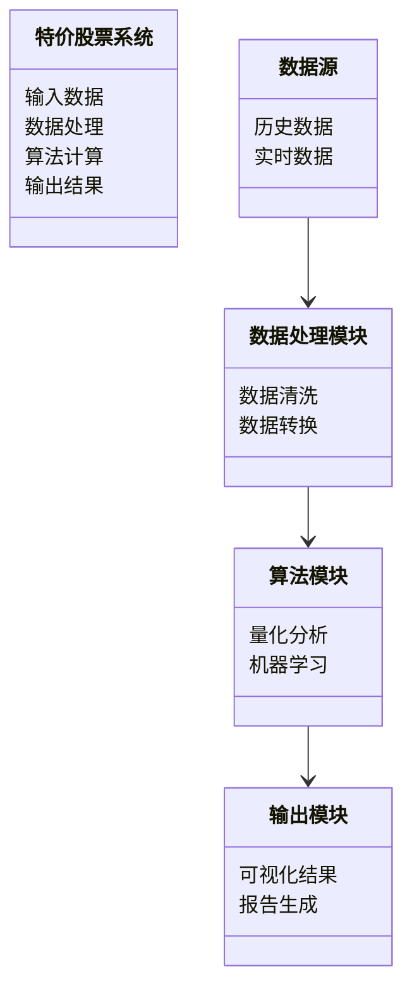
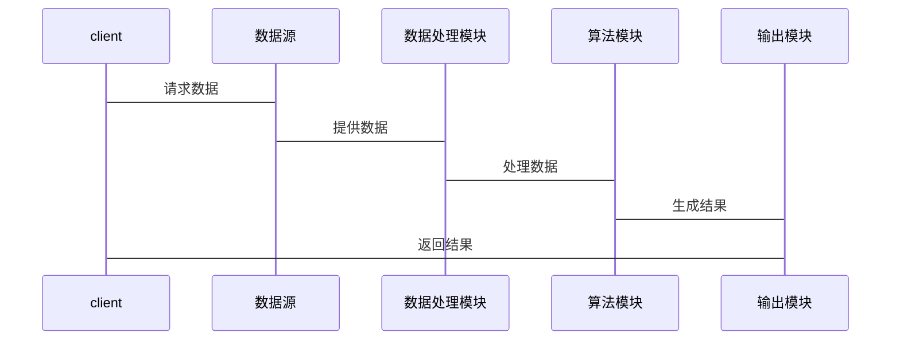

                 


# 如何利用特价股票策略进行系统性创新机会捕捉

> 关键词：特价股票策略，系统性创新，机会捕捉，股票投资，量化分析

> 摘要：本文深入探讨了如何利用特价股票策略进行系统性创新机会捕捉。通过分析特价股票策略的背景、核心概念、算法原理、系统架构设计以及项目实战，本文为投资者提供了一套系统化的解决方案，帮助他们在复杂的市场环境中识别和抓住创新机会。文章结合理论与实践，详细讲解了如何构建数学模型、设计系统架构，并通过实际案例分析验证了策略的有效性。

---

## 第1章: 特价股票策略的背景与概念

### 1.1 特价股票策略的定义与特点

#### 1.1.1 特价股票的定义
特价股票（Special Stock）是指在特定市场条件下，由于各种原因导致其价格被低估的股票。这些股票通常具有较高的潜在回报，但往往被市场忽视或低估。

#### 1.1.2 特价股票的核心特点
- **低估值**：价格远低于其内在价值。
- **市场关注度低**：交易量小，关注者少。
- **周期性**：通常出现在市场低迷或行业调整期。

#### 1.1.3 特价股票与传统股票投资的区别
- **传统股票投资**：注重长期增长，关注公司基本面。
- **特价股票策略**：注重短期价格差异，关注市场低估。

### 1.2 特价股票策略的重要性

#### 1.2.1 特价股票策略的背景
近年来，随着市场的波动加剧，投资者开始寻找新的机会来捕捉超额收益。特价股票策略因其高性价比，成为一种备受关注的投资策略。

#### 1.2.2 特价股票策略对企业创新的推动作用
通过识别和投资于被低估的股票，投资者可以支持企业的创新，推动其成长，从而实现双赢。

#### 1.2.3 特价股票策略在当前市场环境中的应用现状
随着量化交易的普及，特价股票策略逐渐从传统的人工选股转向系统化、自动化的投资。

### 1.3 特价股票策略的边界与外延

#### 1.3.1 特价股票策略的适用场景
- **市场低迷期**：适合寻找被低估的股票。
- **行业调整期**：适合投资于受行业影响的股票。

#### 1.3.2 特价股票策略的限制条件
- **市场波动**：策略的成功依赖于市场波动。
- **交易成本**：频繁交易可能导致成本过高。

#### 1.3.3 特价股票策略与其他投资策略的对比
- **价值投资**：注重长期价值，风险较低。
- **成长投资**：注重未来增长潜力，风险较高。
- **特价股票策略**：结合低估值和潜在增长，风险介于两者之间。

### 1.4 特价股票策略的核心要素

#### 1.4.1 特价股票策略的核心要素组成
- **市场分析**：识别市场低估区域。
- **股票筛选**：基于量化指标筛选股票。
- **交易策略**：制定买入和卖出规则。

#### 1.4.2 特价股票策略的实施步骤
1. 确定市场环境。
2. 筛选低估值股票。
3. 制定交易计划。
4. 执行交易并监控。

#### 1.4.3 特价股票策略的数学模型与公式
$$
\text{股价} = \frac{\text{内在价值}}{\text{市场情绪因子}}
$$
此公式表明，股价的低估与市场情绪因子密切相关。

---

## 第2章: 系统性创新机会的捕捉方法

### 2.1 系统性思维在创新机会捕捉中的应用

#### 2.1.1 系统性思维的定义
系统性思维是指从整体出发，分析问题的各个组成部分及其相互关系，以系统的方式解决问题。

#### 2.1.2 系统性思维在投资中的重要性
- **全面分析**：避免单一视角带来的偏差。
- **风险控制**：通过系统化管理降低风险。

### 2.2 特价股票策略的机会识别

#### 2.2.1 机会识别的关键步骤
1. 数据收集：包括历史价格、财务指标等。
2. 数据分析：使用量化方法筛选潜在机会。
3. 机会评估：综合考虑市场、行业和公司基本面。

#### 2.2.2 特价股票策略的机会来源
- **市场低估**：股价低于内在价值。
- **行业调整**：行业结构调整带来的机会。
- **突发事件**：突发事件导致的短期价格波动。

### 2.3 系统性创新机会的分析框架

#### 2.3.1 分析框架的构建
1. 确定分析目标。
2. 设计分析指标。
3. 建立分析模型。

#### 2.3.2 分析框架的实施步骤
1. 数据预处理。
2. 指标计算。
3. 模型验证。

#### 2.3.3 分析框架的优化与调整
- **模型优化**：通过回测优化参数。
- **策略调整**：根据市场变化调整策略。

### 2.4 特价股票策略的创新策略

#### 2.4.1 创新策略的定义
通过技术创新和策略优化，提升特价股票策略的效率和效果。

#### 2.4.2 创新策略的实施方法
1. 引入人工智能技术。
2. 结合大数据分析。
3. 优化交易策略。

#### 2.4.3 特价股票策略的成功案例分析
某基金通过引入量化模型，成功捕捉到多只被低估的股票，实现了超额收益。

---

## 第3章: 特价股票策略的核心算法

### 3.1 特价股票策略的量化分析方法

#### 3.1.1 市场情绪分析
- **市场情绪指标**：如恐慌指数、市场波动率。
- **情绪与价格的关系**：市场恐慌时，股价可能被低估。

#### 3.1.2 技术指标分析
- **相对强弱指数（RSI）**：衡量股票超买或超卖状态。
- **移动平均线（MA）**：判断趋势方向。

#### 3.1.3 价值指标分析
- **市盈率（P/E）**：衡量股价是否低估。
- **市净率（P/B）**：衡量股价与资产价值的关系。

### 3.2 特价股票策略的机器学习算法

#### 3.2.1 机器学习在股票预测中的应用
- **回归分析**：预测股票价格。
- **聚类分析**：识别市场中的相似股票。

#### 3.2.2 机器学习模型的选择
- **线性回归**：适用于线性关系。
- **随机森林**：适用于复杂非线性关系。
- **神经网络**：适用于深度学习场景。

### 3.3 特价股票策略的算法优化

#### 3.3.1 算法优化的目标
- **提高准确性**：减少误判。
- **降低交易成本**：减少频繁交易。

#### 3.3.2 算法优化的方法
- **参数调整**：优化模型参数。
- **模型组合**：结合多种算法。

---

## 第4章: 系统分析与架构设计

### 4.1 系统分析

#### 4.1.1 问题场景介绍
投资者需要一个系统化的方法来捕捉特价股票机会，避免人为判断的主观性。

#### 4.1.2 项目介绍
开发一个基于量化分析的特价股票策略系统。

### 4.2 系统功能设计

#### 4.2.1 领域模型（类图）


### 4.3 系统架构设计

#### 4.3.1 系统架构图
```mermaid
client
    /   \ 
    /     \
    auth   data
        /   \
        /     \
       service1 service2
        \   /
         data
```

### 4.4 系统接口设计

#### 4.4.1 系统接口
- **输入接口**：接收数据源输入。
- **输出接口**：提供可视化结果。

### 4.5 系统交互设计

#### 4.5.1 系统交互流程图


---

## 第5章: 项目实战

### 5.1 环境安装

#### 5.1.1 开发环境
- **操作系统**：Linux/Windows/Mac。
- **编程语言**：Python。
- **工具**：Jupyter Notebook, PyCharm。

### 5.2 核心代码实现

#### 5.2.1 代码实现
```python
import pandas as pd
import numpy as np

def calculate_value_signals(data):
    # 计算市盈率
    data['PE'] = data['收盘价'] / data['每股收益']
    # 计算市净率
    data['PB'] = data['收盘价'] / data['每股净资产']
    return data

# 示例数据
data = pd.DataFrame({
    '收盘价': [10, 20, 30, 40],
    '每股收益': [2, 4, 6, 8],
    '每股净资产': [5, 10, 15, 20]
})

result = calculate_value_signals(data)
print(result)
```

#### 5.2.2 代码解读
- **函数定义**：`calculate_value_signals`计算市盈率和市净率。
- **数据处理**：对示例数据进行计算并输出结果。

### 5.3 案例分析

#### 5.3.1 案例分析
假设某公司股价为10元，市盈率为5，市净率为2，而行业平均市盈率为15，市净率为3。根据模型，该股票可能被低估，具有投资价值。

### 5.4 项目小结

#### 5.4.1 项目总结
通过量化分析和系统设计，投资者可以更有效地捕捉特价股票机会。

---

## 第6章: 最佳实践与总结

### 6.1 最佳实践 tips

#### 6.1.1 系统化思维的重要性
避免情绪化决策，保持理性分析。

#### 6.1.2 持续优化策略
根据市场变化不断调整策略。

### 6.2 小结

#### 6.2.1 系统性创新机会捕捉的总结
通过系统化的方法和技术创新，投资者可以在复杂市场中捕捉到更多机会。

### 6.3 注意事项

#### 6.3.1 风险提示
- **市场风险**：市场波动可能导致策略失败。
- **操作风险**：策略实施过程中可能出现的技术问题。

### 6.4 拓展阅读

#### 6.4.1 相关书籍
- 《量化投资入门》
- 《系统性投资策略》

#### 6.4.2 相关网站
- [QuantInst](https://www.quantinst.com)
- [DataCamp](https://www.datacamp.com)

---

## 附录: 术语表

- **特价股票（Special Stock）**：价格被低估的股票。
- **量化分析（Quantitative Analysis）**：基于数据的分析方法。
- **机器学习（Machine Learning）**：一种人工智能技术。

---

以上是《如何利用特价股票策略进行系统性创新机会捕捉》的技术博客文章目录和内容示例。通过系统化的方法和创新策略，投资者可以在复杂多变的市场中识别和抓住更多的机会。

