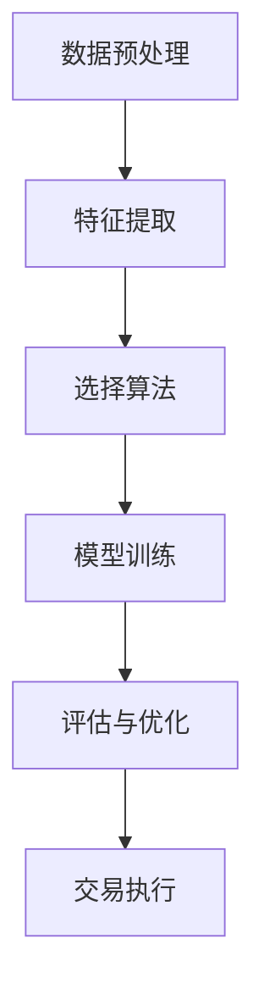
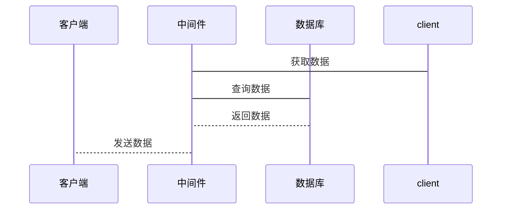

                 


# 如何利用特价股票策略进行系统性数字创新机会捕捉

## 关键词：特价股票策略，数字创新，系统性机会捕捉，算法优化，数据驱动

## 摘要：  
本文深入探讨了如何利用特价股票策略进行系统性数字创新机会的捕捉。通过结合数据分析、机器学习和系统架构设计，本文详细阐述了如何构建高效的数字创新系统，以优化特价股票投资策略。从背景介绍、核心概念到算法实现、系统架构设计，本文为读者提供了从理论到实践的全面指导，帮助投资者在数字化时代抓住更多的投资机会。

---

# 第1章：特价股票策略与数字创新机会概述

## 1.1 特价股票策略的定义与背景

### 1.1.1 特价股票的定义  
特价股票是指在特定市场条件下，价格被低估的股票。这些股票通常具有较高的潜在回报，但可能由于市场波动或其他因素而暂时被市场忽视。

### 1.1.2 特价股票策略的背景与重要性  
随着金融市场的日益复杂化，投资者需要借助数字技术来捕捉特价股票的机会。数字创新为投资者提供了新的工具和方法，以更高效地识别和捕捉这些机会。

### 1.1.3 数字创新在股票投资中的作用  
数字技术（如大数据分析、人工智能）的应用，使得投资者能够更精准地预测市场趋势，优化投资组合，并实时监控市场变化。

---

## 1.2 本书的核心目标与读者定位

### 1.2.1 本书的核心目标  
通过系统性地分析特价股票策略，结合数字创新技术，为投资者提供一套可操作的方法论，帮助其在股票市场中捕捉更多投资机会。

### 1.2.2 本书的读者定位  
本书适合对股票投资感兴趣的技术爱好者、金融从业者以及希望将数字技术应用于投资的投资者。

### 1.2.3 本书的结构安排  
本书分为七章，从背景介绍到系统架构设计，再到项目实战，为读者提供全面的指导。

---

# 第2章：特价股票策略的背景与现状

## 2.1 特价股票策略的市场背景

### 2.1.1 特价股票市场的基本特征  
特价股票市场具有高波动性、低流动性等特点，这使得其价格波动难以预测。

### 2.1.2 特价股票市场的参与者分析  
参与者包括个人投资者、机构投资者以及算法交易系统。不同参与者的行为对市场价格产生影响。

### 2.1.3 特价股票市场的现状与趋势  
随着数字化技术的发展，越来越多的投资者开始利用数字工具进行特价股票投资。

---

## 2.2 数字创新在股票投资中的应用现状

### 2.2.1 数字技术在股票投资中的应用领域  
包括数据分析、机器学习、算法交易等。

### 2.2.2 数字创新在股票投资中的优势与挑战  
优势：提高投资效率、增强预测准确性。  
挑战：数据质量、模型过拟合、市场波动性等。

### 2.2.3 当前市场中的数字创新案例分析  
例如，利用自然语言处理技术分析新闻对股价的影响。

---

# 第3章：特价股票策略的核心概念与联系

## 3.1 特价股票策略的核心概念

### 3.1.1 特价股票策略的定义与分类  
根据投资目标的不同，特价股票策略可以分为短期交易和长期投资两种类型。

### 3.1.2 特价股票策略的关键要素  
包括数据源、分析模型、交易执行系统等。

### 3.1.3 特价股票策略的数学模型与公式  
例如，使用线性回归模型预测股票价格：
$$ y = \beta_0 + \beta_1x + \epsilon $$

## 3.2 特价股票策略与数字创新的联系

### 3.2.1 数字技术如何赋能特价股票策略  
通过大数据分析和机器学习，投资者可以更精准地识别市场机会。

### 3.2.2 数字创新在特价股票策略中的应用场景  
包括市场数据的实时监控、交易策略的自动化执行等。

### 3.2.3 特价股票策略与数字创新的协同发展  
数字创新为特价股票策略提供了新的工具，而特价股票策略则为数字技术的应用提供了新的场景。

---

# 第4章：特价股票策略的算法原理与数学模型

## 4.1 算法原理与流程图

### 使用mermaid绘制的算法流程图：



## 4.2 算法实现

### 4.2.1 数据预处理

#### 数据清洗
处理缺失值、异常值等。

#### 特征工程
提取有用的特征，例如相对强弱指数（RSI）、移动平均线（MA）等。

### 4.2.2 特征提取

#### 时间序列分析
使用ARIMA模型预测未来的价格走势。

### 4.2.3 算法选择

#### 机器学习算法
例如，随机森林、支持向量机（SVM）等。

### 4.2.4 模型训练

#### 线性回归模型
使用最小二乘法进行模型训练：
$$ \hat{y} = \beta_0 + \beta_1x $$

### 4.2.5 评估与优化

#### 模型评估
使用均方误差（MSE）等指标评估模型性能。

### 4.2.6 交易执行

#### 算法交易
根据模型预测结果，执行自动化的买入或卖出操作。

---

## 4.3 数学模型与公式

### 4.3.1 线性回归模型
$$ y = \beta_0 + \beta_1x + \epsilon $$

### 4.3.2 时间序列分析模型
$$ y_t = \alpha y_{t-1} + \beta x_t + \epsilon $$

---

# 第5章：系统分析与架构设计方案

## 5.1 系统功能设计

### 5.1.1 领域模型（mermaid类图）


## 5.2 系统架构设计

### 5.2.1 系统架构图（mermaid架构图）

```mermaid
archi
    客户端 --> 中间件
    中间件 --> 数据库
    中间件 --> 训练模块
    训练模块 --> 执行模块
    执行模块 --> 交易系统
```

## 5.3 系统接口设计

### 5.3.1 数据接口
- 数据获取接口：从数据库中获取历史和实时数据。
- 数据处理接口：对数据进行清洗和特征提取。

### 5.3.2 交易接口
- 交易信号接口：接收模型的预测结果。
- 交易执行接口：向交易系统发送买卖指令。

## 5.4 系统交互设计

### 5.4.1 交互流程（mermaid序列图）



---

# 第6章：项目实战

## 6.1 环境安装

### 6.1.1 安装Python
安装Python 3.8或更高版本。

### 6.1.2 安装相关库
安装pandas、numpy、scikit-learn、matplotlib等库：
```bash
pip install pandas numpy scikit-learn matplotlib
```

## 6.2 核心实现

### 6.2.1 数据预处理代码

```python
import pandas as pd
import numpy as np

# 读取数据
data = pd.read_csv('stock_data.csv')

# 数据清洗
data.dropna(inplace=True)

# 特征提取
data['RSI'] = data['收盘价'].rolling(14).mean()
```

### 6.2.2 模型训练代码

```python
from sklearn.linear_model import LinearRegression

# 创建模型
model = LinearRegression()

# 训练模型
model.fit(X_train, y_train)
```

### 6.2.3 交易执行代码

```python
import pandas as pd
import numpy as np

# 读取数据
data = pd.read_csv('stock_data.csv')

# 数据清洗
data.dropna(inplace=True)

# 特征提取
data['RSI'] = data['收盘价'].rolling(14).mean()

# 模型训练
model = LinearRegression()
model.fit(X_train, y_train)

# 交易策略
positions = []
for i in range(len(data)):
    if model.predict(X[i]) > data['收盘价'][i]:
        positions.append(1)
    else:
        positions.append(0)
```

## 6.3 项目小结

通过实际案例分析，我们展示了如何利用Python代码实现特价股票策略的系统化数字创新。从数据预处理到模型训练，再到交易执行，每一步都需要精心设计和实现。

---

# 第7章：最佳实践与小结

## 7.1 最佳实践

### 7.1.1 数据质量的重要性  
确保数据的准确性和完整性是模型训练的基础。

### 7.1.2 模型的可解释性  
选择易于解释的模型，有助于更好地理解市场规律。

### 7.1.3 风险控制  
在实际交易中，需严格控制风险，避免过度杠杆化。

## 7.2 小结

通过系统的数字创新，投资者可以更高效地捕捉特价股票机会。然而，这需要结合市场实际情况，灵活调整策略，并持续优化模型。

---

# 结语

利用特价股票策略进行系统性数字创新机会的捕捉，是一个复杂但充满潜力的过程。通过本文的系统性指导，投资者可以更好地利用数字技术，优化投资策略，实现更高的投资回报。

