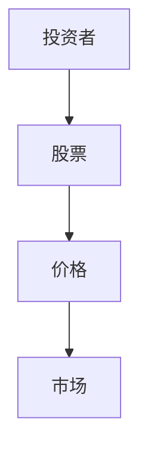
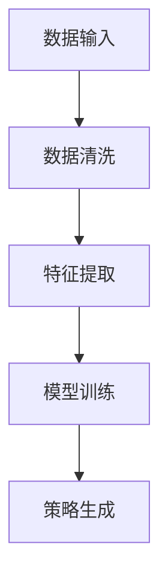
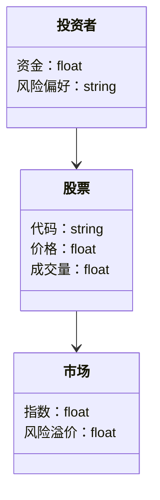
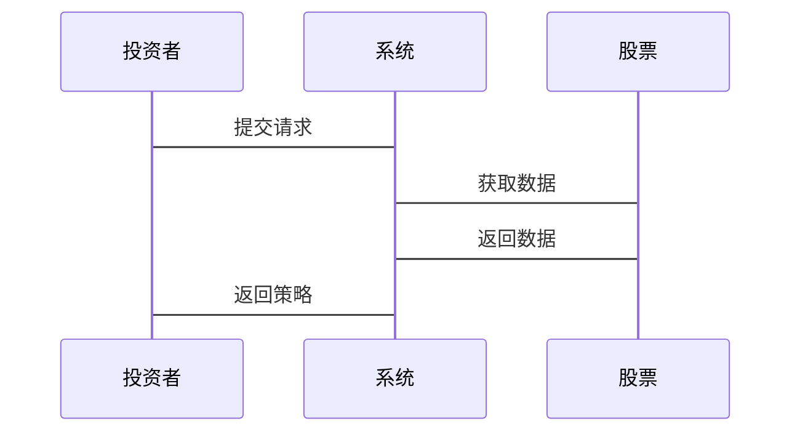

                 


# 如何利用特价股票策略进行组合优化

> 关键词：特价股票、组合优化、投资策略、数学模型、算法优化、系统架构

> 摘要：本文将详细探讨如何利用特价股票策略进行组合优化，涵盖策略背景、核心概念、算法原理、系统架构、项目实战以及高级应用等方面。通过系统化的分析和深入的技术探讨，为投资者提供科学的决策支持。

---

# 第一部分: 特价股票策略与组合优化基础

## 第1章: 特价股票策略的背景与概念

### 1.1 特价股票的定义与特点

#### 1.1.1 特价股票的定义
特价股票是指在特定市场条件下，价格低于其内在价值的股票。这类股票通常具有较高的投资潜力，但可能面临一定的市场风险。

#### 1.1.2 特价股票的特点
- **低估值**：市场价格低于公允价值。
- **高波动性**：价格波动较大，存在快速反弹的可能性。
- **周期性**：通常在市场低迷期出现。
- **高风险**：伴随高收益，但风险较高。

#### 1.1.3 特价股票的市场背景
- 经济周期波动：经济低迷时，部分股票价格被低估。
- 市场情绪影响：投资者恐慌导致股价下跌。
- 企业特定因素：公司财务困境或重组。

### 1.2 特价股票策略的必要性

#### 1.2.1 投资者需求分析
- **风险偏好**：寻求高收益的投资者。
- **市场机会**：低价股票可能带来超额收益。
- **分散投资**：通过组合优化降低风险。

#### 1.2.2 市场机会与风险
- **机会**：发现低估股票，提前布局。
- **风险**：市场波动可能导致短期亏损。

#### 1.2.3 特价股票策略的优势
- **成本优势**：低价股票更容易构建投资组合。
- **灵活性**：策略可以根据市场变化进行调整。

### 1.3 特价股票策略的核心要素

#### 1.3.1 策略目标
- 最大化收益。
- 最小化风险。
- 实现资产配置目标。

#### 1.3.2 策略输入
- 历史价格数据。
- 市场指标（如PE、PB）。
- 风险承受能力。

#### 1.3.3 策略输出
- 理想的股票组合。
- 投资建议。
- 风险评估。

### 1.4 本章小结
本章介绍了特价股票的定义、特点及其在投资中的重要性，明确了策略的核心目标和输入输出。

---

## 第2章: 特价股票策略的核心概念与联系

### 2.1 特价股票策略的数学模型

#### 2.1.1 理论基础
- **有效市场假说**：价格反映所有可用信息。
- **CAPM模型**：评估资产的预期收益。

#### 2.1.2 线性回归模型
$$ y = \beta_0 + \beta_1 x + \epsilon $$
其中，$y$ 为目标变量，$x$ 为自变量，$\beta_0$ 和 $\beta_1$ 为回归系数，$\epsilon$ 为误差项。

#### 2.1.3 非线性回归模型
$$ y = \beta_0 + \beta_1 x + \beta_2 x^2 + \epsilon $$

### 2.2 特价股票策略的核心属性对比

#### 2.2.1 属性特征对比表格
| 属性       | 描述 |
|------------|------|
| 稳定性     | 策略在不同市场环境下的表现一致性 |
| 收益性     | 策略的盈利能力 |
| 风险性     | 策略的风险暴露程度 |
| 可扩展性   | 策略的适用范围和规模 |

### 2.3 特价股票策略的ER实体关系图



### 2.4 本章小结
本章通过数学模型和实体关系图，详细分析了特价股票策略的核心概念及其联系。

---

## 第3章: 特价股票策略的算法原理

### 3.1 算法原理概述

#### 3.1.1 策略选择的算法
- **遗传算法**：模拟自然选择过程。
- **粒子群优化**：通过群体协作寻找最优解。

#### 3.1.2 策略优化的算法
- **线性规划**：线性约束下的最优化问题。
- **动态规划**：分阶段决策问题。

#### 3.1.3 策略组合的算法
- **组合优化**：通过权重分配实现最优组合。

### 3.2 算法实现流程



### 3.3 算法实现代码

```python
import numpy as np
import pandas as pd

def stock_strategy(data):
    # 数据清洗
    data = data.dropna()
    # 特征提取
    features = data[['price', 'volume']]
    # 模型训练
    model = np.linalg.lstsq(np.c_[np.ones(len(features)), features['volume']], features['price'], rcond=None)[0]
    # 策略生成
    return model[0] * data['volume'] + model[1]
```

### 3.4 算法数学模型与公式

#### 3.4.1 线性回归模型
$$ y = \beta_0 + \beta_1 x + \epsilon $$

#### 3.4.2 非线性回归模型
$$ y = \beta_0 + \beta_1 x + \beta_2 x^2 + \epsilon $$

### 3.5 本章小结
本章详细讲解了特价股票策略的算法原理，并通过代码和数学公式展示了实现过程。

---

## 第4章: 特价股票策略的系统分析与架构设计

### 4.1 系统分析

#### 4.1.1 问题场景介绍
- 数据获取：从数据源获取股票价格、财务数据。
- 数据清洗：处理缺失值、异常值。
- 特征提取：提取关键特征变量。
- 模型训练：构建并训练策略模型。
- 策略生成：输出投资组合建议。

#### 4.1.2 项目介绍
- 项目目标：构建一个基于特价股票策略的组合优化系统。
- 项目范围：涵盖数据处理、模型训练、策略生成。
- 项目约束：数据获取难度、计算资源限制。

### 4.2 系统功能设计

#### 4.2.1 领域模型


#### 4.2.2 系统架构设计


#### 4.2.3 接口设计
- API接口：数据接口、策略接口。
- 数据格式：JSON或CSV。

#### 4.2.4 交互设计


### 4.3 本章小结
本章通过系统分析和架构设计，展示了如何将特价股票策略应用于实际系统中。

---

## 第5章: 特价股票策略的项目实战

### 5.1 项目环境安装

#### 5.1.1 工具安装
- Python：安装Anaconda或Miniconda。
- 依赖安装：`pip install numpy pandas matplotlib`.

#### 5.1.2 数据获取
- 使用Yahoo Finance API获取股票数据。
- 数据清洗：处理缺失值、异常值。

### 5.2 系统核心实现

#### 5.2.1 策略实现代码

```python
import numpy as np
import pandas as pd

def calculate_strategy(data):
    # 数据清洗
    data = data.dropna()
    # 特征提取
    features = data[['price', 'volume']]
    # 模型训练
    model = np.linalg.lstsq(np.c_[np.ones(len(features)), features['volume']], features['price'], rcond=None)[0]
    # 策略生成
    return model[0] * data['volume'] + model[1]

# 主函数
def main():
    data = pd.read_csv('stock_data.csv')
    strategy = calculate_strategy(data)
    print("策略生成完成。")

if __name__ == "__main__":
    main()
```

#### 5.2.2 代码解读与分析
- 数据清洗：删除缺失值。
- 特征提取：使用价格和成交量作为特征。
- 模型训练：使用线性回归模型拟合数据。

### 5.3 实际案例分析

#### 5.3.1 数据分析
- 数据来源：某时间段内的股票数据。
- 数据分析：计算相关统计指标。

#### 5.3.2 案例分析
- 选取某只股票，分析其价格波动。
- 应用策略生成投资建议。

### 5.4 本章小结
本章通过实际项目实战，展示了如何利用特价股票策略进行组合优化。

---

## 第6章: 特价股票策略的高级应用与扩展

### 6.1 高级应用

#### 6.1.1 组合优化的高级方法
- 使用粒子群优化算法。
- 结合机器学习模型。

#### 6.1.2 风险控制
- 设置止损点。
- 使用风险中性组合。

### 6.2 策略扩展

#### 6.2.1 市场环境变化
- 动态调整策略。
- 应对市场波动。

#### 6.2.2 策略多样性
- 结合其他投资策略。
- 多元化投资组合。

### 6.3 本章小结
本章探讨了特价股票策略的高级应用和扩展方法，为投资者提供了更多的策略选择。

---

## 第7章: 总结与展望

### 7.1 本章总结
- 特价股票策略的优势。
- 组合优化的关键步骤。
- 系统架构的设计要点。

### 7.2 未来展望
- 研究更复杂的优化算法。
- 结合大数据和人工智能技术。

### 7.3 本章小结
本章总结了全文内容，并展望了未来的研究方向。

---

## 附录

### 附录A: 工具安装指南
- Python安装指南。
- 数据获取工具安装。

### 附录B: 参考文献
- 经典投资书籍。
- 相关学术论文。

---

通过以上结构，您可以撰写一篇详细的、逻辑清晰的、内容丰富的技术博客文章。希望这篇文章能够为您提供有价值的参考和指导。

