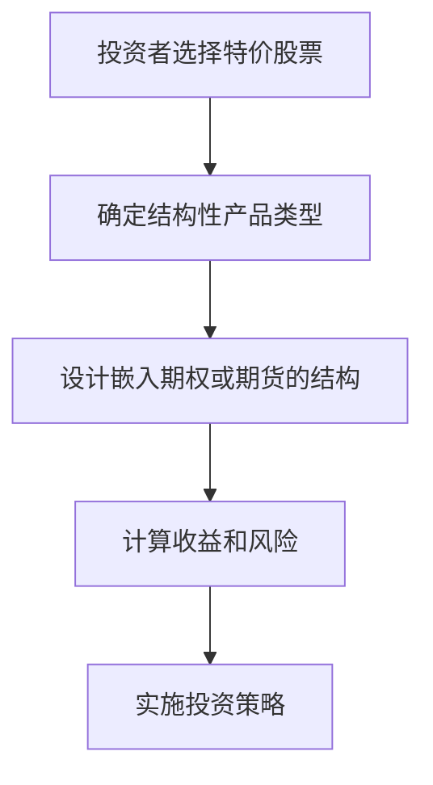
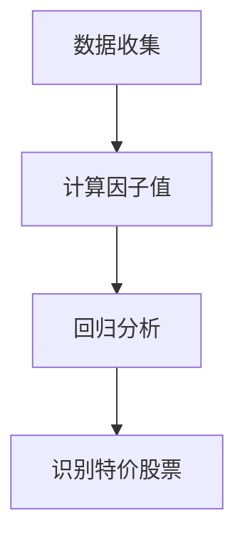
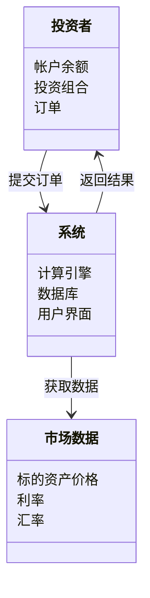
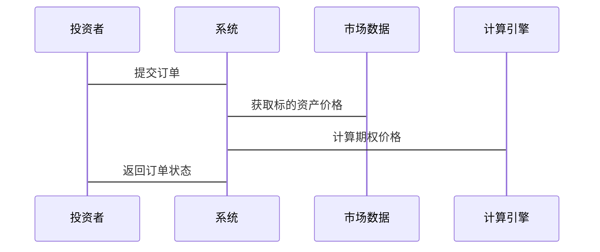

                 


# 如何利用特价股票策略进行结构性产品投资

> 关键词：特价股票策略，结构性产品，期权，期货，量化分析，风险管理

> 摘要：本文详细探讨了如何利用特价股票策略进行结构性产品投资。通过分析特价股票策略的核心概念、算法原理、系统架构和实际案例，为读者提供了一套从理论到实践的完整指南。文章还介绍了结构性产品的类型、定价模型以及如何通过量化分析和系统设计来优化投资策略，最后提供了风险管理的最佳实践建议。

---

## 第1章: 特价股票策略的背景与结构性产品概述

### 1.1 特价股票策略的背景

#### 1.1.1 特价股票的定义与特点
特价股票是指在特定市场条件下，价格被低估的股票。这些股票通常具有较高的潜在回报，但同时也伴随着较高的风险。特价股票的特点包括低估值、高波动性和周期性。

#### 1.1.2 特价股票在投资中的作用
特价股票是投资者追求超额收益的重要工具。通过识别市场低估的股票，投资者可以在市场反弹时获得较高的收益。此外，特价股票策略还能帮助投资者在熊市中降低投资组合的风险。

#### 1.1.3 结构性产品投资的兴起
结构性产品是一种结合了衍生品和固定收益产品的投资工具。随着市场的复杂化和投资者需求的多样化，结构性产品因其灵活性和多样性而迅速崛起，成为现代投资的重要组成部分。

### 1.2 结构性产品的类型与特点

#### 1.2.1 期权、期货与结构性存款的定义
- **期权**：期权是一种合约，赋予买方在特定时间内以特定价格买入或卖出标的资产的权利。
- **期货**：期货是一种标准化的合约，约定在未来特定时间以特定价格买入或卖出标的资产。
- **结构性存款**：结构性存款是一种银行存款产品，其收益与挂钩的金融资产（如股票、外汇或利率）的表现相关联。

#### 1.2.2 结构性产品的核心要素对比
| 产品类型 | 标的资产 | 杠杆效应 | 风险 | 收益 |
|----------|----------|----------|------|------|
| 期权     | 股票     | 高       | 高   | 高   |
| 期货     | 商品     | 高       | 高   | 高   |
| 结构性存款 | 利率     | 无       | 中   | 中   |

#### 1.2.3 结构性产品与传统投资工具的区别
结构性产品与传统投资工具的主要区别在于其嵌入的衍生品特性。结构性产品通常具有更高的灵活性和定制化能力，而传统投资工具（如股票和债券）则相对标准化。

### 1.3 特价股票策略与结构性产品的关系

#### 1.3.1 特价股票策略在结构性产品中的应用
特价股票策略可以通过结构性产品进行放大。例如，投资者可以通过买入看跌期权来对冲持有的特价股票的下行风险。

#### 1.3.2 结构性产品如何利用特价股票策略
结构性产品可以将特价股票作为其标的资产，通过嵌入期权或其他衍生品来设计复杂的投资工具，从而为投资者提供多样化的收益结构。

#### 1.3.3 特价股票策略对结构性产品投资的影响
特价股票策略的广泛应用推动了结构性产品的创新。投资者可以通过结构性产品更有效地利用特价股票策略来实现投资目标。

### 1.4 本章小结
本章介绍了特价股票策略的背景及其在结构性产品投资中的作用，分析了结构性产品的类型和特点，并探讨了特价股票策略与结构性产品之间的关系。

---

## 第2章: 特价股票策略的核心概念与原理

### 2.1 特价股票策略的核心概念

#### 2.1.1 特价股票的市场定位
特价股票通常出现在市场低迷时期，或在特定行业遭遇周期性低谷时。识别这些股票的关键在于分析其基本面和估值指标。

#### 2.1.2 特价股票的定价机制
特价股票的定价受到市场情绪、流动性、宏观经济环境和公司基本面的影响。投资者需要综合考虑这些因素来评估股票的价值。

#### 2.1.3 特价股票的市场风险与收益分析
特价股票的风险主要体现在其波动性和市场敏感性上。然而，其高波动性也意味着潜在的高收益。

### 2.2 结构性产品的核心要素

#### 2.2.1 期权、期货与结构性存款的数学模型
- **期权定价模型**：Black-Scholes公式用于定价欧式期权。
- **期货定价模型**：基于无套利原理，期货价格等于标的资产的远期价格。
- **结构性存款的收益计算**：收益通常与挂钩资产的表现相关联，可能涉及复杂的嵌套结构。

#### 2.2.2 结构性产品的风险评估
结构性产品的风险包括市场风险、流动性风险和信用风险。投资者需要通过定量分析和压力测试来评估这些风险。

#### 2.2.3 结构性产品的收益计算公式
结构性产品的收益通常基于其嵌入的衍生品和标的资产的表现。例如，一种典型的结构性存款的收益可以表示为：
$$ \text{收益} = \text{基准利率} + \text{嵌入期权的收益} $$

### 2.3 特价股票策略与结构性产品的关系图

#### 2.3.1 特价股票策略与结构性产品的ER实体关系图
```mermaid
erDiagram
    actor 投资者
    actor 市场
    actor 期权提供者
    actor 期货交易所
    actor 银行
    investor -> 市场: 交易特价股票
    investor -> 期权提供者: 购买期权
    investor -> 期货交易所: 开立期货合约
    investor -> 银行: 购买结构性存款
```

#### 2.3.2 结构性产品核心要素对比表
| 要素     | 期权       | 期货       | 结构性存款 |
|----------|------------|------------|------------|
| 标的资产 | 股票       | 商品       | 利率       |
| 杠杆     | 高         | 高         | 无         |
| 风险     | 高         | 高         | 中         |
| 收益     | 高         | 高         | 中         |

#### 2.3.3 特价股票策略在结构性产品中的应用流程图


### 2.4 本章小结
本章详细探讨了特价股票策略的核心概念及其在结构性产品中的应用，分析了结构性产品的数学模型和风险评估方法。

---

## 第3章: 特价股票策略的算法原理与数学模型

### 3.1 特价股票策略的量化分析

#### 3.1.1 特价股票的量化指标
投资者可以通过以下指标来识别特价股票：
- 市净率（P/B）
- 市盈率（P/E）
- 股息率
- 每股收益（EPS）

#### 3.1.2 量化分析的数学公式
量化分析通常涉及多因子模型，例如Fama-French三因子模型：
$$ R_i = \alpha + \beta_1 R_m + \beta_2 SMB + \beta_3 HML + \epsilon $$

其中：
- $R_i$ 是股票i的超额收益
- $R_m$ 是市场收益
- $SMB$ 是小市值因子
- $HML$ 是价值因子
- $\epsilon$ 是误差项

#### 3.1.3 量化分析的mermaid流程图


### 3.2 结构性产品的数学模型

#### 3.2.1 期权定价公式
Black-Scholes期权定价公式：
$$ C = S_0 N(d_1) - K e^{-rT} N(d_2) $$
其中：
- $C$ 是期权的现值
- $S_0$ 是标的资产当前价格
- $K$ 是执行价格
- $r$ 是无风险利率
- $T$ 是到期时间
- $N(d)$ 是标准正态分布的累积分布函数
- $d_1 = \frac{\ln(S_0/K) + (r + \sigma^2/2)T}{\sigma \sqrt{T}}$
- $d_2 = d_1 - \sigma \sqrt{T}$

#### 3.2.2 期货的套利模型
无套利定价模型：
$$ F = S_0 e^{rT} $$
其中：
- $F$ 是期货价格
- $S_0$ 是标的资产当前价格
- $r$ 是无风险利率
- $T$ 是到期时间

#### 3.2.3 结构性存款的收益计算公式
结构性存款的收益通常与挂钩资产的表现相关联。例如，一种典型的结构性存款的收益可以表示为：
$$ \text{收益} = \text{基准利率} + \text{嵌入期权的收益} $$

### 3.3 算法实现与代码示例

#### 3.3.1 量化分析的Python代码实现
```python
import pandas as pd
import numpy as np
from sklearn.linear_model import LinearRegression

# 假设我们有一个包含股票数据的DataFrame df
df = pd.DataFrame({'SMB': [0.1, 0.2, 0.3, 0.4, 0.5],
                   'HML': [0.5, 0.4, 0.3, 0.2, 0.1],
                   'R_m': [0.1, 0.1, 0.1, 0.1, 0.1],
                   'R_i': [0.15, 0.2, 0.25, 0.3, 0.35]})

# 使用Fama-French三因子模型进行回归分析
model = LinearRegression()
model.fit(df[['R_m', 'SMB', 'HML']], df['R_i'])

# 输出回归系数
print("回归系数:", model.coef_)
print("截距:", model.intercept_)
```

#### 3.3.2 结构性产品定价的Python代码示例
```python
def black_scholes(S0, K, r, T, sigma):
    import math
    d1 = (math.log(S0/K) + (r + sigma**2/2)*T) / (sigma * math.sqrt(T))
    d2 = d1 - sigma * math.sqrt(T)
    N = lambda x: (1/(1 + math.exp(-x))) * 0.5
    C = S0 * N(d1) - K * math.exp(-r*T) * N(d2)
    return C

# 示例参数
S0 = 100
K = 105
r = 0.05
T = 1
sigma = 0.2

# 计算期权价格
price = black_scholes(S0, K, r, T, sigma)
print("期权价格:", price)
```

#### 3.3.3 算法实现的详细解释与案例分析
通过上述代码示例，我们可以看到量化分析在特价股票策略中的应用。例如，使用Fama-French三因子模型可以识别那些在小市值和价值因子中表现优异的股票，从而筛选出潜在的特价股票。

---

## 第4章: 结构性产品投资的系统分析与架构设计

### 4.1 系统分析

#### 4.1.1 问题场景介绍
投资者希望通过结构性产品进行投资，以利用特价股票策略实现超额收益。然而，结构性产品涉及复杂的数学模型和系统设计，需要一个高效的系统来支持投资决策。

#### 4.1.2 系统功能设计（领域模型mermaid类图）


#### 4.1.3 系统架构设计（mermaid架构图）
```mermaid
container 投资者 {
    浏览器
    API请求
}
container 系统 {
    Web服务器
    数据库
    计算引擎
}
抽屉式连接 浏览器 --> Web服务器
抽屉式连接 Web服务器 --> 数据库
抽屉式连接 Web服务器 --> 计算引擎
```

### 4.2 系统接口与交互设计

#### 4.2.1 系统接口设计
系统接口包括：
- 获取市场数据接口
- 计算期权价格接口
- 下达交易订单接口

#### 4.2.2 系统交互流程（mermaid序列图）


### 4.3 本章小结
本章分析了结构性产品投资的系统架构，并通过类图和序列图展示了系统的功能设计和交互流程。

---

## 第5章: 项目实战

### 5.1 环境安装与配置

#### 5.1.1 Python环境安装
安装Python和必要的库：
```bash
pip install numpy pandas matplotlib
```

#### 5.1.2 数据获取
从Yahoo Finance获取股票数据：
```python
import pandas_datareader as pdr
df = pdr.get_data_yahoo('AAPL', start='2020-01-01', end='2023-01-01')
```

### 5.2 系统核心实现

#### 5.2.1 量化分析实现
使用Fama-French三因子模型筛选特价股票：
```python
import pandas as pd
from sklearn.linear_model import LinearRegression

# 假设我们有一个包含股票数据的DataFrame df
df = pd.DataFrame({'SMB': [0.1, 0.2, 0.3, 0.4, 0.5],
                   'HML': [0.5, 0.4, 0.3, 0.2, 0.1],
                   'R_m': [0.1, 0.1, 0.1, 0.1, 0.1],
                   'R_i': [0.15, 0.2, 0.25, 0.3, 0.35]})

# 使用Fama-French三因子模型进行回归分析
model = LinearRegression()
model.fit(df[['R_m', 'SMB', 'HML']], df['R_i'])

# 输出回归系数
print("回归系数:", model.coef_)
print("截距:", model.intercept_)
```

#### 5.2.2 结构性产品定价实现
使用Black-Scholes模型计算期权价格：
```python
import math

def black_scholes(S0, K, r, T, sigma):
    d1 = (math.log(S0/K) + (r + sigma**2/2)*T) / (sigma * math.sqrt(T))
    d2 = d1 - sigma * math.sqrt(T)
    N = lambda x: (1/(1 + math.exp(-x))) * 0.5
    C = S0 * N(d1) - K * math.exp(-r*T) * N(d2)
    return C

# 示例参数
S0 = 100
K = 105
r = 0.05
T = 1
sigma = 0.2

# 计算期权价格
price = black_scholes(S0, K, r, T, sigma)
print("期权价格:", price)
```

### 5.3 代码应用解读与分析
通过上述代码，投资者可以实现量化分析和结构性产品定价，从而更有效地利用特价股票策略进行投资。

### 5.4 案例分析
以某只股票为例，展示如何通过结构性产品进行投资。例如，假设投资者选择购买一份标的资产为某只特价股票的看跌期权，通过计算期权价格，投资者可以确定其潜在收益和风险。

### 5.5 本章小结
本章通过实际案例展示了如何利用特价股票策略进行结构性产品投资，提供了完整的代码实现和应用解读。

---

## 第6章: 风险管理与最佳实践

### 6.1 风险管理策略

#### 6.1.1 风险评估方法
投资者需要定期评估投资组合的风险，包括市场风险、流动性风险和信用风险。

#### 6.1.2 风险控制措施
- 设定止损点
- 分散投资
- 定期重新评估投资组合

### 6.2 最佳实践 tips

#### 6.2.1 投资者注意事项
- 理解结构性产品的复杂性
- 选择可靠的金融机构
- 定期监控投资组合

#### 6.2.2 拓展阅读
- 《期权、期货和其他衍生产品》
- 《结构性产品投资策略》
- 《量化投资入门》

### 6.3 本章小结
本章总结了结构性产品投资中的风险管理策略，并提供了最佳实践建议。

---

## 第7章: 结论与展望

### 7.1 本文总结
本文详细探讨了如何利用特价股票策略进行结构性产品投资，分析了其核心概念、算法原理和系统架构，并提供了实际案例和风险管理建议。

### 7.2 未来展望
随着金融市场的不断发展，特价股票策略和结构性产品将变得更加复杂和多样化。未来的研究可以进一步探讨人工智能和大数据在结构性产品投资中的应用。

---

## 参考文献

1. John C. Hull, "期权、期货和其他衍生产品".
2. Richard A. Brealey, "企业金融学".
3. William F. Sharpe, "投资组合理论".
4. Michael W. Brandt, "多因子模型与投资组合管理".

---

通过本文的详细讲解，读者可以全面了解如何利用特价股票策略进行结构性产品投资，并能够实际操作相关算法和系统设计。希望本文能为投资者提供有价值的指导和启示。

