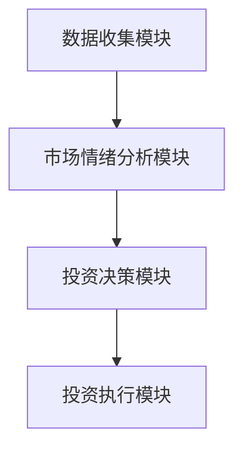
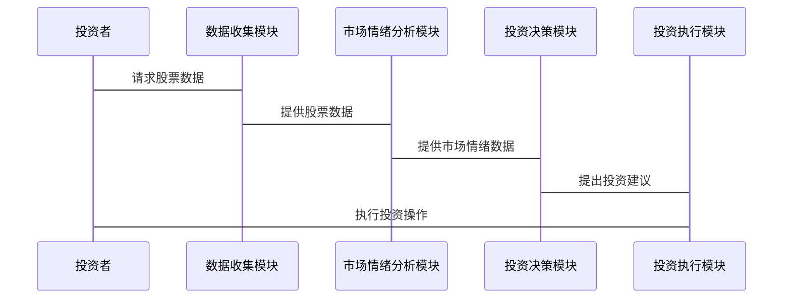

                 


# 如何利用特价股票策略进行逆向思维投资

## 关键词：特价股票策略，逆向思维投资，股票投资，市场周期，价值投资

## 摘要：本文将详细介绍如何利用特价股票策略进行逆向思维投资。首先，我们将介绍特价股票策略的基本概念和逆向思维投资的核心原理。接着，我们将深入分析特价股票策略的关键指标和逆向思维投资的策略实施。然后，我们将从算法和系统架构的角度，详细讲解如何利用特价股票策略进行投资决策。最后，我们将通过实际案例分析和项目实战，展示如何在实际投资中应用这些策略，并总结出最佳实践和注意事项。

---

## 第一部分: 特价股票策略与逆向思维投资的背景介绍

### 第1章: 特价股票策略的定义与特点

#### 1.1 什么是特价股票
特价股票是指在市场低迷时期，由于市场恐慌或投资者情绪影响，股票价格被市场低估，远低于其内在价值的股票。这些股票通常具有较高的安全边际，适合在市场底部进行投资。

#### 1.2 特价股票的特征
- **低市盈率（P/E）**：市盈率低于行业平均水平，表明股票价格被低估。
- **低市净率（P/B）**：市净率低于行业平均水平，表明股票价格相对于资产净值来说较低。
- **高股息率**：公司愿意支付较高的股息，表明公司现金流充裕，愿意回馈股东。
- **行业龙头**：通常是行业内的龙头企业，具有较强的抗风险能力和竞争优势。

#### 1.3 特价股票与普通股票的区别
| 特性 | 特价股票 | 普通股票 |
|------|----------|----------|
| 市盈率 | 低于行业平均 | 接近或高于行业平均 |
| 市净率 | 低于行业平均 | 接近或高于行业平均 |
| 股息率 | 高 | 中等或低 |
| 市场情绪 | 低迷或恐慌 | 理性或乐观 |

### 第2章: 逆向思维投资的原理

#### 2.1 逆向思维投资的定义
逆向思维投资是指在市场恐慌时买入，在市场乐观时卖出的投资策略。这种策略的核心是利用市场的非理性行为，逆市场情绪进行操作。

#### 2.2 逆向思维投资的核心理念
- **市场情绪分析**：通过分析市场情绪，判断市场的低估和高估。
- **价值投资**：寻找被市场低估的股票，买入并长期持有，等待市场回归理性。
- **逆向操作**：在市场底部买入，在市场顶部卖出，利用市场的波动获利。

#### 2.3 逆向思维投资与传统投资的区别
| 特性 | 逆向思维投资 | 传统投资 |
|------|--------------|-----------|
| 投资时机 | 市场恐慌时买入 | 市场乐观时买入 |
| 持股策略 | 长期持有 | 短期交易 |
| 风险控制 | 严格控制风险 | 风险分散 |

---

## 第二部分: 特价股票策略与逆向思维投资的核心概念

### 第3章: 特价股票策略的核心原理

#### 3.1 市场周期理论
市场周期分为四个阶段：繁荣、衰退、恐慌和复苏。特价股票策略的核心是在恐慌阶段买入，在复苏阶段卖出。

#### 3.2 市场情绪分析
市场情绪可以通过多种指标进行分析，例如投资者情绪指数（AAII）、恐慌指数（VIX）等。

#### 3.3 市场低估与高估的判断
通过分析股票的市盈率、市净率等指标，判断股票是否被市场低估或高估。

### 第4章: 逆向思维投资的核心原理

#### 4.1 逆向思维投资的核心要素
- **市场情绪分析**：通过分析市场情绪，判断市场的低估和高估。
- **价值投资**：寻找被市场低估的股票，买入并长期持有。
- **风险控制**：严格控制投资风险，避免过度投资。

#### 4.2 逆向思维投资的关键指标
| 指标 | 用途 |
|------|------|
| 市盈率（P/E） | 判断股票的估值是否合理 |
| 市净率（P/B） | 判断股票的估值是否合理 |
| 股息率 | 判断股票的投资回报率 |

---

## 第三部分: 特价股票策略的算法原理

### 第5章: 特价股票策略的算法原理

#### 5.1 算法原理
特价股票策略的核心是通过分析股票的市盈率、市净率等指标，判断股票是否被市场低估。以下是特价股票策略的算法流程：

1. 收集目标股票的历史数据，包括市盈率、市净率、股息率等。
2. 计算股票的平均市盈率和市净率，判断股票是否被低估。
3. 如果股票被低估，建议买入；否则，建议卖出。

#### 5.2 算法实现
以下是特价股票策略的Python实现代码：

```python
import pandas as pd
import numpy as np

def is_cheap_stock(stock_data, threshold_pe=15, threshold_pb=1.5):
    stock_data['cheap_pe'] = stock_data['PE'] < threshold_pe
    stock_data['cheap_pb'] = stock_data['PB'] < threshold_pb
    stock_data['is_cheap'] = stock_data[['cheap_pe', 'cheap_pb']].all(axis=1)
    return stock_data[stock_data['is_cheap']]

# 示例数据
data = {
    'PE': [10, 20, 12, 25, 8],
    'PB': [1.0, 2.0, 1.2, 1.8, 0.9]
}
stock_data = pd.DataFrame(data)
result = is_cheap_stock(stock_data)
print(result)
```

#### 5.3 算法分析
通过分析股票的市盈率和市净率，判断股票是否被低估。如果股票的市盈率低于15，市净率低于1.5，则认为该股票是特价股票，建议买入。

---

## 第四部分: 逆向思维投资的系统分析

### 第6章: 逆向思维投资的系统架构设计

#### 6.1 系统功能设计
- **数据收集模块**：收集股票的历史数据，包括市盈率、市净率、股息率等。
- **市场情绪分析模块**：分析市场的恐慌指数（VIX）和投资者情绪指数（AAII）。
- **投资决策模块**：根据市场情绪和股票估值，判断是否买入或卖出。

#### 6.2 系统架构图


#### 6.3 系统交互图


---

## 第五部分: 特价股票策略的项目实战

### 第7章: 特价股票策略的项目实战

#### 7.1 实战环境配置
- **数据来源**：使用Yahoo Finance获取股票数据。
- **工具选择**：使用Python和Pandas进行数据分析。
- **策略实现**：实现特价股票策略，判断哪些股票是特价股票。

#### 7.2 实战代码实现
```python
import yfinance as yf
import pandas as pd

# 下载股票数据
tickers = ['AAPL', 'MSFT', 'GOOGL']
data = yf.download(tickers, start='2020-01-01', end='2023-01-01')

# 计算市盈率和市净率
data['PE'] = data['Close'] / data['Earnings Per Share']
data['PB'] = data['Close'] / data['Book Value Per Share']

# 判断特价股票
threshold_pe = 15
threshold_pb = 1.5
data['IsCheap'] = (data['PE'] < threshold_pe) & (data['PB'] < threshold_pb)

# 输出结果
print(data['IsCheap'])
```

#### 7.3 实战案例分析
以2020年新冠疫情爆发期间为例，许多股票的价格被市场低估，适合应用特价股票策略进行投资。

---

## 第六部分: 逆向思维投资的最佳实践

### 第8章: 逆向思维投资的最佳实践

#### 8.1 投资建议
- **长期持有**：逆向思维投资的核心是长期持有被低估的股票，等待市场回归理性。
- **分散投资**：避免将所有资金投入到一只股票，分散投资可以降低风险。
- **风险控制**：设置止损点，避免亏损过大。

#### 8.2 注意事项
- **市场情绪分析**：逆向思维投资需要对市场情绪有敏锐的判断，避免盲目跟风。
- **股票估值分析**：需要对股票的内在价值有清晰的了解，避免被市场表面现象迷惑。
- **风险管理**：严格控制投资风险，避免过度杠杆化。

---

## 第七部分: 总结与展望

### 第9章: 总结与展望

#### 9.1 总结
特价股票策略和逆向思维投资是两种有效的投资策略。特价股票策略通过寻找市场低估的股票进行投资，逆向思维投资则通过分析市场情绪，逆市场行为进行操作。两者结合使用，可以有效提高投资收益。

#### 9.2 展望
随着市场的不断发展，特价股票策略和逆向思维投资将更加重要。未来，投资者需要更加关注市场的周期性变化，灵活运用这些策略，应对市场的波动。

---

## 参考文献
1. Graham, Benjamin. *The Intelligent Investor*.
2. Buffett, Warren. * Berkshire Hathaway Annual Report*.
3. Fama, Eugene. *Investment Theory*.

---

通过本文的详细讲解，读者可以全面了解如何利用特价股票策略进行逆向思维投资，并在实际投资中灵活运用这些策略，提高投资收益。

