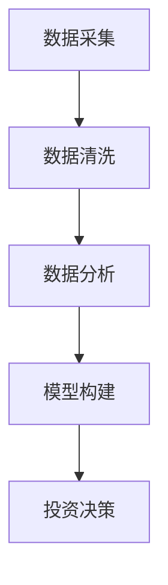

                 


# 如何利用特价股票策略进行逆向数字产业生态投资

**关键词**: 特价股票策略, 逆向投资, 数字产业生态, 投资策略, 量化分析, 投资组合管理

**摘要**: 本文详细探讨了如何利用特价股票策略进行逆向数字产业生态投资，从背景介绍、策略分析、算法原理到实战案例，层层深入，帮助投资者在数字产业中找到被低估的投资机会，构建稳健的投资组合。

---

# 第一章: 特价股票策略与逆向投资概述

## 1.1 特价股票策略的基本概念

### 1.1.1 特价股票的定义与特点

- 特价股票是指市场价格低于其内在价值的股票，通常出现在市场低迷或公司短期遇到困境时。
- 特点包括低估值、高分红率、潜在的上涨空间。

### 1.1.2 逆向投资的基本原理

- 逆向投资是指在市场恐慌时买入，在市场狂热时卖出。
- 逆向投资的核心是寻找市场忽视的机会，利用短期波动实现长期收益。

### 1.1.3 数字产业生态的定义与特征

- 数字产业生态指以数字化技术为核心的产业体系，包括科技、互联网、人工智能等领域。
- 特点包括高成长性、技术驱动、数据依赖。

## 1.2 投资策略的核心要素

### 1.2.1 投资目标的设定

- 确定投资目标：短期收益、长期增值。
- 量化目标：设定收益目标和风险承受能力。

### 1.2.2 风险与收益的平衡

- 风险控制：分散投资、止损机制。
- 收益与风险的权衡：高风险高收益，低风险低收益。

### 1.2.3 投资周期的规划

- 短期投资：抓住市场波动，快速获利。
- 长期投资：持有优质资产，等待价值回归。

## 1.3 特价股票策略与数字产业生态的关系

### 1.3.1 数字产业生态的特点

- 数字产业生态具有高成长性和技术驱动性，适合逆向投资。
- 在市场低迷时，数字产业中的龙头企业可能被低估。

### 1.3.2 特价股票策略在数字产业中的应用

- 通过量化分析筛选出被低估的数字产业股票。
- 结合行业周期，选择处于底部的行业进行投资。

### 1.3.3 逆向投资的优势与挑战

- 优势：提前布局，低位买入，长期收益。
- 挑战：市场波动大，信息不对称，需要深入分析企业基本面。

## 1.4 本章小结

- 特价股票策略和逆向投资是实现超额收益的重要手段。
- 数字产业生态为投资者提供了丰富的投资机会。
- 投资者需要结合市场周期和企业基本面进行综合判断。

---

# 第二章: 特价股票策略的核心概念与分析方法

## 2.1 特价股票的量化分析

### 2.1.1 市盈率与市净率的计算

- 市盈率（P/E）= 股价 / 每股收益。
- 市净率（P/B）= 股价 / 每股净资产。

### 2.1.2 盈利能力分析

- 净利润率 = 净利润 / 营业收入。
- 资产回报率（ROA）= 净利润 / 总资产。

### 2.1.3 偿债能力分析

- 负债率 = 负债总额 / 资产总额。
- 速动比率 = （流动资产 - 存货）/ 流动负债。

## 2.2 逆向投资的逻辑与框架

### 2.2.1 市场周期的分析

- 牛市：高估值，适合卖出。
- 熊市：低估值，适合买入。

### 2.2.2 行业周期的判断

- 行业生命周期：导入期、成长期、成熟期、衰退期。
- 选择处于衰退期的行业中的龙头企业。

### 2.2.3 个股估值的重构

- 基于DCF模型评估企业内在价值。
- 对比当前股价与内在价值，寻找低估机会。

## 2.3 数字产业生态的核心要素

### 2.3.1 数字产业的产业链分析

- 上游：半导体、云计算、大数据。
- 中游：软件开发、互联网平台。
- 下游：消费者、企业用户。

### 2.3.2 关键技术与商业模式

- 关键技术：人工智能、区块链、5G。
- 商业模式：订阅制、广告模式、SaaS。

### 2.3.3 企业竞争优势的评估

- 核心技术优势。
- 市场占有率。
- 管理团队能力。

## 2.4 本章小结

- 特价股票策略需要结合量化分析和基本面分析。
- 逆向投资需要判断市场和行业周期。
- 数字产业生态中的龙头企业是投资的重点。

---

# 第三章: 特价股票策略的算法原理与数学模型

## 3.1 量化分析的数学模型

### 3.1.1 市盈率与市净率的计算公式

- $$市盈率 = \frac{股价}{每股收益}$$
- $$市净率 = \frac{股价}{每股净资产}$$

### 3.1.2 盈利能力分析的指标体系

- 净利润率 = 净利润 / 营业收入。
- 资产回报率（ROA）= 净利润 / 总资产。

### 3.1.3 偿债能力分析的数学模型

- $$负债率 = \frac{负债总额}{资产总额}$$
- $$速动比率 = \frac{流动资产 - 存货}{流动负债}$$

## 3.2 逆向投资的算法流程

### 3.2.1 数据采集与清洗

- 数据来源：股票价格、财务报表、行业报告。
- 数据清洗：处理缺失值、异常值。

### 3.2.2 数据分析与建模

- 使用Python进行数据分析，如Pandas库。
- 构建量化模型，如因子模型。

### 3.2.3 投资决策的生成

- 基于模型结果，生成买入或卖出信号。
- 结合市场周期，调整投资组合。

## 3.3 算法流程图



## 3.4 本章小结

- 量化分析需要结合数学模型和编程工具。
- 逆向投资需要结合市场周期和行业分析。
- 算法流程图帮助投资者系统化投资决策。

---

# 第四章: 数字产业生态中的逆向投资策略

## 4.1 数字产业生态的逆向投资逻辑

### 4.1.1 数字产业的周期性

- 数字产业受技术驱动，具有较强的周期性。
- 在熊市中，数字产业可能被过度抛售。

### 4.1.2 选择被低估的数字企业

- 基于量化指标，筛选低市盈率、低市净率的企业。
- 结合行业地位，选择龙头企业。

### 4.1.3 长期持有与价值回归

- 逆向投资需要耐心，等待价值回归。
- 长期持有优质资产，分享企业成长。

## 4.2 数字产业生态中的投资组合管理

### 4.2.1 投资组合的构建

- 分散投资：避免过度集中。
- 仓位管理：根据市场情况调整仓位。

### 4.2.2 风险控制

- 设置止损点，防止亏损扩大。
- 定期评估投资组合，及时调整。

### 4.2.3 价值发现与再平衡

- 定期审视投资组合，发现新的投资机会。
- 再平衡投资组合，保持最优配置。

## 4.3 本章小结

- 数字产业生态为逆向投资提供了丰富的标的。
- 投资组合管理是实现稳健收益的关键。
- 风险控制和长期持有是逆向投资的核心。

---

# 第五章: 特价股票策略的实战与案例分析

## 5.1 特价股票策略的实战环境搭建

### 5.1.1 数据源选择

- 使用Yahoo Finance获取股票数据。
- 使用公司财报获取财务数据。

### 5.1.2 工具安装

- 安装Python，安装Pandas、NumPy、Matplotlib等库。

### 5.1.3 数据清洗与预处理

- 处理缺失值和异常值。
- 数据标准化和归一化。

## 5.2 代码实现与分析

### 5.2.1 数据获取与可视化

```python
import pandas as pd
import matplotlib.pyplot as plt

# 获取股票数据
df = pd.read_csv('stock_data.csv')
df['日期'] = pd.to_datetime(df['日期'])
df.set_index('日期', inplace=True)

# 绘制股价走势
plt.figure(figsize=(10,6))
df['收盘价'].plot()
plt.title('股价走势')
plt.xlabel('日期')
plt.ylabel('股价')
plt.show()
```

### 5.2.2 量化分析与策略执行

```python
import numpy as np

# 计算市盈率
df['市盈率'] = df['收盘价'] / df['每股收益']

# 筛选低估股票
低估股票 = df[df['市盈率'] < np.mean(df['市盈率'])]

print('低估股票数量:', len(低估股票))
```

### 5.2.3 投资组合管理

```python
# 定义投资组合
投资组合 = [stock1, stock2, stock3]

# 计算投资组合收益
收益 = sum(股票收益 for 股票 in 投资组合)
```

## 5.3 案例分析与经验总结

### 5.3.1 案例分析

- 选择一个数字产业中的企业，如科技公司A。
- 计算其市盈率、市净率等指标，判断是否低估。
- 结合行业分析，评估其投资价值。

### 5.3.2 经验总结

- 数据分析是投资决策的基础。
- 市场周期判断是投资成功的关键。
- 风险控制是投资稳健的保障。

## 5.4 本章小结

- 实战部分帮助投资者掌握数据获取和分析的技能。
- 案例分析提供了具体的操作步骤和经验总结。
- 投资者需要结合市场实际情况调整策略。

---

# 第六章: 风险控制与投资组合优化

## 6.1 风险控制策略

### 6.1.1 市场风险

- 通过分散投资降低市场风险。
- 选择不同行业的股票分散风险。

### 6.1.2 个股风险

- 选择基本面良好的企业。
- 定期评估个股风险，及时调整持仓。

### 6.1.3 操作风险

- 制定严格的投资计划。
- 避免情绪化交易，坚持纪律性投资。

## 6.2 投资组合优化

### 6.2.1 现有投资组合评估

- 评估投资组合的收益与风险。
- 分析投资组合的分散性和相关性。

### 6.2.2 优化策略

- 重新平衡投资组合。
- 调整持仓结构，降低风险。

### 6.2.3 优化后的效果评估

- 重新评估投资组合的收益与风险。
- 对比优化前后的效果，总结经验。

## 6.3 本章小结

- 风险控制是投资成功的重要保障。
- 投资组合优化是实现稳健收益的关键。
- 投资者需要不断学习和调整策略。

---

# 第七章: 总结与展望

## 7.1 全文总结

- 特价股票策略是实现超额收益的重要手段。
- 逆向投资在数字产业生态中具有广阔的应用前景。
- 投资者需要结合市场周期和企业基本面进行综合判断。

## 7.2 最佳实践

- 定期进行市场和行业分析。
- 结合量化分析和基本面分析。
- 保持长期投资心态，耐心等待价值回归。

## 7.3 未来展望

- 数字产业生态将继续快速发展。
- 人工智能和大数据将为投资分析提供更多工具。
- 逆向投资策略将更加多元化和精细化。

## 7.4 结语

- 投资是一场马拉松，需要耐心和纪律。
- 特价股票策略和逆向投资是实现长期收益的重要策略。
- 读者需要结合实际情况，灵活调整投资策略。

---

**结语**: 通过本文的系统介绍，读者可以掌握如何利用特价股票策略进行逆向数字产业生态投资，从理论到实践，从分析到操作，全面了解投资的各个环节。希望本文能为投资者提供有价值的参考和指导。

