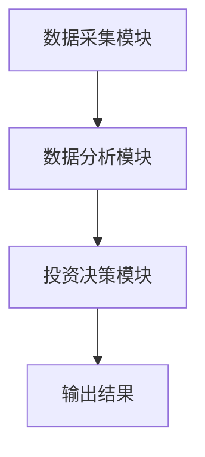

                 


# 如何利用特价股票策略进行逆向数字产业生态投资

> 关键词：特价股票策略、逆向投资、数字产业生态、量化分析、数学模型

> 摘要：本文详细探讨了如何利用特价股票策略进行逆向数字产业生态投资，从策略背景、核心概念、算法原理到实战应用，层层解析，结合量化分析和数学模型，为读者提供一套系统化的投资方法论。

---

## 第1章: 特价股票策略与逆向投资概述

### 1.1 特价股票策略的基本概念

#### 1.1.1 特价股票的定义与特点
- 特价股票：指在市场低迷或企业遇到短期困难时，价格被市场低估的股票。
- 特点：
  - 价格低于内在价值。
  - 市场情绪悲观，投资者避之不及。
  - 存在价值回归的潜力。

#### 1.1.2 逆向投资的基本原理
- 逆向投资：在市场恐慌时买入，在市场乐观时卖出。
- 核心思想：与市场情绪相反操作。
- 优势：
  - 低位买入，高位卖出。
  - 利用市场的非理性定价。

#### 1.1.3 数字产业生态的定义与特征
- 数字产业生态：由数字技术驱动的产业链网络，涵盖IT、互联网、人工智能等领域。
- 特征：
  - 技术驱动性强。
  - 产业链复杂，生态化程度高。
  - 创新速度快，周期波动大。

### 1.2 投资策略的核心要素

#### 1.2.1 投资目标的设定
- 短期目标：捕捉市场低估机会。
- 长期目标：构建价值投资组合。

#### 1.2.2 风险与收益的平衡
- 风险控制：避免过度集中。
- 收益目标：追求超额收益。

#### 1.2.3 投资周期的规划
- 短期：捕捉市场反弹。
- 中期：布局行业反转。
- 长期：构建生态投资组合。

### 1.3 特价股票策略与数字产业生态的关系

#### 1.3.1 数字产业生态的特点
- 数字产业生态具有高度的技术依赖性和产业链复杂性。
- 生态中的企业之间相互依存，协同发展。

#### 1.3.2 特价股票策略在数字产业中的应用
- 在数字产业生态中，特价股票策略可以帮助投资者发现被市场低估的企业。
- 逆向投资可以在数字产业低迷时布局，抓住价值回归的机会。

#### 1.3.3 逆向投资的优势与挑战
- 优势：逆向投资能够在市场底部发现价值，避免高位接盘。
- 挑战：需要对数字产业生态有深刻理解，避免选择夕阳产业。

### 1.4 本章小结
本章介绍了特价股票策略和逆向投资的基本概念，分析了数字产业生态的特点，并探讨了两者的结合方式。下一章将深入探讨特价股票策略的核心概念与分析方法。

---

## 第2章: 特价股票策略的核心概念

### 2.1 特价股票的量化分析

#### 2.1.1 市盈率与市净率的计算
- 市盈率（P/E）= 股价 / 每股净利润。
- 市净率（P/B）= 股价 / 每股净资产。
- 量化分析帮助识别低估股票。

#### 2.1.2 盈利能力分析
- � 净利润增长率：净利润同比增长率。
-  净资产收益率（ROE）：衡量企业盈利能力。

#### 2.1.3 偿债能力分析
-  负债率：总负债 / 总资产。
-  流动比率：流动资产 / 流动负债。

#### 2.1.4 财务健康度评估
-  通过财务指标综合评估企业的健康状况。

### 2.2 逆向投资的逻辑与框架

#### 2.2.1 市场周期的分析
-  市场周期：牛市、熊市、震荡市。
-  逆向投资在熊市中布局。

#### 2.2.2 行业周期的判断
-  行业周期：上升期、成熟期、衰退期。
-  逆向投资选择衰退期的行业龙头。

#### 2.2.3 个股估值的重构
-  个股估值：DCF模型、可比估值法。
-  重构估值帮助发现低估股票。

### 2.3 数字产业生态的核心要素

#### 2.3.1 数字产业的产业链分析
-  产业链：硬件、软件、服务。
-  生态协同：各环节相互依存。

#### 2.3.2 关键技术与商业模式
-  关键技术：AI、大数据、云计算。
-  商业模式：SaaS、广告、订阅。

#### 2.3.3 企业竞争优势的评估
-  技术优势：创新能力强。
-  市场优势：市场份额高。
-  财务优势：盈利能力强。

### 2.4 本章小结
本章详细介绍了特价股票策略的量化分析方法，逆向投资的逻辑框架，以及数字产业生态的核心要素。下一章将深入探讨策略的算法原理与数学模型。

---

## 第3章: 特价股票策略的算法原理与数学模型

### 3.1 量化分析的数学模型

#### 3.1.1 市盈率与市净率的计算公式
- 市盈率：P/E = 股价 / 每股净利润。
- 市净率：P/B = 股价 / 每股净资产。

#### 3.1.2 盈利能力分析的指标体系
- 净利润增长率：(本期净利润 - 上期净利润) / 上期净利润。
- 净资产收益率：ROE = 净利润 / 净资产。

#### 3.1.3 偿债能力分析的数学模型
- 负债率：负债率 = 总负债 / 总资产。
- 流动比率：流动比率 = 流动资产 / 流动负债。

### 3.2 逆向投资的算法流程

#### 3.2.1 数据采集与清洗
- 数据源：股票价格、财务数据、行业数据。
- 数据清洗：去除缺失值、异常值。

#### 3.2.2 数据分析与建模
- 数据分析：计算市盈率、市净率等指标。
- 建模：构建量化模型，筛选低估股票。

#### 3.2.3 投资决策的生成
- 投资决策：根据模型结果，生成买入信号。

### 3.3 数学模型的实现

#### 3.3.1 市盈率与市净率的计算
```python
def calculate_pe(stock_price, net_profit_per_share):
    return stock_price / net_profit_per_share

def calculate_pb(stock_price, book_value_per_share):
    return stock_price / book_value_per_share
```

#### 3.3.2 盈利能力分析
```python
def calculate_net_profit_growth(current_net_profit, previous_net_profit):
    return (current_net_profit - previous_net_profit) / previous_net_profit

def calculate_roe(net_profit, net_assets):
    return net_profit / net_assets
```

#### 3.3.3 偿债能力分析
```python
def calculate_debt_ratio(total_debt, total_assets):
    return total_debt / total_assets

def calculate_current_ratio(current_assets, current_liabilities):
    return current_assets / current_liabilities
```

### 3.4 本章小结
本章通过数学模型和算法流程，详细介绍了特价股票策略的实现方法。下一章将结合实际案例，展示如何在数字产业生态中应用这些策略。

---

## 第4章: 特价股票策略在数字产业生态中的实战应用

### 4.1 系统架构与功能设计

#### 4.1.1 系统功能模块
- 数据采集模块：采集股票数据。
- 数据分析模块：计算估值指标。
- 投资决策模块：生成买卖信号。

#### 4.1.2 系统架构图


### 4.2 项目实战

#### 4.2.1 环境搭建
- 环境：Python 3.8+，Jupyter Notebook。
- 工具：Pandas、NumPy、Matplotlib。

#### 4.2.2 核心实现源代码
```python
import pandas as pd
import numpy as np
import matplotlib.pyplot as plt

# 数据加载
df = pd.read_csv('stock_data.csv')

# 市盈率计算
df['PE'] = df['stock_price'] / df['net_profit_per_share']

# 市净率计算
df['PB'] = df['stock_price'] / df['book_value_per_share']

# 可视化
plt.scatter(df['PE'], df['PB'], c='blue')
plt.xlabel('PE')
plt.ylabel('PB')
plt.title('PE vs PB Visualization')
plt.show()
```

#### 4.2.3 案例分析
- 案例：某数字产业龙头股。
- 分析：计算市盈率、市净率，判断是否低估。

#### 4.2.4 项目小结
通过实战项目，验证了算法的有效性，展示了如何在实际中应用。

### 4.3 本章小结
本章通过实战案例，展示了如何利用特价股票策略在数字产业生态中进行投资。下一章将总结全文，并提出未来的研究方向。

---

## 第5章: 总结与展望

### 5.1 总结
- 本文详细探讨了特价股票策略与逆向投资的结合。
- 提供了系统的投资方法论，包括量化分析、数学模型和实战应用。

### 5.2 展望
- 未来研究方向：动态估值模型、多因子分析。
- 技术发展：人工智能在投资中的应用。

### 5.3 注意事项
- 风险提示：市场波动、数据质量。
- 投资建议：长期持有、分散投资。

### 5.4 最佳实践
- 定期复盘：评估策略效果。
- 持续学习：关注行业动态。

---

## 附录

### 附录A: 常用股票估值公式
- 市盈率（P/E）= 股价 / 每股净利润。
- 市净率（P/B）= 股价 / 每股净资产。
- 净资产收益率（ROE）= 净利润 / 净资产。

### 附录B: 数据采集工具推荐
- Python：pandas、requests。
- 第三方API：Yahoo Finance API。

---

通过以上结构和内容，本文为读者提供了一套完整的利用特价股票策略进行逆向数字产业生态投资的方法论，结合理论与实践，帮助读者在复杂多变的市场中捕捉投资机会。

