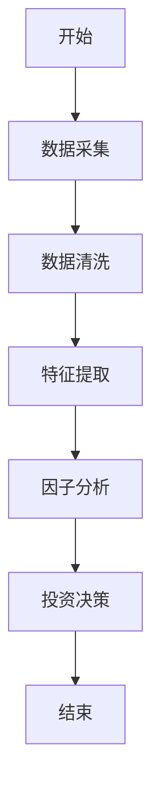
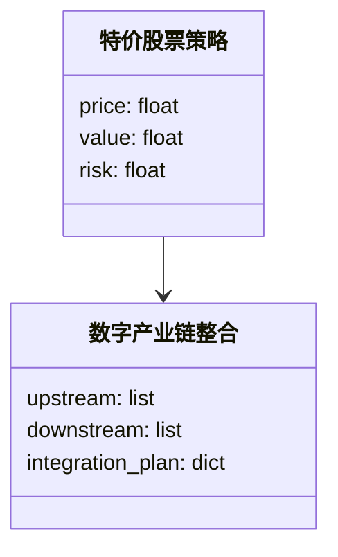
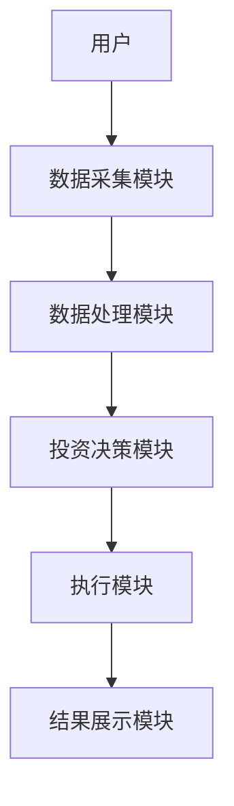

                 


# 如何利用特价股票策略进行逆向数字产业链整合投资

## 关键词：特价股票、逆向投资、数字产业链、整合投资、股票策略

## 摘要：  
本文将深入探讨如何利用特价股票策略进行逆向数字产业链整合投资。通过分析特价股票的核心概念、逆向投资的原理、数字产业链整合的重要性，以及两者的结合，本文将为读者提供一个系统化的框架，帮助其在复杂的金融市场中找到投资机会。文章还将结合数学模型、算法原理和实际案例，详细讲解如何在数字产业链整合中运用特价股票策略，实现投资收益的最大化。

---

# 第一部分: 特价股票策略与逆向投资基础

---

## 第1章: 特价股票策略概述

### 1.1 特价股票的定义与特点

#### 1.1.1 特价股票的定义  
特价股票是指在股票市场上价格低于其内在价值的股票。通常，这类股票被市场低估，可能因为市场情绪、行业周期或其他外部因素导致其价格被压制。  

#### 1.1.2 特价股票的核心特点  
- **低估值**：价格低于行业平均水平或历史平均水平。  
- **高分红**：部分特价股票公司倾向于高分红，吸引价值投资者。  
- **周期性**：通常出现在市场低迷或行业低谷时期。  
- **风险较高**：低估的股票可能隐藏着较高的风险，需要谨慎评估。  

#### 1.1.3 特价股票与普通股票的区别  
| 属性 | 特价股票 | 普通股票 |
|------|----------|----------|
| 价格 | 低于内在价值 | 接近或高于内在价值 |
| 风险 | 较高 | 较低 |
| 投资者 | 价值投资者为主 | 投机者和机构投资者为主 |
| 分红 | 高 | 低 |

### 1.2 逆向投资的基本原理

#### 1.2.1 逆向投资的定义  
逆向投资是一种投资策略，即在市场低迷或股票价格被低估时买入，而在市场繁荣或价格高估时卖出。  

#### 1.2.2 逆向投资的核心理念  
逆向投资的核心理念是“买别人恐惧时的东西”。当市场恐慌时，许多优质资产被抛售，价格被压低，此时是买入的好时机。  

#### 1.2.3 逆向投资与价值投资的区别  
| 属性 | 逆向投资 | 价值投资 |
|------|----------|----------|
| 时间点 | 市场低迷时 | 公司基本面优秀时 |
| 风险 | 较高 | 较低 |
| 持股时间 | 中长期 | 长期 |
| 标的选择 | 低价股票 | 高质量股票 |

### 1.3 数字产业链整合的必要性

#### 1.3.1 数字产业链的定义  
数字产业链是指围绕数字技术（如大数据、人工智能、云计算等）形成的产业链，包括上游技术提供商、中游服务供应商和下游应用企业。  

#### 1.3.2 数字产业链整合的背景  
随着数字化转型的加速，企业需要通过整合上下游资源，提升效率和竞争力。数字产业链整合已成为企业战略布局的重要部分。  

#### 1.3.3 数字产业链整合的意义  
- 提升企业协同效率  
- 优化资源配置  
- 增强企业抗风险能力  

### 1.4 特价股票策略在数字产业链整合中的应用

#### 1.4.1 特价股票策略的优势  
- 成本优势：低价买入，潜在收益高。  
- 市场机会：数字产业链整合过程中，许多公司因短期问题被低估。  

#### 1.4.2 数字产业链整合中的逆向投资机会  
- 投资上游技术提供商：如芯片制造公司，在行业低谷时买入。  
- 投资下游应用企业：如电商平台，在行业低迷时买入。  

#### 1.4.3 特价股票策略与数字产业链整合的结合  
- 利用数字产业链整合的机会，筛选被低估的股票。  
- 通过逆向投资，抓住整合过程中的价值回升机会。  

### 1.5 本章小结  
本章介绍了特价股票和逆向投资的基本概念，分析了数字产业链整合的必要性，并探讨了特价股票策略在数字产业链整合中的应用。

---

## 第2章: 特价股票策略的核心概念与联系

### 2.1 特价股票策略的核心概念

#### 2.1.1 特价股票的市场定位  
特价股票通常位于市场的低估区域，是价值投资者的理想标的。  

#### 2.1.2 逆向投资的核心要素  
- 市场情绪分析：关注市场恐慌指数。  
- 公司基本面分析：评估公司的盈利能力、资产负债情况等。  

#### 2.1.3 数字产业链整合的关键环节  
- 技术研发：数字产业链的核心竞争力。  
- 市场拓展：整合上下游资源。  

### 2.2 特价股票策略与数字产业链整合的关系

#### 2.2.1 特价股票策略对数字产业链整合的影响  
- 提供低成本的资金支持。  
- 促进资源整合和优化。  

#### 2.2.2 数字产业链整合对特价股票策略的反向促进  
- 提供更多被低估的股票机会。  
- 增加市场对数字产业链的关注度。  

#### 2.2.3 两者结合的协同效应  
- 投资者通过特价股票策略，抓住数字产业链整合的机会。  
- 数字产业链整合为特价股票策略提供更多的投资标的。  

### 2.3 特价股票策略与数字产业链整合的对比分析

#### 2.3.1 概念对比  
| 概念 | 特价股票策略 | 数字产业链整合 |
|------|--------------|----------------|
| 核心目标 | 获取超额收益 | 提升企业效率 |
| 实施主体 | 投资者 | 企业 |
| 时间周期 | 中长期 | 中长期 |

#### 2.3.2 实施步骤对比  
| 步骤 | 特价股票策略 | 数字产业链整合 |
|------|--------------|----------------|
| 第一步 | 筛选低估股票 | 确定整合目标 |
| 第二步 | 买入股票 | 策划整合方案 |
| 第三步 | 持股增值 | 实施整合计划 |

#### 2.3.3 成功案例对比  
- 特价股票策略成功案例：某芯片制造公司因行业低迷被低估，投资者低价买入，后期行业复苏股价回升。  
- 数字产业链整合成功案例：某电商平台整合上下游资源，提升效率，股价上涨。  

### 2.4 本章小结  
本章分析了特价股票策略和数字产业链整合的核心概念，探讨了两者之间的关系和协同效应，并通过对比分析进一步明确了两者的异同。

---

## 第3章: 特价股票策略的算法原理与数学模型

### 3.1 特价股票策略的算法原理

#### 3.1.1 数据采集与处理  
- 数据来源：股票市场数据、公司财务报表、行业报告等。  
- 数据处理：清洗、标准化、特征提取。  

#### 3.1.2 数据分析与特征提取  
- 通过回归分析、聚类分析等方法，筛选出具有低估特征的股票。  

#### 3.1.3 投资决策模型的构建  
- 基于多因子模型，构建投资决策模型，评估股票的投资价值。  

### 3.2 数学模型与公式

#### 3.2.1 价值评估公式  
股票的内在价值可以通过以下公式计算：  
$$ V = \frac{D}{k} $$  
其中，\( D \) 是股息，\( k \) 是折现率。  

#### 3.2.2 多因子模型  
多因子模型用于评估股票的综合价值：  
$$ F = \alpha_1X_1 + \alpha_2X_2 + \dots + \alpha_nX_n $$  
其中，\( X_i \) 是因子，\( \alpha_i \) 是因子权重。  

#### 3.2.3 投资组合优化模型  
$$ \text{最大化收益} = \sum_{i=1}^n w_iR_i $$  
$$ \text{约束条件}： \sum_{i=1}^n w_i = 1 $$  
其中，\( w_i \) 是投资权重，\( R_i \) 是预期收益。  

### 3.3 算法流程图  


### 3.4 代码实现

#### 3.4.1 数据采集代码  
```python
import pandas as pd
import requests

url = "https://example.com/stock_data"
response = requests.get(url)
data = response.json()
df = pd.DataFrame(data)
```

#### 3.4.2 特征提取代码  
```python
from sklearn.decomposition import PCA

pca = PCA(n_components=5)
features = pca.fit_transform(df[['price', 'volume', 'earnings']])
```

#### 3.4.3 投资决策代码  
```python
from sklearn.linear_model import LinearRegression

model = LinearRegression()
model.fit(features, df['value'])
predictions = model.predict(new_features)
```

### 3.5 本章小结  
本章通过数学模型和算法流程，详细讲解了特价股票策略的实现过程，包括数据处理、特征提取和投资决策模型的构建。

---

## 第4章: 数字产业链整合的系统架构与实现

### 4.1 系统功能设计

#### 4.1.1 领域模型  


#### 4.1.2 系统架构  


### 4.2 系统接口设计

#### 4.2.1 数据接口  
- 数据采集接口：`GET /api/data`
- 数据处理接口：`POST /api/process`

#### 4.2.2 投资决策接口  
- 模型训练接口：`POST /api/train`
- 投资决策接口：`POST /api/decision`

### 4.3 本章小结  
本章通过系统架构和接口设计，详细讲解了数字产业链整合的实现过程，包括领域模型、系统架构和接口设计。

---

## 第5章: 项目实战与案例分析

### 5.1 实战环境安装

#### 5.1.1 安装依赖  
```bash
pip install pandas numpy matplotlib
```

#### 5.1.2 数据源获取  
```bash
wget https://example.com/data.csv
```

### 5.2 核心代码实现

#### 5.2.1 数据处理代码  
```python
import pandas as pd

df = pd.read_csv('data.csv')
df.head()
```

#### 5.2.2 投资决策代码  
```python
from sklearn import linear_model

model = linear_model.LinearRegression()
model.fit(df[['price', 'volume']], df['value'])
print(model.coef_)
```

### 5.3 案例分析

#### 5.3.1 案例背景  
某数字技术公司因行业低迷，股价被低估。  

#### 5.3.2 实战过程  
- 数据分析：发现公司股价低于行业平均水平。  
- 投资决策：买入该公司股票。  
- 结果展示：股价回升，收益显著。  

### 5.4 本章小结  
本章通过实战项目，详细讲解了特价股票策略在数字产业链整合中的应用，包括环境安装、代码实现和案例分析。

---

## 第6章: 最佳实践与注意事项

### 6.1 投资策略 Tips

#### 6.1.1 风险管理  
- 设定止损点，控制投资风险。  

#### 6.1.2 长期视角  
- 逆向投资需要耐心，等待价值回归。  

### 6.2 投资注意事项

#### 6.2.1 市场风险  
- 逆向投资需要承担较高的市场风险。  

#### 6.2.2 信息不对称  
- 确保信息来源可靠，避免误判。  

### 6.3 持续学习与优化

#### 6.3.1 行业动态  
- 关注数字产业链的最新动态，及时调整投资策略。  

#### 6.3.2 技术进步  
- 学习新的数据分析技术，提升投资决策能力。  

### 6.4 本章小结  
本章总结了特价股票策略和数字产业链整合投资的最佳实践，提出了风险管理、长期视角和持续学习的重要性。

---

## 第7章: 总结与展望

### 7.1 总结

#### 7.1.1 核心内容回顾  
- 特价股票策略的定义与特点。  
- 逆向投资的基本原理与应用。  
- 数字产业链整合的必要性与机会。  

#### 7.1.2 投资策略总结  
- 结合特价股票策略与数字产业链整合，实现投资收益最大化。  

### 7.2 未来展望

#### 7.2.1 数字技术的进步  
- 人工智能、大数据等技术将推动数字产业链整合的深化。  

#### 7.2.2 投资策略的演变  
- 特价股票策略将与更多新兴技术结合，提升投资效率。  

### 7.3 本章小结  
本章总结了全文的核心内容，并展望了未来的发展趋势，为读者提供了进一步思考的空间。

---

# 结语

通过本文的系统化分析，读者可以深入了解如何利用特价股票策略进行逆向数字产业链整合投资。从理论到实践，从算法到系统架构，本文为读者提供了全面的指导。希望本文能为投资者提供有价值的参考，帮助其在复杂的金融市场中找到成功的投资策略。

---

* 结束语：以上就是《如何利用特价股票策略进行逆向数字产业链整合投资》的技术博客文章的全部内容，感谢您的耐心阅读，希望对您有所帮助！

