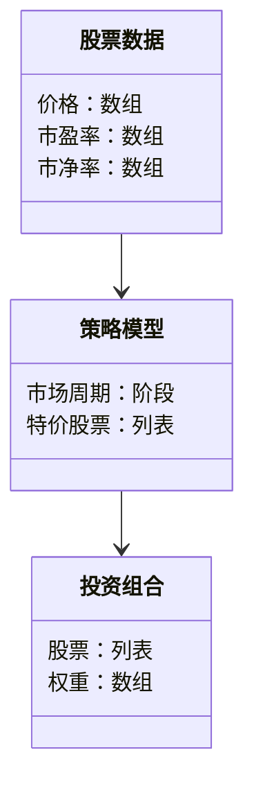
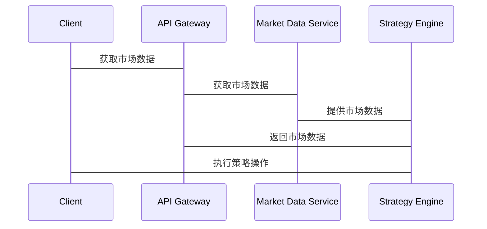

                 


# 如何利用特价股票策略进行逆周期资产配置

> 关键词：逆周期资产配置，特价股票策略，投资组合优化，数学模型，系统架构

> 摘要：本文详细探讨了如何利用特价股票策略进行逆周期资产配置，通过数学模型和系统架构的设计，结合实际案例分析，为投资者提供了一套科学的投资策略。

---

# 第一章：逆周期资产配置与特价股票策略概述

## 1.1 逆周期资产配置的核心概念

### 1.1.1 逆周期投资的基本原理

逆周期投资是一种在经济周期波动中进行资产配置的策略。经济周期通常分为四个阶段：衰退、复苏、过热和滞胀。逆周期投资的目标是在市场低谷时增加投资，在市场高点时减少投资，从而在不同周期阶段优化资产配置，降低风险并最大化收益。

### 1.1.2 特价股票策略的定义与背景

特价股票策略是指在市场低迷时期，寻找价格被低估的股票进行投资的策略。这种策略通常在市场底部时买入，市场顶部时卖出，利用市场的周期性波动获取超额收益。

### 1.1.3 特价股票策略在逆周期配置中的作用

在逆周期资产配置中，特价股票策略可以帮助投资者在市场低谷时发现价值，避免在市场高点时的过度投资。通过合理配置特价股票，投资者可以在经济衰退时期保护资本，在经济复苏时期获得超额收益。

## 1.2 特价股票策略的关键要素

### 1.2.1 市场周期分析

市场周期分析是逆周期投资的基础。通过分析经济指标、市场趋势和行业数据，投资者可以识别市场的周期阶段，从而制定相应的投资策略。

### 1.2.2 特价股票的识别方法

识别特价股票的关键在于评估股票的内在价值。常用的方法包括市盈率（P/E ratio）、市净率（P/B ratio）等估值指标。通过比较市场价格与内在价值的差异，投资者可以找到被低估的股票。

### 1.2.3 风险控制与仓位管理

在逆周期投资中，风险控制至关重要。投资者需要根据市场周期和资产配置目标，合理调整投资仓位，避免过度集中或过度分散的风险。

---

# 第二章：特价股票策略的核心原理与数学模型

## 2.1 特价股票策略的数学模型

### 2.1.1 市场趋势分析的回归模型

回归分析是常用的市场趋势预测方法。通过建立回归模型，投资者可以预测未来市场的走势，从而制定相应的投资策略。

$$ R_{t} = \alpha + \beta R_{t-1} + \epsilon_{t} $$

其中，$R_{t}$ 表示当前市场收益，$R_{t-1}$ 表示前一期的市场收益，$\epsilon_{t}$ 表示误差项。

### 2.1.2 市场估值指标的计算公式

市盈率（P/E ratio）是常用的市场估值指标，计算公式为：

$$ P/E \, ratio = \frac{Price}{Earnings} $$

其中，$Price$ 是股票的价格，$Earnings$ 是每股收益。

### 2.1.3 风险调整收益模型

风险调整收益模型通过调整资产的预期收益，以反映其风险水平。常用的模型包括夏普比率（Sharpe Ratio）和特雷诺比率（Treynor Ratio）。

## 2.2 特价股票策略的算法原理

### 2.2.1 市场周期识别算法

市场周期识别算法通过分析市场数据，识别当前所处的经济周期阶段。常用的算法包括移动平均法（Moving Average）和趋势分析法（Trend Analysis）。

### 2.2.2 特价股票筛选算法

特价股票筛选算法通过筛选市盈率、市净率等估值指标，识别出价格被低估的股票。

### 2.2.3 投资组合优化算法

投资组合优化算法通过优化资产配置，最大化收益并最小化风险。常用的算法包括现代投资组合理论（MPT）和均值-方差优化（Mean-Variance Optimization）。

---

# 第三章：系统分析与架构设计方案

## 3.1 项目背景与目标

本项目旨在开发一个基于特价股票策略的逆周期资产配置系统，帮助投资者在不同经济周期阶段优化资产配置，实现稳健投资收益。

## 3.2 系统功能设计

### 3.2.1 系统功能模块

- **市场数据采集模块**：采集市场数据，包括股票价格、市盈率、市净率等。
- **策略执行模块**：根据市场数据和策略模型，执行买入或卖出操作。
- **风险控制模块**：监控市场风险，调整投资组合。

### 3.2.2 领域模型



## 3.3 系统架构设计

### 3.3.1 系统架构图

```mermaid
archi
    title 特价股票策略系统架构
    client --> API Gateway
    API Gateway --> Market Data Service
    Market Data Service --> Database
    Market Data Service --> Strategy Engine
    Strategy Engine --> Risk Control
    Risk Control --> Database
    Database --> Report Generator
```

## 3.4 系统接口设计

### 3.4.1 API 接口

- `/api/market_data`: 获取市场数据
- `/api/strategy_execution`: 执行策略操作
- `/api/risk_monitor`: 监控市场风险

### 3.4.2 数据流设计



---

# 第四章：项目实战：基于特价股票策略的逆周期资产配置实现

## 4.1 环境安装

### 4.1.1 安装 Python

```bash
python --version
pip install --upgrade pip
```

### 4.1.2 安装依赖库

```bash
pip install numpy pandas matplotlib
```

## 4.2 核心代码实现

### 4.2.1 数据获取

```python
import pandas as pd
import numpy as np

def get_market_data(ticker):
    # 获取市场数据
    pass

def calculate_pe_ratio(df):
    # 计算市盈率
    df['PE'] = df['Price'] / df['Earnings']
    return df
```

### 4.2.2 策略实现

```python
def identify_value_stocks(df, threshold=15):
    # 识别市盈率低于阈值的股票
    value_stocks = df[df['PE'] < threshold]
    return value_stocks
```

### 4.2.3 投资组合优化

```python
def optimize_portfolio(stocks, weights):
    # 计算投资组合的收益与风险
    returns = stocks.dot(weights)
    variance = np.dot(weights.T, stocks.dot(weights))
    return returns, variance
```

## 4.3 实际案例分析

### 4.3.1 数据分析

```python
market_data = pd.read_csv('market_data.csv')
value_stocks = identify_value_stocks(market_data)
print(value_stocks.head())
```

### 4.3.2 投资组合优化

```python
weights = np.array([0.3, 0.2, 0.5])
returns, variance = optimize_portfolio(value_stocks, weights)
print(f'Expected Return: {returns}')
print(f'Variance: {variance}')
```

---

# 第五章：最佳实践与注意事项

## 5.1 最佳实践

### 5.1.1 定期回顾与调整

投资者应定期回顾投资组合的表现，并根据市场变化调整资产配置。

### 5.1.2 风险控制

在逆周期投资中，风险控制至关重要。投资者应设定止损点，避免过度损失。

## 5.2 注意事项

### 5.2.1 市场周期的不确定性

市场周期的预测存在不确定性，投资者应保持灵活性，及时调整策略。

### 5.2.2 数据质量的重要性

数据质量直接影响策略的效果，投资者应选择可靠的数据源，并进行数据清洗。

## 5.3 拓展阅读

- 《投资学》
- 《算法交易》
- 《风险管理》

---

# 小结

通过本文的详细讲解，读者可以系统地了解如何利用特价股票策略进行逆周期资产配置。从理论分析到实际操作，从数学模型到系统实现，本文为投资者提供了一套完整的解决方案。希望本文能为投资者在逆周期投资中提供有价值的参考和指导。

