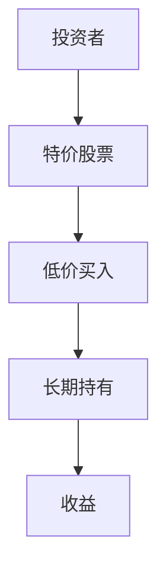
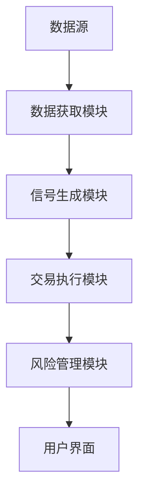
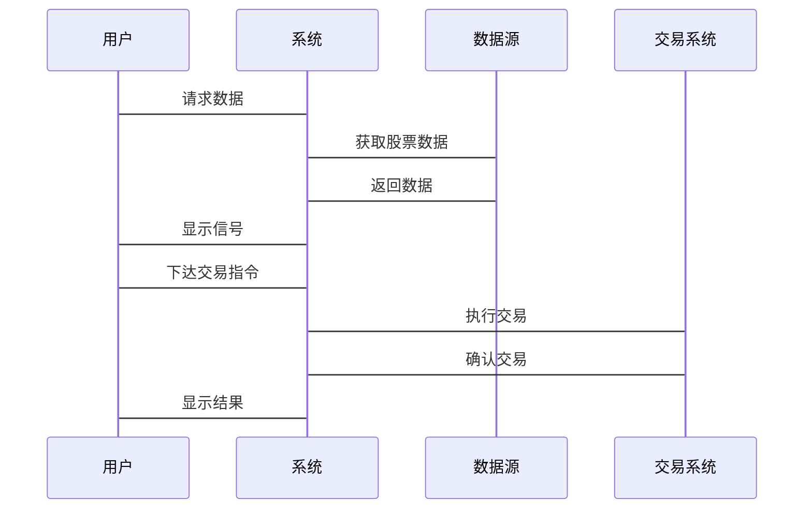

                 


# 如何利用特价股票策略进行长期财富积累

## 关键词：
特价股票、长期财富积累、投资策略、风险管理、价值投资

## 摘要：
本文详细探讨了如何利用特价股票策略进行长期财富积累。首先介绍了特价股票的基本概念和长期投资的重要性，然后分析了特价股票策略的核心原理和优势。接着，从算法原理、系统架构、项目实战等多个角度，深入讲解了如何通过数学模型和系统设计优化特价股票投资。最后，总结了投资中的最佳实践，帮助读者制定有效的投资策略，实现财富的长期增长。

---

# 第一部分: 特价股票策略的背景与基础

## 第1章: 特价股票策略概述

### 1.1 特价股票策略的基本概念
#### 1.1.1 什么是特价股票
特价股票是指价格低于其内在价值的股票。通常情况下，这些股票可能暂时被市场低估，但具有长期增长的潜力。投资者通过低价买入，等待其价值回归，从而获得收益。

#### 1.1.2 特价股票的特点与优势
- **低价买入**：特价股票的价格通常低于市场平均水平，降低了初始投资成本。
- **潜在回报高**：由于价格被低估，未来上涨的可能性较大。
- **风险相对较低**：相比高价股票，特价股票的风险分散性更好。

#### 1.1.3 特价股票与普通股票的区别
| 属性       | 特价股票             | 普通股票             |
|------------|----------------------|----------------------|
| 价格       | 低于市场价           | 接近或高于市场价     |
| 风险       | 相对较低             | 较高                |
| 回报       | 潜在回报较高         | 较稳定              |

### 1.2 长期财富积累的重要性
#### 1.2.1 财富积累的基本概念
财富积累是通过长期投资和复利效应，逐步增加资产的过程。长期投资能够平滑市场波动，降低风险，实现资产的稳健增长。

#### 1.2.2 长期投资与短期投资的对比
| 属性       | 长期投资             | 短期投资             |
|------------|----------------------|----------------------|
| 风险       | 较低                | 较高                |
| 回报       | 稳定且可持续         | 不稳定              |
| 时间       | 数年甚至数十年       | 几个月至几年        |

#### 1.2.3 特价股票策略在财富积累中的作用
特价股票策略通过低价买入和长期持有，利用复利效应，帮助投资者实现财富的稳步增长。

### 1.3 特价股票策略的优势
#### 1.3.1 低价买入的潜在收益
通过买入特价股票，投资者能够在价格回升时获得资本收益。例如，一只价值10元的股票以5元价格买入，当其回升到10元时，收益率为100%。

#### 1.3.2 风险控制的优势
特价股票的价格波动较小，且通常具有较高的安全边际，能够在市场波动中降低风险。

#### 1.3.3 长期持有的稳定性
长期持有特价股票能够平滑短期波动，避免频繁交易带来的成本和风险。

### 1.4 特价股票策略的边界与外延
#### 1.4.1 特价股票的适用范围
特价股票适用于市场周期的底部或震荡期，适合长期投资者。

#### 1.4.2 特价股票的局限性
- 市场长期低迷时，特价股票可能长时间无法回升。
- 部分特价股票可能属于夕阳行业，缺乏增长潜力。

#### 1.4.3 特价股票与其他投资策略的对比
| 策略       | 特价股票             | 短期交易             | 债券投资             |
|------------|----------------------|----------------------|----------------------|
| 风险       | 中等                | 高                  | 低                  |
| 回报       | 中高                | 高变               | 稳定                |
| 时间       | 长期                | 短期                | 长期                |

### 1.5 本章小结
本章介绍了特价股票的基本概念、优势及与其他投资策略的对比，为后续分析奠定了基础。

---

# 第二部分: 特价股票策略的核心概念与联系

## 第2章: 特价股票策略的核心原理

### 2.1 特价股票策略的原理
#### 2.1.1 市场波动与价格回归
股票价格受市场情绪影响，经常偏离其真实价值。特价股票策略利用价格回归规律，寻找被低估的股票。

#### 2.1.2 价值投资与价格折扣
价值投资者关注公司的基本面，寻找价格低于内在价值的股票。特价股票正是这种策略的理想目标。

#### 2.1.3 长期持有与复利效应
通过长期持有特价股票，投资者能够享受复利效应，逐步积累财富。

### 2.2 特价股票策略的属性特征对比
| 属性       | 特价股票             | 高价股票             |
|------------|----------------------|----------------------|
| 价格       | 低于市场价           | 高于市场价           |
| 风险       | 较低                | 较高                |
| 回报       | 潜在回报较高         | 较稳定              |

### 2.3 特价股票策略的ER实体关系图



### 2.4 本章小结
本章通过对比分析，明确了特价股票策略的核心原理及其在投资组合中的优势。

---

# 第三部分: 特价股票策略的算法原理

## 第3章: 特价股票策略的算法实现

### 3.1 时间序列分析
#### 3.1.1 时间序列的基本概念
时间序列分析是通过历史数据预测未来趋势的方法。常用模型包括ARIMA和GARCH。

#### 3.1.2 ARIMA模型的原理
ARIMA（Autoregressive Integrated Moving Average）模型用于预测非平稳时间序列。

$$ ARIMA(p, d, q) $$
- p：自回归阶数
- d：差分阶数
- q：移动平均阶数

#### 3.1.3 使用ARIMA模型预测股票价格
```python
from statsmodels.tsa.arima.model import ARIMA
import pandas as pd

# 假设我们有股票价格数据
data = pd.Series([100, 105, 110, 108, 112, 115])

# 拟合ARIMA模型
model = ARIMA(data, order=(1, 1, 1))
model_fit = model.fit()

# 预测下一个价格
 forecast = model_fit.forecast(steps=1)
 print(forecast)
```

### 3.2 风险管理模型
#### 3.2.1 风险评估的基本方法
使用VaR（Value at Risk）模型评估投资组合的风险。

$$ VaR = \mu + z \cdot \sigma $$
- $\mu$：平均回报
- $z$：标准正态分布的分位数
- $\sigma$：标准差

#### 3.2.2 VaR模型的实现
```python
import numpy as np

def calculate VaR(returns, confidence_level=0.95):
    mu = np.mean(returns)
    sigma = np.std(returns)
    z = np.percentile(returns, (1 - confidence_level) * 100)
    var = mu + z * sigma
    return var

returns = [0.05, -0.02, 0.03, -0.01]
var = calculate VaR(returns)
print(var)
```

#### 3.2.3 风险控制的具体策略
- 设置止损点：当股价跌破某一水平时，立即卖出。
- 分批买入：将投资金额分批投入，降低风险。

### 3.3 动态调整策略
#### 3.3.1 动态调整的原理
根据市场变化，定期调整投资组合的构成，优化风险和回报。

#### 3.3.2 动态调整的算法
```python
def dynamic_adjustment(portfolio, market_conditions):
    if market_conditions == 'bull':
        increase_position(portfolio)
    elif market_conditions == 'bear':
        decrease_position(portfolio)
    return portfolio

# 示例应用
market_conditions = 'bull'
portfolio = {'stocks': 50, 'cash': 100}
portfolio = dynamic_adjustment(portfolio, market_conditions)
print(portfolio)
```

### 3.4 本章小结
本章通过数学模型和算法，详细讲解了如何利用时间序列分析和风险管理模型优化特价股票投资。

---

# 第四部分: 特价股票策略的系统架构设计

## 第4章: 特价股票策略的系统分析与架构

### 4.1 投资策略的系统架构
#### 4.1.1 问题场景介绍
投资者需要一个系统，自动筛选特价股票，生成交易信号，并执行交易。

#### 4.1.2 系统功能设计
- 数据获取模块：收集股票数据。
- 信号生成模块：识别特价股票。
- 交易执行模块：下单交易。
- 风险管理模块：监控和控制风险。

### 4.2 系统架构设计


### 4.3 系统交互设计


### 4.4 本章小结
本章通过系统架构设计，展示了如何构建一个高效的特价股票投资系统。

---

# 第五部分: 特价股票策略的项目实战

## 第5章: 特价股票策略的项目实现

### 5.1 环境安装
- 安装Python和必要的库：
  ```bash
  pip install pandas numpy statsmodels matplotlib
  ```

### 5.2 核心代码实现
#### 5.2.1 数据获取模块
```python
import pandas as pd
import yfinance as yf

def get_stock_data(ticker, start, end):
    data = yf.download(ticker, start=start, end=end)
    return data['Close']
```

#### 5.2.2 信号生成模块
```python
def generate_signals(data, threshold=0.2):
    signals = []
    for price in data:
        if price < data.mean() * (1 - threshold):
            signals.append(1)  # 买入信号
        else:
            signals.append(0)
    return signals
```

#### 5.2.3 交易执行模块
```python
import pandas as pd
from backtrader import Strategy

class MyStrategy(Strategy):
    def __init__(self):
        self.buy_count = 0
        self.sell_count = 0

    def next(self):
        if self.position.size == 0:
            if self.buy_signal:
                self.buy()
        else:
            if self.sell_signal:
                self.sell()
```

### 5.3 代码应用解读与分析
- 数据获取模块从Yahoo Finance获取股票数据。
- 信号生成模块基于价格低于均值的一定比例，生成买入信号。
- 交易执行模块根据信号执行买入或卖出操作。

### 5.4 实际案例分析
假设我们选择一只股票，其历史数据如下：
| 日期   | 收盘价 |
|--------|--------|
| 2023-01| 50     |
| 2023-02| 52     |
| 2023-03| 48     |
| 2023-04| 55     |

使用上述代码，生成买入信号，执行买入操作。

### 5.5 本章小结
本章通过实际案例，展示了如何利用Python代码实现特价股票策略的系统。

---

# 第六部分: 特价股票策略的最佳实践

## 第6章: 特价股票策略的优化与总结

### 6.1 投资策略中的关键点
#### 6.1.1 风险管理的重要性
- 设置止损点
- 分批建仓
- 定期评估组合

#### 6.1.2 长期投资的坚持
- 忽略短期波动
- 保持耐心
- 定期再平衡

#### 6.1.3 持续学习与优化
- 关注市场变化
- 更新投资模型
- 优化交易策略

### 6.2 心理素质的培养
- 控制情绪
- 理性决策
- 保持耐心

### 6.3 小结与展望
特价股票策略是一种有效的长期投资方法，但需要结合风险管理、持续学习和心理素质，才能实现财富的长期积累。

### 6.4 注意事项
- 特价股票并非总是上涨，需关注公司基本面。
- 避免过度交易，增加交易成本。
- 定期评估策略效果，及时调整。

### 6.5 拓展阅读
- 《富爸爸穷爸爸》
- 《股票作手回忆录》
- 《投资学原理》

### 6.6 本章小结
本章总结了投资中的关键点，强调了心理素质和风险管理的重要性，并提供了注意事项和拓展阅读，帮助读者进一步提升投资能力。

---

# 结语

通过本文的详细讲解，读者可以系统地了解如何利用特价股票策略进行长期财富积累。从基础概念到算法实现，再到系统设计和项目实战，本文为投资者提供了全面的指导。希望读者能够结合实际情况，制定有效的投资策略，实现财富的稳健增长。

