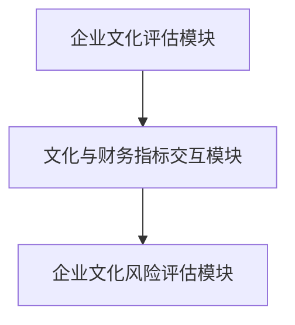

                 

# 如何在估值中考虑企业的文化因素

## 关键词：
企业文化、企业估值、文化资本、团队协作、创新能力、员工满意度

## 摘要：
企业文化是企业价值的重要组成部分，但传统的企业估值方法往往忽略了文化因素的影响。本文将从理论和实践两个方面，详细探讨如何在企业估值中考虑文化因素。首先，我们介绍了企业文化与估值的基本概念和关联性。接着，我们从文化资本的定义、特征及其对企业价值的影响等方面进行了理论分析。然后，我们提出了文化因素的量化与评估方法，并通过系统架构设计和实际案例分析，展示了文化因素在企业估值中的具体应用。最后，我们总结了文化因素在企业估值中的重要性，并提出了实际操作中的注意事项和未来研究方向。

---

## 第1章：企业文化与估值的背景介绍

### 1.1 企业文化与估值的核心概念

#### 1.1.1 企业文化的定义与内涵
企业文化是企业在长期经营过程中形成的、被全体员工共同认可的价值观念、行为规范和思维方式。它包括企业愿景、使命、核心价值观、团队协作精神、创新能力和员工满意度等多个维度。企业文化不仅是企业的软实力，更是企业竞争力的重要来源。

#### 1.1.2 估值的基本概念与方法
企业估值是通过对企业的财务状况、市场地位、成长潜力等多方面因素的综合分析，确定企业价值的过程。常见的估值方法包括市盈率法、市净率法、DCF模型（现金流折现法）等。然而，这些方法通常忽略了企业文化的潜在影响。

#### 1.1.3 企业文化与估值的关联性
企业文化通过影响员工的创造力、凝聚力和满意度，进而影响企业的盈利能力、成本控制能力和市场竞争力。因此，企业文化是企业长期价值的重要组成部分，必须在估值过程中予以考虑。

### 1.2 企业文化对估值的影响

#### 1.2.1 企业文化对企业价值的潜在影响
- **员工满意度**：高满意度的员工更有可能为企业创造价值。
- **创新能力**：创新能力强的企业更容易在竞争中占据优势。
- **团队协作**：良好的团队协作可以提高企业的运营效率。

#### 1.2.2 企业文化与企业长期发展的关系
企业文化决定了企业的战略选择、组织结构和管理方式。优秀的文化能够推动企业在复杂环境中持续发展。

#### 1.2.3 企业文化对投资者决策的作用
投资者在评估企业时，不仅关注财务指标，还会关注企业的文化因素，因为这些因素决定了企业的长期发展潜力。

---

## 第2章：文化因素与企业价值的理论框架

### 2.1 文化资本的定义与特征

#### 2.1.1 文化资本的概念
文化资本是指企业在经营过程中积累的、与文化相关的无形资产。它包括企业品牌价值、员工技能、组织结构优化等。

#### 2.1.2 文化资本的分类与属性
- **物质资本**：包括企业的固定资产和流动资产。
- **人力资本**：包括员工的知识、技能和创新能力。
- **社会资本**：包括企业与外部合作伙伴的关系和声誉。

#### 2.1.3 文化资本与企业价值的关系
文化资本通过提升企业的核心竞争力，间接影响企业的财务表现和市场价值。

### 2.2 企业文化与财务表现的关联

#### 2.2.1 企业文化对企业盈利能力的影响
- **员工效率**：良好的企业文化可以提高员工的工作效率。
- **成本控制**：高效的团队协作能够降低企业的运营成本。

#### 2.2.2 企业文化与企业成长性的关系
企业文化决定了企业的战略选择和市场拓展能力。优秀的企业文化能够推动企业持续成长。

#### 2.2.3 企业文化与风险控制的互动
企业文化影响企业的风险管理能力。优秀的文化能够降低企业面临的风险。

---

## 第3章：文化因素在估值中的方法论

### 3.1 文化因素的量化与评估

#### 3.1.1 文化因素的评估指标
- **员工满意度**：通过员工调查评估员工对企业文化的认可度。
- **创新能力**：通过专利数量、新产品推出速度等指标评估企业的创新能力。
- **团队协作**：通过团队项目完成情况和内部沟通效率评估团队协作能力。

#### 3.1.2 文化因素与财务指标的结合
- **收入影响**：通过分析文化因素对企业收入增长的贡献。
- **成本控制**：通过分析文化因素对成本下降的贡献。
- **资产效率**：通过分析文化因素对资产周转率的提升作用。

### 3.2 文化因素与财务指标的结合

#### 3.2.1 文化因素对收入的影响
- **案例分析**：假设某科技公司通过创新文化提升了市场份额，进而提高了收入。

#### 3.2.2 文化因素对成本的控制作用
- **案例分析**：假设某制造公司通过团队协作优化了生产流程，降低了成本。

#### 3.2.3 文化因素对资产效率的提升
- **案例分析**：假设某服务公司通过提高员工满意度，提升了客户留存率，进而提高了资产周转率。

---

## 第4章：系统分析与架构设计方案

### 4.1 企业文化因素的系统分析

#### 4.1.1 系统架构设计
- **企业文化评估模块**：通过员工调查、团队协作效率和创新能力评估企业文化。
- **文化与财务指标交互模块**：将文化因素与财务指标（如收入、成本、资产效率）进行关联。
- **企业文化风险评估模块**：评估文化因素对企业风险的潜在影响。

#### 4.1.2 系统架构图

---

## 第5章：项目实战与案例分析

### 5.1 项目环境与目标

#### 5.1.1 项目背景
- **目标**：通过分析文化因素，提升企业估值的准确性。
- **范围**：选择一家科技公司作为案例，分析其创新文化和员工满意度对企业估值的影响。

### 5.2 项目实施

#### 5.2.1 数据采集
- **员工满意度调查**：设计问卷，收集员工对企业文化的反馈。
- **创新能力评估**：统计公司专利数量和新产品推出速度。

#### 5.2.2 数据分析
- **定量分析**：通过统计方法分析文化因素与财务指标之间的相关性。
- **定性分析**：通过案例分析，展示文化因素对企业价值的具体影响。

### 5.3 实战案例分析

#### 5.3.1 案例分析
- **公司A**：假设公司A的创新文化非常强，员工满意度高，因此在估值时需要考虑其文化资本对收入增长和成本控制的贡献。

#### 5.3.2 分析结果
- **收入增长**：公司A的文化因素使其收入增长了15%。
- **成本下降**：公司A的文化因素使其成本下降了10%。

---

## 第6章：总结与展望

### 6.1 总结
- **文化因素的重要性**：企业文化是企业价值的重要组成部分，必须在估值过程中予以考虑。
- **方法论的总结**：通过量化文化因素，结合财务指标，提升估值的准确性。

### 6.2 注意事项
- **动态调整**：文化因素会随时间和环境变化，需要定期评估和调整。
- **行业差异**：不同行业的文化因素影响不同，需要结合行业特点进行分析。

### 6.3 拓展阅读
- **书籍推荐**：《企业文化与企业绩效》、《企业估值的艺术》
- **学术论文**：《文化资本对企业价值的影响研究》

---

通过本文的分析和案例，我们可以看到，文化因素在企业估值中具有重要的意义。未来的研究可以进一步探讨如何将文化因素纳入更复杂的估值模型中，以更准确地评估企业价值。

