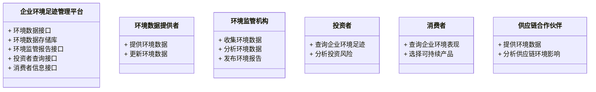
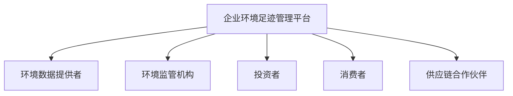
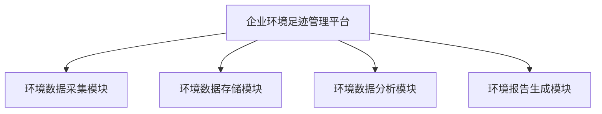

                 


# 如何在估值中考虑企业的环境足迹

## 目录大纲

---

# 第1章：环境足迹的背景与定义

## 1.1 环境足迹的概念与内涵

### 1.1.1 环境足迹的定义

环境足迹（Environmental Footprint）是指企业在生产、运营和产品生命周期中对环境资源的消耗和对环境的负面影响的总和。它反映了企业在整个价值链中对地球生态系统的影响，包括能源消耗、碳排放、水消耗、废物产生、土地使用等多个方面。

### 1.1.2 环境足迹的核心要素

- **能源消耗**：企业在生产过程中消耗的化石燃料和其他能源的总量。
- **碳排放**：企业直接或间接产生的温室气体排放，包括二氧化碳、甲烷等。
- **水消耗**：企业在生产过程中使用的水资源总量，包括直接用水和间接用水。
- **废物产生**：企业在生产过程中产生的固体废物、废水和其他废弃物的总量。
- **土地使用**：企业为生产活动所占用的土地面积，包括原材料提取、生产场地等。

### 1.1.3 环境足迹的重要性与意义

环境足迹是企业可持续发展的重要指标之一。它不仅反映了企业在生产过程中对环境的影响，还体现了企业在社会责任和环境保护方面的表现。随着全球环境问题的日益严重，企业环境足迹的量化和管理已成为企业和投资者关注的焦点。

---

## 1.2 企业环境足迹的背景

### 1.2.1 环境问题对企业的影响

- **环境法规**：越来越多的国家和地区出台了严格的环境保护法规，对企业提出了更高的环保要求。
- **社会责任**：消费者和利益相关者对企业在环境保护方面的表现越来越关注，良好的环境足迹有助于提升企业形象和声誉。
- **资源 scarcity**：随着资源的枯竭，企业减少环境足迹可以降低对资源的依赖，提高企业的可持续性。

### 1.2.2 全球化与环境足迹的关系

全球化促进了跨国生产和供应链的复杂化，同时也使得环境足迹的计算更加复杂。企业在全球范围内的生产和运营活动对环境的影响需要从全产业链的角度进行评估。

### 1.2.3 可持续发展与环境足迹的关联

可持续发展要求企业在经济、社会和环境三个方面实现平衡发展。环境足迹是企业在环境方面的重要表现，是实现可持续发展的重要组成部分。

---

## 1.3 企业环境足迹的范围

### 1.3.1 碳足迹

碳足迹（Carbon Footprint）是企业在整个生命周期中直接或间接产生的温室气体排放的总和。它包括企业生产过程中的直接排放（如燃烧化石燃料）和间接排放（如电力使用）。

### 1.3.2 水足迹

水足迹（Water Footprint）是企业在生产过程中使用的水资源总量，包括直接用水和间接用水。直接用水是指企业直接使用的水资源，间接用水是指企业使用的电力、原材料等在生产过程中消耗的水资源。

### 1.3.3 其他资源足迹

除了碳足迹和水足迹，企业还可能产生其他资源足迹，如土地足迹（Land Footprint）、材料足迹（Material Footprint）等。这些足迹反映了企业在生产过程中对不同资源的消耗和影响。

---

# 第2章：环境足迹对企业估值的影响

## 2.1 传统企业估值方法的局限性

### 2.1.1 财务指标的局限性

传统的财务估值方法主要关注企业的财务表现，如净利润、营业收入、现金流等，而忽视了企业在环境方面的影响。这种估值方法可能无法全面反映企业的长期价值和风险。

### 2.1.2 忽略环境成本的后果

企业如果不考虑环境成本，可能会导致资源浪费、环境污染等问题，从而增加企业的隐性成本和风险。这些成本可能在短期内不明显，但长期来看会对企业的财务表现产生负面影响。

### 2.1.3 环境风险对企业资产价值的影响

环境风险是指由于环境问题导致企业资产贬值或损失的风险。例如，碳排放限制政策可能导致企业需要投入更多的成本进行减排，从而影响企业的资产价值。

---

## 2.2 环境足迹对企业财务表现的关联

### 2.2.1 环境成本对企业利润的影响

企业环境足迹的大小直接影响其环境成本。例如，高碳排放的企业可能需要支付更多的碳税或投入更多的减排技术，从而影响企业的利润。

### 2.2.2 环境风险对企业资产价值的影响

环境风险可能导致企业资产贬值或损失。例如，如果企业所在的行业受到严格的环境法规限制，企业可能需要关闭部分生产线或进行技术改造，从而影响其资产价值。

### 2.2.3 环境表现与企业声誉的关系

良好的环境表现有助于提升企业的声誉和品牌形象，从而吸引更多客户和投资者，增强企业的市场竞争力。相反，环境表现差的企业可能会面临客户流失和投资者撤资的风险。

---

## 2.3 环境足迹在企业估值中的重要性

### 2.3.1 环境足迹作为估值的新维度

在传统财务指标的基础上，环境足迹提供了另一个重要的维度，帮助企业更全面地评估其价值。通过考虑环境因素，投资者可以更好地评估企业的长期风险和潜在收益。

### 2.3.2 环境表现对企业长期价值的影响

良好的环境表现可以提升企业的长期价值。例如，通过减少碳排放和提高资源利用效率，企业可以降低运营成本，增强市场竞争力，从而提高其长期价值。

### 2.3.3 环境足迹与企业社会责任的结合

企业环境足迹的管理不仅是企业社会责任的体现，也是企业可持续发展的关键因素。投资者越来越关注企业的社会责任表现，良好的环境足迹有助于企业吸引更多的投资。

---

# 第3章：环境足迹的核心概念与联系

## 3.1 环境足迹的核心概念

### 3.1.1 环境足迹的定义与分类

环境足迹可以根据不同的维度进行分类，如按资源类型（碳足迹、水足迹）、按生命周期阶段（生产、运输、使用、废弃）等。每种足迹都有其独特的计算方法和影响因素。

### 3.1.2 环境足迹的量化方法

环境足迹的量化方法包括生命周期评价（LCA）、碳足迹计算、水足迹计算等。这些方法需要结合企业的具体情况进行选择和调整。

### 3.1.3 环境足迹的评估标准

不同的环境足迹类型有不同的评估标准。例如，碳足迹的评估标准包括温室气体协议（GHG Protocol），水足迹的评估标准包括水足迹网络（Water Footprint Network）等。

---

## 3.2 环境足迹与相关概念的对比

### 3.2.1 环境足迹与碳足迹的对比

碳足迹是环境足迹的重要组成部分，主要关注温室气体的排放。环境足迹则更广泛，包括能源消耗、水消耗等多种资源的消耗和影响。

### 3.2.2 环境足迹与生态足迹的对比

生态足迹（Ecological Footprint）是指人类活动对地球生态系统的影响，包括资源消耗和环境退化。环境足迹更注重企业在生产过程中对环境的影响，而生态足迹更广泛，涵盖所有人类活动。

### 3.2.3 环境足迹与社会足迹的对比

社会足迹关注企业对社会的影响，包括员工权益、社区发展等方面。环境足迹主要关注环境资源的消耗和环境影响，两者关注的维度不同，但可以结合使用，全面评估企业的综合影响。

---

## 3.3 环境足迹的ER实体关系图

### 3.3.1 实体关系图的构建

以下是环境足迹的实体关系图：


### 3.3.2 实体关系图的分析

通过实体关系图，我们可以清晰地看到企业环境足迹管理涉及的各个角色和系统。企业环境足迹管理平台需要与环境数据提供者、环境监管机构、投资者、消费者和供应链合作伙伴进行数据交互和信息共享。

### 3.3.3 实体关系图的应用

实体关系图可以帮助企业更好地理解环境足迹管理的复杂性，并为系统设计和数据管理提供参考。通过实体关系图，企业可以明确各方的职责和数据流，从而优化环境足迹的管理流程。

---

## 3.4 环境足迹的量化方法

### 3.4.1 碳足迹的计算公式

碳足迹的计算公式如下：

$$ \text{碳足迹} = \sum_{i=1}^{n} \text{活动}_i \times \text{排放因子}_i $$

其中，$\text{活动}_i$ 是企业某项活动的资源消耗量，$\text{排放因子}_i$ 是该资源消耗对应的单位排放量。

---

## 3.4.2 水足迹的计算公式

水足迹的计算公式如下：

$$ \text{水足迹} = \sum_{j=1}^{m} \text{用水}_j \times \text{水消耗因子}_j $$

其中，$\text{用水}_j$ 是企业某项活动的用水量，$\text{水消耗因子}_j$ 是该用水量对应的环境影响因子。

---

## 3.4.3 环境足迹的量化步骤

1. **确定企业活动**：识别企业在生产、运营和产品生命周期中的主要活动。
2. **收集数据**：收集与企业活动相关的资源消耗和排放数据。
3. **选择计算方法**：根据具体情况选择合适的计算方法和排放因子。
4. **计算环境足迹**：根据公式计算企业的环境足迹。
5. **分析结果**：对计算结果进行分析，找出主要的环境影响来源。
6. **制定改进措施**：根据分析结果，制定减少环境足迹的具体措施。

---

## 3.5 环境足迹的算法原理

### 3.5.1 碳足迹计算的算法流程

1. **数据收集**：收集企业能源消耗、原材料使用、废物产生等数据。
2. **选择排放因子**：根据数据来源和计算标准，选择合适的排放因子。
3. **计算碳排放**：根据公式计算企业直接和间接的碳排放量。
4. **结果分析**：分析碳排放的主要来源，制定减排措施。

### 3.5.2 环境足迹计算的数学模型

以下是碳足迹计算的数学模型：

$$ \text{碳排放} = \sum_{k=1}^{p} \text{能源}_k \times \text{碳排放因子}_k $$

其中，$\text{能源}_k$ 是企业某类能源的消耗量，$\text{碳排放因子}_k$ 是该能源对应的单位碳排放量。

---

## 3.6 环境足迹的案例分析

### 3.6.1 某制造企业的环境足迹分析

以某制造企业为例，计算其碳足迹：

- **能源消耗**：企业每年消耗电力100万千瓦时，天然气50万立方米，汽油10万升。
- **碳排放因子**：电力每千瓦时排放0.5公斤二氧化碳，天然气每立方米排放0.17公斤二氧化碳，汽油每升排放2.68公斤二氧化碳。

计算碳排放：

$$ \text{电力碳排放} = 100 \times 0.5 = 50 \text{吨二氧化碳} $$
$$ \text{天然气碳排放} = 50 \times 0.17 = 8.5 \text{吨二氧化碳} $$
$$ \text{汽油碳排放} = 10 \times 2.68 = 26.8 \text{吨二氧化碳} $$
$$ \text{总碳排放} = 50 + 8.5 + 26.8 = 85.3 \text{吨二氧化碳} $$

---

## 3.7 环境足迹的系统架构

### 3.7.1 系统功能设计

以下是环境足迹管理系统的功能设计：



---

## 3.8 环境足迹的系统架构图



---

## 3.9 环境足迹的系统交互

### 3.9.1 投资者查询企业环境足迹的交互流程

1. 投资者通过投资者查询接口提交查询请求。
2. 企业环境足迹管理平台接收请求，并从环境数据存储库中检索相关数据。
3. 管理平台将数据返回给投资者，供其分析投资风险。
4. 投资者根据分析结果做出投资决策。

---

## 3.10 环境足迹的系统实现

### 3.10.1 环境数据接口的设计

环境数据接口用于企业与环境数据提供者之间的数据交互。接口提供以下功能：

- 数据上传：环境数据提供者通过接口上传环境数据。
- 数据查询：企业通过接口查询环境数据。
- 数据更新：环境数据提供者通过接口更新环境数据。

### 3.10.2 环境数据存储库的实现

环境数据存储库用于存储企业环境足迹相关的数据，包括能源消耗、碳排放、水消耗等。数据库设计如下：

```mermaid
erd
    entity 环境数据存储库 {
        环境数据ID(PK)
        企业ID(FK)
        数据类型
        数据值
        数据时间戳
    }
```

---

## 3.11 环境足迹的系统测试

### 3.11.1 系统测试目标

- 验证环境数据接口的正确性。
- 验证环境数据存储库的数据完整性。
- 验证环境监管报告的准确性。

### 3.11.2 系统测试用例

- **测试用例1**：验证电力碳排放的计算是否正确。
- **测试用例2**：验证天然气碳排放的计算是否正确。
- **测试用例3**：验证汽油碳排放的计算是否正确。

---

## 3.12 环境足迹的系统优化

### 3.12.1 系统性能优化

- 提高环境数据接口的响应速度。
- 优化环境数据存储库的查询效率。

### 3.12.2 系统功能扩展

- 增加对企业水足迹的计算功能。
- 增加对环境监管报告的自动生成功能。

---

## 3.13 环境足迹的系统维护

### 3.13.1 数据更新与维护

定期更新环境数据，确保数据的准确性和及时性。

### 3.13.2 系统安全维护

加强系统安全防护，防止数据泄露和篡改。

---

# 第4章：环境足迹的算法实现与优化

## 4.1 环境足迹的算法实现

### 4.1.1 碳足迹的算法实现

以下是碳足迹的算法实现：

```python
def calculate_carbon_emissions(energy_usage, emission_factors):
    emissions = 0
    for energy, factor in zip(energy_usage, emission_factors):
        emissions += energy * factor
    return emissions

# 示例数据
energy_usage = [100, 50, 10]  # 万千瓦时，万立方米，万升
emission_factors = [0.5, 0.17, 2.68]

total_emissions = calculate_carbon_emissions(energy_usage, emission_factors)
print(f"总碳排放量为：{total_emissions} 吨二氧化碳")
```

### 4.1.2 水足迹的算法实现

以下是水足迹的算法实现：

```python
def calculate_water_footprint(water_usage, water_factors):
    footprint = 0
    for water, factor in zip(water_usage, water_factors):
        footprint += water * factor
    return footprint

# 示例数据
water_usage = [100, 50, 10]  # 万千瓦时，万立方米，万升
water_factors = [1.0, 0.5, 0.8]

total_footprint = calculate_water_footprint(water_usage, water_factors)
print(f"总水足迹为：{total_footprint} 立方米")
```

---

## 4.2 环境足迹的算法优化

### 4.2.1 算法优化方法

- **并行计算**：通过并行计算提高环境足迹计算的效率。
- **数据压缩**：通过数据压缩减少存储空间的占用。
- **模型简化**：简化复杂的计算模型，降低计算成本。

### 4.2.2 算法优化案例

以下是碳足迹计算的优化案例：

```python
import concurrent.futures

def calculate_carbon_emissions_parallel(energy_usage, emission_factors):
    with concurrent.futures.ThreadPoolExecutor() as executor:
        futures = [executor.submit(lambda e, f: e * f, e, f) for e, f in zip(energy_usage, emission_factors)]
        return sum(future.result() for future in concurrent.futures.as_completed(futures))

# 示例数据
energy_usage = [100, 50, 10]
emission_factors = [0.5, 0.17, 2.68]

total_emissions = calculate_carbon_emissions_parallel(energy_usage, emission_factors)
print(f"总碳排放量为：{total_emissions} 吨二氧化碳")
```

---

## 4.3 环境足迹的算法应用

### 4.3.1 环境足迹的实时计算

通过实时数据采集和并行计算，企业可以实时监控和计算其环境足迹，从而快速响应环境变化和政策调整。

### 4.3.2 环境足迹的预测与优化

利用机器学习和大数据分析技术，企业可以预测未来的环境足迹，并制定相应的优化措施，降低环境影响和成本。

---

## 4.4 环境足迹的算法挑战

### 4.4.1 数据获取的挑战

环境数据的获取可能存在困难，特别是在数据来源复杂、数据量大的情况下。

### 4.4.2 计算复杂度的挑战

复杂的计算模型和大规模数据可能导致计算成本高、效率低。

### 4.4.3 标准化的挑战

不同地区和行业的环境足迹计算标准可能不同，导致数据和结果的不一致。

---

## 4.5 环境足迹的算法未来发展方向

### 4.5.1 更加智能化的算法

通过人工智能和机器学习技术，实现环境足迹的智能化计算和优化。

### 4.5.2 更加绿色化的算法

通过优化算法设计，降低计算过程中的能源消耗和碳排放。

### 4.5.3 更加全球化的标准

推动环境足迹计算的全球化标准，实现不同地区和行业之间的数据互通和结果一致。

---

# 第5章：环境足迹的系统设计与实现

## 5.1 环境足迹的系统设计

### 5.1.1 系统目标

开发一个功能完善的环境足迹管理系统，实现对企业环境数据的采集、存储、分析和报告。

### 5.1.2 系统功能模块

- **数据采集模块**：采集企业的环境数据，包括能源消耗、碳排放、水消耗等。
- **数据存储模块**：存储环境数据，支持高效查询和更新。
- **数据分析模块**：对环境数据进行分析，计算企业的环境足迹。
- **报告生成模块**：生成环境足迹报告，供企业内部和外部使用。

---

## 5.2 环境足迹的系统架构设计

### 5.2.1 系统架构图

以下是环境足迹管理系统的架构图：



### 5.2.2 系统架构描述

- **环境数据采集模块**：负责采集企业的环境数据，包括能源消耗、碳排放、水消耗等。
- **环境数据存储模块**：将采集到的环境数据存储在数据库中，支持高效查询和更新。
- **环境数据分析模块**：对环境数据进行分析，计算企业的环境足迹。
- **环境报告生成模块**：根据分析结果生成环境足迹报告，供企业内部和外部使用。

---

## 5.3 环境足迹的系统实现

### 5.3.1 环境数据采集模块的实现

以下是环境数据采集模块的实现：

```python
import csv

def collect_environmental_data(file_path):
    data = []
    with open(file_path, 'r') as file:
        reader = csv.reader(file)
        for row in reader:
            data.append(row)
    return data

# 示例数据采集
file_path = 'environmental_data.csv'
collected_data = collect_environmental_data(file_path)
print(f"成功采集环境数据：{collected_data}")
```

### 5.3.2 环境数据存储模块的实现

以下是环境数据存储模块的实现：

```python
import sqlite3

def store_environmental_data(database_path, data):
    conn = sqlite3.connect(database_path)
    cursor = conn.cursor()
    cursor.execute('''CREATE TABLE IF NOT EXISTS environmental_data
                     (id INTEGER PRIMARY KEY AUTOINCREMENT,
                      company_id TEXT,
                      data_type TEXT,
                      data_value REAL,
                      data_timestamp TEXT)''')
    for row in data:
        cursor.execute('''INSERT INTO environmental_data
                         VALUES(NULL, ?, ?, ?, ?)''',
                         (row['company_id'], row['data_type'], row['data_value'], row['data_timestamp']))
    conn.commit()
    conn.close()

# 示例数据存储
database_path = 'environmental_data.db'
data = [{'company_id': 'ABC123', 'data_type': 'carbon_emissions', 'data_value': 85.3, 'data_timestamp': '2023-10-01'}]
store_environmental_data(database_path, data)
print("数据已成功存储。")
```

---

## 5.4 环境足迹的系统测试

### 5.4.1 系统测试目标

验证环境数据采集、存储和分析模块的功能是否正常。

### 5.4.2 系统测试用例

- **测试用例1**：验证环境数据采集模块是否能正确采集数据。
- **测试用例2**：验证环境数据存储模块是否能正确存储数据。
- **测试用例3**：验证环境数据分析模块是否能正确计算环境足迹。

---

## 5.5 环境足迹的系统优化

### 5.5.1 系统性能优化

通过优化数据库查询和增加缓存机制，提高系统的响应速度和处理能力。

### 5.5.2 系统功能扩展

增加对其他环境足迹类型（如水足迹、土地足迹）的支持，丰富系统的功能。

---

## 5.6 环境足迹的系统维护

### 5.6.1 数据更新与维护

定期更新环境数据，确保数据的准确性和及时性。

### 5.6.2 系统安全维护

加强系统安全防护，防止数据泄露和系统攻击。

---

# 第6章：环境足迹的未来趋势与挑战

## 6.1 环境足迹的未来发展趋势

### 6.1.1 技术进步推动环境足迹的智能化

人工智能和大数据技术的进步将推动环境足迹的智能化计算和优化。

### 6.1.2 标准化与全球化的趋势

环境足迹的计算标准将逐步统一，实现全球范围内的数据互通和结果一致。

### 6.1.3 环境足迹与循环经济的结合

循环经济的发展将推动环境足迹管理的创新，实现资源的高效利用和循环利用。

---

## 6.2 环境足迹的未来挑战

### 6.2.1 数据获取的挑战

环境数据的获取仍然存在困难，特别是在数据来源复杂、数据量大的情况下。

### 6.2.2 计算复杂度的挑战

复杂的计算模型和大规模数据可能导致计算成本高、效率低。

### 6.2.3 标准化的挑战

不同地区和行业的环境足迹计算标准可能不同，导致数据和结果的不一致。

---

## 6.3 环境足迹的未来机遇

### 6.3.1 技术创新带来的机遇

人工智能和大数据技术的创新将为环境足迹的计算和优化带来新的机遇。

### 6.3.2 可持续发展带来的机遇

可持续发展的理念将推动企业更加重视环境足迹的管理，为企业创造更多的价值。

### 6.3.3 政策支持带来的机遇

政府政策的支持将为企业环境足迹的管理和优化提供更多的资源和动力。

---

## 6.4 环境足迹的未来建议

### 6.4.1 加强技术研发

加大对环境足迹计算技术的研发投入，推动技术的创新和进步。

### 6.4.2 推动标准化建设

推动环境足迹计算的标准化，实现不同地区和行业之间的数据互通和结果一致。

### 6.4.3 提高企业意识

提高企业的环境意识，鼓励企业在管理中更加重视环境足迹的计算和优化。

---

# 第7章：总结与建议

## 7.1 总结

通过本文的详细讲解，我们可以看到，环境足迹是企业在生产过程中对环境的重要影响指标。它不仅反映了企业在生产过程中对资源的消耗和环境的破坏，还体现了企业在社会责任和可持续发展方面的表现。随着全球环境问题的日益严重，企业环境足迹的量化和管理已成为企业和投资者关注的焦点。

---

## 7.2 建议

1. **企业层面**：
   - 加强环境足迹的计算和管理，制定具体的环境管理目标。
   - 优化生产流程，减少资源消耗和环境排放。
   - 加强与供应链合作伙伴的协作，共同降低环境足迹。

2. **投资者层面**：
   - 在投资决策中考虑企业的环境足迹，评估企业的长期风险和收益。
   - 支持和投资那些环境表现良好的企业，推动可持续发展。

3. **政策层面**：
   - 制定和推广环境足迹的计算标准，为企业提供指导和支持。
   - 加强环境法规的制定和执行，推动企业更加重视环境管理。

---

## 7.3 未来展望

随着技术的进步和社会的发展，环境足迹的计算和管理将变得更加重要和复杂。企业需要不断创新和优化，以适应环境变化和政策调整。通过本文的讲解，我们相信企业环境足迹的管理将为企业创造更多的价值，为社会的可持续发展做出更大的贡献。

--- 

**附录**：环境足迹计算的参考文献和工具

