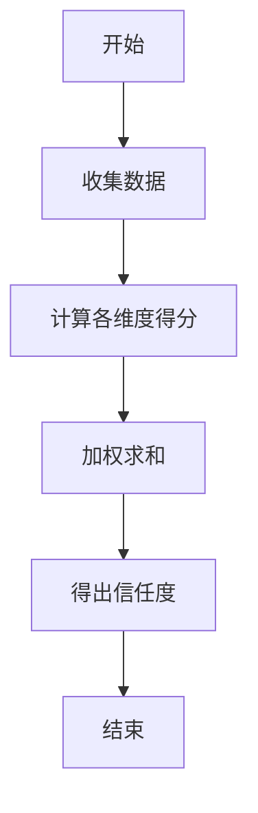
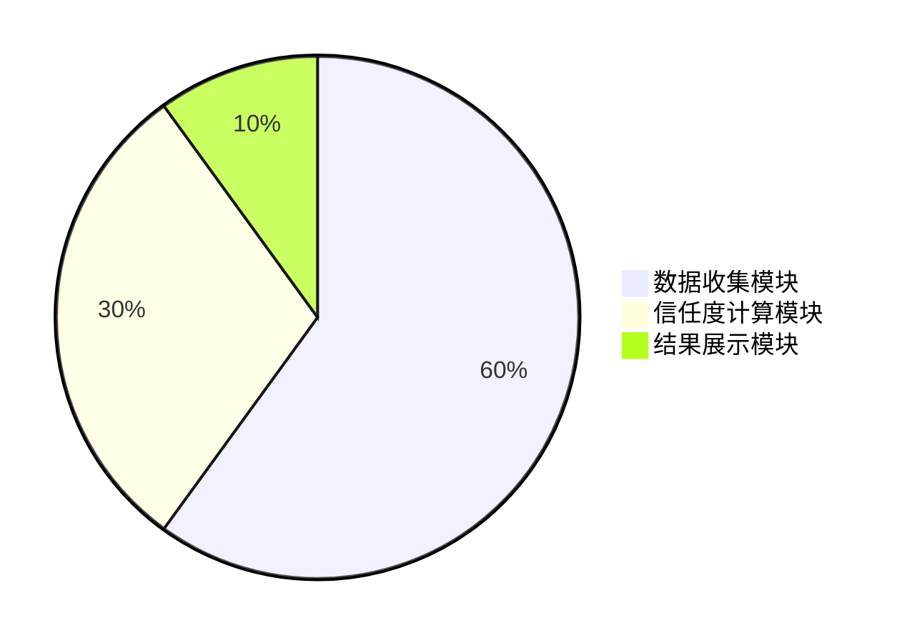
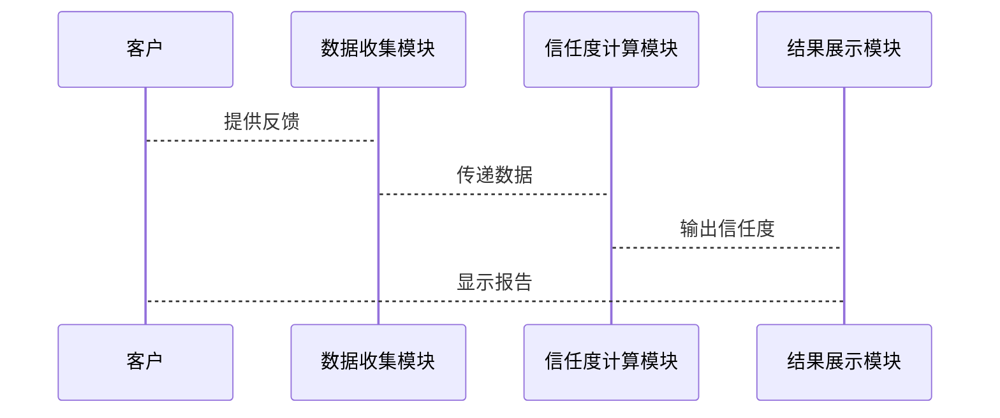

                 


# 如何在估值中考虑企业的社会信任度

## 关键词：企业估值、社会信任度、声誉、社会责任、道德标准

## 摘要：在企业估值过程中，社会信任度是一个关键因素，它反映了企业在社会中的信誉和责任感。本文详细探讨了社会信任度的核心概念、算法原理、系统架构以及实际案例，帮助读者理解如何在估值中有效考虑这一因素。

---

## 第一部分：企业社会信任度的背景与概念

### 第1章：企业社会信任度的定义与背景

#### 1.1 企业社会信任度的定义
- **1.1.1 企业社会信任度的基本概念**
  社会信任度是指企业在社会公众中的信任程度，反映了企业在道德、责任和社会影响力方面的表现。

- **1.1.2 信任度与企业价值的关系**
  信任度高的企业更容易获得投资者青睐，降低融资成本，提升品牌价值和客户忠诚度。

- **1.1.3 社会信任度的多维度属性**
  包括企业声誉、社会责任、道德标准等，这些因素相互影响，共同构成社会信任度。

#### 1.2 企业社会信任度的背景与重要性
- **1.2.1 当前企业估值的新趋势**
  传统财务指标之外，企业社会责任和声誉越来越受重视。

- **1.2.2 社会信任度对企业长期价值的影响**
  高信任度企业更具抗风险能力，能更好地应对市场波动和社会变化。

- **1.2.3 信任度在企业风险管理中的作用**
  信任度高的企业在危机中恢复能力更强，有助于维护稳定运营。

#### 1.3 企业社会信任度的边界与外延
- **1.3.1 信任度的适用范围**
  适用于所有行业，但不同行业重点不同，如金融行业更关注诚信，科技行业更关注透明度。

- **1.3.2 信任度与其他企业价值评估指标的关系**
  信任度是企业整体价值的一部分，与财务指标和市场表现密切相关。

- **1.3.3 信任度的动态变化特性**
  受企业行为、市场环境和社会舆论影响，信任度会随时间变化。

---

## 第二部分：企业社会信任度的核心概念与联系

### 第2章：核心概念与联系

#### 2.1 信任度的核心要素
- **2.1.1 企业声誉**
  企业声誉是基于历史行为、产品质量和服务的综合评价。

- **2.1.2 社会责任**
  包括环境保护、员工福利、公益捐赠等方面，展示企业的社会贡献。

- **2.1.3 道德标准**
  企业遵守法律法规，坚持商业伦理，避免不正当竞争和欺诈行为。

#### 2.2 核心概念的属性特征对比
- **2.2.1 企业声誉与社会责任的对比**
  | 属性 | 企业声誉 | 社会责任 |
  |------|----------|----------|
  | 定义 | 公众对企业的总体评价 | 企业对社会的贡献 |
  | 重点 | 市场表现、品牌形象 | 环境保护、公益 |

- **2.2.2 社会责任与道德标准的联系**
  社会责任是道德标准的具体体现，企业通过履行社会责任提升道德形象。

- **2.2.3 核心要素的权重分配**
  根据行业特点和企业战略，各要素的权重可能不同，如金融行业声誉权重较高，科技行业道德标准权重较高。

#### 2.3 ER实体关系图
```mermaid
erDiagram
    customer[客户] {
        id : integer
        name : string
        feedback : string
    }
    company[公司] {
        id : integer
        name : string
        reputation : float
        responsibility : float
        ethics : float
    }
    trust_degree[信任度] {
        id : integer
        company_id : integer
        score : float
        date : date
    }
    customer --> trust_degree : 提供反馈
    company --> trust_degree : 计算信任度
```

---

## 第三部分：企业社会信任度的算法原理

### 第3章：信任度量化算法

#### 3.1 信任度量化的基本原理
- **3.1.1 信任度的加权评分法**
  根据声誉、社会责任和道德标准的权重计算信任度。

- **3.1.2 信任度的动态调整机制**
  考虑企业行为的时间因素，近期事件对信任度影响更大。

- **3.1.3 信任度的多维度评估模型**
  综合多个维度的数据，得出全面的信任度评分。

#### 3.2 算法流程图


#### 3.3 数学模型与公式
- **加权平均公式**
  $$ 信任度 = \sum_{i=1}^{n} w_i \times f_i $$
  其中，$w_i$ 是第i个维度的权重，$f_i$ 是第i个维度的评分。

- **动态调整公式**
  $$ 调整后的信任度 = 原信任度 \times (1 + \alpha \times 时间因素) $$
  其中，$\alpha$ 是调整系数，时间因素反映事件的时间距离。

---

## 第四部分：企业社会信任度的系统架构设计

### 第4章：信任度评估系统设计

#### 4.1 系统功能设计
- **数据收集模块**
  采集企业声誉、社会责任和道德标准相关数据，如客户反馈、媒体报道、社会责任报告等。

- **信任度计算模块**
  使用加权评分法和动态调整机制计算企业信任度，输出信任度评分。

- **结果展示模块**
  以图表形式展示信任度变化趋势，提供可视化报告，帮助投资者和管理层决策。

#### 4.2 系统架构图


#### 4.3 系统交互流程图


---

## 第五部分：项目实战

### 第5章：企业社会信任度评估系统实现

#### 5.1 环境安装
  - 安装Python和必要的库（如pandas、numpy、matplotlib）。
  - 确保数据来源可靠，如新闻网站、社交媒体、行业报告。

#### 5.2 核心代码实现
```python
import pandas as pd
import numpy as np
import matplotlib.pyplot as plt

# 示例数据：企业声誉、社会责任、道德标准评分
data = {
    '企业': ['A', 'B', 'C'],
    '声誉': [85, 70, 90],
    '社会责任': [80, 85, 75],
    '道德标准': [90, 70, 80]
}

df = pd.DataFrame(data)

# 定义权重（声誉:0.4, 社会责任:0.3, 道德标准:0.3）
weights = {'声誉': 0.4, '社会责任': 0.3, '道德标准': 0.3}

# 计算信任度
trust_scores = []
for index, row in df.iterrows():
    score = sum(row[col] * weights[col] for col in weights.keys())
    trust_scores.append(score)

df['信任度'] = trust_scores

# 可视化
plt.figure(figsize=(10, 6))
plt.bar(df['企业'], df['信任度'], label='信任度')
plt.title('企业社会信任度评分')
plt.xlabel('企业')
plt.ylabel('评分')
plt.legend()
plt.show()
```

#### 5.3 代码解读与分析
- 数据预处理：将企业的声誉、社会责任和道德标准评分整合到数据框中。
- 权重分配：根据经验或行业特点设定各维度的权重。
- 信任度计算：使用加权求和方法计算每个企业的信任度。
- 可视化展示：用柱状图直观显示各企业的信任度评分。

#### 5.4 案例分析
- 以企业A为例，其信任度为85分，高于企业B的70分，表明企业A在社会信任度方面表现更优。

#### 5.5 项目小结
- 信任度评估系统能有效量化企业社会表现，帮助投资者和管理层做出更明智的决策。

---

## 第六部分：总结与展望

### 第6章：总结与展望

#### 6.1 总结
- 企业社会信任度是估值的重要因素，涵盖声誉、社会责任和道德标准。
- 信任度的量化方法和系统设计为企业评估提供了新的视角。

#### 6.2 展望
- 未来，信任度评估将更加智能化，结合人工智能技术实时监测和调整。
- 企业应重视社会信任度建设，通过履行社会责任和提升道德标准增强竞争力。

#### 6.3 最佳实践 tips
- 定期评估信任度，及时调整企业策略。
- 透明化企业行为，积极回应公众关切。
- 建立长期的信任关系，提升客户忠诚度和品牌价值。

#### 6.4 小结
- 信任度是企业价值的重要组成部分，提升社会信任度将为企业创造更大价值。

---

通过本文的详细讲解，读者可以全面理解如何在企业估值中考虑社会信任度，并在实际应用中提升企业的社会形象和市场竞争力。

