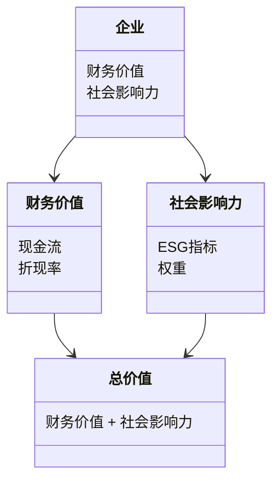
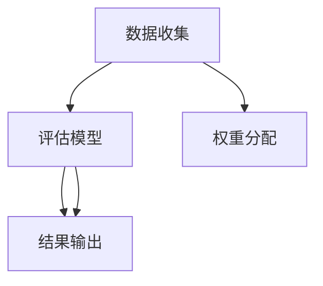

                 


# 如何在估值中考虑企业的社会影响力

## 关键词：企业估值，社会影响力，ESG，企业价值，影响力投资

## 摘要：随着全球对可持续发展的关注增加，企业社会影响力在估值中的重要性日益凸显。本文探讨了如何将社会影响力因素纳入企业估值模型，分析了社会影响力对企业价值的影响机制，并通过实际案例展示了如何量化和评估社会影响力。通过引入环境、社会和治理（ESG）指标，本文提出了改进的企业估值方法，帮助投资者更全面地评估企业的长期价值。

---

# 如何在估值中考虑企业的社会影响力

## 1. 企业社会影响力与估值的背景介绍

### 1.1 企业社会影响力的概念与定义
- **社会影响力**是指企业在经营过程中对社会产生的正面或负面影响，包括环境保护、社会责任、员工福利等方面。
- **企业价值**不仅包括财务表现，还应考虑社会影响力对品牌价值、客户忠诚度和员工凝聚力的影响。

### 1.2 社会影响力对企业价值的影响机制
- **企业声誉**：良好的社会影响力可以提升企业的品牌形象，吸引更多客户和优秀员工。
- **客户关系**：社会责任感强的企业更容易获得客户的信任和支持。
- **员工凝聚力**：积极的社会影响力可以提高员工的归属感和满意度。

### 1.3 传统估值方法的局限性
- 传统估值方法如净现值法（NPV）和现金流折现法（DCF）忽视了社会影响力对企业价值的影响。
- 忽略社会影响力可能导致估值偏差，无法反映企业的长期可持续价值。

---

## 2. 社会影响力与企业价值的构成要素

### 2.1 社会影响力的构成维度
- **环境（E）**：企业的环保表现，如碳排放、资源利用效率。
- **社会（S）**：企业对员工、社区和社会的贡献，如社会责任项目。
- **治理（G）**：公司治理结构和透明度，如董事会构成、高管薪酬透明度。

### 2.2 社会影响力与企业核心竞争力的关系
- **促进作用**：良好的社会影响力可以提升企业的创新能力和市场竞争力。
- **潜在威胁**：忽视社会影响力可能导致企业声誉受损，进而影响核心竞争力。

### 2.3 社会影响力与企业风险评估
- **声誉风险**：负面社会影响力可能导致客户流失和品牌价值下降。
- **运营风险**：社会责任缺失可能引发法律风险和员工流失。

---

## 3. 社会影响力对企业估值模型的改进

### 3.1 传统企业估值模型的回顾
- **净现值法（NPV）**：仅考虑财务现金流，忽视社会影响力。
- **现金流折现法（DCF）**：同样缺乏对社会影响力因素的考虑。

### 3.2 引入社会影响力因素的改进模型
- **ESG指标的量化**：将环境、社会和治理因素量化，融入估值模型。
- **加权评分法**：根据企业对社会影响力各维度的贡献，赋予不同权重，计算其对估值的影响。

### 3.3 改进模型的数学表达
假设企业价值 \( V \) 由财务价值 \( F \) 和社会影响力价值 \( S \) 组成：
\[ V = F + S \]
其中，\( S \) 可以通过以下公式计算：
\[ S = \sum_{i=1}^{n} w_i \times s_i \]
其中，\( w_i \) 是第 \( i \) 个社会影响力维度的权重，\( s_i \) 是该维度的量化评分。

### 3.4 案例分析：某环保科技公司的估值
- **财务价值**：基于未来现金流的DCF模型计算出财务价值为10亿元。
- **社会影响力价值**：企业环保技术的推广减少了碳排放，量化后为2亿元。
- **总价值**：\( V = 10 + 2 = 12 \) 亿元。

---

## 4. 社会影响力与企业估值的系统分析

### 4.1 系统功能设计
- **领域模型**：使用Mermaid类图展示企业、财务价值、社会影响力和总价值之间的关系。


### 4.2 系统架构设计
- **架构图**：展示数据收集、评估模型、结果输出的流程。


### 4.3 系统接口设计
- **输入**：企业的财务数据和ESG指标。
- **输出**：改进后的估值结果。

---

## 5. 项目实战：如何量化社会影响力

### 5.1 环境数据收集与处理
- **工具**：使用Python的pandas库进行数据清洗和处理。
```python
import pandas as pd
data = pd.read_csv('esg_data.csv')
data_clean = data.dropna()
```

### 5.2 社会影响力量化模型
- **代码示例**：
```python
def calculate_s影响力(数据):
    权重 = [0.4, 0.3, 0.3]
    影响力 = 0
    for i in range(len(权重)):
        影响力 += 数据[i] * 权重[i]
    return 影响力

影响力 = calculate_s影响力([85, 70, 90])
print(影响力)  # 输出：83
```

### 5.3 实际案例分析
- 分析某企业的ESG指标，计算其社会影响力，并将其纳入估值模型。

---

## 6. 总结与未来展望

### 6.1 本章小结
- 引入社会影响力因素可以更全面地评估企业价值。
- 改进后的估值模型能够更好地反映企业的可持续发展能力。

### 6.2 未来展望
- 随着ESG投资的增加，社会影响力在估值中的应用将更加广泛。
- 未来可能开发更多智能化的工具，帮助企业和投资者更高效地进行社会影响力评估。

---

通过本文的分析和案例，读者可以清晰地理解如何在企业估值中考虑社会影响力，并在实际操作中应用这些方法。

