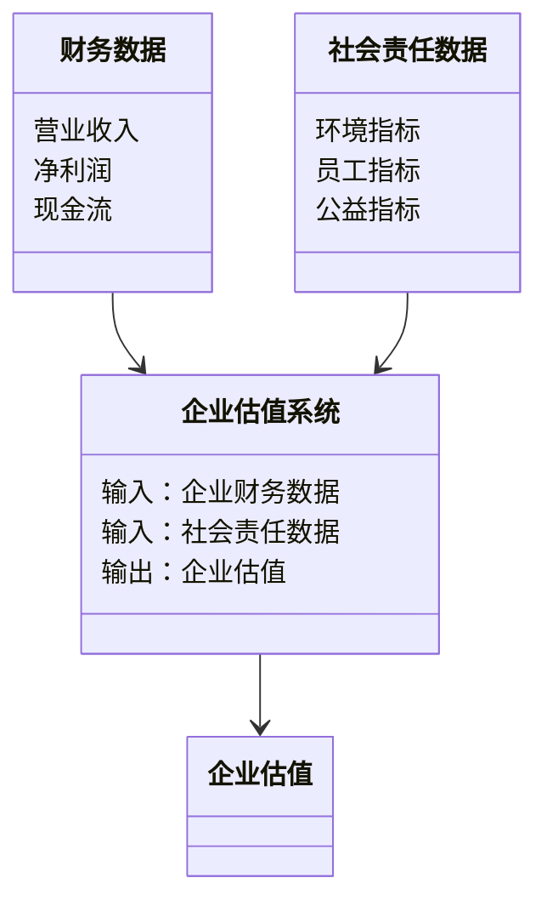

                 


# 如何在估值中考虑企业的社会责任

## 关键词：企业估值，社会责任，可持续发展，财务模型，企业价值，社会责任投资

## 摘要：  
在企业估值中，传统方法主要关注财务指标，但随着可持续发展理念的兴起，企业社会责任（Corporate Social Responsibility, CSR）已成为影响企业价值的重要因素。本文通过分析社会责任对企业估值的影响，探讨如何将社会责任纳入企业估值模型，结合数学模型和实际案例，提供系统的解决方案。

---

## 第一部分：企业社会责任的背景与概念

### 第1章：企业社会责任的定义与内涵

#### 1.1 企业社会责任的定义  
企业社会责任（Corporate Social Responsibility, CSR）是指企业在追求经济利益的同时，还需关注环境保护、员工福祉、社会公益等方面，以实现可持续发展。  

**核心概念术语说明：**  
- **经济利益**：企业通过经营活动创造的价值。  
- **环境保护**：企业在生产过程中减少对环境的负面影响。  
- **员工福祉**：企业关注员工的工作条件、福利待遇和职业发展。  
- **社会公益**：企业通过慈善捐赠、社区支持等方式回馈社会。  

#### 1.2 企业社会责任的特征  
以下是企业社会责任的特征对比表：  

| 特征      | 描述                                                                 |
|-----------|----------------------------------------------------------------------|
| 经济性     | 企业通过社会责任活动创造附加价值，增强竞争力。                   |
| 社会性     | 企业行为对社会产生广泛影响，涉及利益相关者。                   |
| 长期性     | 社会责任投资具有长期性，影响企业的可持续发展。                   |
| 内部性     | 社会责任活动通常与企业内部管理相关，如员工培训。                 |
| 外部性     | 企业社会责任可能产生外部收益，如提升企业声誉。                 |

#### 1.3 企业社会责任的边界与外延  
企业社会责任的边界包括：  
1. **经济贡献**：企业的税收、就业机会等对经济的贡献。  
2. **员工福祉**：员工的工作满意度、职业发展机会等。  
3. **环境保护**：减少污染、节约资源等。  

企业社会责任的外延包括：  
1. **社会公益**：慈善捐赠、社区支持等。  
2. **治理结构**：公司治理中的道德规范和透明度。  
3. **创新与技术**：通过技术创新解决社会问题。  

#### 1.4 企业社会责任的核心要素  
以下是企业社会责任的核心要素组成：  

1. **经济贡献**：企业的收入、利润、就业机会。  
2. **员工福祉**：员工的工作条件、福利待遇、职业培训。  
3. **环境保护**：减少碳排放、资源节约、污染治理。  
4. **社会公益**：慈善捐赠、社区支持、公益活动。  

---

## 第二部分：企业社会责任与估值的联系

### 第2章：社会责任对企业价值的影响

#### 2.1 社会责任对财务表现的影响  
社会责任对财务表现的影响可以通过以下方面体现：  
1. **成本节约**：通过减少资源浪费和提高效率降低成本。  
2. **收入增长**：提升企业声誉和品牌价值，吸引更多客户。  
3. **风险降低**：减少法律诉讼和社会争议，降低财务风险。  

#### 2.2 社会责任与企业声誉的关联  
企业声誉是企业价值的重要组成部分。良好的社会责任记录可以提升企业声誉，进而提高企业估值。  

**对比分析：**  
- **正面影响**：社会责任良好的企业更容易获得投资者的信任，股价可能上升。  
- **负面影响**：社会责任缺失可能导致企业声誉受损，股价下跌。  

#### 2.3 社会责任与企业长期发展的关系  
社会责任是企业可持续发展的基石。通过履行社会责任，企业可以：  
1. **增强竞争力**：社会责任良好的企业更容易吸引优秀人才和客户。  
2. **创新动力**：社会责任推动企业技术创新和社会问题的解决。  
3. **风险管理**：社会责任有助于企业应对政策变化和市场波动。  

---

## 第三部分：社会责任在企业估值中的数学模型与算法

### 第3章：社会责任的量化方法

#### 3.1 社会责任的量化指标  
以下是社会责任的量化指标：  

1. **经济贡献**：就业人数、税收贡献。  
2. **员工福祉**：员工满意度、福利支出。  
3. **环境保护**：碳排放量、资源节约量。  
4. **社会公益**：慈善捐赠金额、公益活动数量。  

#### 3.2 社会责任与企业估值的关系  
以下是社会责任与企业估值的关系模型：  

$$ EVA = Net\ Operating\ Profit\ After\ Tax + Non-Financial\ Impact $$  

其中，$Non-Financial\ Impact$ 包括社会责任对品牌价值、员工忠诚度、客户满意度的影响。

---

## 第四部分：系统分析与架构设计

### 第4章：社会责任在企业估值中的系统架构

#### 4.1 问题场景介绍  
企业估值系统需要整合社会责任因素，构建一个全面的估值模型。  

#### 4.2 系统功能设计  
以下是系统功能设计的领域模型：  



#### 4.3 系统架构设计  
以下是系统架构设计的架构图：  


---

## 第五部分：项目实战与案例分析

### 第5章：社会责任在企业估值中的应用

#### 5.1 环境安装与数据准备  
1. 安装Python和相关库（如Pandas、NumPy）。  
2. 准备企业财务数据和社会责任数据。  

#### 5.2 核心代码实现  

```python
import pandas as pd

def calculate_csr_impact(revenue, profit, carbon_emission, employee_welfare, charity):
    # 计算社会责任影响
    csr_score = (profit / revenue) * (1 - carbon_emission / revenue) * (employee_welfare / 100) * (charity / 100)
    return csr_score

# 示例数据
revenue = 100000000
profit = 20000000
carbon_emission = 500000
employee_welfare = 80
charity = 10

csr_impact = calculate_csr_impact(revenue, profit, carbon_emission, employee_welfare, charity)
print(f"CSR Impact Score: {csr_impact}")
```

#### 5.3 代码应用解读与分析  
通过上述代码，我们可以计算出企业的社会责任影响评分，将其纳入企业估值模型中。  

---

## 第六部分：最佳实践与总结

### 第6章：总结与展望

#### 6.1 最佳实践  
1. **量化社会责任**：将社会责任指标量化，纳入估值模型。  
2. **动态调整**：定期更新社会责任数据，反映企业的最新表现。  
3. **透明报告**：发布社会责任报告，增强企业透明度和可信度。  

#### 6.2 注意事项  
- 数据收集的难度：社会责任数据可能难以量化。  
- 方法的适用性：不同行业社会责任的影响不同。  

#### 6.3 未来趋势  
随着可持续发展理念的普及，社会责任在企业估值中的重要性将逐步提升，相关研究和实践将更加深入。

---

通过本文的详细分析，我们了解了如何在企业估值中考虑社会责任，并通过数学模型和系统架构设计提供了具体的方法和案例。希望本文能为读者在企业估值中纳入社会责任提供有价值的参考。

