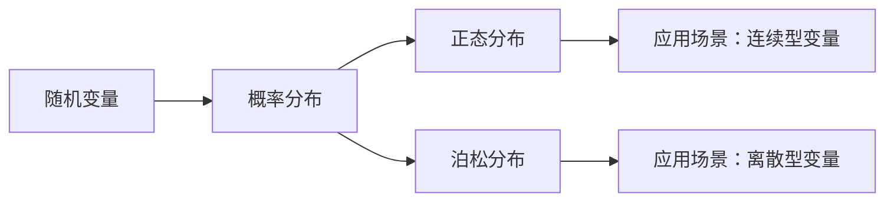
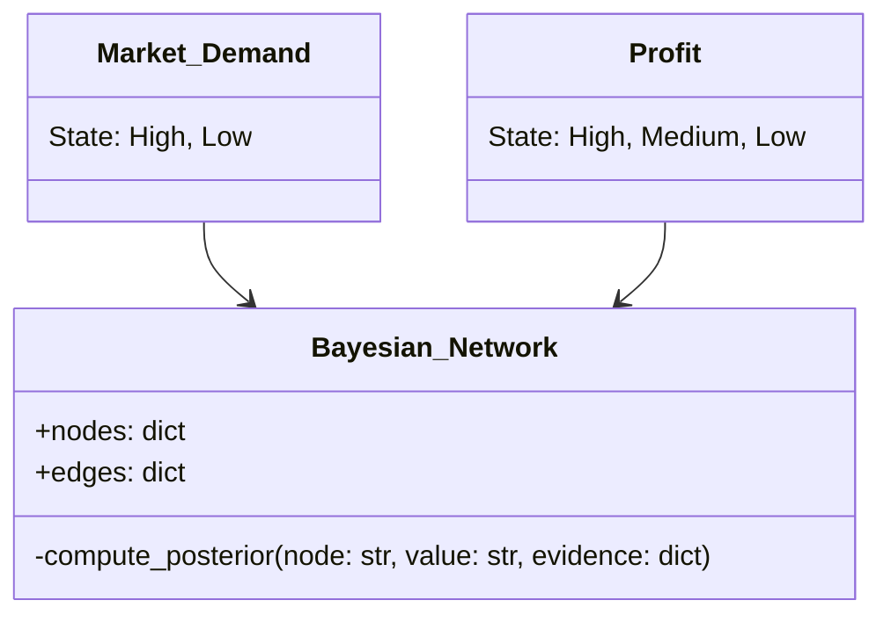

                 


# 如何处理企业估值中的不确定性

---

## 关键词：
- 企业估值
- 不确定性
- 概率论
- 蒙特卡洛模拟
- 风险管理

---

## 摘要：
企业估值是企业管理中的核心任务之一，但在实际操作中，不确定性广泛存在，影响估值的准确性。本文系统地分析了企业估值中的不确定性来源，并结合概率论、统计学、风险管理等方法，提出了处理不确定性的系统性解决方案。通过理论分析、算法实现、案例解读和系统设计，本文为读者提供了从理论到实践的完整思路，帮助企业在复杂多变的市场环境中更准确地进行估值。

---

## 第一章: 企业估值中的不确定性概述

### 1.1 问题背景与重要性
#### 1.1.1 企业估值的基本概念
企业估值是通过对企业的财务状况、市场地位、竞争优势等多方面因素的综合分析，确定企业价值的过程。常见的估值方法包括DCF模型、市盈率法、市净率法等。

#### 1.1.2 不确定性在企业估值中的表现
不确定性主要来源于市场需求波动、成本变化、政策调整、管理决策等。这些因素可能导致企业未来现金流、利润率等关键指标的变化，进而影响估值结果的准确性。

#### 1.1.3 处理不确定性的必要性
在实际估值过程中，忽略不确定性可能导致估值偏差，进而影响投资决策。因此，如何量化和处理不确定性是企业估值中的关键问题。

### 1.2 问题描述与挑战
#### 1.2.1 不确定性的来源分析
- 市场需求波动
- 成本变化
- 竞争格局变化
- 政策调整
- 管理决策失误

#### 1.2.2 不确定性对企业估值的影响
- 估值结果的波动性增加
- 投资决策的风险上升
- 企业价值的评估存在偏差

#### 1.2.3 传统估值方法的局限性
传统估值方法通常假设未来现金流是确定的，忽略了不确定性的影响。这种方法在实际应用中可能导致估值结果过于乐观或保守。

### 1.3 问题解决思路
#### 1.3.1 引入概率论与统计学的方法
通过概率分布量化未来现金流的不确定性，利用统计方法对可能的现金流进行模拟和分析。

#### 1.3.2 结合现代金融工具的解决方案
引入蒙特卡洛模拟、贝叶斯网络等现代金融工具，对不确定性进行建模和分析。

#### 1.3.3 不确定性量化与风险控制的结合
通过量化不确定性，制定风险管理策略，降低不确定性对企业估值的影响。

### 1.4 边界与外延
#### 1.4.1 不确定性处理的边界条件
- 数据的可获得性
- 模型的适用性
- 计算资源的限制

#### 1.4.2 相关概念的外延分析
- 不确定性与风险的关系
- 不确定性与企业价值的关系
- 不确定性与投资决策的关系

#### 1.4.3 核心概念的结构化分解
- 核心概念：不确定性
- 关键属性：概率分布、风险、波动性
- 相关关系：因果关系、相关关系

---

## 第二章: 概率论与统计学基础

### 2.1 核心概念与联系
#### 2.1.1 概率论的基本原理
概率论是处理不确定性的重要工具。概率分布（如正态分布、泊松分布）用于描述随机变量的可能取值及其概率。

#### 2.1.2 统计学的核心方法
统计学通过样本数据估计总体参数，帮助企业从数据中提取不确定性信息。

#### 2.1.3 概率论与统计学的联系
概率论是统计学的基础，统计学是概率论在实际问题中的应用。

---

### 2.2 核心概念的结构化分解
#### 2.2.1 概率分布的属性特征对比
| 概率分布 | 支持的随机变量 | 分布函数形式 | 应用场景 |
|----------|----------------|--------------|----------|
| 正态分布 | 连续型         | 钟形曲线     | 自然现象 |
| 泊松分布 | 离散型         | 非对称分布   | 事件计数 |

#### 2.2.2 概率分布的Mermaid流程图


---

### 2.3 概率论与统计学的结合
#### 2.3.1 贝叶斯定理
贝叶斯定理用于更新概率，公式为：
$$P(A|B) = \frac{P(B|A)P(A)}{P(B)}$$

#### 2.3.2 中心极限定理
中心极限定理指出，无论原始数据分布如何，样本均值的分布将趋近于正态分布。

#### 2.3.3 大数定律
大数定律表明，随着样本量的增加，样本均值将趋近于总体均值。

---

## 第三章: 蒙特卡洛模拟与贝叶斯网络

### 3.1 算法原理讲解
#### 3.1.1 蒙特卡洛模拟的原理
蒙特卡洛模拟通过随机采样，模拟所有可能的结果，计算期望值和标准差。

#### 3.1.2 贝叶斯网络的应用
贝叶斯网络用于建模变量之间的依赖关系，帮助识别关键不确定性来源。

---

### 3.2 算法实现
#### 3.2.1 蒙特卡洛模拟的Python代码
```python
import numpy as np

def monte_carlo_simulation(n_simulations):
    np.random.seed(42)
    simulations = []
    for _ in range(n_simulations):
        # 模拟现金流
        cash_flow = np.random.normal(100, 20)
        simulations.append(cash_flow)
    return simulations

simulations = monte_carlo_simulation(1000)
print("模拟结果的平均值为：", np.mean(simulations))
print("模拟结果的标准差为：", np.std(simulations))
```

#### 3.2.2 贝叶斯网络的实现
```python
from bayesian_network import BayesianNetwork

# 定义贝叶斯网络
network = BayesianNetwork()
network.add_node('Market Demand', ['High', 'Low'])
network.add_node('Profit', ['High', 'Low', 'Medium'], ['Market Demand'])

# 计算后验概率
posterior = network.compute_posterior('Profit', 'High', 'Market Demand', 'High')
print("后验概率为：", posterior)
```

---

## 第四章: 系统分析与架构设计

### 4.1 问题场景介绍
假设我们正在为一家初创科技公司进行估值，需要考虑市场需求、研发成本等不确定因素。

### 4.2 系统功能设计
#### 4.2.1 领域模型（Mermaid类图）


#### 4.2.2 系统架构设计（Mermaid架构图）
```mermaid
archi
    title 系统架构图
    bank Algorithm_Execution
        Algorithm_Execution --> Bayesian_Network
        Algorithm_Execution --> Monte_Carlo_Simulation
    asis Database {
        Market_Data
        Profit_Data
    }
    Database --> Algorithm_Execution
    actor User {
        +run_simulation()
        +get_posterior()
    }
```

---

## 第五章: 项目实战

### 5.1 环境安装
安装必要的Python库：
```bash
pip install numpy matplotlib bayesian-network
```

### 5.2 核心代码实现
#### 5.2.1 蒙特卡洛模拟实现
```python
import numpy as np
import matplotlib.pyplot as plt

def plot_simulation_results(simulations):
    plt.hist(simulations, bins=20, alpha=0.7)
    plt.xlabel('现金流')
    plt.ylabel('频率')
    plt.title('蒙特卡洛模拟结果')
    plt.show()

simulations = monte_carlo_simulation(1000)
plot_simulation_results(simulations)
```

#### 5.2.2 贝叶斯网络实现
```python
network = BayesianNetwork()
network.add_node('Market Demand', ['High', 'Low'])
network.add_node('Profit', ['High', 'Low', 'Medium'], ['Market Demand'])

# 设置条件概率
network.set_probability('Market Demand', 'High', 0.7)
network.set_probability('Market Demand', 'Low', 0.3)
network.set_probability('Profit', 'High', 0.8, evidence={'Market Demand': 'High'})
network.set_probability('Profit', 'Medium', 0.1, evidence={'Market Demand': 'High'})
network.set_probability('Profit', 'Low', 0.1, evidence={'Market Demand': 'High'})
network.set_probability('Profit', 'High', 0.2, evidence={'Market Demand': 'Low'})
network.set_probability('Profit', 'Medium', 0.3, evidence={'Market Demand': 'Low'})
network.set_probability('Profit', 'Low', 0.5, evidence={'Market Demand': 'Low'})

posterior = network.compute_posterior('Profit', 'High', {'Market Demand': 'High'})
print("后验概率为：", posterior)
```

### 5.3 案例分析
以某初创科技公司为例，假设市场需求为“High”的概率为0.7，利润在市场需求为“High”时为“High”的概率为0.8。通过蒙特卡洛模拟和贝叶斯网络，计算利润为“High”的后验概率。

### 5.4 项目小结
通过实战案例，我们验证了蒙特卡洛模拟和贝叶斯网络在处理企业估值中不确定性的有效性。

---

## 第六章: 总结与展望

### 6.1 内容总结
本文系统地介绍了企业估值中的不确定性处理方法，包括概率论、统计学、蒙特卡洛模拟和贝叶斯网络等工具的应用。

### 6.2 最佳实践 tips
- 在实际应用中，结合多种方法进行不确定性分析。
- 定期更新模型参数，以反映市场变化。
- 使用可视化工具展示不确定性对估值的影响。

### 6.3 未来展望
未来，随着人工智能和大数据技术的发展，不确定性处理方法将更加智能化和精准化。

---

## 结语
通过本文的系统分析和实战案例，我们展示了如何在企业估值中处理不确定性。希望本文能为读者提供有价值的参考，帮助企业更好地应对估值中的不确定性挑战。

