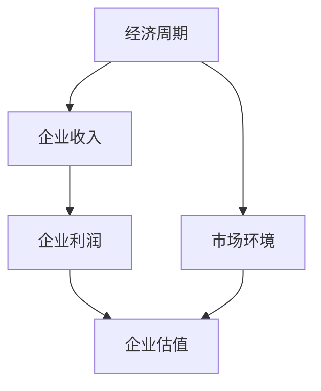
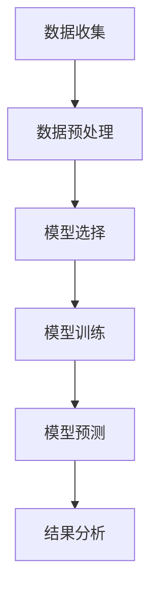

                 


# 如何处理企业估值中的周期性波动

> 关键词：企业估值、周期性波动、经济周期、财务分析、风险管理

> 摘要：企业估值在不同的经济周期中会受到周期性波动的影响。本文从周期性波动的定义、对企业估值的影响、预测方法和应对策略等方面进行详细分析，帮助读者理解如何在周期性波动中准确评估企业价值，优化投资决策。

---

## 第一部分: 企业估值与周期性波动的背景介绍

### 第1章: 企业估值的基本概念

#### 1.1 企业估值的定义与意义
企业估值是通过对企业各项资产、负债和未来现金流的分析，确定其市场价值的过程。企业估值的核心在于揭示企业的内在价值，为投资者和管理层提供决策依据。

#### 1.2 周期性波动的定义与特征
周期性波动是指在经济活动中，由于经济周期的影响，企业经营状况和市场环境会出现周期性变化。周期性波动具有周期性、波动性和普遍性的特征。

#### 1.3 企业估值与周期性波动的关系
周期性波动会影响企业的收入、利润和现金流，从而影响企业的估值结果。在不同的经济周期阶段，企业估值的方法和结果也会有所不同。

### 第2章: 周期性波动对企业估值的影响

#### 2.1 经济周期对企业估值的影响
在经济扩张期，企业估值通常较高；在经济衰退期，企业估值可能被低估。周期性波动会通过企业的财务状况和市场环境影响其估值。

#### 2.2 周期性波动对不同行业的影响
不同行业的周期性波动特点不同，例如制造业和科技行业的波动性可能不同。行业周期性波动会影响企业的估值模型和参数选择。

#### 2.3 周期性波动对估值模型的影响
周期性波动会导致企业未来现金流的预测不确定性增加，从而影响DCF模型、市盈率模型等估值方法的有效性。

---

## 第二部分: 周期性波动的量化分析与预测

### 第3章: 周期性波动的量化指标

#### 3.1 经济指标与周期性波动
常用的经济指标包括GDP、失业率、PMI等，这些指标可以帮助预测经济周期的变化。

#### 3.2 市场情绪指标与周期性波动
市场情绪指标如VIX指数可以反映市场的波动性，帮助投资者判断周期性波动的强度。

#### 3.3 企业财务指标与周期性波动
企业的收入、利润和现金流等财务指标会受到周期性波动的影响，可以通过分析这些指标的变化来判断周期性波动对企业估值的影响。

### 第4章: 周期性波动的预测方法

#### 4.1 时间序列分析法
时间序列分析法是通过分析历史数据，预测未来的趋势。常用的模型包括ARIMA和GARCH模型。

#### 4.2 机器学习在周期性波动预测中的应用
机器学习算法如随机森林和神经网络可以用于周期性波动的预测，通过训练历史数据来识别模式和趋势。

#### 4.3 组合模型的应用
组合模型结合了多种预测方法，可以通过优势互补来提高预测的准确性。

---

## 第三部分: 企业估值中的周期性波动应对策略

### 第5章: 企业层面的应对策略

#### 5.1 优化企业财务结构
通过调整资产负债结构，增强企业的抗风险能力，减少周期性波动对企业估值的影响。

#### 5.2 加强风险管理
通过建立风险管理机制，识别和应对周期性波动中的潜在风险，保护企业价值。

#### 5.3 灵活调整经营策略
根据经济周期的变化，及时调整产品结构、市场策略和成本控制，以应对周期性波动的影响。

### 第6章: 投资者层面的应对策略

#### 6.1 投资组合的多元化配置
通过多元化投资，降低周期性波动对投资组合的影响，分散风险。

#### 6.2 灵活调整投资策略
根据经济周期的变化，调整投资策略，选择在不同周期表现优异的资产类别。

#### 6.3 加强市场监控和风险预警
通过实时监控市场变化和周期性波动，及时调整投资组合，规避风险。

---

## 第四部分: 项目实战与最佳实践

### 第7章: 项目实战

#### 7.1 环境安装与数据准备
安装必要的工具和软件，收集和整理周期性波动相关的数据，为模型建立和分析做好准备。

#### 7.2 核心代码实现
通过Python代码实现周期性波动预测模型，例如使用ARIMA模型进行时间序列分析，或者使用机器学习算法进行预测。

#### 7.3 案例分析与总结
通过实际案例分析，展示周期性波动对企业估值的影响，验证模型的预测效果，并总结经验教训。

### 第8章: 最佳实践

#### 8.1 关键点总结
总结周期性波动对企业估值的影响，以及应对策略的核心要点。

#### 8.2 小结
回顾全文，总结企业估值中处理周期性波动的主要方法和策略。

#### 8.3 注意事项
提醒读者在实际操作中需要注意的问题，例如数据的准确性和模型的适用性。

#### 8.4 拓展阅读
推荐相关的书籍和资源，帮助读者深入学习和研究。

---

## 附录

### 附录A: 代码实现示例

```python
import pandas as pd
from statsmodels.tsa.arima_model import ARIMA

# 加载数据
data = pd.read_csv('economic_data.csv')

# 建立ARIMA模型
model = ARIMA(data['GDP'], order=(1, 1, 1))
model_fit = model.fit()

# 预测未来值
forecast = model_fit.forecast(steps=10)
print(forecast)
```

### 附录B: 图表示例

#### 图表1: 经济周期与企业估值的关系图


#### 图表2: 时间序列分析流程图


---

## 结语

企业估值中的周期性波动是一个复杂而重要的问题，需要从多个角度进行分析和应对。通过量化分析、模型预测和策略调整，可以有效降低周期性波动对企业估值的影响，优化投资决策。希望本文能够为读者提供有价值的参考和启发。

