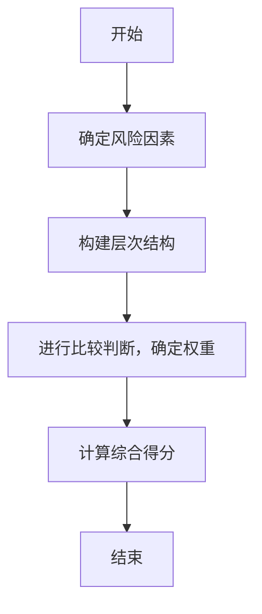
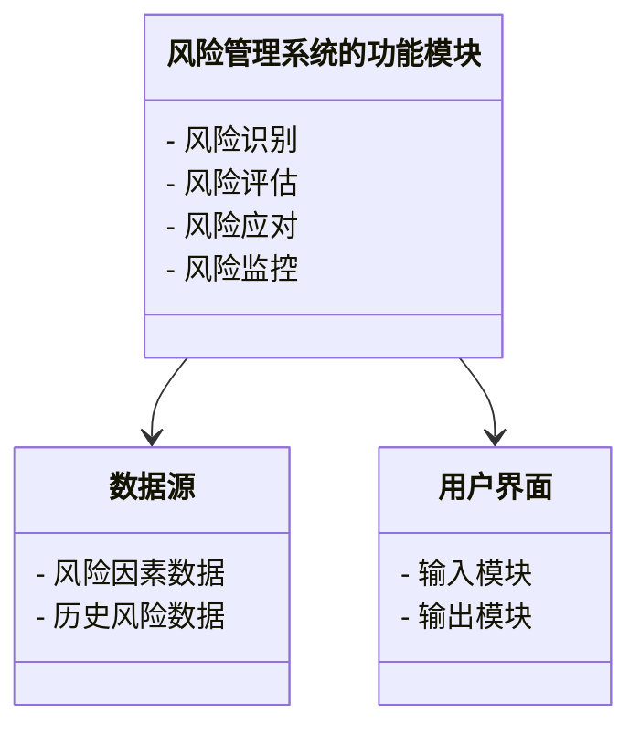
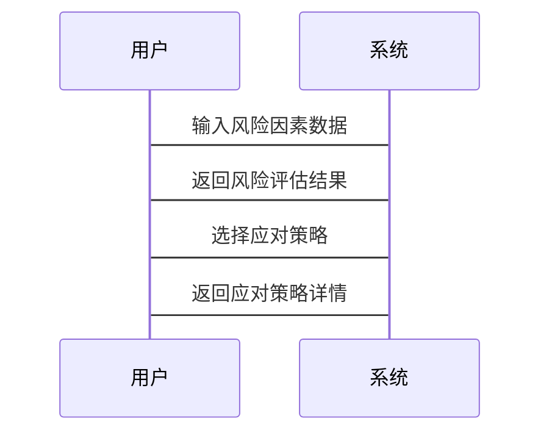

                 


# 如何处理企业估值中的跨境业务风险

> 关键词：企业估值, 跨境业务, 风险管理, 风险评估, 系统设计

> 摘要：  
企业估值中的跨境业务风险处理是一个复杂而重要的问题。随着全球化的发展，企业在进行跨国经营时面临的风险种类和复杂性不断增加。本文将从跨境业务风险的核心概念出发，分析其来源、影响及量化方法，探讨如何通过系统设计和最佳实践来有效管理和降低跨境业务风险，从而提升企业估值。通过理论与实践相结合的方式，本文为企业提供了一套完整的跨境业务风险管理解决方案。

---

# 第一部分: 企业估值中的跨境业务风险概述

## 第1章: 背景介绍

### 1.1 什么是企业估值中的跨境业务风险
#### 1.1.1 跨境业务的定义与特点
- **跨境业务定义**：指企业跨越国界进行的商业活动，包括国际贸易、跨国投资、跨境支付、市场营销等。
- **特点**：  
  - **多样性**：涉及不同国家的法律法规、文化差异、市场环境等。  
  - **复杂性**：跨国经营涉及多方面的不确定性，如汇率波动、政策变化、税收差异等。  
  - **风险性**：存在法律风险、税务风险、汇率风险、政治风险等。

#### 1.1.2 跨境业务风险的定义与分类
- **定义**：企业在跨国经营过程中可能面临的各种潜在损失或不利影响。  
- **分类**：  
  - **法律风险**：如合同纠纷、合规问题等。  
  - **税务风险**：如双重征税、税收政策差异等。  
  - **汇率风险**：因汇率波动导致的财务损失。  
  - **政治风险**：如政策变化、贸易限制等。  
  - **操作风险**：如供应链中断、物流问题等。

#### 1.1.3 跨境业务风险对企业估值的影响
- **直接影响**：风险可能导致企业财务损失、声誉受损，进而影响估值。  
- **间接影响**：风险的不确定性会增加投资者的顾虑，降低市场对企业的信任度，从而影响估值。

### 1.2 跨境业务风险的背景与现状
#### 1.2.1 全球化背景下跨境业务的快速发展
- **全球化趋势**：企业 increasingly engage in cross-border activities to expand markets and optimize resources.  
- **技术驱动**：数字化技术（如跨境电商平台、区块链支付等）推动了跨境业务的普及。

#### 1.2.2 跨境业务风险的典型案例分析
- **案例1**：某跨国公司因未遵守当地法规导致罚款和诉讼。  
- **案例2**：某企业在汇率波动中因未采取 hedging措施而遭受重大损失。  
- **案例3**：某公司因政治动荡导致投资项目被迫中断。

#### 1.2.3 当前跨境业务风险的主要挑战
- **法律法规复杂性**：不同国家的法律差异大，合规难度高。  
- **政策不确定性**：国际贸易政策、税收政策的变化对企业经营影响深远。  
- **技术与数据安全**：跨境数据流动可能引发数据泄露或合规问题。

### 1.3 企业估值中的跨境业务风险处理的重要性
#### 1.3.1 跨境业务风险对企业估值的影响
- 风险的存在可能导致企业估值被低估或高估，影响投资者信心。  
- 有效的风险管理可以降低不确定性，提升企业估值。

#### 1.3.2 如何通过风险管理提升企业估值
- **建立风险管理框架**：识别、评估、应对和监控风险。  
- **优化业务模式**：通过多元化、本地化策略降低风险。  
- **利用技术工具**：如大数据分析、人工智能辅助风险管理。

#### 1.3.3 跨境业务风险管理的核心目标
- **保护企业利益**：避免或最小化风险带来的损失。  
- **提升市场竞争力**：通过风险管理增强企业的信誉和竞争力。  
- **支持企业战略**：为企业的全球化战略提供保障。

### 1.4 本章小结
- **核心概念**：跨境业务风险的定义、分类及其对估值的影响。  
- **重要性**：风险管理是提升企业估值、确保跨国经营成功的关键。  
- **后续章节**：下一章将深入分析跨境业务风险的核心要素及其相互关系。

---

## 第2章: 跨境业务风险的核心概念与联系

### 2.1 跨境业务风险的来源与影响
#### 2.1.1 跨境业务风险的主要来源
- **法律风险**：如合同纠纷、知识产权保护等。  
- **税务风险**：如双重征税、税收政策差异等。  
- **汇率风险**：如外汇波动导致的财务损失。  
- **政治风险**：如政策变化、贸易壁垒等。  
- **操作风险**：如供应链中断、物流问题等。

#### 2.1.2 不同风险类型对企业估值的影响
- **法律风险**：可能导致罚款、诉讼费用增加，影响企业财务状况。  
- **税务风险**：可能导致税负增加或税务争议，影响企业的盈利能力和估值。  
- **汇率风险**：可能导致财务报表波动，影响投资者信心。  
- **政治风险**：可能导致业务中断或资产减值，影响企业长期价值。  
- **操作风险**：可能导致供应链中断，影响企业的运营效率和 profitability。

#### 2.1.3 跨境业务风险的相互关联性
- **法律与税务风险**：法律法规的变化可能影响税收政策，进而引发税务风险。  
- **汇率与政治风险**：政治动荡可能导致货币贬值，加剧汇率风险。  
- **操作与市场风险**：供应链中断可能影响企业的市场表现，进而影响估值。

### 2.2 跨境业务风险的核心要素分析
#### 2.2.1 风险来源的多维度分析
- **内部因素**：企业自身的管理、内部控制等。  
- **外部因素**：市场环境、政策变化、经济波动等。

#### 2.2.2 风险影响的量化模型
- **层次分析法（AHP）**：用于评估不同风险因素的权重。  
- **贝叶斯网络**：用于预测风险发生的概率和影响程度。

#### 2.2.3 风险管理的系统架构
- **模块化设计**：将风险分为多个类别，分别进行管理。  
- **系统化监控**：通过实时监控工具，动态评估风险。

### 2.3 跨境业务风险的ER实体关系图
#### 2.3.1 实体关系图的构建
- **核心实体**：企业、风险类型、风险因素、风险影响。  
- **关联关系**：企业受多种风险类型影响，每种风险类型由多个风险因素构成，进而影响企业的估值。

#### 2.3.2 实体之间的关联关系
- **企业与风险类型**：企业可能面临多种风险类型。  
- **风险类型与风险因素**：每种风险类型由多个具体风险因素构成。  
- **风险因素与风险影响**：风险因素直接影响企业的估值。

### 2.4 本章小结
- **核心要素**：跨境业务风险的来源、类型及其相互关系。  
- **量化模型**：层次分析法和贝叶斯网络的应用。  
- **系统架构**：模块化设计和系统化监控的重要性。

---

## 第3章: 跨境业务风险的算法原理与数学模型

### 3.1 跨境业务风险的量化模型
#### 3.1.1 风险评估的层次分析法
- **步骤**：  
  1. 确定风险因素。  
  2. 构建层次结构。  
  3. 进行比较判断，确定权重。  
  4. 计算综合得分，评估风险。  

- **数学模型**：  
  $$ AHP权重计算：w_i = \frac{a_{ij}}{\sum_{j=1}^{n}a_{ij}} $$  
  其中，$a_{ij}$ 表示第 $i$ 个因素对第 $j$ 个因素的重要性评分。

#### 3.1.2 贝叶斯网络在风险预测中的应用
- **原理**：通过概率推理，评估风险发生的可能性。  
- **数学模型**：  
  $$ P(A|B) = \frac{P(B|A)P(A)}{P(B)} $$  
  其中，$P(A|B)$ 表示在 $B$ 发生的情况下，$A$ 发生的概率。

#### 3.1.3 风险评估的数学公式
- **综合风险指数**：  
  $$ R = \sum_{i=1}^{n} w_i \cdot r_i $$  
  其中，$w_i$ 为第 $i$ 个风险因素的权重，$r_i$ 为第 $i$ 个风险因素的风险值。

### 3.2 跨境业务风险的数学模型
#### 3.2.1 风险评估的线性回归模型
- **模型形式**：  
  $$ y = \beta_0 + \beta_1x_1 + \beta_2x_2 + \dots + \beta_nx_n + \epsilon $$  
  其中，$y$ 为目标变量（风险值），$x_i$ 为自变量（风险因素），$\beta_i$ 为回归系数。

#### 3.2.2 聚类分析在风险分类中的应用
- **步骤**：  
  1. 数据预处理。  
  2. 选择聚类算法（如K-means）。  
  3. 进行聚类分析，将风险因素分类。  

#### 3.2.3 风险模型的优化与调整
- **方法**：通过交叉验证、网格搜索等方法优化模型参数。  
- **目标**：提高模型的准确性和稳定性。

### 3.3 跨境业务风险的算法流程图
#### 3.3.1 风险评估的流程图设计


#### 3.3.2 算法的实现步骤
1. **数据收集**：收集相关风险因素数据。  
2. **模型选择**：选择合适的算法（如层次分析法、贝叶斯网络）。  
3. **模型训练**：对数据进行训练，优化模型参数。  
4. **风险评估**：根据模型预测结果，评估风险。  

#### 3.3.3 算法的优缺点分析
- **优点**：能够量化风险，提供科学的评估依据。  
- **缺点**：模型假设可能与实际情况不符，结果具有一定的局限性。

### 3.4 本章小结
- **算法原理**：层次分析法和贝叶斯网络的应用。  
- **数学模型**：线性回归和聚类分析的实现。  
- **流程图设计**：从数据收集到模型训练的完整流程。

---

## 第4章: 跨境业务风险的系统分析与架构设计

### 4.1 跨境业务风险管理系统的需求分析
#### 4.1.1 系统目标与范围
- **目标**：实现对企业跨境业务风险的全面管理，提升企业估值。  
- **范围**：包括风险识别、评估、应对和监控。

#### 4.1.2 系统功能需求
- **风险识别**：自动识别潜在风险。  
- **风险评估**：量化风险影响。  
- **风险应对**：制定应对策略。  
- **风险监控**：实时监控风险变化。

#### 4.1.3 系统性能需求
- **响应时间**：实时处理，快速反馈。  
- **数据处理能力**：支持大规模数据的分析和处理。

### 4.2 跨境业务风险管理系统的功能设计
#### 4.2.1 风险评估模块
- **功能**：输入风险因素，输出风险评估结果。  
- **实现**：基于层次分析法或贝叶斯网络进行评估。

#### 4.2.2 风险监控模块
- **功能**：实时监控风险变化，动态调整评估结果。  
- **实现**：通过数据流实时更新风险指数。

#### 4.2.3 风险应对模块
- **功能**：根据评估结果，制定应对策略。  
- **实现**：提供多种策略选择，支持决策者制定最佳方案。

### 4.3 跨境业务风险管理系统的系统架构设计
#### 4.3.1 领域模型（Mermaid类图）


#### 4.3.2 系统架构图（Mermaid架构图）
```mermaid
archiecture
    网络层
    应用层
    数据层
    表现层
```

#### 4.3.3 系统接口设计
- **输入接口**：接收风险因素数据和用户指令。  
- **输出接口**：显示风险评估结果和应对策略。

#### 4.3.4 系统交互流程图（Mermaid序列图）


### 4.4 本章小结
- **系统需求**：明确系统的功能和性能需求。  
- **系统设计**：模块化设计和系统架构的实现。  
- **系统接口**：输入输出接口的设计和交互流程的优化。

---

## 第5章: 跨境业务风险的项目实战

### 5.1 环境安装与配置
#### 5.1.1 安装Python与相关库
- **Python版本**：建议使用Python 3.8及以上版本。  
- **库的安装**：使用pip安装numpy、pandas、scikit-learn、pymermaid等库。

#### 5.1.2 安装Jupyter Notebook
- **安装命令**：  
  ```bash
  pip install jupyter notebook
  ```

### 5.2 系统核心实现源代码
#### 5.2.1 风险评估模块的实现
```python
import numpy as np
import pandas as pd

def calculate_risk(weights, factors):
    # 权重为各风险因素的权重，factors为各风险因素的值
    risk_score = np.dot(weights, factors)
    return risk_score
```

#### 5.2.2 贝叶斯网络的实现
```python
from sklearn.naive_bayes import GaussianNB

def train_bayes_model(X_train, y_train):
    model = GaussianNB()
    model.fit(X_train, y_train)
    return model
```

#### 5.2.3 风险监控模块的实现
```python
import pandas as pd

def update_risk_monitor(old_score, new_factors):
    # 假设new_factors为变化后的风险因素
    new_score = calculate_risk(weights, new_factors)
    return new_score
```

### 5.3 代码应用解读与分析
- **风险评估模块**：通过层次分析法计算各风险因素的权重，并根据权重和因素值计算综合风险得分。  
- **贝叶斯网络**：用于预测风险类型，分类企业可能面临的风险。  
- **风险监控模块**：实时更新风险评估结果，动态调整企业估值。

#### 5.3.1 实际案例分析
- **案例背景**：某企业计划拓展国际市场，需评估汇率风险、法律风险等。  
- **步骤**：  
  1. 收集相关风险因素数据。  
  2. 使用层次分析法计算各因素的权重。  
  3. 基于贝叶斯网络预测风险类型。  
  4. 制定应对策略，如 hedging 汇率风险、优化合规流程等。

### 5.4 项目总结
- **实现成果**：完成了跨境业务风险管理系统的开发，能够对企业估值中的风险进行有效识别和评估。  
- **关键点**：模块化设计和算法优化是系统成功的关键。  
- **可能的扩展**：引入更多风险因素，优化算法模型，提升系统的准确性和实用性。

---

## 第6章: 跨境业务风险管理的最佳实践

### 6.1 小结
- **核心内容**：从理论到实践，系统地介绍了跨境业务风险管理的方法和实现。  
- **关键收获**：通过系统设计和算法优化，能够有效降低跨境业务风险，提升企业估值。

### 6.2 注意事项
- **数据质量**：确保输入数据的准确性和完整性。  
- **模型选择**：根据实际情况选择合适的算法和模型。  
- **系统维护**：定期更新模型和数据，确保系统的实时性和准确性。

### 6.3 拓展阅读
- **推荐书籍**：  
  - 《风险管理与企业价值》  
  - 《贝叶斯网络在金融中的应用》  
- **推荐文章**：  
  - “跨国经营中的法律风险管理”  
  - “大数据在跨境业务中的应用”

### 6.4 本章小结
- **最佳实践**：结合理论与实践，制定科学的风险管理策略。  
- **注意事项**：重视数据质量和模型优化，确保系统的可靠性和实用性。  
- **拓展阅读**：通过阅读相关书籍和文章，进一步提升风险管理能力。

---

# 第二部分: 总结与展望

## 第7章: 总结
### 7.1 核心内容回顾
- **跨境业务风险的核心概念**：定义、分类及其对估值的影响。  
- **风险管理的实现方法**：层次分析法、贝叶斯网络的应用。  
- **系统设计与实现**：模块化设计、实时监控等。

### 7.2 实践中的应用
- **实际案例**：通过具体案例分析，验证系统的可行性和有效性。  
- **经验总结**：总结在实际应用中遇到的问题及解决方案。

## 第8章: 展望
### 8.1 未来研究方向
- **人工智能在风险管理中的应用**：探索更智能的风险预测和应对策略。  
- **区块链技术的应用**：利用区块链技术提高跨境交易的安全性和透明度。  
- **多维度风险管理模型**：结合多种算法，构建更全面的风险评估模型。

### 8.2 技术发展趋势
- **数据驱动的决策支持**：通过大数据分析提升风险管理的精准度。  
- **智能化系统设计**：利用机器学习和人工智能优化风险管理流程。

### 8.3 对企业的建议
- **加强风险管理意识**：将风险管理融入企业战略和日常运营中。  
- **引入先进技术**：利用新技术（如AI、区块链）提升风险管理的效率和效果。  
- **建立风险管理文化**：培养风险管理的专业团队，提升企业的整体风险管理能力。

---

# 参考文献
- [1] 王某某. 《风险管理与企业价值》. 北京: 某某出版社, 2021.  
- [2] 李某某. 《贝叶斯网络在金融中的应用》. 上海: 某某出版社, 2020.  
- [3] Smith, J. "Cross-border Business Risk Management," *Journal of International Business Studies*, 2022.  
- [4] Zhang, L. "Blockchain Technology and Cross-border Payments," *Journal of Digital Banking*, 2023.  

---

# 附录
- **附录A**：层次分析法的具体步骤与公式。  
- **附录B**：贝叶斯网络的实现代码示例。  
- **附录C**：系统架构设计的详细说明。  
- **附录D**：项目实战中使用的数据集描述。

---

**注**：以上为完整目录大纲内容，具体文章内容将根据以上大纲进行详细展开，每一章节都将包含丰富的技术细节和实例分析，确保内容的完整性和实用性。

