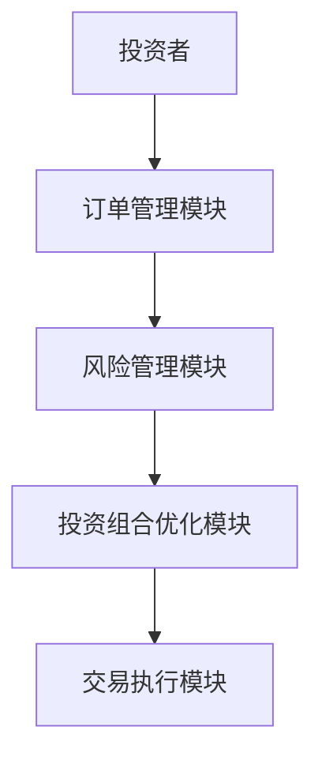

                 


# 如何处理特价股票投资中的亏损

> 关键词：特价股票，投资亏损，风险管理，止损策略，股票投资

> 摘要：本文深入探讨了特价股票投资中的亏损问题，从亏损的定义、原因到解决方法，结合算法原理和系统设计，为投资者提供了一套完整的解决方案。通过分析亏损的类型、市场和公司因素，本文提出了基于止损策略和风险控制的投资优化方法，并结合实际案例进行了详细讲解。

---

## 第1章: 特价股票投资中的亏损概述

### 1.1 特价股票的定义与特点
特价股票是指价格显著低于市场价的股票，通常因公司业绩不佳、市场环境恶化或投资者预期下调导致。其特点包括高波动性、高风险性和潜在的高回报。

#### 1.1.1 特价股票的定义
特价股票是市场价格低于其内在价值的股票，通常被视为“超跌股”或“价值股”。投资者认为这些股票的价格被市场低估，具有长期增值的潜力。

#### 1.1.2 特价股票的特点
- 高波动性：股价波动较大，容易受到市场情绪影响。
- 高风险性：公司基本面可能存在问题，如财务危机或行业竞争加剧。
- 隐含机会：潜在的高回报，吸引长期投资者。

#### 1.1.3 特价股票与普通股票的区别
| 特性 | 特价股票 | 普通股票 |
|------|----------|----------|
| 价格 | 低于市场价 | 市场价合理 |
| 风险 | 高 | 中等 |
| 回报 | 高 | 中等 |

---

### 1.2 投资中的亏损问题
亏损是股票投资中不可避免的现象，尤其是特价股票投资风险更高，亏损概率更大。

#### 1.2.1 亏损的定义与分类
亏损是指投资收益低于初始投资成本，分为短期亏损和长期亏损。

- 短期亏损：短期内股价下跌，未达到预期收益。
- 长期亏损：长期持有股票，股价持续下跌，最终低于初始成本。

#### 1.2.2 亏损的原因分析
亏损的原因可以从市场、公司和投资者三个维度分析：

1. **市场因素**：市场整体下跌、经济危机、政策变化等。
2. **公司因素**：公司业绩下滑、管理问题、行业竞争加剧等。
3. **投资者自身因素**：选股失误、仓位过重、未能及时止损等。

#### 1.2.3 亏损对投资者的影响
亏损不仅影响经济利益，还可能对投资者心理产生负面影响，如信心下降、情绪化决策等。

---

### 1.3 特价股票投资中的亏损特点
特价股票投资中的亏损具有以下特点：

- **高风险性**：股价波动大，容易触发止损。
- **短期亏损多**：市场波动可能导致短期大幅亏损。
- **周期性**：亏损可能集中在特定市场周期。

---

## 第2章: 特价股票投资亏损的核心概念与联系

### 2.1 特价股票投资中的亏损类型
亏损可以分为以下几种类型：

#### 2.1.1 短期亏损与长期亏损
- **短期亏损**：股价在短时间内大幅下跌，通常由市场波动或公司突发消息引发。
- **长期亏损**：股价长期低迷，公司基本面持续恶化。

#### 2.1.2 全部亏损与部分亏损
- **全部亏损**：股价跌破初始成本，投资者损失全部本金。
- **部分亏损**：股价下跌，但未跌破成本，投资者损失部分本金。

#### 2.1.3 暴跌性亏损与渐进性亏损
- **暴跌性亏损**：股价突然大幅下跌，导致投资者迅速亏损。
- **渐进性亏损**：股价逐步下跌，投资者在较长时间内逐步亏损。

---

### 2.2 亏损的原因分析
亏损的原因可以从市场、公司和投资者自身三个方面进行分析：

#### 2.2.1 市场因素
- **市场波动**：市场整体下跌，如经济危机或行业衰退。
- **政策变化**：政府政策调整影响股票价格。

#### 2.2.2 公司因素
- **财务状况**：公司财务健康状况不佳，如高负债、低利润。
- **管理问题**：公司管理层决策失误或内控不严。
- **行业竞争**：行业竞争加剧，公司市场份额下降。

#### 2.2.3 投资者自身因素
- **选股错误**：投资者选择基本面不佳的股票。
- **仓位过重**：投入过多资金，风险承受能力不足。
- **未能及时止损**：投资者因心理因素未能及时卖出，导致亏损扩大。

---

### 2.3 亏损的影响与解决方法
亏损对投资者的影响是多方面的，解决方法需要综合考虑：

#### 2.3.1 亏损对心理的影响
- 投资者容易产生焦虑、失望情绪，影响后续投资决策。

#### 2.3.2 亏损对投资策略的影响
- 投资者可能调整投资策略，如减少投资金额、改变选股标准。

#### 2.3.3 亏损的解决方法概述
- 设定止损点，避免亏损扩大。
- 分散投资，降低风险。
- 加强研究，避免盲目投资。

---

## 第3章: 特价股票投资亏损的算法原理与数学模型

### 3.1 止损策略
止损是防止亏损扩大的重要策略，以下是常见的止损方法：

#### 3.1.1 固定比例止损
- 设定最大亏损比例，如10%。
- 当亏损达到设定比例时，立即卖出。

#### 3.1.2 技术指标止损
- 使用技术指标，如移动平均线、MACD等，判断卖出时机。

#### 3.1.3 时间止损
- 设定持有时间，如一个月或三个月，到期后卖出。

---

### 3.2 风险控制算法
风险控制是投资的重要环节，以下是常用的风险控制方法：

#### 3.2.1 风险评估模型
- 使用VaR（Value at Risk）模型评估投资风险。

#### 3.2.2 风险控制的数学公式
$$ \text{VaR} = \mu + z \cdot \sigma $$
其中，$\mu$为平均收益，$z$为标准正态分布的分位数，$\sigma$为标准差。

#### 3.2.3 风险控制算法的实现
- 计算投资组合的风险值。
- 根据风险值调整投资组合。

---

### 3.3 投资组合优化算法
投资组合优化是降低亏损的重要方法，以下是常用算法：

#### 3.3.1 均值-方差优化
- 通过优化投资组合的期望收益和方差，降低风险。

#### 3.3.2 马科维茨投资组合理论
- 根据投资者风险偏好，构建最优投资组合。

#### 3.3.3 投资组合优化算法的实现
- 使用数学优化方法，如拉格朗日乘数法，求解最优解。

---

## 第4章: 特价股票投资亏损的系统分析与架构设计

### 4.1 投资者亏损管理系统
投资者可以通过系统化的方法管理亏损，以下是系统的功能设计：

#### 4.1.1 风险评估模块
- 评估投资组合的风险，如VaR值。

#### 4.1.2 止损策略模块
- 设置止损点，自动执行卖出指令。

#### 4.1.3 投资组合优化模块
- 根据风险偏好，优化投资组合。

---

### 4.2 系统架构设计
以下是系统的架构图：



---

## 第5章: 特价股票投资亏损的项目实战

### 5.1 环境安装
- 安装Python和相关库，如Pandas、Matplotlib。

### 5.2 代码实现
以下是止损策略的Python代码示例：

```python
import pandas as pd
import numpy as np

# 假设df为股票数据，包含'Adj Close'列
# 设置止损比例，如10%
stop_loss = 0.1

# 计算止损价格
df['Stop Loss'] = df['Adj Close'] * (1 - stop_loss)

# 判断是否触发止损
df['Trigger Stop'] = df['Adj Close'] < df['Stop Loss']
```

### 5.3 案例分析
以下是一个实际案例：

#### 案例背景
投资者买入某公司股票，初始价格为10元，设定止损点为9元。

#### 案例分析
- 买入价格：10元
- 止损价格：9元
- 股价下跌至9元时，触发止损，卖出股票，亏损1元。

---

## 第6章: 特价股票投资亏损的注意事项与拓展阅读

### 6.1 小结
- 特价股票投资具有高风险性，亏损是常见现象。
- 通过止损策略和风险控制，可以有效管理亏损。

### 6.2 注意事项
- 投资者需保持冷静，避免情绪化决策。
- 分散投资，降低风险。

### 6.3 拓展阅读
- 《投资学基础》
- 《风险管理实务》

---

通过以上分析和方法，投资者可以更好地处理特价股票投资中的亏损问题，避免进一步损失。

