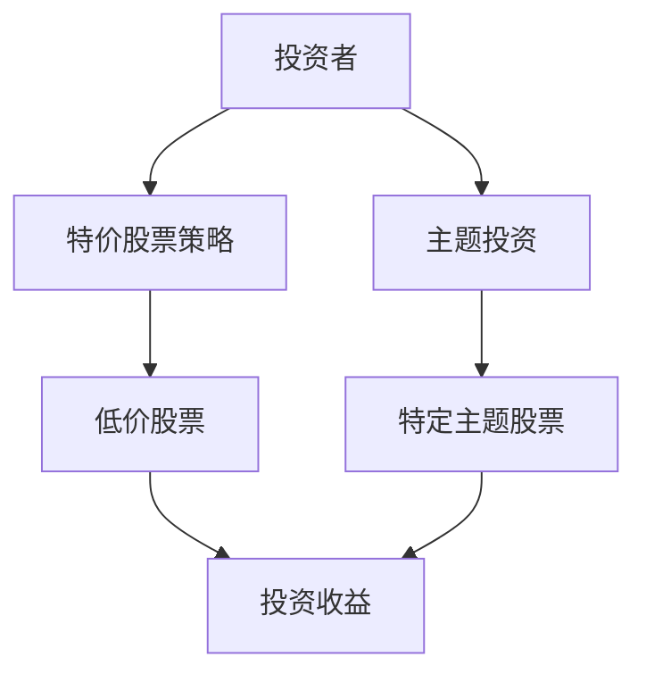
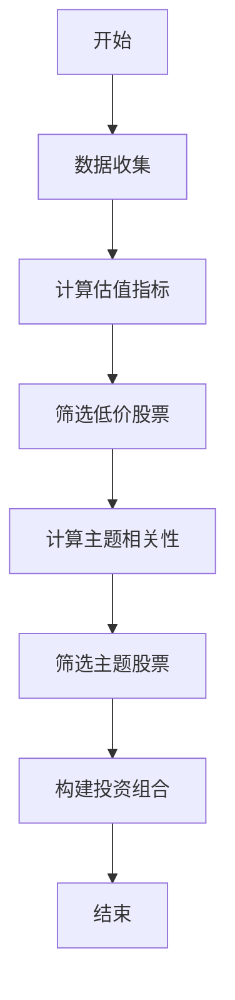
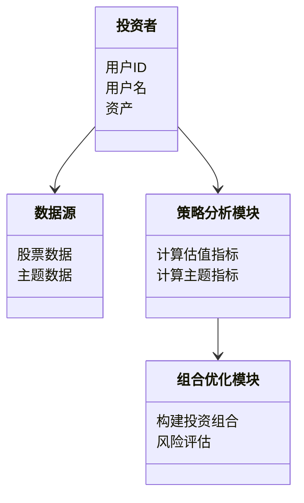
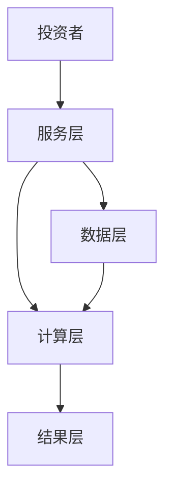

                 


# 如何将特价股票策略与主题投资相结合

## 关键词：特价股票策略、主题投资、投资组合优化、系统架构设计、算法实现

## 摘要：本文探讨如何将特价股票策略与主题投资相结合，通过分析两者的核心概念、数学模型和系统架构，提出一种投资决策支持系统的构建方法，并通过实际案例验证其有效性。

---

## 第1章: 特价股票策略与主题投资的背景介绍

### 1.1 特价股票策略的核心概念

#### 1.1.1 特价股票的定义与特点
特价股票是指价格低于其内在价值的股票，通常具有较高的安全边际。其特点包括低估值、高股息率和潜在的上涨空间。

#### 1.1.2 特价股票策略的背景与问题背景
特价股票策略基于价值投资理念，旨在通过寻找被市场低估的股票获取超额收益。然而，市场波动和信息不对称可能导致策略执行中的挑战。

#### 1.1.3 特价股票策略的应用场景与边界
适用于市场低迷或行业周期性低谷时，投资者可通过精选低价股实现长期收益。其边界包括市场过度低估和个股基本面改善的不确定性。

### 1.2 主题投资的核心概念

#### 1.2.1 主题投资的定义与特点
主题投资关注特定主题或行业的股票，如科技、医疗等。其特点是高增长潜力和集中投资。

#### 1.2.2 主题投资的背景与问题背景
随着经济结构变化，新兴主题不断涌现，为主题投资提供了机会。然而，主题投资的风险在于市场波动和主题生命周期的不确定性。

#### 1.2.3 主题投资的应用场景与边界
适用于经济转型期或科技创新驱动的行业，投资者需关注主题的持续性和成长潜力。其边界包括主题过热和政策变化带来的风险。

### 1.3 特价股票策略与主题投资的联系与区别

#### 1.3.1 联系分析
两者均追求超额收益，但特价股票策略注重估值，主题投资关注成长潜力。两者可互补，形成多元化的投资组合。

#### 1.3.2 区别分析
特价股票策略侧重防御性投资，风险较低；主题投资侧重进攻性投资，风险较高。策略执行周期不同，特价股票适合长期持有，主题投资适合中短期操作。

## 第2章: 特价股票策略与主题投资的核心概念与联系

### 2.1 核心概念原理

#### 2.1.1 特价股票策略的原理
基于价值投资，通过分析市盈率、市净率等指标，寻找价格低于内在价值的股票。

#### 2.1.2 主题投资的原理
基于主题发现，通过分析行业趋势、政策变化等，投资于具有增长潜力的主题或行业。

### 2.2 核心概念属性特征对比表

| 特性         | 特价股票策略       | 主题投资             |
|--------------|--------------------|----------------------|
| 投资目标     | 追求价值回归       | 追求主题增长         |
| 风险水平     | 较低               | 较高                 |
| 持股期限     | 长期               | 中短期               |
| 适用场景     | 市场低迷           | 经济转型或创新行业   |

### 2.3 ER实体关系图架构



## 第3章: 特价股票策略与主题投资的数学模型与算法原理

### 3.1 特价股票策略的数学模型

#### 3.1.1 技术分析指标的数学公式
市盈率（P/E）= 股价 / 每股收益  
市净率（P/B）= 股价 / 每股净资产

#### 3.1.2 市场情绪分析模型
使用移动平均线（MA）和相对强弱指数（RSI）判断市场情绪。

#### 3.1.3 举例说明
假设某股票的P/E为10，低于行业平均值，可能被视为被低估。

### 3.2 主题投资的数学模型

#### 3.2.1 主题量化指标的数学公式
行业增长潜力指数（IGPI）= 行业增长率 × 市场容量  
主题相关性系数（TCC）= ∑（主题关键词匹配度）

#### 3.2.2 主题投资组合优化模型
使用均值-方差优化模型，最大化收益并最小化风险。

### 3.3 算法原理的 mermaid 流程图



## 第4章: 系统分析与架构设计方案

### 4.1 问题场景介绍

#### 4.1.1 投资者的需求与目标
投资者希望结合特价股票和主题投资，优化投资组合，分散风险。

#### 4.1.2 系统需要解决的问题
如何整合两种策略，提供实时数据和分析工具，支持投资决策。

### 4.2 项目介绍

#### 4.2.1 项目目标
构建投资决策支持系统，帮助投资者优化投资组合。

#### 4.2.2 项目范围
包括数据收集、策略分析和组合优化模块。

#### 4.2.3 项目关键成功因素
数据准确性、算法有效性和用户体验。

### 4.3 系统功能设计

#### 4.3.1 领域模型 mermaid 类图



### 4.4 系统架构设计

#### 4.4.1 系统架构 mermaid 架构图



## 第5章: 项目实战

### 5.1 环境安装

#### 5.1.1 开发环境配置
安装Python、Pandas、Matplotlib和相关金融分析库。

#### 5.1.2 数据源获取与安装
使用Yahoo Finance API获取股票数据，整理主题数据。

### 5.2 系统核心实现源代码

#### 5.2.1 数据获取与处理代码
```python
import pandas as pd
import yfinance as yf

# 获取股票数据
data = yf.download(tickers, start='2020-01-01', end='2023-12-31')
```

#### 5.2.2 策略实现代码
```python
def calculate_pe(stock_data):
    pe = stock_data['Close'] / stock_data['EPS']
    return pe
```

#### 5.2.3 回测与分析代码
```python
import backtrader as bt

class Strategy(bt.Strategy):
    def __init__(self):
        self.position = None
        # 策略逻辑
```

### 5.3 代码应用解读与分析

#### 5.3.1 代码结构分析
代码分为数据获取、策略计算和回测分析三部分，模块化设计便于维护和扩展。

#### 5.3.2 代码实现细节解读
使用技术指标和主题分析双重过滤，优化投资组合。

#### 5.3.3 代码优化建议
引入机器学习模型，增强主题识别和风险预测能力。

### 5.4 实际案例分析

#### 5.4.1 案例背景介绍
假设在2020年投资科技主题中的低价股，寻找被低估的科技公司。

#### 5.4.2 案例数据准备
收集相关科技股的估值和主题数据。

#### 5.4.3 案例分析与结果解读
通过策略筛选出数只低价科技股，构建投资组合，定期调整。

#### 5.4.4 案例总结与经验分享
策略的有效性取决于市场环境和主题选择，定期监控和调整策略。

## 第6章: 最佳实践 tips、小结、注意事项与拓展阅读

### 6.1 最佳实践 tips

#### 6.1.1 策略优化建议
定期评估策略效果，结合市场变化调整参数。

#### 6.1.2 风险管理策略
设置止损点，分散投资，降低风险。

#### 6.1.3 系统维护建议
及时更新数据和模型，确保系统高效运行。

### 6.2 小结
本文详细探讨了如何结合特价股票策略和主题投资，构建有效投资组合，为投资者提供新思路。

### 6.3 注意事项
市场波动和政策变化会影响策略效果，投资者需谨慎操作。

### 6.4 拓展阅读
建议阅读相关书籍和文献，深入学习投资策略和系统设计。

---

通过以上结构化分析，本文为投资者提供了系统的策略指导和实践指南，帮助他们在复杂市场中优化投资组合。

