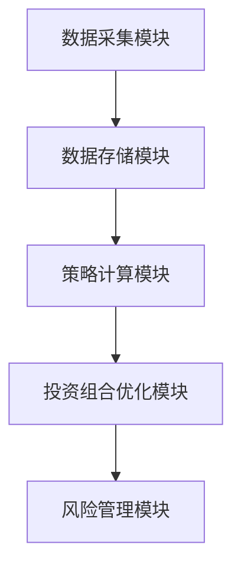

                 


# 如何将特价股票策略与价值成长投资相结合

> 关键词：特价股票策略，价值成长投资，量化分析，投资组合优化，风险管理

> 摘要：本文深入探讨了如何将特价股票策略与价值成长投资相结合，通过量化分析和系统设计，提出了一种创新的投资策略。文章从背景、核心概念、算法原理、系统架构到实际案例，详细阐述了如何在股票投资中实现两者的有机结合，为投资者提供了科学的理论依据和实践指导。

---

## 第一部分：特价股票策略与价值成长投资的背景介绍

### 第1章：特价股票策略的核心概念

#### 1.1 特价股票的定义与特征
- 特价股票指的是市场估值低于其内在价值的股票，通常表现为低市盈率（P/E）、低市净率（P/B）等。
- 特价股票的特征：
  - 价格被市场低估
  - 公司基本面良好
  - 具备一定的安全边际

#### 1.2 价值成长投资的内涵
- 价值投资强调以低于内在价值的价格买入优质公司。
- 成长投资关注公司未来的盈利能力增长。
- 价值与成长的结合意味着选择那些既有安全边际又具备成长潜力的公司。

#### 1.3 两者的结合意义
- 特价股票策略注重估值，而价值成长投资注重基本面与成长性。
- 结合两者可以避免仅看估值或仅看成长性的片面性。
- 这种结合能够帮助投资者在市场波动中寻找稳定的投资机会。

---

## 第二部分：特价股票策略与价值成长投资的核心要素

### 第2章：特价股票策略的实施步骤

#### 2.1 数据收集与初步筛选
- 数据来源：股票的历史价格、财务报表数据、行业分析报告等。
- 初步筛选标准：
  - 市盈率低于行业平均水平
  - 市净率低于行业平均水平
  - 净利润增长率稳定

#### 2.2 深度分析与投资决策
- 财务报表分析：
  - 利润表：关注收入增长、利润率
  - 资产负债表：关注资产负债结构
  - 现金流量表：关注现金流健康性
- 竞争力分析：
  - 行业地位
  - 核心竞争优势
  - 市场前景

### 第3章：价值成长投资的核心要素

#### 3.1 公司基本面分析
- 财务指标：
  - 净利润增长率
  - 营业利润率
  - 资产负债率
- 行业地位：
  - 市场占有率
  - 行业发展趋势

#### 3.2 成长性判断
- 公司未来盈利潜力：
  - 产品创新
  - 市场扩张
  - 技术优势

#### 3.3 估值与成长的平衡
- 避免只看估值忽视成长（价值陷阱）
- 避免只看成长忽视估值（成长高估）

---

## 第三部分：特价股票策略与价值成长投资的结合策略

### 第4章：结合策略的核心思想

#### 4.1 筛选模型的设计
- 综合考虑估值与成长性：
  - 市盈率（P/E）< 行业平均值
  - 净利润增长率 > 行业平均值
  - ROE（净资产收益率）> 10%

#### 4.2 策略实施步骤
1. 确定投资目标与风险偏好
2. 数据收集与初步筛选
3. 深入分析与投资决策
4. 投资组合优化与风险管理

### 第5章：投资组合的构建与风险管理

#### 5.1 投资组合优化
- 分散投资：降低个股风险
- 资产配置：平衡成长与价值
- 定期再平衡：保持投资策略的有效性

#### 5.2 风险管理
- 设置止损点
- 定期评估投资组合
- 保持对市场的敏感性

---

## 第四部分：系统分析与架构设计

### 第6章：系统架构与实现

#### 6.1 问题场景介绍
- 数据量大，需要高效的数据处理能力
- 策略复杂，需要强大的计算能力
- 实时监控，需要稳定的系统架构

#### 6.2 系统功能设计
- 数据采集模块：
  - 收集股票数据、财务数据、行业数据
- 策略计算模块：
  - 计算估值指标（P/E、P/B）
  - 计算成长指标（净利润增长率）
- 投资组合优化模块：
  - 生成投资组合
  - 进行风险评估

#### 6.3 系统架构图


---

## 第五部分：项目实战与最佳实践

### 第7章：项目实战

#### 7.1 环境安装与配置
- 数据源：使用Yahoo Finance或本地数据库
- 工具：Python、Pandas、NumPy、Matplotlib

#### 7.2 核心代码实现
```python
import pandas as pd
import numpy as np

# 示例代码：计算市盈率与净利润增长率
def calculate_pe_ttm(df):
    df['PE_TTM'] = df['Close'] * df['Shares'] / df['NetIncome_TTM']
    return df

def calculate_growth_rate(df):
    df['NetIncome_Growth'] = df['NetIncome'].pct_change()
    return df

# 数据加载与处理
data = pd.read_csv('stock_data.csv')
data = calculate_pe_ttm(data)
data = calculate_growth_rate(data)
```

#### 7.3 案例分析
- 案例一：某低估的成长股
- 案例二：某高估的价值股

#### 7.4 总结与反思
- 策略的有效性
- 实施过程中的问题与改进

---

## 第六部分：总结与展望

### 第8章：总结与展望

#### 8.1 小结
- 结合特价股票策略与价值成长投资的优势
- 投资组合优化的重要性
- 系统化投资的必要性

#### 8.2 展望
- 更多的策略优化
- 更多的数据分析与挖掘
- 更智能化的系统设计

---

## 第七部分：最佳实践与注意事项

### 8.1 最佳实践
- 定期复盘与优化
- 保持对市场的敏感性
- 合理分散投资风险

### 8.2 注意事项
- 避免过度依赖单一指标
- 风险管理是投资成功的关键
- 长期投资需要耐心与信心

---

通过以上分析，我们可以看到，将特价股票策略与价值成长投资相结合是一种科学且有效的方法，能够帮助投资者在复杂多变的市场中找到稳定的投资机会。

