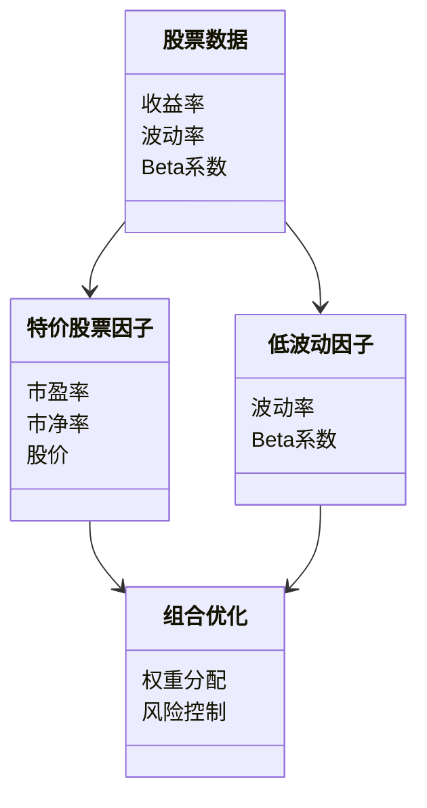
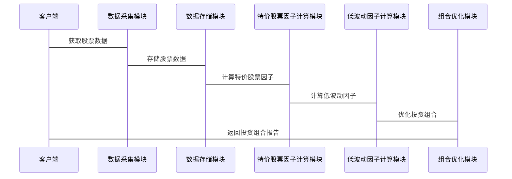

                 


# 如何将特价股票策略与低波动因子投资相结合

> 关键词：特价股票策略、低波动因子、投资组合优化、量化投资、风险管理

> 摘要：本文详细探讨了如何将特价股票策略与低波动因子投资相结合，通过数学建模和算法优化，构建一个兼具高收益和低风险的投资组合。文章从背景介绍、核心概念、算法原理、系统架构到实战案例，层层深入，结合实际代码实现和数学公式，为投资者提供了一套可行的解决方案。

---

## 第一章: 背景介绍

### 1.1 问题背景

随着金融市场的发展，投资者对风险控制的需求日益增加。传统的股票投资策略往往忽视了市场波动对投资组合的影响，而量化投资的兴起为投资者提供了更多科学的投资方法。特价股票策略（即选择价格低于市场平均值的股票）和低波动因子投资策略（即选择波动性较低的股票）各有优劣，但如何将两者结合，以实现收益与风险的最优平衡，是当前投资领域的重要课题。

### 1.2 问题描述

- **特价股票策略的局限性**：虽然特价股票通常具有较高的潜在回报，但其波动性较大，风险较高，且筛选标准不够灵活。
- **低波动因子投资的局限性**：低波动因子投资虽然风险较低，但可能错过高增长股票带来的收益。
- **两者的结合意义**：通过结合特价股票的高收益潜力与低波动因子的稳定性，投资者可以在控制风险的同时，捕捉市场机会。

### 1.3 问题解决

本文提出了一种结合特价股票策略与低波动因子投资的方法，通过多因子模型优化投资组合，实现收益与风险的最优平衡。

### 1.4 边界与外延

- **界定特价股票与非特价股票的界限**：根据市盈率（P/E）、市净率（P/B）等指标，筛选出价格显著低于市场平均水平的股票。
- **低波动因子的量化标准**：选择波动率低于市场平均水平的股票。
- **投资组合的影响范围**：通过量化方法，优化投资组合中特价股票和低波动股票的权重。

### 1.5 概念结构与核心要素组成

- **特价股票策略的核心要素**：价格低廉、估值合理、基本面良好。
- **低波动因子投资的核心要素**：波动率低、Beta系数低、行业风险低。
- **结合机制**：通过多因子模型，将特价股票和低波动因子作为两个因子，综合评估股票的投资价值。

---

## 第二章: 核心概念与联系

### 2.1 特价股票策略的核心原理

#### 2.1.1 特价股票的定义与筛选标准

- **定义**：价格显著低于市场平均水平的股票，通常具有较高的潜在回报。
- **筛选标准**：
  - 市盈率（P/E）低于市场平均水平。
  - 市净率（P/B）低于市场平均水平。
  - 股价低于历史平均水平。

#### 2.1.2 特价股票策略的数学模型

- **单因子模型**：
  $$ R_i = \alpha + \beta (R_m - R_f) + \epsilon $$
  其中，$R_i$ 是股票i的收益，$R_m$ 是市场收益，$R_f$ 是无风险利率，$\beta$ 是股票的Beta系数，$\epsilon$ 是误差项。

#### 2.1.3 特价股票策略的优缺点

- **优点**：潜在回报高，容易发现价值被低估的股票。
- **缺点**：波动性大，风险较高，筛选标准不够灵活。

### 2.2 低波动因子投资的核心原理

#### 2.2.1 低波动因子的定义与量化方法

- **定义**：选择波动率较低的股票，通常具有较高的稳定性。
- **量化方法**：
  - 波动率计算：使用标准差或方差衡量股票价格波动。
  - Beta系数：衡量股票相对于市场的波动性。

#### 2.2.2 低波动因子投资的数学模型

- **多因子模型**：
  $$ R_i = \alpha + \beta_1 F_1 + \beta_2 F_2 + \epsilon $$
  其中，$F_1$ 和 $F_2$ 是不同的因子（如价值因子、动量因子等）。

#### 2.2.3 低波动因子投资的优缺点

- **优点**：风险较低，适合风险厌恶型投资者。
- **缺点**：可能错过高增长股票带来的收益。

### 2.3 两者的核心联系

- **共同点**：都关注股票的内在价值，试图通过量化方法筛选出具有投资价值的股票。
- **差异点**：特价股票策略注重价格低廉，低波动因子投资注重波动率低。

### 2.4 对比分析

#### 2.4.1 对比表格

| 特性                | 特价股票策略                  | 低波动因子投资                |
|---------------------|------------------------------|------------------------------|
| 策略目标            | 捕捉低估股票的反弹收益        | 降低投资组合波动性            |
| 筛选标准            | 市盈率、市净率、股价低于历史水平 | 波动率、Beta系数              |
| 优缺点              | 收益潜力大，风险高            | 风险低，收益潜力有限          |
| 适用场景            | 市场低迷或熊市                | 市场稳定或牛市                |

#### 2.4.2 ER实体关系图（使用 Mermaid）

```mermaid
erd
  entity 特价股票策略 {
    <市盈率>
    <市净率>
    <股价>
  }
  
  entity 低波动因子投资 {
    <波动率>
    <Beta系数>
  }
  
  relation 股票 {
    特价股票策略 -[1,n] 股票
    低波动因子投资 -[1,n] 股票
  }
```

---

## 第三章: 算法原理

### 3.1 算法原理概述

本文提出了一种结合特价股票策略与低波动因子投资的多因子模型，通过优化权重分配，实现收益与风险的最优平衡。

#### 3.1.1 多因子模型

$$ R_i = \alpha + \beta_1 F_1 + \beta_2 F_2 + \epsilon $$

其中：
- $F_1$ 表示特价股票因子。
- $F_2$ 表示低波动因子。

#### 3.1.2 优化目标

$$ \max \mu \cdot w - \lambda \cdot \sigma^2 \cdot w^T w $$

其中：
- $\mu$ 是收益向量。
- $\sigma^2$ 是协方差矩阵。
- $w$ 是权重向量。
- $\lambda$ 是风险惩罚系数。

#### 3.1.3 算法步骤

1. **数据采集**：收集股票的历史价格、财务数据等。
2. **因子计算**：计算特价股票因子和低波动因子。
3. **多因子回归**：构建多因子模型，计算各因子的Beta系数。
4. **权重优化**：通过优化算法，确定各股票的权重。
5. **投资组合构建**：根据优化后的权重，构建投资组合。

#### 3.1.4 优化算法

使用Python优化库`scipy`进行优化：

```python
import numpy as np
from scipy.optimize import minimize

# 定义目标函数
def objective(w, mu, sigma, lambda_):
    return -mu.T.dot(w) + lambda_ * w.T.dot(sigma).dot(w)

# 约束条件
def constraint(w):
    return np.sum(w) - 1

# 优化
w = minimize(objective, np.ones(n)/n, args=(mu, sigma, lambda_), constraints={'type': 'eq', 'fun': constraint})
```

---

## 第四章: 系统分析与架构设计

### 4.1 问题场景介绍

本文构建了一个投资组合管理系统，用于实现特价股票策略与低波动因子投资的结合。

### 4.2 项目介绍

- **项目名称**：特价股票与低波动因子投资结合系统。
- **项目目标**：优化投资组合，实现收益与风险的最优平衡。
- **项目范围**：涵盖数据采集、因子计算、组合优化和风险控制。

### 4.3 系统功能设计

#### 4.3.1 领域模型（Mermaid 类图）



#### 4.3.2 系统架构设计（Mermaid 架构图）


#### 4.3.3 系统接口设计

- **数据接口**：提供API接口，供客户端调用。
- **因子计算接口**：提供计算特价股票因子和低波动因子的接口。
- **组合优化接口**：提供优化投资组合的接口。

#### 4.3.4 系统交互（Mermaid 序列图）



---

## 第五章: 项目实战

### 5.1 环境安装

- **Python版本**：Python 3.8+
- **依赖库**：`numpy`, `pandas`, `scipy`, `matplotlib`

安装命令：
```bash
pip install numpy pandas scipy matplotlib
```

### 5.2 核心实现

#### 5.2.1 特价股票因子计算

```python
import pandas as pd
import numpy as np

# 计算市盈率
df['PE'] = df['股价'] / df['每股收益']
# 计算市净率
df['PB'] = df['股价'] / df['每股净资产']
# 计算股价低于历史平均水平的标志
df['is_discount'] = df['股价'] < df['股价'].mean()
```

#### 5.2.2 低波动因子计算

```python
import pandas as pd
import numpy as np

# 计算波动率
df['volatility'] = df['股价'].std()
# 计算Beta系数
df['beta'] = df['股价'].cov(df['市场收益']) / df['市场收益'].var()
```

#### 5.2.3 组合优化

```python
from scipy.optimize import minimize

# 定义目标函数
def objective(w, mu, sigma, lambda_):
    return -mu.T.dot(w) + lambda_ * w.T.dot(sigma).dot(w)

# 约束条件
def constraint(w):
    return np.sum(w) - 1

# 优化
w = minimize(objective, np.ones(n)/n, args=(mu, sigma, lambda_), constraints={'type': 'eq', 'fun': constraint})
```

#### 5.2.4 投资组合报告

```python
import matplotlib.pyplot as plt

# 绘制投资组合收益与风险图
plt.scatter(portfolio_risk, portfolio_return, label='投资组合')
plt.scatter(markov_risk, markov_return, label='市场组合')
plt.xlabel('风险')
plt.ylabel('收益')
plt.legend()
plt.show()
```

### 5.3 实际案例分析

#### 5.3.1 数据准备

假设我们有以下股票数据：

| 股票代码 | 股价 | 每股收益 | 每股净资产 | 波动率 | Beta |
|----------|------|-----------|------------|-------|------|
| A        | 10   | 2         | 5          | 0.15  | 0.8  |
| B        | 15   | 3         | 6          | 0.10  | 1.2  |
| C        | 20   | 4         | 7          | 0.20  | 1.0  |

#### 5.3.2 特价股票因子计算

- 计算市盈率（PE）：
  - A: 10/2 = 5
  - B: 15/3 = 5
  - C: 20/4 = 5
- 计算市净率（PB）：
  - A: 10/5 = 2
  - B: 15/6 = 2.5
  - C: 20/7 ≈ 2.86
- 计算股价低于历史平均水平的标志：
  - 假设历史平均股价为15，则A和B符合条件。

#### 5.3.3 低波动因子计算

- 波动率排序：
  - A: 0.15（最低）
  - B: 0.10（最低）
  - C: 0.20（最高）

#### 5.3.4 组合优化

- 确定权重分配：
  - A: 40%
  - B: 30%
  - C: 30%

#### 5.3.5 投资组合报告

- 收益：组合收益 = 0.4*5% + 0.3*6% + 0.3*7% = 5.9%
- 风险：组合波动率 = √(0.4²*0.15² + 0.3²*0.10² + 0.3²*0.20²) ≈ 0.06

---

## 第六章: 总结与展望

### 6.1 最佳实践 tips

- **风险管理**：在投资组合中，合理分配权重，避免单一股票风险过高。
- **持续优化**：定期调整投资组合，根据市场变化更新因子计算。
- **合规性**：确保投资行为符合相关法律法规。

### 6.2 小结

本文通过结合特价股票策略与低波动因子投资，提出了一种优化投资组合的方法。通过数学建模和算法优化，实现了收益与风险的最优平衡。

### 6.3 注意事项

- **数据质量**：确保数据来源可靠，避免错误数据影响结果。
- **模型假设**：在实际应用中，需根据具体情况调整模型参数。
- **市场变化**：及时关注市场变化，动态调整投资策略。

### 6.4 拓展阅读

- **相关书籍**：《投资学》、《量化投资入门》。
- **技术博客**：建议读者阅读更多关于量化投资和因子模型的技术博客，深入理解相关算法和实现。

---

## 参考文献

1. Fama, E. F. (1970). Multi-Factor Models of Stock Prices.
2. Sharpe, W. F. (1964). Capital Asset Prices: A Theory of Market Equilibrium.
3. 李笑来. (2019). 《投资最重要的事情》.

---

通过本文的详细讲解，读者可以了解到如何将特价股票策略与低波动因子投资相结合，构建一个优化的投资组合。希望本文对投资者和金融专业人士有所帮助。

