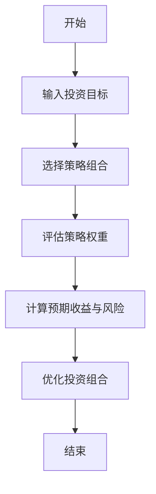
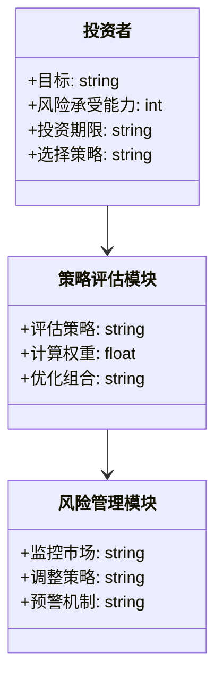

                 


# 如何将特价股票策略与其他投资策略结合

## 关键词：特价股票策略、投资策略、策略结合、风险管理、收益优化

## 摘要：本文详细探讨了如何将特价股票策略与其他投资策略相结合，通过系统分析和实战案例，揭示了策略结合的优势和具体实施方法，帮助投资者优化投资组合，降低风险，提升收益。

---

## 第一部分：特价股票策略的背景与基础

### 第1章：特价股票策略概述

#### 1.1 特价股票策略的基本概念

- **1.1.1 特价股票的定义**
  特价股票是指那些市场价格低于其内在价值的股票，通常由于市场波动、短期负面新闻或市场参与者的非理性行为导致。识别并投资于这些股票，投资者可以在市场价值回归时获得收益。

- **1.1.2 特价股票的常见类型**
  - **绝对便宜**：股票价格远低于其历史平均值。
  - **相对便宜**：股票价格低于其行业或市场平均水平。
  - **价值陷阱**：看似便宜，但公司基本面持续恶化，需谨慎。

- **1.1.3 特价股票的优势与局限性**
  - **优势**：高潜在回报，低买高卖机会。
  - **局限性**：市场波动风险，公司基本面可能变差。

#### 1.2 投资策略的多样性

- **1.2.1 主流投资策略介绍**
  - **价值投资**：寻找被低估的股票。
  - **成长投资**：投资于高成长潜力的公司。
  - **指数投资**：通过指数基金分散投资。
  - **短线交易**：利用短期价格波动获利。

- **1.2.2 不同策略的特点与应用场景**
  - 价值投资适合长期投资者，成长投资适合风险承受能力强的投资者，指数投资适合分散风险，短线交易适合技术分析能力强的投资者。

- **1.2.3 策略之间的相互影响**
  不同策略在市场不同阶段表现不同，结合使用可以平滑收益波动，降低整体风险。

---

## 第二部分：特价股票策略与其他投资策略的结合

### 第2章：策略结合的核心概念与联系

#### 2.1 核心概念的对比与分析

- **2.1.1 特价股票策略与其他策略的对比表格**
  | 策略类型 | 投资期限 | 风险水平 | 收益来源 | 适用场景 |
  |----------|----------|----------|----------|----------|
  | 特价股票 | 短期至中期 | 中高 | 价值回归 | 市场低估 |
  | 价值投资 | 长期 | 中 | 公司价值提升 | 公司基本面好 |
  | 成长投资 | 长期 | 高 | 公司增长 | 高成长行业 |
  | 指数投资 | 长期 | 低 | 市场平均收益 | 分散风险 |

- **2.1.2 策略之间的关系分析**
  - **互补性**：如价值投资和成长投资结合，兼顾价值和成长潜力。
  - **对冲性**：如结合指数投资和特价股票策略，平滑市场波动风险。

#### 2.2 策略结合的ER实体关系

```mermaid
erDiagram
    user UTODOSO(策略结合) {
        entity 特价股票策略
        entity 价值投资
        entity 成长投资
        entity 指数投资
        entity 短线交易
        UTODOSO o-- 特价股票策略
        UTODOSO o-- 价值投资
        UTODOSO o-- 成长投资
        UTODOSO o-- 指数投资
        UTODOSO o-- 短线交易
    }
```

---

## 第三部分：算法原理讲解

### 第3章：策略结合的算法原理

#### 3.1 算法实现流程



#### 3.2 核心算法代码实现

```python
import numpy as np
import pandas as pd

def calculate_portfolio_return(weights, returns):
    return np.dot(weights.T, returns)

def calculate_portfolio_risk(weights, returns, covariance_matrix):
    variance = np.dot(weights.T, np.dot(covariance_matrix, weights))
    return np.sqrt(variance)

# 示例数据
returns = pd.DataFrame({'stock1': [0.1, 0.05, 0.02], 
                        'stock2': [0.08, 0.04, 0.03],
                        'stock3': [0.05, 0.03, 0.02]})

covariance_matrix = returns.cov()

# 策略权重
weights = np.array([0.3, 0.3, 0.4])

# 计算收益和风险
portfolio_return = calculate_portfolio_return(weights, returns.values)
portfolio_risk = calculate_portfolio_risk(weights, returns.values, covariance_matrix)

print(f"预期收益: {portfolio_return}")
print(f"预期风险: {portfolio_risk}")
```

#### 3.3 数学模型与公式

- **预期收益公式**：$$E(R_p) = \sum_{i=1}^n w_i E(R_i)$$
- **方差公式**：$$Var(R_p) = \sum_{i=1}^n \sum_{j=1}^n w_i w_j Cov(R_i, R_j)$$
- **现代投资组合理论**：通过优化权重分配，最小化风险或最大化收益。

---

## 第四部分：系统分析与架构设计方案

### 第4章：系统架构设计

#### 4.1 系统功能设计



#### 4.2 系统架构图


---

## 第五部分：项目实战

### 第5章：项目实战与分析

#### 5.1 环境安装与配置

- 安装Python和相关库：numpy, pandas, matplotlib
- 安装Jupyter Notebook

#### 5.2 核心代码实现

```python
import pandas as pd
import numpy as np
import matplotlib.pyplot as plt

# 示例数据：假设有三个策略
strategies = ['特价股票', '价值投资', '成长投资']
returns = pd.DataFrame({
    '特价股票': [10, 15, 5],
    '价值投资': [12, 8, 7],
    '成长投资': [5, 18, 10]
})

# 计算各策略的平均收益
average_returns = returns.mean()
print("平均收益：", average_returns)

# 计算协方差矩阵
cov_matrix = returns.cov()

# 定义目标函数：最大化收益
def objective(weights):
    return -np.dot(weights, average_returns.values)

# 约束条件：权重之和为1，非负权重
from scipy.optimize import minimize

# 初始化权重
initial_weights = [1/3, 1/3, 1/3]

# 求解优化问题
result = minimize(objective, initial_weights, method='SLSQP', bounds= [(0,1), (0,1), (0,1)], 
                  constraints={'type': 'eq', 'fun': lambda w: sum(w) - 1})

# 优化后的权重
optimal_weights = result.x

print("最优权重：", optimal_weights)
print("最优收益：", -result.fun)
```

#### 5.3 案例分析与解读

- **案例背景**：假设市场中存在低估股票、价值型股票和成长型股票，投资者希望通过结合策略降低风险。
- **分析过程**：通过优化模型计算最优权重，结合各策略的优势。
- **结果解读**：例如，最优权重为0.2, 0.5, 0.3，意味着20%投资特价股票，50%投资价值投资，30%投资成长投资，预期收益为X%。

---

## 第六部分：总结与展望

### 第6章：总结与展望

#### 6.1 最佳实践

- **分散投资**：避免过度集中于单一策略。
- **动态调整**：根据市场变化及时调整策略权重。
- **风险管理**：设置止损点，定期评估投资组合。

#### 6.2 小结

通过结合特价股票策略和其他投资策略，投资者可以在不同市场环境下优化收益，降低风险，实现更稳健的投资回报。

#### 6.3 注意事项

- **市场风险**：策略的有效性依赖于市场环境。
- **数据质量**：确保输入数据的准确性和及时性。
- **策略选择**：根据自身风险偏好和投资目标选择适合的策略组合。

#### 6.4 拓展阅读

- 阅读《投资学原理》深入理解投资策略。
- 学习Python金融库，如Pandas、NumPy，提升数据分析能力。
- 关注市场动态，了解最新的投资策略和工具。

---

## 附录：参考文献

- 书籍：《投资学》（作者）
- 网站：Quantitative Finance Community
- 工具：Python for Finance

---

通过以上结构，读者可以系统地理解如何将特价股票策略与其他投资策略结合，优化投资组合，提升收益，降低风险。

