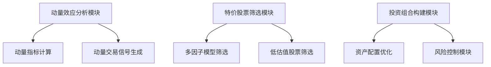

                 


# 如何将特价股票策略与动量投资相结合

> 关键词：动量投资，特价股票策略，股票投资，投资策略，动量效应

> 摘要：本文深入探讨了如何将特价股票策略与动量投资相结合，通过背景介绍、核心概念、算法原理、系统设计、项目实战等多维度分析，揭示了两者结合的优势与应用，帮助投资者优化投资策略，提升投资收益。

---

# 第一部分: 特价股票策略与动量投资概述

## 第1章: 特价股票策略与动量投资的背景介绍

### 1.1 特价股票策略的核心概念

#### 1.1.1 什么是特价股票策略
特价股票策略是一种基于市场低估的股票价格进行投资的策略，通常寻找市场价格低于其内在价值的股票。这种策略的核心在于识别市场中的估值错配机会，利用价格与价值的差距进行投资。

#### 1.1.2 特价股票策略的特点与优势
- **低估值**：主要关注市盈率、市净率等估值指标低于行业平均水平的股票。
- **逆向投资**：在市场低迷时买入，市场高涨时卖出。
- **长期视角**：基于长期价值判断，而非短期价格波动。

#### 1.1.3 特价股票策略的适用场景与边界
- 适用场景：市场处于低估状态，投资者认为市场会回归理性。
- 边界：避免在市场泡沫严重时盲目买入，需结合市场周期进行判断。

### 1.2 动量投资的核心概念

#### 1.2.1 动量效应的定义与原理
动量效应是指股票价格的动量效应，即近期价格上涨的股票在未来一段时间内继续上涨的概率较高，反之亦然。动量投资基于价格的惯性效应，通过买入近期表现强劲的股票，卖出近期表现疲软的股票。

#### 1.2.2 动量投资的策略与方法
- 动量策略的核心是基于价格动量指标，如相对强弱指数（RSI）和动量指标（MOM）。
- 通过技术分析筛选出动量效应显著的股票进行投资。

#### 1.2.3 动量投资的适用市场与限制
- 适用市场：成熟市场，动量效应较为显著。
- 限制：在市场波动剧烈或反转行情时，动量策略可能失效。

### 1.3 特价股票策略与动量投资的结合点

#### 1.3.1 两者的共同点与差异性分析
- 共同点：都基于价格与价值的关系，追求超额收益。
- 差异性：特价股票策略注重长期价值，动量投资注重短期价格趋势。

#### 1.3.2 结合投资的优势与潜在风险
- 优势：结合动量效应与低估值股票，可以在市场低估时买入，同时利用动量效应提升短期收益。
- 风险：两者结合可能增加策略复杂性，需平衡短期动量与长期价值。

#### 1.3.3 两者的协同效应与应用场景
协同效应体现在动量效应帮助捕捉市场短期机会，特价股票策略则捕捉市场低估的长期机会，两者结合可以实现短期与长期收益的平衡。

---

## 第2章: 特价股票策略与动量投资的核心概念与联系

### 2.1 动量效应的数学模型与公式

#### 2.1.1 动量效应的定义与公式推导
动量效应可以用动量指标（MOM）来衡量，公式为：
$$ MOM = \frac{P_t - P_{t-n}}{P_{t-n}} $$
其中，$P_t$ 表示当前价格，$P_{t-n}$ 表示n天前的价格。

#### 2.1.2 动量效应的量化指标与计算方法
相对强弱指数（RSI）也是一个常用的动量指标，计算公式为：
$$ RSI = \frac{N天内上涨幅度}{N天内下跌幅度} $$

#### 2.1.3 动量效应的实证分析与案例
通过实证分析可以发现，动量效应在成熟市场中表现较为显著，尤其是在短期内。

### 2.2 特价股票策略的数学模型与公式

#### 2.2.1 特价股票的定义与筛选标准
特价股票可以通过市盈率（PE）和市净率（PB）等指标进行筛选，公式为：
$$ PE = \frac{股价}{每股收益} $$
$$ PB = \frac{股价}{每股净资产} $$

#### 2.2.2 特价股票的估值模型与计算公式
常用市净率模型和市盈率模型进行估值，公式为：
$$ 合理股价 = 盈利能力 \times 市盈率倍数 $$

#### 2.2.3 特价股票的市场表现与风险分析
特价股票策略在市场低估时表现较好，但在市场上涨时可能跑输指数，需平衡风险。

### 2.3 动量效应与特价股票策略的联系

#### 2.3.1 动量效应在特价股票筛选中的应用
通过动量效应筛选出近期表现强劲的低估值股票，提升投资收益。

#### 2.3.2 特价股票策略对动量效应的优化
结合低估值股票的动量效应，优化动量策略的表现。

#### 2.3.3 两者的结合对投资收益的影响
通过动量效应捕捉短期机会，同时利用低估值股票的长期价值，实现收益的优化。

---

## 第3章: 动量投资与特价股票策略的算法原理

### 3.1 动量投资的算法原理

#### 3.1.1 动量指标的计算与筛选
通过动量指标筛选出表现强劲的股票，如使用MOM和RSI指标。

#### 3.1.2 动量策略的交易信号生成
当动量指标达到一定阈值时，触发买入或卖出信号。

#### 3.1.3 动量策略的风险控制与优化
通过设置止损和止盈点，优化动量策略的风险控制。

### 3.2 特价股票策略的算法原理

#### 3.2.1 特价股票的筛选标准与排序
通过多因子模型对低估值股票进行排序，选择排名靠前的股票。

#### 3.2.2 特价股票的投资组合构建
根据筛选结果构建投资组合，分散投资风险。

#### 3.2.3 特价股票的投资时机选择
结合市场周期和动量效应，选择最佳的投资时机。

### 3.3 动量投资与特价股票策略的结合算法

#### 3.3.1 结合动量效应与特价股票的筛选方法
通过动量效应筛选近期表现强劲的低估值股票。

#### 3.3.2 动量效应在特价股票投资中的应用
利用动量效应优化特价股票的筛选标准，提升投资收益。

#### 3.3.3 结合策略的交易信号生成与优化
结合动量效应和低估值股票的筛选结果，生成优化的交易信号。

---

## 第4章: 动量投资与特价股票策略的系统分析与架构设计

### 4.1 系统功能设计

#### 4.1.1 动量效应分析模块
负责计算和筛选动量指标，生成动量交易信号。

#### 4.1.2 特价股票筛选模块
负责根据多因子模型筛选低估值股票。

#### 4.1.3 投资组合构建模块
根据筛选结果构建投资组合，优化资产配置。

#### 4.1.4 风险控制模块
负责风险管理，设置止损和止盈点。

### 4.2 系统架构设计

#### 4.2.1 系统架构图


#### 4.2.2 模块之间的交互关系
动量效应分析模块与特价股票筛选模块相互作用，生成优化的交易信号。

#### 4.2.3 数据流与信息流设计
数据从市场数据源流入，经过各模块处理后，生成交易信号并输出投资组合。

---

## 第5章: 动量投资与特价股票策略的项目实战

### 5.1 环境安装

#### 5.1.1 Python环境安装
安装Python和必要的库，如Pandas、NumPy、Matplotlib。

#### 5.1.2 数据源获取
获取历史数据和实时数据，建议使用Yahoo Finance API。

### 5.2 系统核心实现源代码

#### 5.2.1 动量效应计算
```python
import pandas as pd
import numpy as np

def calculate_momentum(data, n=10):
    return data['Close'].pct_change().rolling(n).mean()
```

#### 5.2.2 特价股票筛选
```python
def screen_cheap_stocks(data):
    # 计算市盈率和市净率
    data['PE'] = data['Close'] / data['EPS']
    data['PB'] = data['Close'] / data['BVPS']
    # 筛选PE和PB均低于行业平均的股票
    return data[(data['PE'] < data['PE'].mean()) & (data['PB'] < data['PB'].mean())]
```

#### 5.2.3 结合策略实现
```python
def combined_strategy(data):
    # 计算动量效应
    momentum = calculate_momentum(data)
    # 筛选特价股票
    cheap_stocks = screen_cheap_stocks(data)
    # 结合动量效应和特价股票筛选结果
    return data[data.index.isin(cheap_stocks.index) & (momentum > 0.05)]
```

### 5.3 实际案例分析

#### 5.3.1 数据分析与解读
分析历史数据，验证结合策略的有效性。

#### 5.3.2 策略回测与优化
通过回测验证策略的表现，并进行参数优化。

#### 5.3.3 性能评估与总结
评估策略的收益、风险比和稳定性，总结经验教训。

### 5.4 项目小结

#### 5.4.1 最佳实践 tips
- 结合动量效应和特价股票策略，平衡短期和长期收益。
- 定期优化筛选标准，适应市场变化。

#### 5.4.2 投资者注意事项
- 风险控制是关键，设置止损点。
- 结合市场周期，灵活调整策略。

#### 5.4.3 拓展阅读
推荐相关书籍和文献，进一步深入学习。

---

## 第6章: 总结与展望

### 6.1 总结
本文详细探讨了如何将特价股票策略与动量投资相结合，揭示了两者结合的优势与应用，帮助投资者优化投资策略。

### 6.2 展望
未来可以通过机器学习等技术进一步优化策略，结合更多因子提升投资收益。

---

通过以上步骤，我们可以系统地将特价股票策略与动量投资相结合，优化投资组合，提升投资收益。

